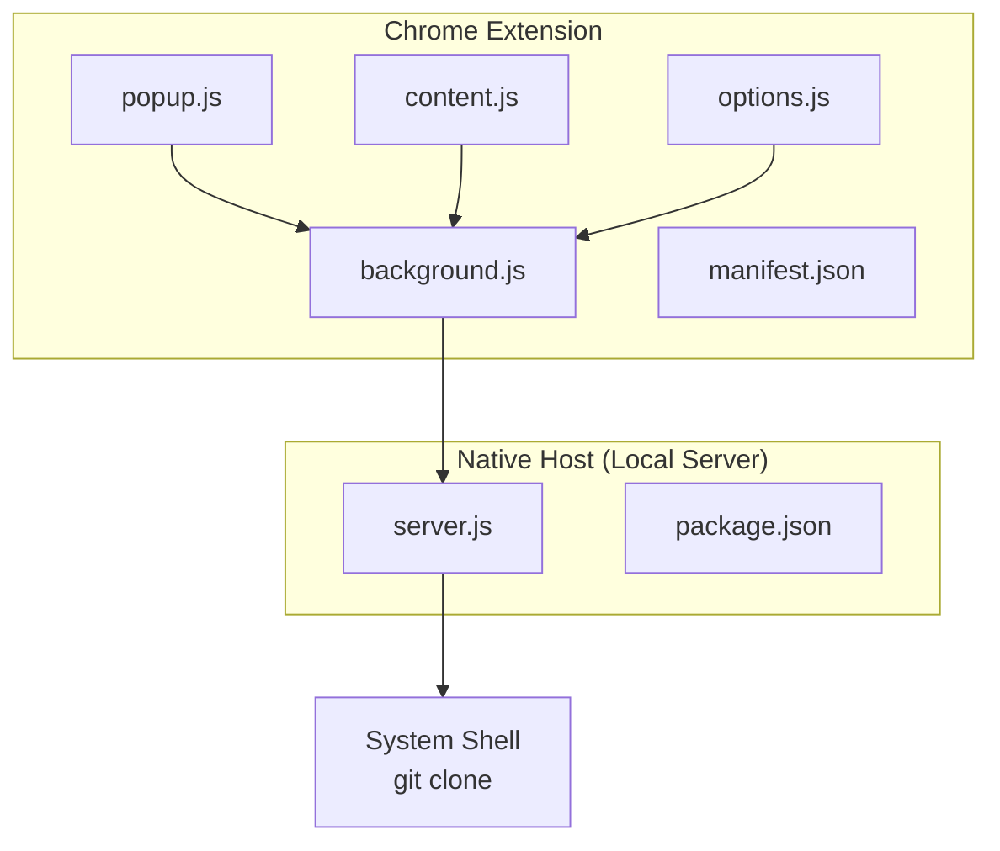
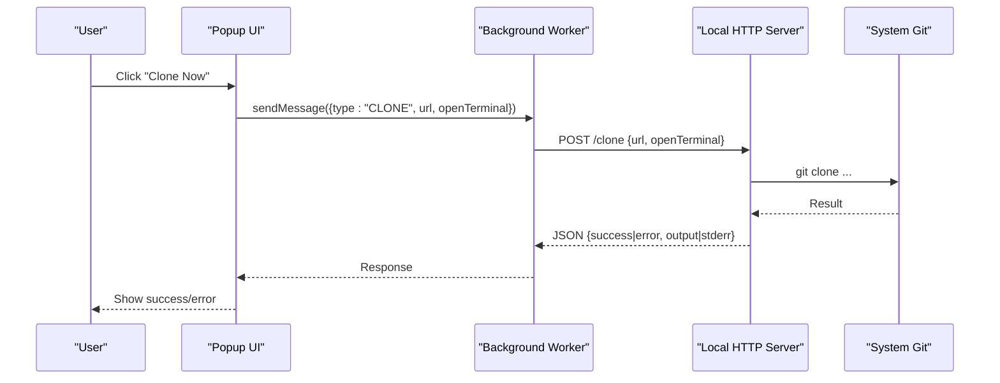
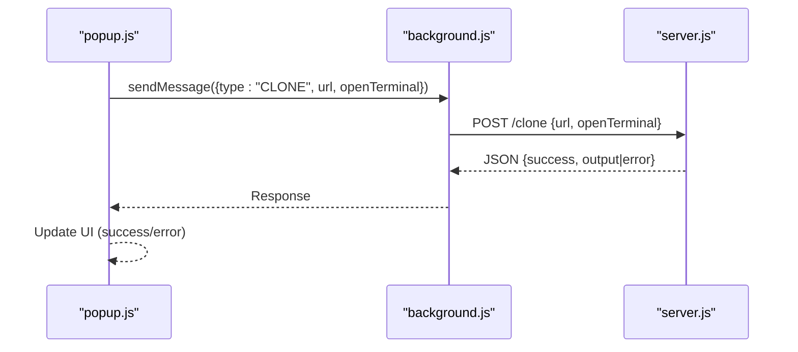
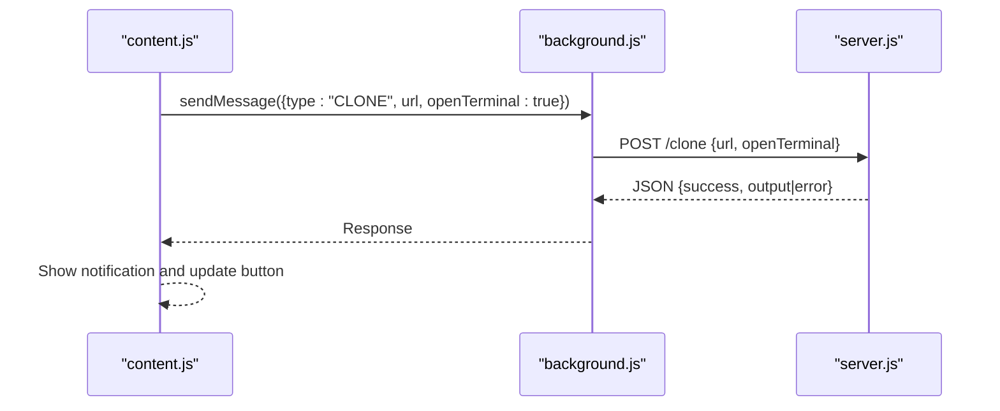
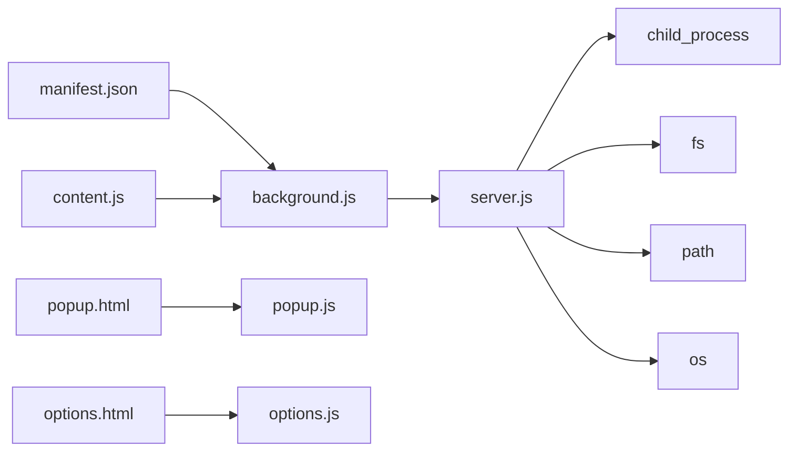

# API Reference

<cite>
**Referenced Files in This Document**
- [README.md](file://README.md)
- [manifest.json](file://chrome-extension/manifest.json)
- [background.js](file://chrome-extension/background.js)
- [popup.js](file://chrome-extension/popup.js)
- [content.js](file://chrome-extension/content.js)
- [options.js](file://chrome-extension/options.js)
- [popup.html](file://chrome-extension/popup.html)
- [options.html](file://chrome-extension/options.html)
- [server.js](file://native-host/server.js)
- [package.json](file://native-host/package.json)
</cite>

## Table of Contents
1. [Introduction](#introduction)
2. [Project Structure](#project-structure)
3. [Core Components](#core-components)
4. [Architecture Overview](#architecture-overview)
5. [Detailed Component Analysis](#detailed-component-analysis)
6. [Dependency Analysis](#dependency-analysis)
7. [Performance Considerations](#performance-considerations)
8. [Troubleshooting Guide](#troubleshooting-guide)
9. [Conclusion](#conclusion)
10. [Appendices](#appendices)

## Introduction
This document provides a comprehensive API reference for Git Magager’s HTTP endpoints and Chrome extension messaging interfaces. It covers:
- HTTP endpoints exposed by the local companion server (health, configuration, and clone operations)
- Chrome extension messaging types and payload structures
- Authentication, rate limiting, and security considerations
- Practical usage examples, client implementation guidelines, and integration patterns
- Error codes, exception handling, and debugging approaches

## Project Structure
Git Magager consists of:
- A Chrome extension (Manifest V3) with background service worker, content scripts, popup UI, and options page
- A local companion HTTP server (Node.js) listening on localhost for Git operations

**Diagram sources**
- [background.js:1-62](file://chrome-extension/background.js#L1-L62)
- [popup.js:1-168](file://chrome-extension/popup.js#L1-L168)
- [content.js:1-312](file://chrome-extension/content.js#L1-L312)
- [options.js:1-56](file://chrome-extension/options.js#L1-L56)
- [manifest.json:1-50](file://chrome-extension/manifest.json#L1-L50)
- [server.js:1-211](file://native-host/server.js#L1-L211)
- [package.json:1-12](file://native-host/package.json#L1-L12)

**Section sources**
- [README.md:1-3](file://README.md#L1-L3)
- [manifest.json:1-50](file://chrome-extension/manifest.json#L1-L50)

## Core Components
- Local HTTP server: Provides endpoints for health checks, configuration management, and repository cloning. It runs on localhost and is consumed by the extension.
- Chrome extension: Sends messages to the background service worker, which proxies requests to the local server and returns responses to the UI.

Key responsibilities:
- background.js: Manages extension lifecycle, health checks, and forwards messages to the local server
- popup.js: Presents UI for cloning and settings
- content.js: Injects clone buttons on supported sites and triggers cloning
- options.js: Loads/saves configuration via the background worker
- server.js: Implements HTTP endpoints and executes Git operations

**Section sources**
- [background.js:1-62](file://chrome-extension/background.js#L1-L62)
- [popup.js:1-168](file://chrome-extension/popup.js#L1-L168)
- [content.js:1-312](file://chrome-extension/content.js#L1-L312)
- [options.js:1-56](file://chrome-extension/options.js#L1-L56)
- [server.js:1-211](file://native-host/server.js#L1-L211)

## Architecture Overview
The extension communicates with the local server using HTTP and Chrome extension messaging. The server performs Git operations locally.

**Diagram sources**
- [popup.js:94-149](file://chrome-extension/popup.js#L94-L149)
- [background.js:30-40](file://chrome-extension/background.js#L30-L40)
- [server.js:165-199](file://native-host/server.js#L165-L199)

## Detailed Component Analysis

### HTTP Endpoints

#### Endpoint: GET /health
- Purpose: Health check for the local server
- Method: GET
- URL: http://127.0.0.1:9456/health
- Request: No body
- Response (200 OK):
  - Content-Type: application/json
  - Body fields:
    - status: string, indicates server status (e.g., "ok")
    - version: string, server version
- Example response:
  - {"status":"ok","version":"1.0.0"}

Notes:
- The extension performs an initial health check on install and displays connectivity status in the popup.

**Section sources**
- [background.js:11-21](file://chrome-extension/background.js#L11-L21)
- [server.js:126-131](file://native-host/server.js#L126-L131)

#### Endpoint: GET /config
- Purpose: Retrieve current configuration
- Method: GET
- URL: http://127.0.0.1:9456/config
- Request: No body
- Response (200 OK):
  - Content-Type: application/json
  - Body fields:
    - cloneDirectory: string, default clone destination
    - openInTerminal: boolean, whether to open terminal after cloning
    - terminalApp: string, terminal application to use ("Terminal", "iTerm", "Warp")
- Example response:
  - {"cloneDirectory":"/Users/alice/Projects","openInTerminal":true,"terminalApp":"Terminal"}

Notes:
- The extension loads configuration on popup initialization and options page load.

**Section sources**
- [background.js:42-48](file://chrome-extension/background.js#L42-L48)
- [server.js:133-139](file://native-host/server.js#L133-L139)

#### Endpoint: POST /config
- Purpose: Update configuration
- Method: POST
- URL: http://127.0.0.1:9456/config
- Headers:
  - Content-Type: application/json
- Request body (JSON):
  - Fields:
    - cloneDirectory: string, optional
    - openInTerminal: boolean, optional
    - terminalApp: string, optional
- Response (200 OK):
  - Content-Type: application/json
  - Body fields:
    - success: boolean, indicates operation outcome
    - config: object, merged configuration
- Response (400 Bad Request):
  - Content-Type: application/json
  - Body fields:
    - success: boolean, false
    - error: string, indicates invalid JSON
- Response (500 Internal Server Error):
  - Content-Type: application/json
  - Body fields:
    - success: boolean, false
    - error: string, indicates failure to save configuration
- Example request:
  - {"cloneDirectory":"/Users/alice/Projects","openInTerminal":false}
- Example response:
  - {"success":true,"config":{"cloneDirectory":"/Users/alice/Projects","openInTerminal":false,"terminalApp":"Terminal"}}

Notes:
- The server merges incoming updates with existing configuration and persists to disk.

**Section sources**
- [background.js:50-60](file://chrome-extension/background.js#L50-L60)
- [server.js:141-163](file://native-host/server.js#L141-L163)

#### Endpoint: POST /clone
- Purpose: Clone a repository and optionally open terminal
- Method: POST
- URL: http://127.0.0.1:9456/clone
- Headers:
  - Content-Type: application/json
- Request body (JSON):
  - Fields:
    - url: string, required, repository URL to clone
    - openTerminal: boolean, optional, overrides global setting
- Validation:
  - url is required; missing or empty triggers 400
- Response (200 OK):
  - Content-Type: application/json
  - Body fields:
    - success: boolean, indicates operation outcome
    - output: string, stdout from git operation (when applicable)
    - stderr: string, stderr from git operation (when applicable)
- Response (500 Internal Server Error):
  - Content-Type: application/json
  - Body fields:
    - success: boolean, false
    - error: string, error message from git or server
- Example request:
  - {"url":"https://github.com/user/repo.git","openTerminal":true}
- Example response:
  - {"success":true,"output":"Cloning into 'repo'...\n","stderr":""}

Notes:
- Behavior depends on openTerminal flag and server configuration. When true, the server attempts to open the configured terminal and run the clone command; otherwise, it runs the clone directly.

**Section sources**
- [background.js:30-40](file://chrome-extension/background.js#L30-L40)
- [server.js:165-199](file://native-host/server.js#L165-L199)

### Chrome Extension Messaging Interfaces

#### Message Types and Payloads
- CHECK_SERVER
  - Sender: popup
  - Payload: none
  - Response: boolean indicating server connectivity
- CLONE
  - Sender: popup or content script
  - Payload fields:
    - type: "CLONE"
    - url: string, repository URL
    - openTerminal: boolean, optional
  - Response: object with fields:
    - success: boolean
    - error: string (optional)
    - output: string (optional)
    - stderr: string (optional)
- GET_CONFIG
  - Sender: popup or options
  - Payload: none
  - Response: object with configuration fields or error field
- SET_CONFIG
  - Sender: options
  - Payload fields:
    - type: "SET_CONFIG"
    - config: object (subset of configuration)
  - Response: object with fields:
    - success: boolean
    - error: string (optional)
    - config: object (updated configuration, optional)

#### Flow: Clone from Popup

**Diagram sources**
- [popup.js:112-129](file://chrome-extension/popup.js#L112-L129)
- [background.js:30-40](file://chrome-extension/background.js#L30-L40)
- [server.js:165-199](file://native-host/server.js#L165-L199)

#### Flow: Clone from Content Script

**Diagram sources**
- [content.js:118-135](file://chrome-extension/content.js#L118-L135)
- [background.js:30-40](file://chrome-extension/background.js#L30-L40)
- [server.js:165-199](file://native-host/server.js#L165-L199)

### Security and Access Control
- Transport: All endpoints are served over HTTP on localhost (127.0.0.1:9456). There is no TLS encryption.
- Origin policy: The server sets CORS headers to allow requests from any origin and includes Content-Type in allowed headers.
- Authentication: No authentication is enforced by the server.
- Rate limiting: Not implemented by the server.
- Recommendations:
  - Keep the server running only on trusted machines
  - Do not expose the port externally
  - Consider adding authentication or mTLS if exposing the server beyond localhost

**Section sources**
- [server.js:113-124](file://native-host/server.js#L113-L124)

### Error Handling and Responses
- HTTP errors:
  - 400 Bad Request: Invalid JSON or missing required fields (e.g., missing url)
  - 500 Internal Server Error: Failure to save configuration or execute git operation
  - 404 Not Found: Unknown endpoint
- JSON error bodies:
  - Fields:
    - success: boolean, false
    - error: string, error message
    - output/stderr: strings (when applicable)

**Section sources**
- [server.js:157-160](file://native-host/server.js#L157-L160)
- [server.js:172-176](file://native-host/server.js#L172-L176)
- [server.js:190-196](file://native-host/server.js#L190-L196)
- [server.js:201-204](file://native-host/server.js#L201-L204)

## Dependency Analysis
- Extension permissions and hosts:
  - Permissions: storage, activeTab, scripting
  - Host permissions: GitHub, GitLab domains, and localhost:9456
- Extension entry points:
  - Service worker: background.js
  - Content scripts: content.js (runs on GitHub/GitLab)
  - UI pages: popup.html, options.html
- Server dependencies:
  - Node.js built-ins: http, child_process, fs, path, os
  - No external dependencies declared

**Diagram sources**
- [manifest.json:1-50](file://chrome-extension/manifest.json#L1-L50)
- [background.js:1-62](file://chrome-extension/background.js#L1-L62)
- [popup.js:1-168](file://chrome-extension/popup.js#L1-L168)
- [options.js:1-56](file://chrome-extension/options.js#L1-L56)
- [content.js:1-312](file://chrome-extension/content.js#L1-L312)
- [server.js:1-211](file://native-host/server.js#L1-L211)
- [package.json:1-12](file://native-host/package.json#L1-L12)

**Section sources**
- [manifest.json:6-18](file://chrome-extension/manifest.json#L6-L18)
- [server.js:1-6](file://native-host/server.js#L1-L6)
- [package.json:10](file://native-host/package.json#L10)

## Performance Considerations
- Network overhead: All communication is local; latency is minimal.
- Git operations: Blocking on git clone; long-running operations can delay responses.
- UI responsiveness: The extension updates UI immediately upon receiving responses; consider debouncing frequent requests.
- Recommendations:
  - Avoid excessive polling of /health
  - Batch configuration updates when possible
  - Monitor terminal automation commands for reliability

[No sources needed since this section provides general guidance]

## Troubleshooting Guide
Common issues and resolutions:
- Server not running
  - Symptom: Popup shows “Local server not running”
  - Action: Start the server using the provided script
  - Evidence:
    - Popup error UI and instructions
    - Background health check logs
- Invalid JSON in /config
  - Symptom: 400 error with error message
  - Action: Validate JSON payload before sending
  - Evidence:
    - Server response handling for invalid JSON
- Missing URL in /clone
  - Symptom: 400 error requesting URL
  - Action: Ensure url is present and non-empty
  - Evidence:
    - Validation logic in clone handler
- Git clone failures
  - Symptom: 500 error with error message
  - Action: Inspect stderr and confirm repository accessibility
  - Evidence:
    - Error propagation from git execution
- Terminal automation issues
  - Symptom: Terminal does not open or command not executed
  - Action: Verify terminalApp setting and system permissions
  - Evidence:
    - Terminal automation commands in server

**Section sources**
- [popup.html:55-66](file://chrome-extension/popup.html#L55-L66)
- [background.js:11-21](file://chrome-extension/background.js#L11-L21)
- [server.js:157-160](file://native-host/server.js#L157-L160)
- [server.js:172-176](file://native-host/server.js#L172-L176)
- [server.js:190-196](file://native-host/server.js#L190-L196)

## Conclusion
Git Magager provides a streamlined interface for cloning repositories via a local HTTP server and Chrome extension. The API surface is intentionally small and focused on health checks, configuration management, and cloning. Consumers should ensure the server is running, validate payloads, and handle JSON responses consistently. For production environments, consider adding authentication and transport encryption.

[No sources needed since this section summarizes without analyzing specific files]

## Appendices

### API Definitions

- GET /health
  - Headers: None
  - Query: None
  - Success response: 200 OK, application/json
  - Example: {"status":"ok","version":"1.0.0"}

- GET /config
  - Headers: None
  - Query: None
  - Success response: 200 OK, application/json
  - Example: {"cloneDirectory":"/path","openInTerminal":true,"terminalApp":"Terminal"}

- POST /config
  - Headers: Content-Type: application/json
  - Body: Partial configuration object
  - Success response: 200 OK, application/json
  - Error responses: 400 Bad Request (invalid JSON), 500 Internal Server Error (save failure)

- POST /clone
  - Headers: Content-Type: application/json
  - Body: { url: string, openTerminal?: boolean }
  - Success response: 200 OK, application/json
  - Error responses: 400 Bad Request (missing url), 500 Internal Server Error (git failure)

### Client Implementation Guidelines
- Start the server before invoking extension actions
- Use the extension’s messaging APIs to avoid direct HTTP calls
- Validate inputs before sending requests
- Handle both success and error responses gracefully
- Respect terminal automation limitations on different platforms

### Integration Patterns
- Popup-driven cloning: Send CLONE message with url and optional openTerminal
- Content script injection: Automatically detects repository URLs and triggers cloning
- Options page: Updates configuration via SET_CONFIG message

**Section sources**
- [background.js:24-61](file://chrome-extension/background.js#L24-L61)
- [content.js:118-135](file://chrome-extension/content.js#L118-L135)
- [options.js:33-44](file://chrome-extension/options.js#L33-L44)