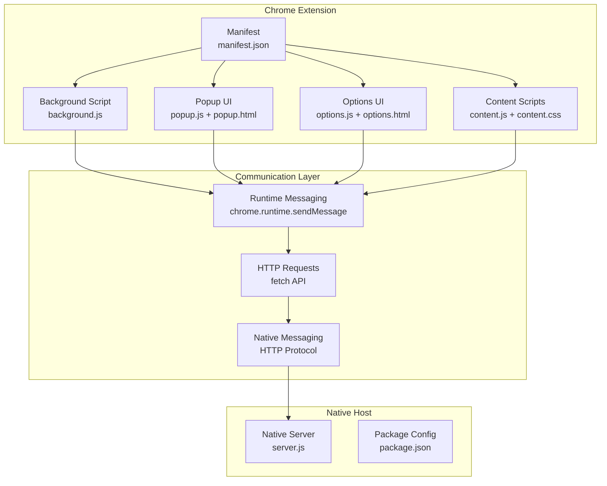
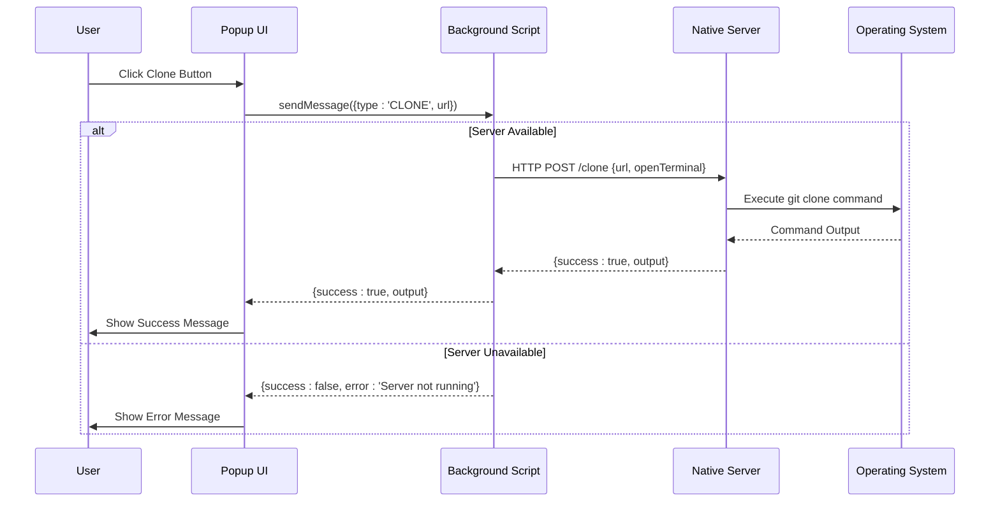
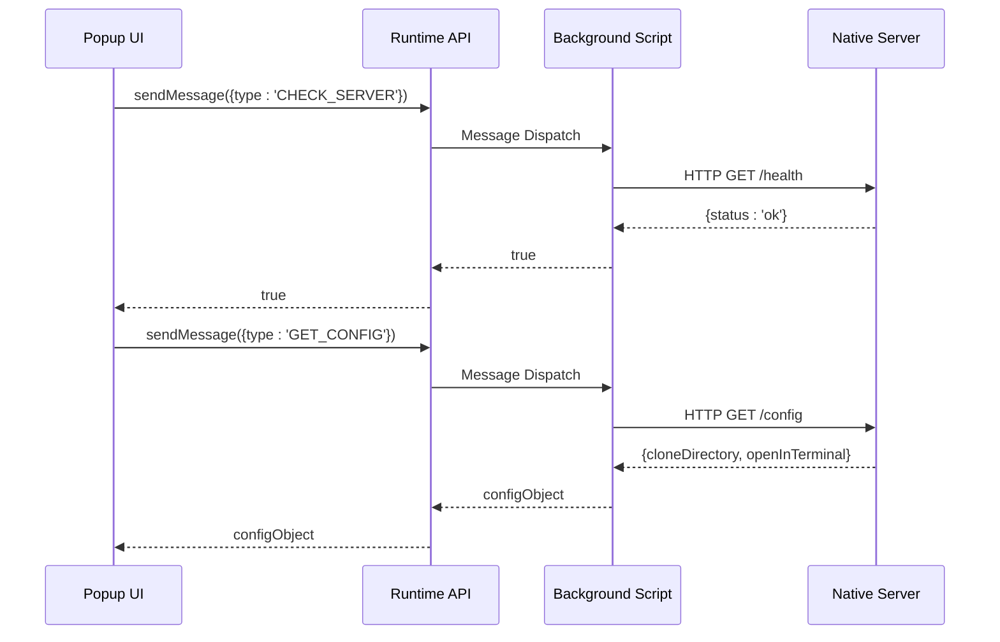
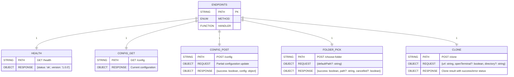
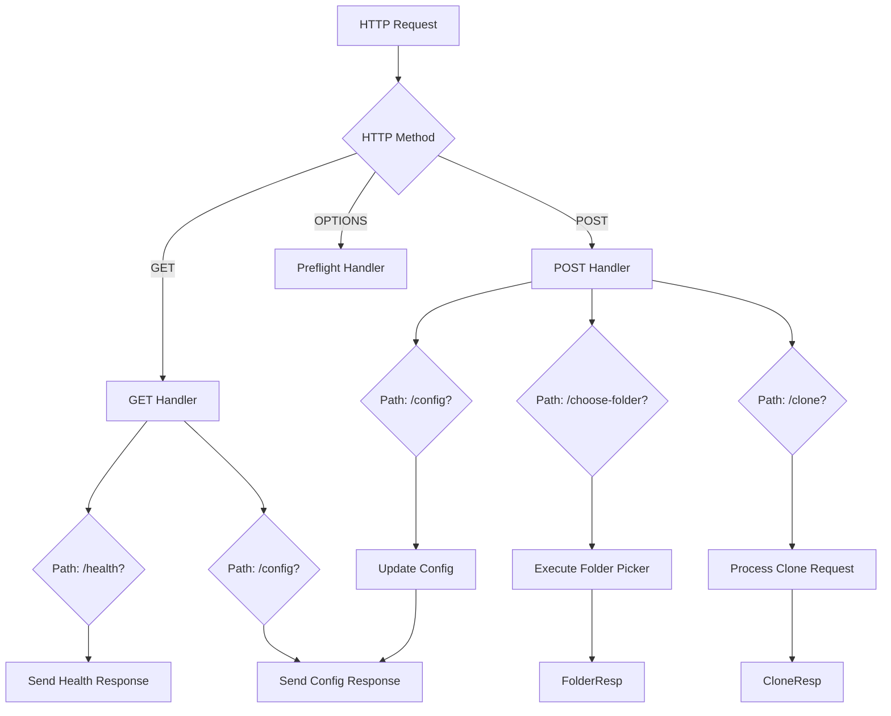
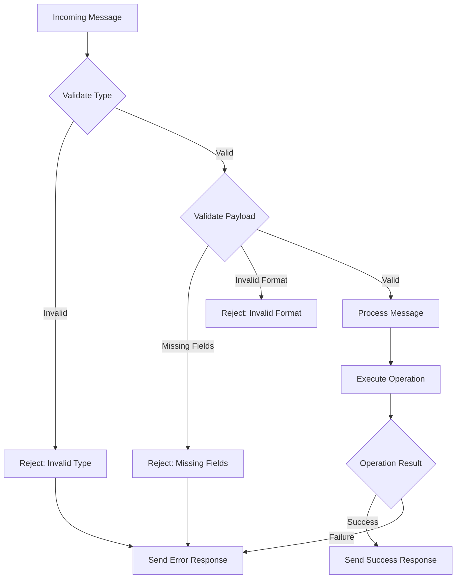
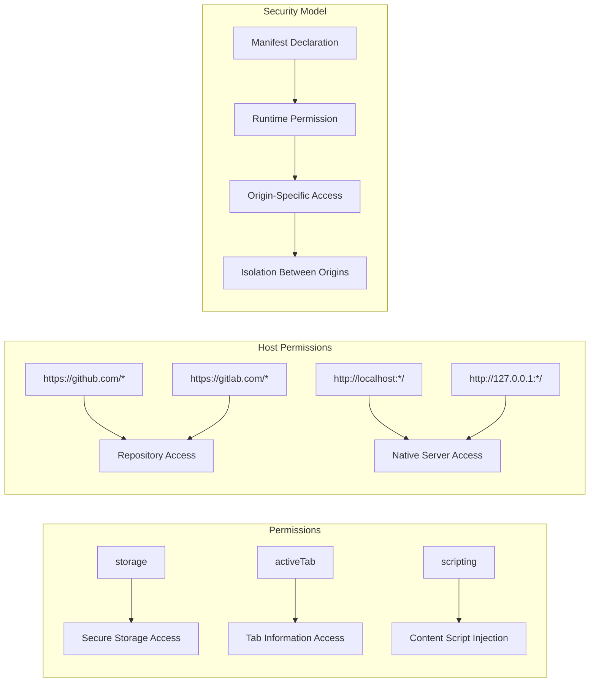
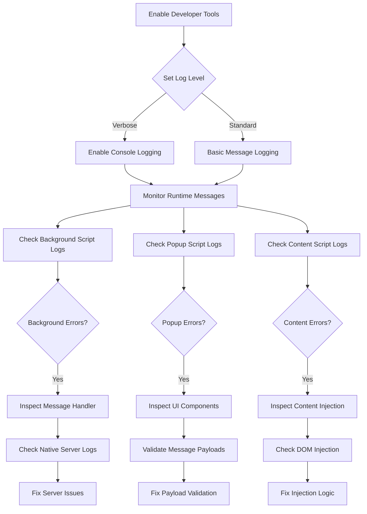
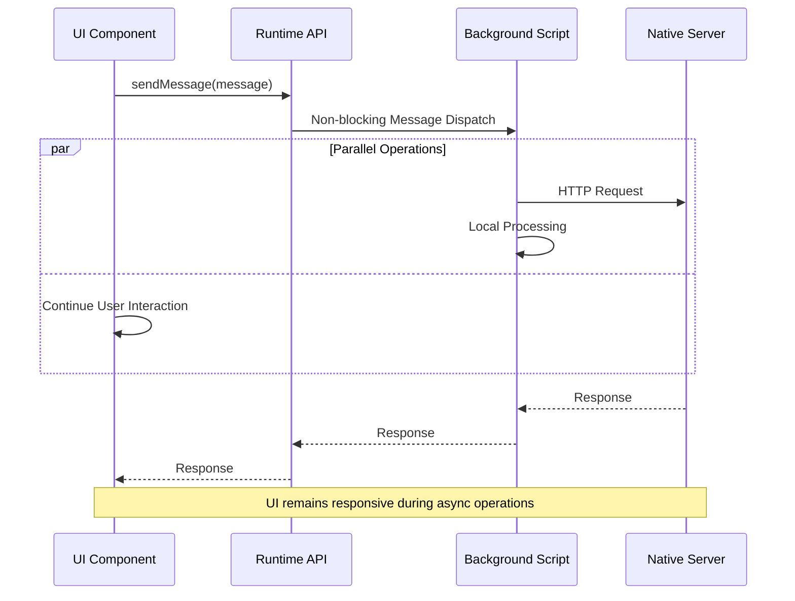

# Extension Messaging

<cite>
**Referenced Files in This Document**
- [background.js](file://chrome-extension/background.js)
- [popup.js](file://chrome-extension/popup.js)
- [options.js](file://chrome-extension/options.js)
- [content.js](file://chrome-extension/content.js)
- [manifest.json](file://chrome-extension/manifest.json)
- [popup.html](file://chrome-extension/popup.html)
- [options.html](file://chrome-extension/options.html)
- [content.css](file://chrome-extension/content.css)
- [server.js](file://native-host/server.js)
- [package.json](file://native-host/package.json)
</cite>

## Table of Contents
1. [Introduction](#introduction)
2. [Project Structure](#project-structure)
3. [Core Components](#core-components)
4. [Architecture Overview](#architecture-overview)
5. [Detailed Component Analysis](#detailed-component-analysis)
6. [Message Types and Payloads](#message-types-and-payloads)
7. [Native Host Communication](#native-host-communication)
8. [Error Handling and Validation](#error-handling-and-validation)
9. [Cross-Origin Considerations](#cross-origin-considerations)
10. [Debugging Techniques](#debugging-techniques)
11. [Performance Considerations](#performance-considerations)
12. [Troubleshooting Guide](#troubleshooting-guide)
13. [Conclusion](#conclusion)

## Introduction

Git Magager is a Chrome extension designed to provide one-click Git repository cloning capabilities on popular platforms like GitHub and GitLab. The extension implements a sophisticated messaging architecture that enables seamless communication between multiple extension components and a local native host server.

The messaging system consists of two primary pathways:
1. **Chrome Extension Messaging**: Communication between extension components using Chrome's runtime messaging API
2. **Native Host Communication**: HTTP-based communication between the extension and a local companion server

This documentation provides comprehensive coverage of the message passing architecture, including message types, payload structures, response handling patterns, and integration with the native messaging protocol.

## Project Structure

The Git Magager project follows a modular structure with clear separation of concerns:



**Diagram sources**
- [manifest.json:19-43](file://chrome-extension/manifest.json#L19-L43)
- [background.js:24-73](file://chrome-extension/background.js#L24-L73)
- [server.js:137-256](file://native-host/server.js#L137-L256)

**Section sources**
- [manifest.json:1-50](file://chrome-extension/manifest.json#L1-L50)
- [background.js:1-74](file://chrome-extension/background.js#L1-L74)
- [server.js:1-263](file://native-host/server.js#L1-L263)

## Core Components

The extension architecture comprises four primary components that communicate through well-defined messaging patterns:

### Background Service Worker
The background script serves as the central coordinator for all extension messaging. It maintains server health checks, processes incoming messages, and orchestrates communication with the native host server.

### Popup Interface
The popup provides the primary user interaction point with pre-filled repository URLs and clone controls. It handles user input validation and displays real-time feedback.

### Options Interface
The options page manages user preferences including default clone directories, terminal applications, and behavior settings.

### Content Scripts
Content scripts integrate directly with GitHub and GitLab pages, detecting repository URLs and injecting clone buttons for seamless user experience.

**Section sources**
- [background.js:1-74](file://chrome-extension/background.js#L1-L74)
- [popup.js:1-168](file://chrome-extension/popup.js#L1-L168)
- [options.js:1-56](file://chrome-extension/options.js#L1-L56)
- [content.js:1-333](file://chrome-extension/content.js#L1-L333)

## Architecture Overview

The messaging architecture implements a layered approach with clear separation between UI components and backend services:



**Diagram sources**
- [popup.js:94-149](file://chrome-extension/popup.js#L94-L149)
- [background.js:42-52](file://chrome-extension/background.js#L42-L52)
- [server.js:213-251](file://native-host/server.js#L213-L251)

The architecture ensures robust error handling and graceful degradation when the native server is unavailable.

**Section sources**
- [background.js:23-73](file://chrome-extension/background.js#L23-L73)
- [popup.js:37-59](file://chrome-extension/popup.js#L37-L59)

## Detailed Component Analysis

### Background Script Messaging Handler

The background script implements a centralized message listener that processes requests from all extension components:

```mermaid
flowchart TD
Start([Message Received]) --> TypeCheck{Message Type?}
TypeCheck --> |CHECK_SERVER| HealthCheck[checkServerHealth()]
HealthCheck --> SendHealth[sendResponse(serverStatus)]
TypeCheck --> |CHOOSE_FOLDER| FolderReq[Fetch /choose-folder]
FolderReq --> FolderResp{Response Status?}
FolderResp --> |Success| SendFolder[sendResponse({success, path})]
FolderResp --> |Error| SendFolderErr[sendResponse({success: false, error})]
TypeCheck --> |CLONE| CloneReq[Fetch /clone]
CloneReq --> CloneResp{Response Status?}
CloneResp --> |Success| SendClone[sendResponse({success, result})]
CloneResp --> |Error| SendCloneErr[sendResponse({success: false, error})]
TypeCheck --> |GET_CONFIG| ConfigGet[Fetch /config]
ConfigGet --> SendConfig[sendResponse(config)]
TypeCheck --> |SET_CONFIG| ConfigSet[Fetch /config POST]
ConfigSet --> ConfigResp{Response Status?}
ConfigResp --> |Success| SendConfigSet[sendResponse({success, config})]
ConfigResp --> |Error| SendConfigErr[sendResponse({success: false, error})]
SendHealth --> End([Complete])
SendFolder --> End
SendFolderErr --> End
SendClone --> End
SendCloneErr --> End
SendConfig --> End
SendConfigSet --> End
SendConfigErr --> End
```

**Diagram sources**
- [background.js:24-73](file://chrome-extension/background.js#L24-L73)

**Section sources**
- [background.js:24-73](file://chrome-extension/background.js#L24-L73)

### Popup Component Message Flow

The popup component demonstrates asynchronous message handling with comprehensive error management:



**Diagram sources**
- [popup.js:37-59](file://chrome-extension/popup.js#L37-L59)
- [background.js:54-60](file://chrome-extension/background.js#L54-L60)

**Section sources**
- [popup.js:37-59](file://chrome-extension/popup.js#L37-L59)
- [popup.js:94-149](file://chrome-extension/popup.js#L94-L149)

### Content Script Integration Pattern

Content scripts implement a sophisticated injection pattern that detects repository URLs and provides seamless cloning:

```mermaid
flowchart TD
Init[Content Script Init] --> Platform{Detect Platform}
Platform --> |GitHub| GitHub[GitHub URL Detection]
Platform --> |GitLab| GitLab[GitLab URL Detection]
Platform --> |Other| Exit[Exit Script]
GitHub --> ExtractGH[Extract HTTPS/SSH URLs]
GitLab --> ExtractGL[Extract HTTPS/SSH URLs]
ExtractGH --> InjectBtn[Inject Clone Button]
ExtractGL --> InjectBtn
InjectBtn --> UserAction{User Clicks Clone?}
UserAction --> |Yes| FolderPick[sendMessage(CHOOSE_FOLDER)]
UserAction --> |No| Wait[Wait for Action]
FolderPick --> FolderResp{Folder Selected?}
FolderResp --> |Yes| CloneMsg[sendMessage(CLONE, {url, directory})]
FolderResp --> |No| Cancel[Cancel Operation]
CloneMsg --> CloneResp{Clone Success?}
CloneResp --> |Yes| Success[Show Success]
CloneResp --> |No| Error[Show Error]
```

**Diagram sources**
- [content.js:111-163](file://chrome-extension/content.js#L111-L163)

**Section sources**
- [content.js:111-163](file://chrome-extension/content.js#L111-L163)

## Message Types and Payloads

The extension defines several standardized message types with specific payload structures:

### Server Health Messages

**Message Type**: `CHECK_SERVER`
**Purpose**: Verify native host server availability
**Payload**: None (empty object)
**Response**: Boolean indicating server status

### Configuration Management Messages

**Message Type**: `GET_CONFIG`
**Purpose**: Retrieve user configuration
**Payload**: None
**Response**: Configuration object containing:
- `cloneDirectory`: String path to default clone location
- `terminalApp`: String specifying terminal application
- `openInTerminal`: Boolean controlling terminal behavior

**Message Type**: `SET_CONFIG`
**Purpose**: Update user configuration
**Payload**: Configuration object with specified fields
**Response**: `{ success: boolean, config?: object, error?: string }`

### Repository Cloning Messages

**Message Type**: `CLONE`
**Purpose**: Execute repository cloning operation
**Payload**: 
- `url`: String containing repository URL
- `openTerminal`: Boolean (optional) - controls terminal behavior
- `directory`: String (optional) - overrides default clone directory

**Response**: `{ success: boolean, output?: string, error?: string, stderr?: string }`

### Folder Selection Messages

**Message Type**: `CHOOSE_FOLDER`
**Purpose**: Open native folder picker dialog
**Payload**: `{ defaultPath?: string }`
**Response**: `{ success: boolean, path?: string, cancelled?: boolean, error?: string }`

**Section sources**
- [background.js:25-72](file://chrome-extension/background.js#L25-L72)
- [popup.js:112-116](file://chrome-extension/popup.js#L112-L116)
- [content.js:122-140](file://chrome-extension/content.js#L122-L140)

## Native Host Communication

The native host server implements a comprehensive HTTP API that handles all Git operations:

### Server Endpoints



**Diagram sources**
- [server.js:150-251](file://native-host/server.js#L150-L251)

### HTTP Request Processing

The native server implements robust request processing with comprehensive error handling:



**Diagram sources**
- [server.js:137-256](file://native-host/server.js#L137-L256)

**Section sources**
- [server.js:137-256](file://native-host/server.js#L137-L256)

## Error Handling and Validation

The messaging system implements comprehensive error handling at multiple levels:

### Message Validation Patterns



### Error Propagation Strategy

The system implements a consistent error propagation pattern:

1. **Validation Errors**: Immediate rejection with descriptive error messages
2. **Execution Errors**: Graceful fallback with user-friendly error reporting
3. **Network Errors**: Retry mechanisms and user notification
4. **Timeout Handling**: Graceful degradation with fallback UI states

**Section sources**
- [background.js:11-21](file://chrome-extension/background.js#L11-L21)
- [server.js:166-187](file://native-host/server.js#L166-L187)

## Cross-Origin Considerations

The extension handles cross-origin communication through carefully configured permissions and security measures:

### Manifest Permissions

The extension declares specific permissions for secure cross-origin communication:



**Diagram sources**
- [manifest.json:6-18](file://chrome-extension/manifest.json#L6-L18)

### Security Implementation

The native server implements security measures for local communication:

1. **Origin Validation**: Accepts requests from localhost origins only
2. **CORS Headers**: Configurable CORS handling for development flexibility
3. **Input Sanitization**: Validates and sanitizes all incoming requests
4. **Command Injection Prevention**: Escapes special characters in shell commands

**Section sources**
- [manifest.json:6-18](file://chrome-extension/manifest.json#L6-L18)
- [server.js:137-148](file://native-host/server.js#L137-L148)

## Debugging Techniques

Effective debugging requires understanding the multi-layered messaging architecture:

### Message Flow Debugging



### Common Debugging Scenarios

1. **Message Not Received**: Check message type validation and payload structure
2. **Server Unavailable**: Verify native server process and port accessibility
3. **Permission Denied**: Review manifest permissions and host permission declarations
4. **Content Script Issues**: Validate DOM injection timing and platform detection

**Section sources**
- [background.js:11-21](file://chrome-extension/background.js#L11-L21)
- [popup.js:37-59](file://chrome-extension/popup.js#L37-L59)

## Performance Considerations

The messaging architecture incorporates several performance optimization strategies:

### Asynchronous Operation Handling



### Caching and State Management

The system implements intelligent caching strategies:
- **Server Health Cache**: Temporary caching of server availability status
- **Configuration Cache**: Local storage of user preferences
- **URL Detection Cache**: Cached repository URL extraction results

### Memory Management

Content scripts implement memory-efficient patterns:
- **Mutation Observers**: Debounced DOM observation with cleanup
- **Event Delegation**: Efficient event handling with minimal overhead
- **Resource Cleanup**: Proper cleanup of injected elements and observers

## Troubleshooting Guide

### Common Issues and Solutions

**Issue**: Extension fails to connect to native server
- **Symptoms**: Server status shows disconnected, clone operations fail
- **Causes**: Server not running, incorrect port, firewall blocking
- **Solutions**: Start native server, verify port accessibility, check firewall settings

**Issue**: Messages not received by background script
- **Symptoms**: UI appears frozen, no response to user actions
- **Causes**: Message handler not registered, invalid message format
- **Solutions**: Verify message handler registration, validate message structure

**Issue**: Content script injection failures
- **Symptoms**: Clone buttons not appearing on repository pages
- **Causes**: Content script not loaded, DOM mutation timing issues
- **Solutions**: Check content script permissions, verify DOM observer timing

**Issue**: Cross-origin communication errors
- **Symptoms**: Mixed content warnings, blocked requests
- **Causes**: Missing host permissions, insecure content loading
- **Solutions**: Add required host permissions, ensure HTTPS for external resources

### Diagnostic Commands

```bash
# Check native server status
curl http://127.0.0.1:9456/health

# Verify extension permissions
chrome://extensions/?id=[extension-id]

# Check browser console for errors
Developer Tools > Console
```

**Section sources**
- [background.js:11-21](file://chrome-extension/background.js#L11-L21)
- [server.js:258-262](file://native-host/server.js#L258-L262)

## Conclusion

The Git Magager extension demonstrates a sophisticated approach to Chrome extension messaging architecture. The system successfully balances user experience with technical robustness through:

- **Clear Separation of Concerns**: Well-defined roles for each component
- **Robust Error Handling**: Comprehensive error propagation and user feedback
- **Performance Optimization**: Asynchronous operations and efficient resource management
- **Security Implementation**: Careful permission management and input validation
- **Extensibility**: Modular design supporting future enhancements

The messaging architecture provides a solid foundation for similar extensions requiring native system integration while maintaining security and performance standards.