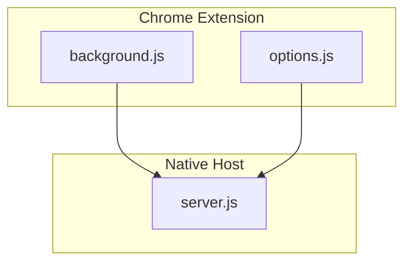
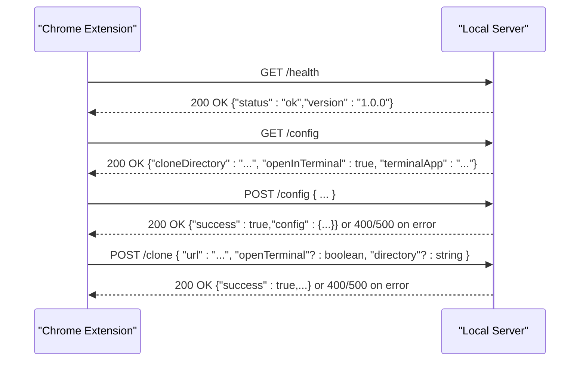
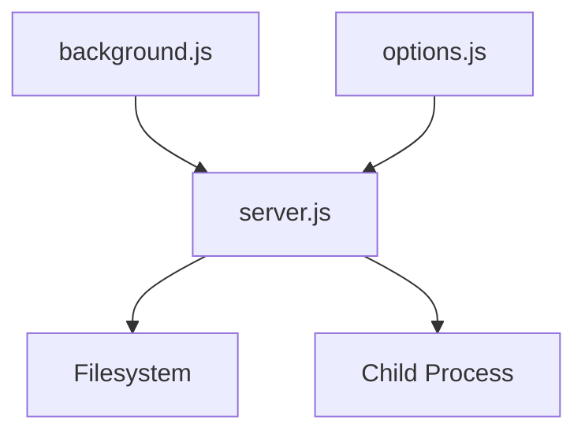

# HTTP Endpoints

<cite>
**Referenced Files in This Document**
- [server.js](file://native-host/server.js)
- [background.js](file://chrome-extension/background.js)
- [options.js](file://chrome-extension/options.js)
- [manifest.json](file://chrome-extension/manifest.json)
</cite>

## Table of Contents
1. [Introduction](#introduction)
2. [Project Structure](#project-structure)
3. [Core Components](#core-components)
4. [Architecture Overview](#architecture-overview)
5. [Detailed Component Analysis](#detailed-component-analysis)
6. [Dependency Analysis](#dependency-analysis)
7. [Performance Considerations](#performance-considerations)
8. [Troubleshooting Guide](#troubleshooting-guide)
9. [Conclusion](#conclusion)
10. [Appendices](#appendices)

## Introduction
This document describes the HTTP API exposed by Git Magager’s local server. It covers the endpoints used by the Chrome extension to manage configuration, check server health, and trigger repository cloning. The server runs locally on the user’s machine and is intended for internal use by the browser extension.

## Project Structure
The HTTP server is implemented in the native host module and is consumed by the Chrome extension. The key files involved in the HTTP API are:
- Native host server implementation
- Chrome extension scripts that call the server endpoints

**Diagram sources**
- [server.js](file://native-host/server.js)
- [background.js](file://chrome-extension/background.js)
- [options.js](file://chrome-extension/options.js)

**Section sources**
- [server.js](file://native-host/server.js)
- [background.js](file://chrome-extension/background.js)
- [options.js](file://chrome-extension/options.js)

## Core Components
- Local HTTP server: Provides endpoints for health checks, configuration retrieval and updates, and repository cloning.
- Chrome extension: Sends HTTP requests to the local server and displays results to the user.

Key implementation details:
- Server listens on localhost at a fixed port.
- Endpoints are simple and return JSON responses.
- Configuration is stored in a JSON file in the user’s home directory.

**Section sources**
- [server.js](file://native-host/server.js)

## Architecture Overview
The Chrome extension communicates with the local server via HTTP. The server exposes endpoints for health checks, configuration management, and cloning. Requests originate from the extension and responses are returned in JSON format.

**Diagram sources**
- [server.js](file://native-host/server.js)
- [background.js](file://chrome-extension/background.js)

## Detailed Component Analysis

### Endpoint: GET /health
- Purpose: Verify that the local server is running and responsive.
- Method: GET
- URL: http://127.0.0.1:9456/health
- Content-Type: application/json
- Response body:
  - status: String indicating server health (e.g., "ok")
  - version: String indicating server version
- Typical success response: 200 OK
- Notes:
  - The extension performs a health check during installation.

Example usage:
- curl -s http://127.0.0.1:9456/health

**Section sources**
- [server.js](file://native-host/server.js)
- [background.js](file://chrome-extension/background.js)

### Endpoint: GET /config
- Purpose: Retrieve current configuration values.
- Method: GET
- URL: http://127.0.0.1:9456/config
- Content-Type: application/json
- Response body:
  - cloneDirectory: String representing the base directory for clones
  - openInTerminal: Boolean indicating whether to open a terminal after cloning
  - terminalApp: String specifying the terminal application to use
- Typical success response: 200 OK
- Notes:
  - The response reflects the merged default configuration and persisted values.

Example usage:
- curl -s http://127.0.0.1:9456/config

**Section sources**
- [server.js](file://native-host/server.js)

### Endpoint: POST /config
- Purpose: Update configuration values.
- Method: POST
- URL: http://127.0.0.1:9456/config
- Content-Type: application/json
- Request body:
  - Fields to update (optional): cloneDirectory, openInTerminal, terminalApp
  - Behavior: Provided fields are merged into existing configuration
- Response body:
  - success: Boolean indicating operation outcome
  - config: Updated configuration object (on success)
  - error: String describing failure (on error)
- Status codes:
  - 200 OK: On successful update
  - 400 Bad Request: If the request body is invalid JSON
  - 500 Internal Server Error: If saving configuration fails
- Notes:
  - The server persists configuration to a JSON file in the user’s home directory.

Example usage:
- curl -s -X POST http://127.0.0.1:9456/config -H "Content-Type: application/json" -d '{ "openInTerminal": false }'

**Section sources**
- [server.js](file://native-host/server.js)

### Endpoint: POST /clone
- Purpose: Clone a Git repository to the configured directory or a specified directory, optionally opening a terminal.
- Method: POST
- URL: http://127.0.0.1:9456/clone
- Content-Type: application/json
- Request body:
  - url: String, required. The repository URL to clone.
  - openTerminal: Boolean, optional. Overrides the global setting to open a terminal after cloning.
  - directory: String, optional. Overrides the configured clone directory for this operation.
- Response body:
  - success: Boolean indicating operation outcome
  - output/stdout: String containing standard output from the clone process (on success)
  - stderr: String containing standard error from the clone process (on success)
  - error: String describing failure (on error)
- Status codes:
  - 200 OK: On successful clone or terminal launch
  - 400 Bad Request: If url is missing
  - 500 Internal Server Error: If cloning fails or other errors occur
- Notes:
  - The server ensures the clone directory exists before cloning.
  - Terminal behavior depends on the openTerminal flag and configuration.

Example usage:
- curl -s -X POST http://127.0.0.1:9456/clone -H "Content-Type: application/json" -d '{ "url": "https://example.com/repo.git" }'

**Section sources**
- [server.js](file://native-host/server.js)

### Endpoint: POST /choose-folder
- Purpose: Trigger a native folder selection dialog (macOS) to pick a destination directory.
- Method: POST
- URL: http://127.0.0.1:9456/choose-folder
- Content-Type: application/json
- Request body:
  - defaultPath: String, optional. Initial path for the folder picker.
- Response body:
  - success: Boolean indicating operation outcome
  - path: String containing the selected folder path (on success)
  - cancelled: Boolean indicating user cancellation (on success)
  - error: String describing failure (on error)
- Status codes:
  - 200 OK: On successful selection or cancellation
  - 500 Internal Server Error: If the folder picker fails

Example usage:
- curl -s -X POST http://127.0.0.1:9456/choose-folder -H "Content-Type: application/json" -d '{ "defaultPath": "/Users/me/Projects" }'

**Section sources**
- [server.js](file://native-host/server.js)

## Dependency Analysis
The Chrome extension interacts with the local server. The extension’s background script sends requests to the server and handles responses. The server relies on local filesystem operations and child process execution to perform cloning and terminal actions.

**Diagram sources**
- [server.js](file://native-host/server.js)
- [background.js](file://chrome-extension/background.js)
- [options.js](file://chrome-extension/options.js)

**Section sources**
- [server.js](file://native-host/server.js)
- [background.js](file://chrome-extension/background.js)
- [options.js](file://chrome-extension/options.js)

## Performance Considerations
- The server is lightweight and synchronous for small operations. Cloning can be slow depending on repository size and network conditions.
- Frequent polling of /health is unnecessary; the extension performs a single check on install.
- Avoid sending large configuration payloads; only include changed fields.

## Troubleshooting Guide
Common issues and resolutions:
- Server not reachable:
  - Ensure the native host server is running locally.
  - Confirm the port matches the configured value.
- Invalid JSON in requests:
  - Validate request bodies as JSON before sending.
- Missing URL in clone requests:
  - Provide a valid repository URL in the url field.
- Permission errors:
  - Verify the clone directory exists and is writable.
- Terminal not opening:
  - Check the terminalApp setting and ensure the specified terminal is installed.

**Section sources**
- [server.js](file://native-host/server.js)
- [background.js](file://chrome-extension/background.js)

## Conclusion
The local HTTP API provides essential functionality for managing configuration, verifying server health, and performing repository cloning. It is designed for internal use by the Chrome extension and operates securely on localhost. Use the provided endpoints with JSON payloads and handle responses accordingly.

## Appendices

### HTTP Methods and URL Patterns
- GET http://127.0.0.1:9456/health
- GET http://127.0.0.1:9456/config
- POST http://127.0.0.1:9456/config
- POST http://127.0.0.1:9456/clone
- POST http://127.0.0.1:9456/choose-folder

**Section sources**
- [server.js](file://native-host/server.js)

### Content-Type Requirements
- All endpoints accept and return application/json.

**Section sources**
- [server.js](file://native-host/server.js)

### CORS Configuration
- No explicit CORS headers are set in the server implementation.
- The server is intended for local use by the Chrome extension and does not expose cross-origin endpoints.

**Section sources**
- [server.js](file://native-host/server.js)

### Authentication and Security
- No authentication is enforced by the server.
- The server binds to localhost only, reducing exposure.
- The extension runs with permissions defined in the manifest.

**Section sources**
- [server.js](file://native-host/server.js)
- [manifest.json](file://chrome-extension/manifest.json)

### Rate Limiting
- No built-in rate limiting is implemented.
- Clients should avoid excessive polling or rapid successive requests.

**Section sources**
- [server.js](file://native-host/server.js)

### Client Implementation Patterns
- Use fetch or XMLHttpRequest to send requests.
- Handle JSON parsing and error responses.
- For cloning, optionally pass openTerminal and directory to override defaults.

**Section sources**
- [background.js](file://chrome-extension/background.js)
- [options.js](file://chrome-extension/options.js)