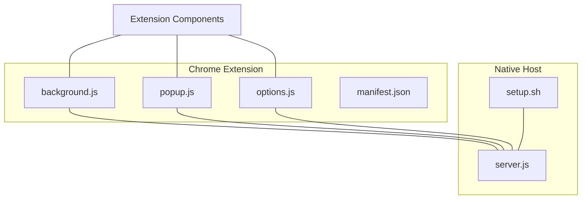
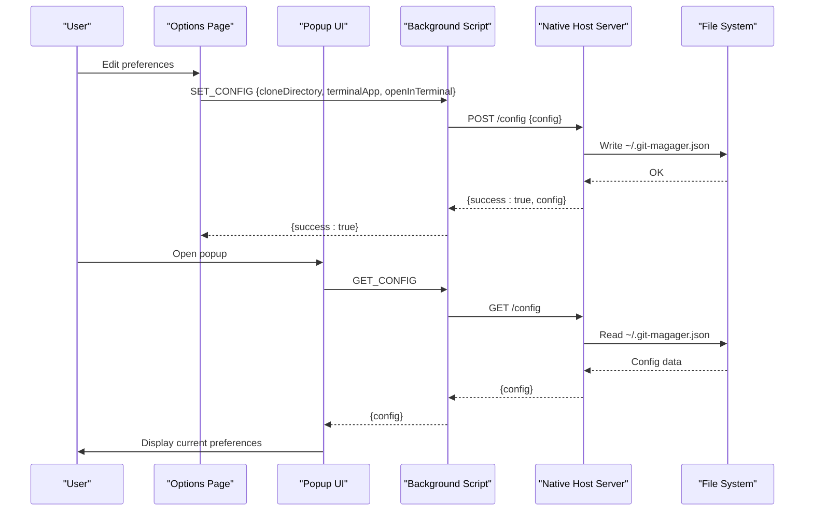
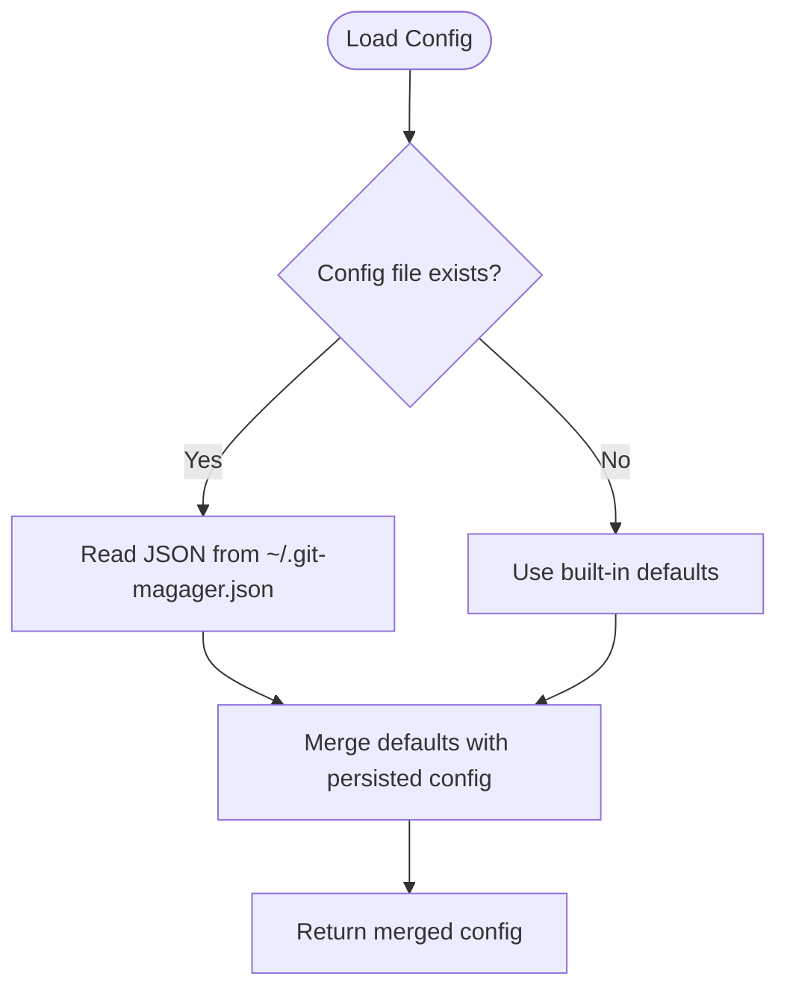
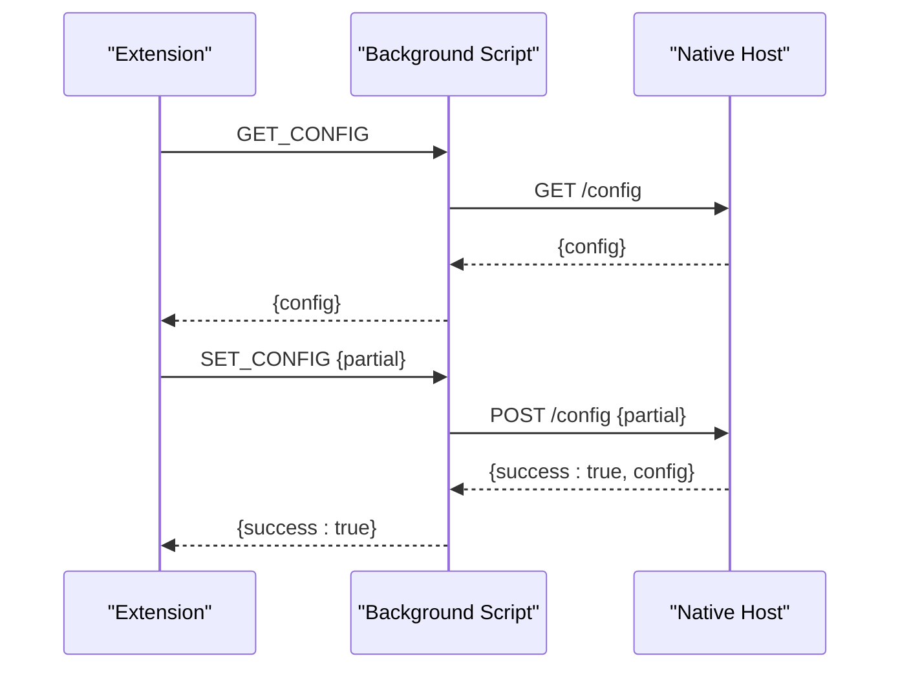
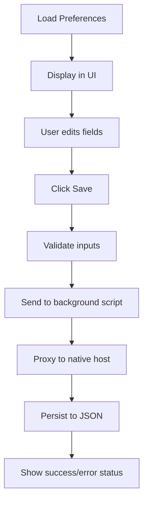
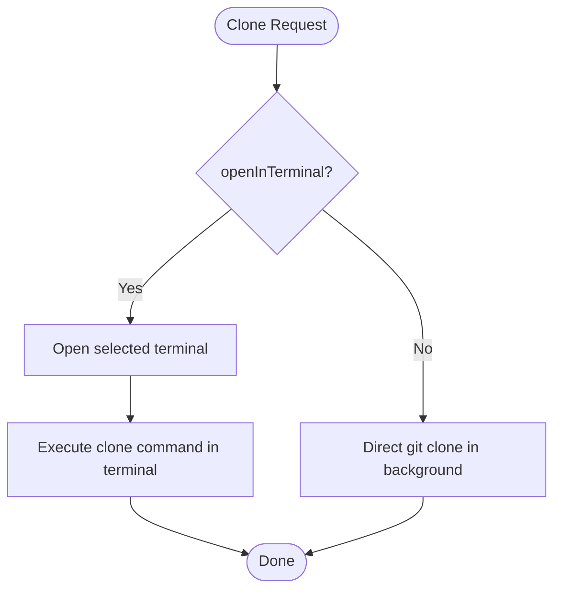
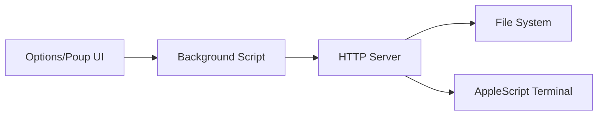

# Configuration Management

<cite>
**Referenced Files in This Document**
- [options.html](file://chrome-extension/options.html)
- [options.js](file://chrome-extension/options.js)
- [background.js](file://chrome-extension/background.js)
- [popup.html](file://chrome-extension/popup.html)
- [popup.js](file://chrome-extension/popup.js)
- [content.js](file://chrome-extension/content.js)
- [manifest.json](file://chrome-extension/manifest.json)
- [server.js](file://native-host/server.js)
- [setup.sh](file://native-host/setup.sh)
</cite>

## Table of Contents
1. [Introduction](#introduction)
2. [Project Structure](#project-structure)
3. [Core Components](#core-components)
4. [Architecture Overview](#architecture-overview)
5. [Detailed Component Analysis](#detailed-component-analysis)
6. [Dependency Analysis](#dependency-analysis)
7. [Performance Considerations](#performance-considerations)
8. [Troubleshooting Guide](#troubleshooting-guide)
9. [Conclusion](#conclusion)

## Introduction
This document describes the configuration management system for Git Magager. It covers the configuration schema, persistence using JSON files, validation and migration behavior, synchronization between extension components and the native host server, user preference management via the options page, and operational considerations such as file locations, backups, and multi-user scenarios.

## Project Structure
Git Magager consists of:
- A Chrome extension with a background service worker, popup UI, content scripts, and an options page
- A native host server written in Node.js that exposes a local HTTP API for configuration and cloning

**Diagram sources**
- [background.js:1-62](file://chrome-extension/background.js#L1-L62)
- [popup.js:1-168](file://chrome-extension/popup.js#L1-L168)
- [options.js:1-56](file://chrome-extension/options.js#L1-L56)
- [server.js:1-211](file://native-host/server.js#L1-L211)
- [setup.sh:1-102](file://native-host/setup.sh#L1-L102)

**Section sources**
- [manifest.json:1-50](file://chrome-extension/manifest.json#L1-L50)
- [background.js:1-62](file://chrome-extension/background.js#L1-L62)
- [server.js:1-211](file://native-host/server.js#L1-L211)

## Core Components
The configuration model is centered around three user preferences:
- cloneDirectory: Path to the default directory where repositories are cloned
- openInTerminal: Boolean flag controlling whether cloning occurs inside a terminal
- terminalApp: Selection among supported terminal applications

These preferences are persisted in a JSON file located under the user’s home directory and synchronized between the extension and the native host server.

**Section sources**
- [server.js:10-15](file://native-host/server.js#L10-L15)
- [server.js:17-27](file://native-host/server.js#L17-L27)
- [options.html:178-203](file://chrome-extension/options.html#L178-L203)
- [options.js:27-31](file://chrome-extension/options.js#L27-L31)

## Architecture Overview
The configuration lifecycle spans three layers:
- User interface: Options page and popup UI collect and display preferences
- Extension runtime: Background script proxies requests to the native host
- Native host: Server loads/saves configuration and performs cloning operations

**Diagram sources**
- [options.js:23-54](file://chrome-extension/options.js#L23-L54)
- [background.js:42-61](file://chrome-extension/background.js#L42-L61)
- [server.js:133-163](file://native-host/server.js#L133-L163)
- [server.js:17-37](file://native-host/server.js#L17-L37)

## Detailed Component Analysis

### Configuration Schema
The configuration object includes:
- cloneDirectory: String representing a filesystem path
- openInTerminal: Boolean indicating whether to open a terminal after cloning
- terminalApp: String constrained to supported terminal applications

Supported terminal applications:
- macOS Terminal
- iTerm2
- Warp

Default values are defined in the native host server and used when loading configuration from disk.

**Section sources**
- [server.js:10-15](file://native-host/server.js#L10-L15)
- [server.js:71-111](file://native-host/server.js#L71-L111)
- [options.html:185-191](file://chrome-extension/options.html#L185-L191)

### Configuration Persistence Mechanism
- File location: ~/.git-magager.json (per-user)
- Persistence strategy: Full replacement writes with JSON serialization
- Default fallback: Server merges persisted config with built-in defaults on load
- Validation: Server accepts partial updates and merges them into existing config

**Diagram sources**
- [server.js:17-27](file://native-host/server.js#L17-L27)
- [server.js:10-15](file://native-host/server.js#L10-L15)

**Section sources**
- [server.js:17-37](file://native-host/server.js#L17-L37)
- [server.js:133-163](file://native-host/server.js#L133-L163)

### Settings Synchronization Between Extension and Native Host
- The extension communicates with the native host via HTTP endpoints:
  - GET /config: Retrieve current configuration
  - POST /config: Update configuration (partial updates are accepted)
  - POST /clone: Perform clone operation with optional terminal opening
- The background script acts as a proxy, translating extension messages to HTTP requests.

**Diagram sources**
- [background.js:42-61](file://chrome-extension/background.js#L42-L61)
- [server.js:133-163](file://native-host/server.js#L133-L163)

**Section sources**
- [background.js:24-61](file://chrome-extension/background.js#L24-L61)
- [server.js:133-163](file://native-host/server.js#L133-L163)

### User Preference Management via Options Page
- The options page presents:
  - Default clone directory input
  - Terminal application selection
  - Toggle for opening in terminal
- Real-time feedback:
  - On save, the UI displays success or error status messages
  - Disabled save button during save operations
- Validation and error handling:
  - On save failure, the UI shows an error message
  - On load failure, the UI falls back to defaults

**Diagram sources**
- [options.html:176-216](file://chrome-extension/options.html#L176-L216)
- [options.js:10-54](file://chrome-extension/options.js#L10-L54)

**Section sources**
- [options.html:176-216](file://chrome-extension/options.html#L176-L216)
- [options.js:10-54](file://chrome-extension/options.js#L10-L54)

### Terminal Integration Behavior
- When openInTerminal is true, the native host opens a terminal and executes the clone command
- Supported terminal applications are handled via AppleScript automation
- The terminal command constructs a shell command that navigates to the clone directory and runs the clone

**Diagram sources**
- [server.js:66-111](file://native-host/server.js#L66-L111)
- [server.js:178-189](file://native-host/server.js#L178-L189)

**Section sources**
- [server.js:66-111](file://native-host/server.js#L66-L111)
- [server.js:178-189](file://native-host/server.js#L178-L189)

### Environment-Specific Configurations and Multi-User Scenarios
- Per-user configuration: The native host stores configuration in the user’s home directory, ensuring isolation across users
- Default creation: The setup script creates a default configuration if none exists
- Service management: The setup script installs a launchd agent to automatically start the server

**Section sources**
- [server.js:8](file://native-host/server.js#L8)
- [setup.sh:23-39](file://native-host/setup.sh#L23-L39)
- [setup.sh:41-74](file://native-host/setup.sh#L41-L74)

## Dependency Analysis
The configuration system depends on:
- File system for JSON persistence
- HTTP server for cross-process communication
- AppleScript for terminal automation
- Extension messaging for UI-to-runtime coordination

**Diagram sources**
- [background.js:1-62](file://chrome-extension/background.js#L1-L62)
- [server.js:1-211](file://native-host/server.js#L1-L211)

**Section sources**
- [background.js:1-62](file://chrome-extension/background.js#L1-L62)
- [server.js:1-211](file://native-host/server.js#L1-L211)

## Performance Considerations
- Configuration reads/writes are lightweight JSON operations
- Terminal automation adds latency; consider disabling openInTerminal for frequent batch operations
- The native host server listens on localhost and uses minimal resources

## Troubleshooting Guide
Common issues and resolutions:
- Server not running:
  - Verify the native host server is started locally
  - Check logs at ~/.git-magager.log and ~/.git-magager-error.log
- Configuration not persisting:
  - Ensure the JSON file is writable in the user’s home directory
  - Confirm the file is valid JSON
- Terminal not opening:
  - Verify the selected terminal application is installed
  - Check AppleScript permissions for the terminal application

Operational references:
- Server health endpoint: GET /health
- Configuration endpoints: GET /config, POST /config
- Clone endpoint: POST /clone

**Section sources**
- [server.js:126-131](file://native-host/server.js#L126-L131)
- [server.js:133-163](file://native-host/server.js#L133-L163)
- [server.js:165-199](file://native-host/server.js#L165-L199)
- [setup.sh:77-81](file://native-host/setup.sh#L77-L81)

## Conclusion
Git Magager’s configuration management provides a straightforward, per-user JSON-backed model with robust defaults and seamless synchronization between the extension and native host. The system supports essential preferences for clone directory, terminal behavior, and terminal application selection, while offering clear operational guidance for setup, persistence, and troubleshooting.