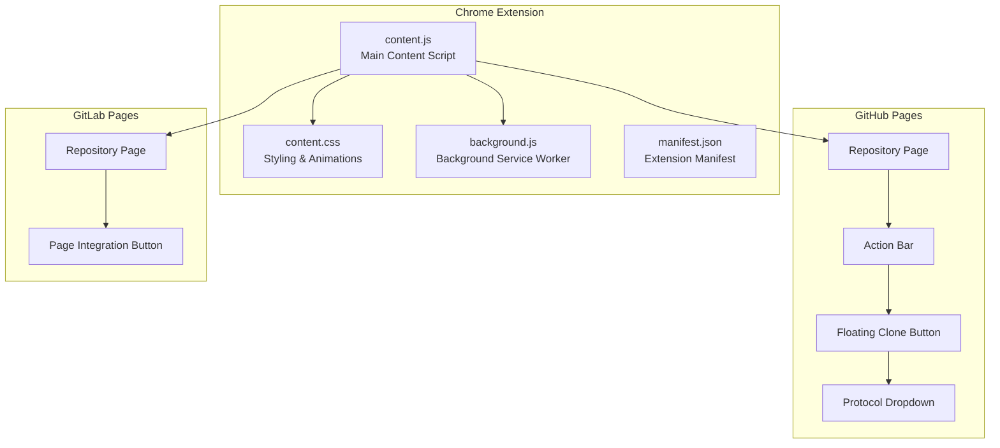
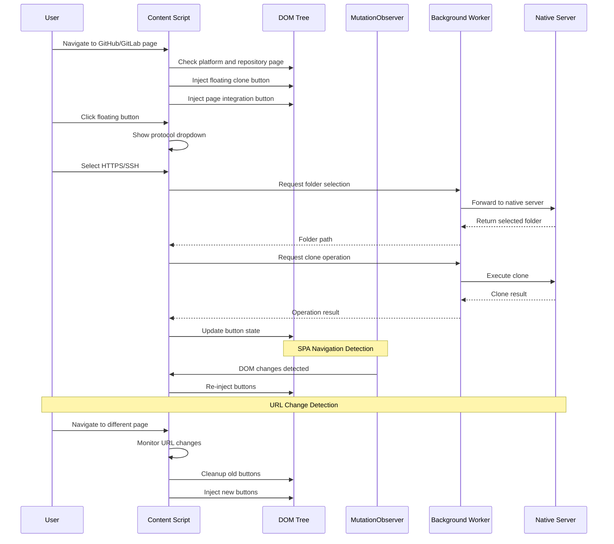
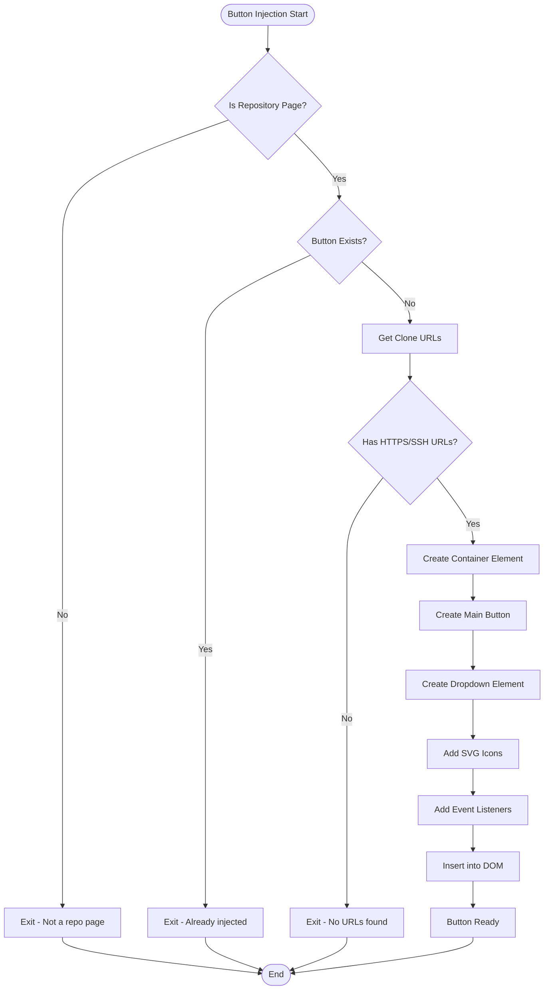
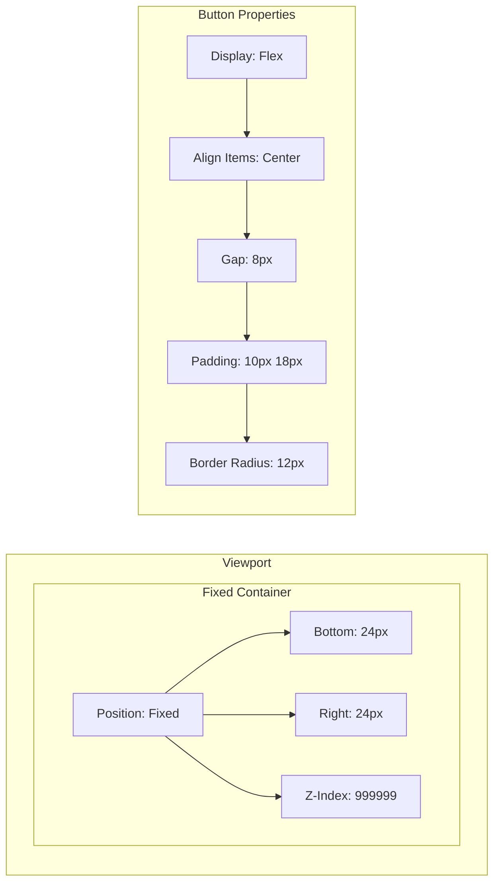
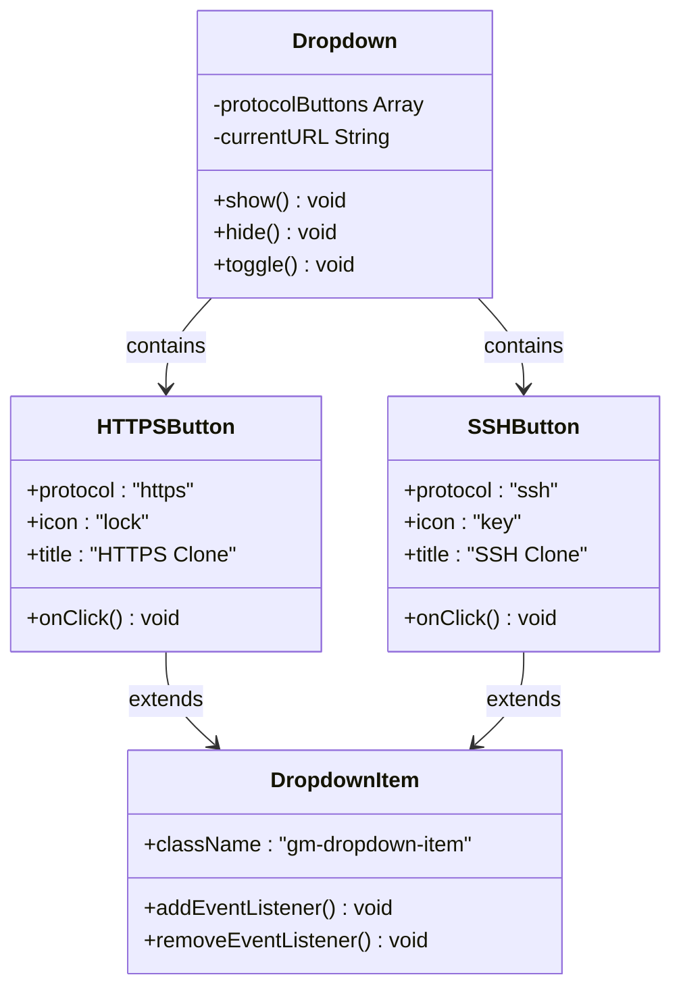
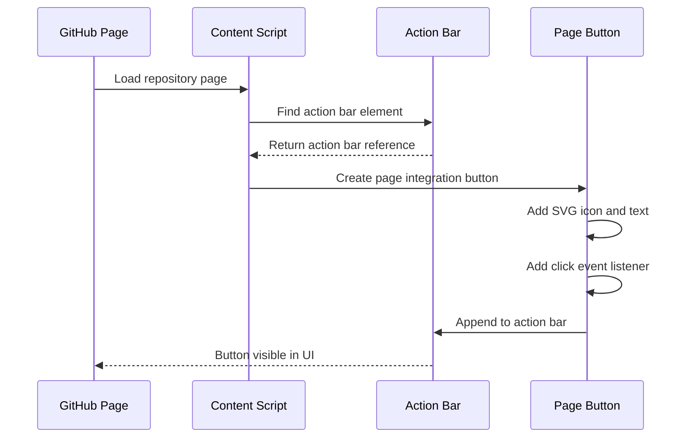
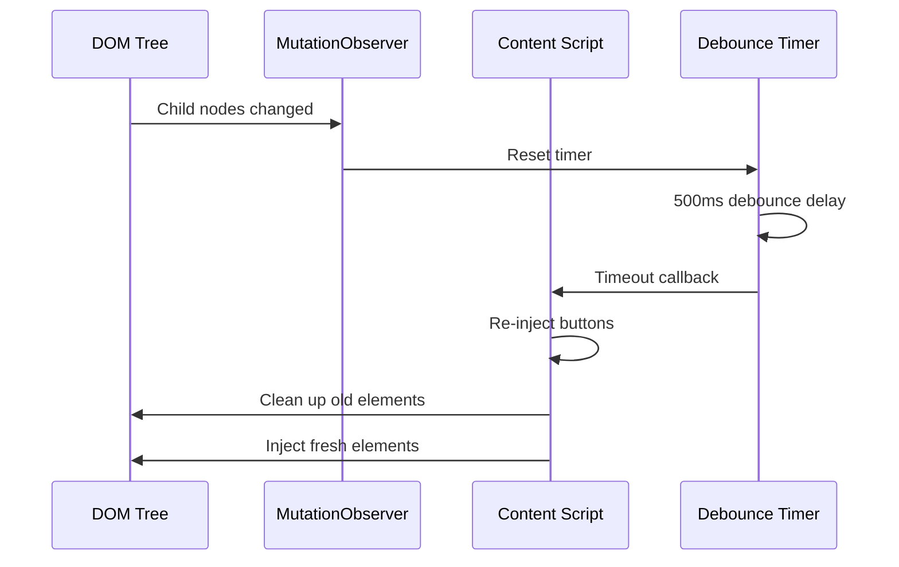
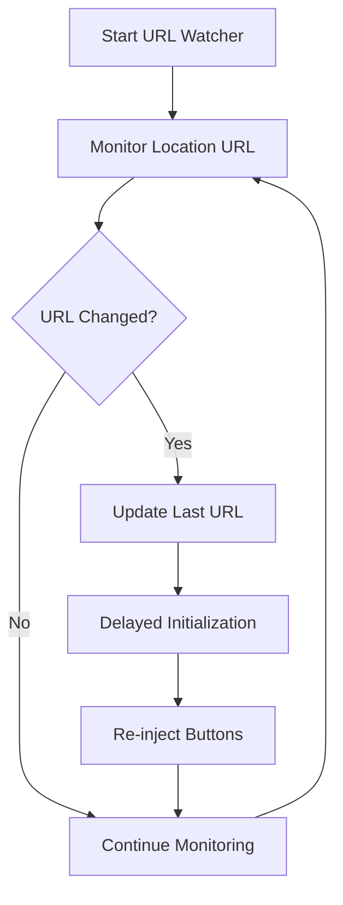
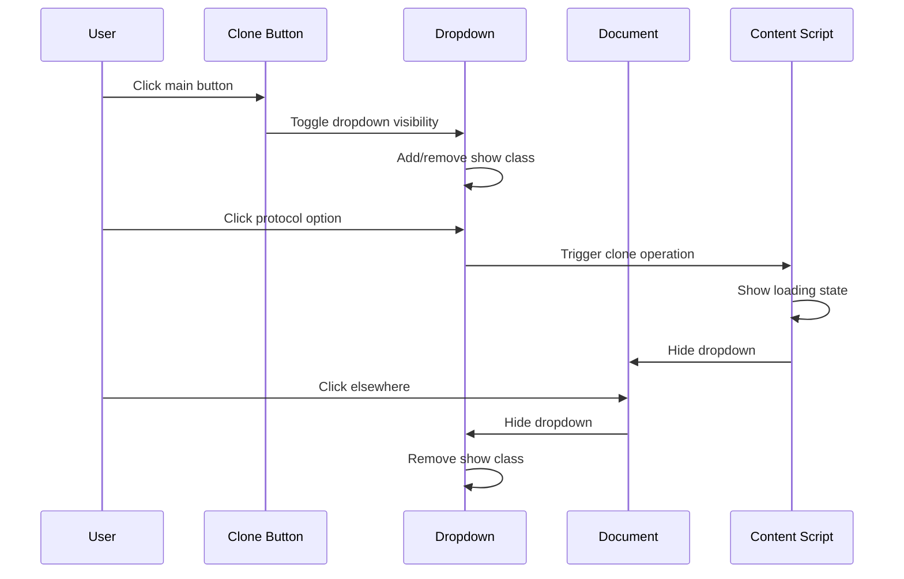
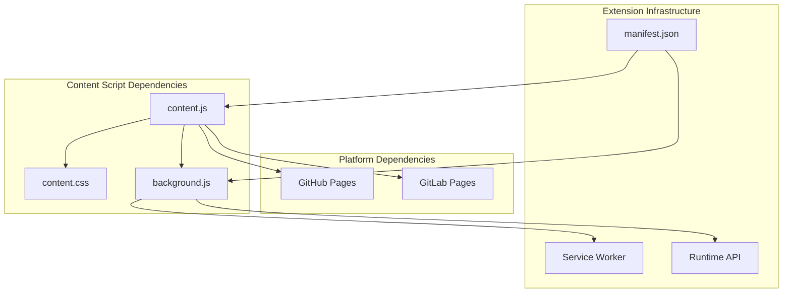

# Clone Button Injection

<cite>
**Referenced Files in This Document**
- [content.js](file://chrome-extension/content.js)
- [content.css](file://chrome-extension/content.css)
- [background.js](file://chrome-extension/background.js)
- [manifest.json](file://chrome-extension/manifest.json)
- [popup.html](file://chrome-extension/popup.html)
- [popup.js](file://chrome-extension/popup.js)
- [options.html](file://chrome-extension/options.html)
- [options.js](file://chrome-extension/options.js)
</cite>

## Table of Contents
1. [Introduction](#introduction)
2. [Project Structure](#project-structure)
3. [Core Components](#core-components)
4. [Architecture Overview](#architecture-overview)
5. [Detailed Component Analysis](#detailed-component-analysis)
6. [Dependency Analysis](#dependency-analysis)
7. [Performance Considerations](#performance-considerations)
8. [Troubleshooting Guide](#troubleshooting-guide)
9. [Conclusion](#conclusion)

## Introduction

The Git Magager Chrome extension provides seamless Git repository cloning capabilities through intelligent button injection on GitHub and GitLab pages. This documentation focuses specifically on the clone button injection system, detailing how floating clone buttons are created, positioned, and integrated with existing repository interfaces.

The system implements a sophisticated dual-button architecture featuring a floating clone button with an integrated HTTPS/SSH protocol selection dropdown, alongside a GitHub-specific page integration button that appears seamlessly within the repository's action bar. The implementation handles complex SPA navigation scenarios, prevents duplicate injections, and manages dynamic element lifecycle throughout user sessions.

## Project Structure

The clone button injection system is primarily implemented in the Chrome extension's content script and associated stylesheets:



**Diagram sources**
- [content.js:1-333](file://chrome-extension/content.js#L1-L333)
- [content.css:1-175](file://chrome-extension/content.css#L1-L175)
- [background.js:1-74](file://chrome-extension/background.js#L1-L74)
- [manifest.json:1-50](file://chrome-extension/manifest.json#L1-L50)

**Section sources**
- [content.js:1-333](file://chrome-extension/content.js#L1-L333)
- [content.css:1-175](file://chrome-extension/content.css#L1-L175)
- [manifest.json:1-50](file://chrome-extension/manifest.json#L1-L50)

## Core Components

The clone button injection system consists of several interconnected components working together to provide seamless Git repository cloning:

### Floating Clone Button System
The primary interface element is a floating clone button positioned in the bottom-right corner of the page. This button serves as the main entry point for repository cloning operations and includes sophisticated state management for user feedback during clone operations.

### Dual-Button Architecture
The system implements a dual-button approach:
- **Floating Button**: A prominent, always-visible button with protocol selection dropdown
- **Page Integration Button**: A smaller button integrated directly into GitHub's repository action bar

### Protocol Selection Dropdown
An intelligent dropdown that presents HTTPS and SSH clone options based on detected repository URLs, allowing users to choose their preferred protocol without manual URL manipulation.

### Platform-Specific Integration
Separate injection strategies for GitHub and GitLab platforms, each optimized for their respective page layouts and UI patterns.

**Section sources**
- [content.js:185-258](file://chrome-extension/content.js#L185-L258)
- [content.js:262-292](file://chrome-extension/content.js#L262-L292)
- [content.js:204-240](file://chrome-extension/content.js#L204-L240)

## Architecture Overview

The clone button injection system follows a multi-layered architecture designed for robust SPA navigation support and platform compatibility:



**Diagram sources**
- [content.js:296-332](file://chrome-extension/content.js#L296-L332)
- [background.js:24-73](file://chrome-extension/background.js#L24-L73)

The architecture ensures reliable button injection across different navigation patterns while maintaining optimal performance through debounced re-injection mechanisms.

## Detailed Component Analysis

### Floating Clone Button Creation Process

The floating clone button is constructed through a multi-step process that ensures proper DOM integration and user experience:

#### DOM Element Construction
The button creation process involves creating a container div with a unique ID, followed by the main button element and protocol dropdown:



**Diagram sources**
- [content.js:185-258](file://chrome-extension/content.js#L185-L258)

#### CSS Class Assignment Strategy
The button receives multiple CSS classes for styling and state management:
- **Primary Class**: `gm-clone-btn` for base styling
- **State Classes**: `gm-success`, `gm-error`, `gm-cloning` for visual feedback
- **Dropdown Classes**: `gm-dropdown`, `gm-dropdown-show` for dropdown state

#### Positioning Strategies
The floating button uses a fixed positioning strategy with carefully calculated margins:



**Diagram sources**
- [content.css:13-19](file://chrome-extension/content.css#L13-L19)
- [content.css:21-36](file://chrome-extension/content.css#L21-L36)

**Section sources**
- [content.js:185-258](file://chrome-extension/content.js#L185-L258)
- [content.css:13-66](file://chrome-extension/content.css#L13-L66)

### Dual-Button Architecture Implementation

The system implements a sophisticated dual-button architecture that provides different user experiences depending on the target platform:

#### Main Clone Button Features
The floating clone button serves as the primary interface with comprehensive functionality:
- **Protocol Detection**: Automatically detects available HTTPS and SSH protocols
- **Visual Feedback**: Provides real-time status updates during clone operations
- **Error Handling**: Displays meaningful error messages for failed operations
- **Success Confirmation**: Shows completion status with visual indicators

#### Protocol Selection Dropdown
The dropdown component provides intelligent protocol selection:



**Diagram sources**
- [content.js:204-240](file://chrome-extension/content.js#L204-L240)
- [content.css:77-119](file://chrome-extension/content.css#L77-L119)

#### GitHub-Specific Page Integration Button
The page integration button is designed specifically for GitHub repository pages:



**Diagram sources**
- [content.js:262-292](file://chrome-extension/content.js#L262-L292)
- [content.css:120-140](file://chrome-extension/content.css#L120-L140)

**Section sources**
- [content.js:204-240](file://chrome-extension/content.js#L204-L240)
- [content.js:262-292](file://chrome-extension/content.js#L262-L292)
- [content.css:77-140](file://chrome-extension/content.css#L77-L140)

### GitHub-Specific Page Integration

The GitHub-specific integration button is strategically positioned within the repository's action bar to blend seamlessly with existing UI elements:

#### Target Element Selection
The system identifies the appropriate insertion point using multiple selector strategies:
- `.file-navigation .d-flex` for standard repository layouts
- `.react-directory-header-name-and-utils` for newer GitHub interfaces
- `[data-testid="repo-header-actions"]` for test-driven selectors

#### Integration Design Principles
The page integration button maintains visual consistency with GitHub's design language:
- **Size Proportions**: Matches GitHub's standard button sizing (5px 14px padding)
- **Typography**: Uses GitHub's font stack and weight specifications
- **Color Scheme**: Inherits GitHub's primary color palette
- **Spacing**: Maintains consistent spacing with adjacent action buttons

**Section sources**
- [content.js:262-292](file://chrome-extension/content.js#L262-L292)
- [content.css:120-140](file://chrome-extension/content.css#L120-L140)

### Injection Timing Mechanisms

The system employs multiple sophisticated timing mechanisms to ensure reliable button injection across different navigation patterns:

#### Initial Page Load Detection
The system performs immediate injection upon page load with fallback handling for dynamic content:

```mermaid
flowchart TD
PageLoad[Page Load Event] --> CheckReady{"Document Ready?"}
CheckReady --> |Loading| WaitDOMContentLoaded[Wait for DOMContentLoaded]
CheckReady --> |Complete| ImmediateInit[Immediate Initialization]
WaitDOMContentLoaded --> Init[Run init()]
ImmediateInit --> Init
Init --> InjectButtons[Inject Buttons]
InjectButtons --> SetupObserver[Setup MutationObserver]
SetupObserver --> SetupURLWatcher[Setup URL Watcher]
SetupURLWatcher --> Ready[Ready for SPA Navigation]
```

**Diagram sources**
- [content.js:296-307](file://chrome-extension/content.js#L296-L307)

#### SPA Navigation Handling via MutationObserver
The system monitors DOM changes to handle GitHub's Single Page Application navigation:



**Diagram sources**
- [content.js:309-322](file://chrome-extension/content.js#L309-L322)

#### URL Change Detection
The system implements continuous URL monitoring for navigation events:



**Diagram sources**
- [content.js:324-331](file://chrome-extension/content.js#L324-L331)

**Section sources**
- [content.js:296-331](file://chrome-extension/content.js#L296-L331)

### Prevention of Duplicate Injections and Element Cleanup

The system implements multiple strategies to prevent duplicate button injection and manage element lifecycle:

#### Duplicate Prevention Mechanisms
- **Global Flag**: `window.__gitMagagerInjected` prevents multiple script instances
- **Element Existence Checks**: Verifies button existence before injection
- **Platform Validation**: Ensures buttons are only injected on supported pages

#### Dynamic Element Cleanup
The cleanup process ensures proper resource management:
- **Observer Disconnection**: Stops MutationObserver when navigating away
- **Event Listener Removal**: Removes all attached event listeners
- **DOM Element Removal**: Completely removes injected elements from the page

#### Lifecycle Management
The system manages button lifecycle through careful state tracking:
- **Initialization State**: Tracks whether injection has occurred
- **Navigation State**: Monitors current page context
- **Operation State**: Manages ongoing clone operations

**Section sources**
- [content.js:7-9](file://chrome-extension/content.js#L7-L9)
- [content.js:185-187](file://chrome-extension/content.js#L185-L187)
- [content.js:262-265](file://chrome-extension/content.js#L262-L265)

### CSS Styling Details and Responsive Design

The styling system provides comprehensive visual design with responsive considerations:

#### Color Palette and Theming
The system uses a carefully curated color scheme optimized for dark mode environments:
- **Primary Color**: `#8b5cf6` (purple) for main button and highlights
- **Success Color**: `#22c55e` (green) for successful operations
- **Error Color**: `#ef4444` (red) for error states
- **Background**: `#1e1e2e` for dropdowns and notifications
- **Text**: `#cdd6f4` for readable text against dark backgrounds

#### Animation and Transition System
The CSS includes sophisticated animations for enhanced user experience:
- **Spin Animation**: Circular loading indicator for clone operations
- **Slide Transitions**: Smooth dropdown appearance/disappearance
- **Hover Effects**: Subtle elevation and shadow transitions
- **State Transitions**: Animated color changes for different button states

#### Responsive Design Considerations
The styling adapts to different screen sizes and device orientations:
- **Flexible Layout**: Buttons use flexbox for adaptive spacing
- **Scalable Typography**: Font sizes adjust proportionally
- **Touch-Friendly Targets**: Minimum 44px touch targets for mobile devices
- **Viewport Units**: Uses viewport-relative units for consistent scaling

**Section sources**
- [content.css:3-11](file://chrome-extension/content.css#L3-L11)
- [content.css:67-75](file://chrome-extension/content.css#L67-L75)
- [content.css:77-98](file://chrome-extension/content.css#L77-L98)

### SVG Icon Implementation

The system extensively uses SVG icons for visual clarity and scalability:

#### Icon Design Principles
Each icon is designed with specific technical requirements:
- **ViewBox Consistency**: All icons use `0 0 24 24` coordinate system
- **Stroke/Fill Balance**: Optimal balance between strokes and filled areas
- **Scalability**: Vector-based design ensures crisp rendering at any size
- **Accessibility**: Proper contrast ratios for accessibility compliance

#### Icon Categories
The icon library covers distinct functional categories:
- **Clone Operations**: Repository cloning with file transfer imagery
- **Protocol Indicators**: Lock icon for HTTPS, key icon for SSH
- **Status Feedback**: Checkmark for success, X for failure, spinner for loading
- **Navigation Elements**: Dropdown arrows and action indicators

#### Integration Patterns
Icons integrate seamlessly with the overall design system:
- **Consistent Sizing**: Standard 16x16 and 14x14 pixel dimensions
- **Color Coordination**: Icons inherit button text color
- **Alignment**: Proper vertical alignment with text content
- **Spacing**: Consistent 8px gaps between icons and text

**Section sources**
- [content.js:197-202](file://chrome-extension/content.js#L197-L202)
- [content.js:212-216](file://chrome-extension/content.js#L212-L216)
- [content.js:228-232](file://chrome-extension/content.js#L228-L232)

### Event Handling System

The event handling system manages user interactions with sophisticated delegation and state management:

#### Button Click Event Management
The system implements comprehensive event handling for all interactive elements:



**Diagram sources**
- [content.js:242-250](file://chrome-extension/content.js#L242-L250)

#### External Click Detection for Dropdown Closure
The system implements intelligent external click detection:
- **Event Delegation**: Single document-level event listener
- **Propagation Control**: Uses `stopPropagation()` to prevent bubbling
- **Conditional Logic**: Only closes dropdown when clicking outside
- **Performance Optimization**: Single listener handles all dropdowns

#### State Management During Operations
The button state management system provides comprehensive user feedback:
- **Loading States**: Visual indicators during folder selection and cloning
- **Success States**: Confirmation messages and color changes
- **Error States**: Descriptive error messages with retry options
- **Reset Mechanisms**: Automatic state restoration after operations

**Section sources**
- [content.js:242-250](file://chrome-extension/content.js#L242-L250)
- [content.js:111-163](file://chrome-extension/content.js#L111-L163)

## Dependency Analysis

The clone button injection system has well-defined dependencies that ensure modularity and maintainability:



**Diagram sources**
- [content.js:1-333](file://chrome-extension/content.js#L1-L333)
- [content.css:1-175](file://chrome-extension/content.css#L1-L175)
- [background.js:1-74](file://chrome-extension/background.js#L1-L74)
- [manifest.json:1-50](file://chrome-extension/manifest.json#L1-L50)

The dependency structure ensures that the content script remains focused on UI injection while delegating complex operations to the background service worker.

**Section sources**
- [content.js:1-333](file://chrome-extension/content.js#L1-L333)
- [background.js:1-74](file://chrome-extension/background.js#L1-L74)
- [manifest.json:1-50](file://chrome-extension/manifest.json#L1-L50)

## Performance Considerations

The clone button injection system implements several performance optimizations:

### Efficient DOM Manipulation
- **Batched Operations**: Multiple DOM modifications performed in single transactions
- **Debounced Re-injection**: 500ms debounce reduces unnecessary re-rendering
- **Selective Updates**: Only re-injects when DOM structure changes significantly

### Memory Management
- **Event Listener Cleanup**: Proper removal of all attached listeners
- **Observer Disconnection**: MutationObserver properly disconnected on navigation
- **Element Reference Management**: No lingering references to removed elements

### Network Optimization
- **Lazy Loading**: Buttons only loaded on supported pages
- **Efficient URL Detection**: Minimal DOM traversal for URL extraction
- **Background Processing**: Heavy operations delegated to background worker

## Troubleshooting Guide

Common issues and their solutions:

### Buttons Not Appearing
**Symptoms**: Clone buttons fail to appear on repository pages
**Causes**: 
- Unsupported platform or page type
- Existing button injection protection
- Content script initialization failures

**Solutions**:
- Verify platform support (GitHub.com, GitLab.com)
- Check browser console for initialization errors
- Ensure content script permissions are granted

### Dropdown Not Responding
**Symptoms**: Protocol dropdown fails to open or close
**Causes**:
- Event listener conflicts with page scripts
- CSS positioning issues
- JavaScript execution errors

**Solutions**:
- Check for CSS specificity conflicts
- Verify event listener attachment
- Review browser console for JavaScript errors

### Clone Operations Failing
**Symptoms**: Buttons appear but clone operations fail
**Causes**:
- Native server connectivity issues
- Permission problems with file system access
- Network connectivity problems

**Solutions**:
- Verify native server is running and accessible
- Check file system permissions
- Review network connectivity and firewall settings

**Section sources**
- [content.js:111-163](file://chrome-extension/content.js#L111-L163)
- [background.js:11-21](file://chrome-extension/background.js#L11-L21)

## Conclusion

The Git Magager clone button injection system represents a sophisticated implementation of Chrome extension UI integration. Through careful consideration of platform-specific requirements, SPA navigation handling, and user experience design, the system provides seamless Git repository cloning capabilities.

The dual-button architecture successfully balances discoverability with integration, while the comprehensive event handling system ensures robust interaction patterns. The implementation demonstrates excellent separation of concerns, with the content script focusing on UI injection and the background worker managing complex operations.

Key strengths of the implementation include:
- **Robust SPA Navigation Support**: Multiple detection mechanisms ensure reliable button injection
- **Platform-Specific Optimization**: Tailored integration for GitHub and GitLab interfaces
- **Comprehensive State Management**: Sophisticated visual feedback during operations
- **Performance Optimization**: Efficient DOM manipulation and memory management
- **Accessibility Considerations**: Proper contrast ratios and keyboard navigation support

The system serves as an excellent example of modern Chrome extension development, balancing functionality with user experience while maintaining performance and reliability across diverse web applications.