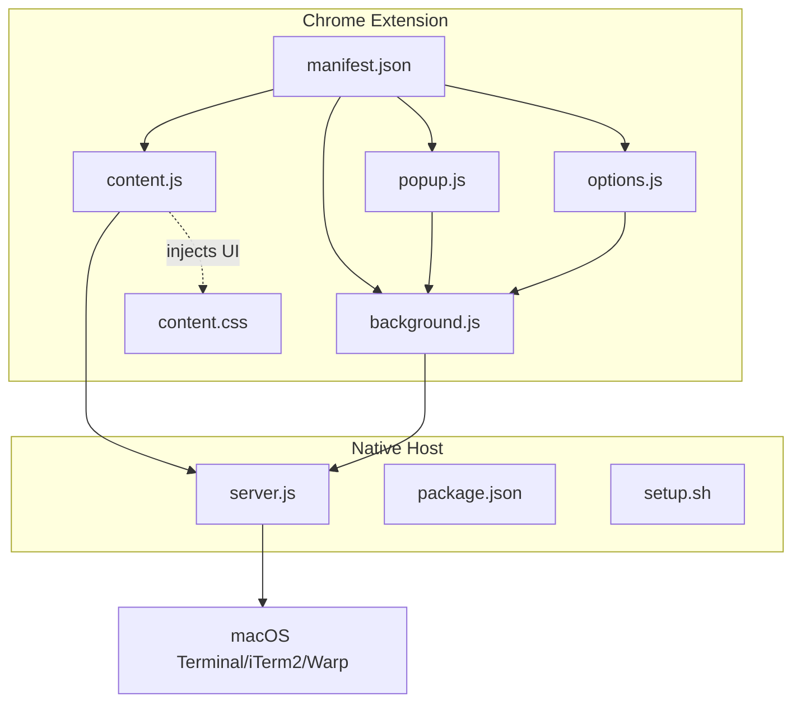
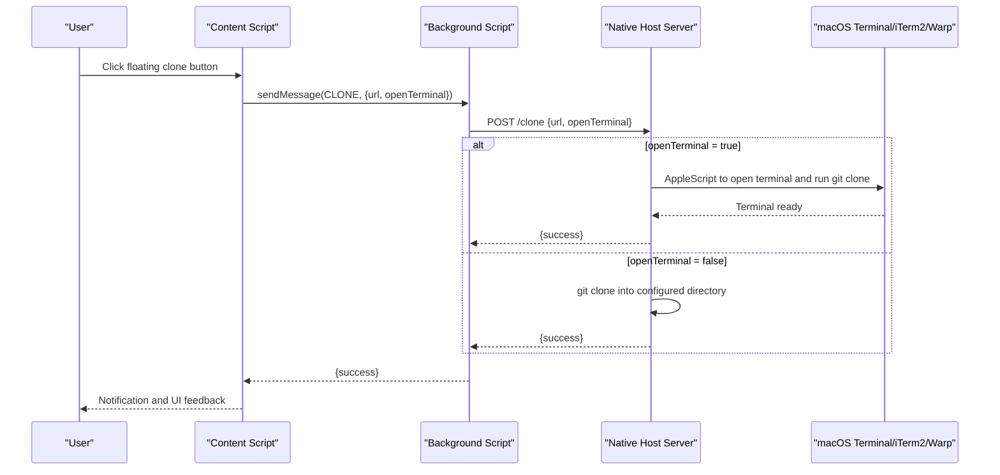
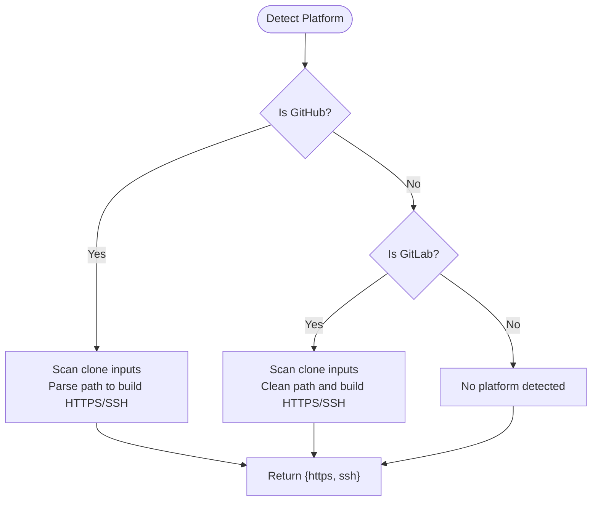
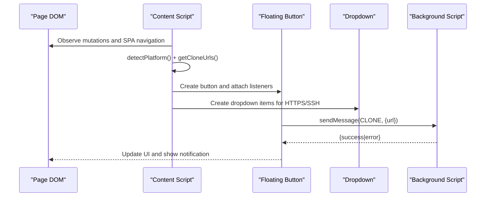
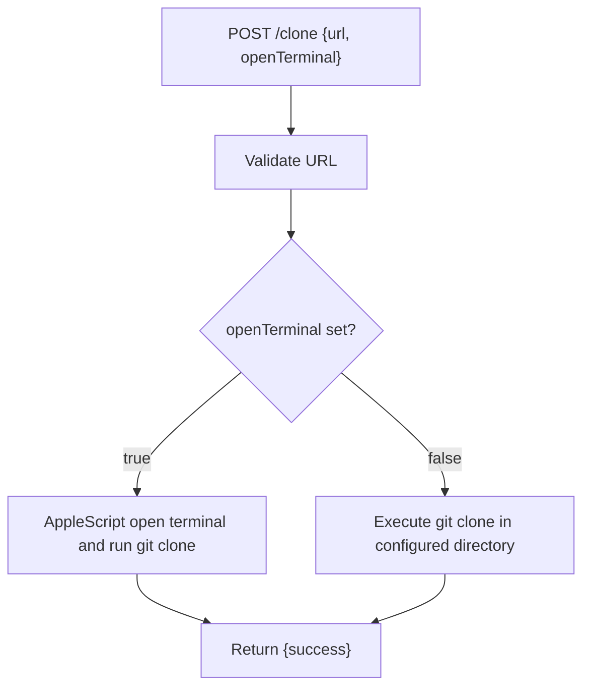
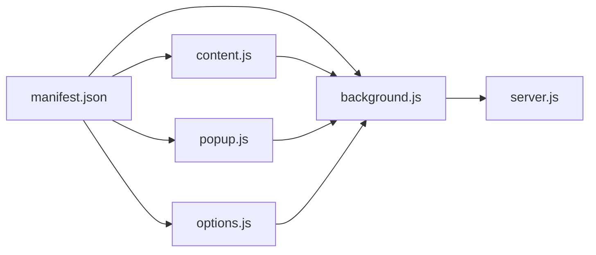

# Core Functionality

<cite>
**Referenced Files in This Document**
- [README.md](file://README.md)
- [manifest.json](file://chrome-extension/manifest.json)
- [content.js](file://chrome-extension/content.js)
- [content.css](file://chrome-extension/content.css)
- [background.js](file://chrome-extension/background.js)
- [popup.js](file://chrome-extension/popup.js)
- [popup.html](file://chrome-extension/popup.html)
- [options.js](file://chrome-extension/options.js)
- [options.html](file://chrome-extension/options.html)
- [server.js](file://native-host/server.js)
- [package.json](file://native-host/package.json)
- [setup.sh](file://native-host/setup.sh)
</cite>

## Table of Contents
1. [Introduction](#introduction)
2. [Project Structure](#project-structure)
3. [Core Components](#core-components)
4. [Architecture Overview](#architecture-overview)
5. [Detailed Component Analysis](#detailed-component-analysis)
6. [Dependency Analysis](#dependency-analysis)
7. [Performance Considerations](#performance-considerations)
8. [Troubleshooting Guide](#troubleshooting-guide)
9. [Conclusion](#conclusion)

## Introduction
This document explains Git Magager’s core functionality: one-click cloning from URL detection to repository cloning, including automatic URL parsing for GitHub and GitLab, Git operation execution via a local companion server, floating clone button injection, terminal automation for macOS Terminal, iTerm2, and Warp, and robust error handling and user notifications.

## Project Structure
Git Magager consists of:
- A Chrome Extension (Manifest V3) with a content script, background service worker, popup UI, and options page
- A native host HTTP server that executes Git operations and automates terminals on macOS

**Diagram sources**
- [manifest.json:1-50](file://chrome-extension/manifest.json#L1-L50)
- [content.js:1-320](file://chrome-extension/content.js#L1-L320)
- [background.js:1-62](file://chrome-extension/background.js#L1-L62)
- [popup.js:1-168](file://chrome-extension/popup.js#L1-L168)
- [options.js:1-56](file://chrome-extension/options.js#L1-L56)
- [content.css:1-175](file://chrome-extension/content.css#L1-L175)
- [server.js:1-210](file://native-host/server.js#L1-L210)
- [package.json:1-12](file://native-host/package.json#L1-L12)
- [setup.sh:1-102](file://native-host/setup.sh#L1-L102)

**Section sources**
- [README.md:1-3](file://README.md#L1-L3)
- [manifest.json:1-50](file://chrome-extension/manifest.json#L1-L50)

## Core Components
- Content Script: Detects clone URLs on GitHub/GitLab, injects floating clone buttons, handles user clicks, and communicates with the local server
- Background Service Worker: Proxies clone requests to the local server and exposes health checks and configuration APIs
- Popup UI: Allows manual cloning, toggles HTTPS/SSH, and controls terminal behavior
- Options UI: Manages clone directory, terminal app, and whether to open in terminal
- Native Host Server: Executes git clone and AppleScript-driven terminal automation

**Section sources**
- [content.js:1-320](file://chrome-extension/content.js#L1-L320)
- [background.js:1-62](file://chrome-extension/background.js#L1-L62)
- [popup.js:1-168](file://chrome-extension/popup.js#L1-L168)
- [options.js:1-56](file://chrome-extension/options.js#L1-L56)
- [server.js:1-210](file://native-host/server.js#L1-L210)

## Architecture Overview
The extension operates in two contexts:
- Browser context: content script and popup communicate with the local server via HTTP
- Local host context: a Node.js server listens on localhost and executes Git commands and AppleScript

**Diagram sources**
- [content.js:113-150](file://chrome-extension/content.js#L113-L150)
- [background.js:30-40](file://chrome-extension/background.js#L30-L40)
- [server.js:164-198](file://native-host/server.js#L164-L198)
- [server.js:66-111](file://native-host/server.js#L66-L111)

## Detailed Component Analysis

### URL Detection and Automatic Parsing
Git Magager detects GitHub and GitLab repository pages and extracts HTTPS/SSH clone URLs using multiple strategies:
- GitHub: reads inputs near clone buttons, constructs HTTPS/SSH from the page path, and scans clipboard/data attributes
- GitLab: reads inputs from the clone dropdown, cleans paths to remove tree/blob/etc., and builds HTTPS/SSH URLs

**Diagram sources**
- [content.js:15-95](file://chrome-extension/content.js#L15-L95)

**Section sources**
- [content.js:22-95](file://chrome-extension/content.js#L22-L95)

### Floating Clone Button Injection
The content script injects:
- A floating clone button with a dropdown to choose HTTPS or SSH
- A page-integrated “Instant Clone” button on GitHub repository pages
- Robust DOM insertion and mutation observation to handle SPA navigation

**Diagram sources**
- [content.js:172-245](file://chrome-extension/content.js#L172-L245)
- [content.js:249-279](file://chrome-extension/content.js#L249-L279)
- [content.js:283-319](file://chrome-extension/content.js#L283-L319)

**Section sources**
- [content.js:172-279](file://chrome-extension/content.js#L172-L279)
- [content.css:13-175](file://chrome-extension/content.css#L13-L175)

### Git Operation Execution and Terminal Automation
The native host server:
- Validates incoming requests and loads configuration from a JSON file
- Supports two modes:
  - Clone without terminal: executes git clone into a configured directory
  - Clone with terminal: uses AppleScript to open Terminal/iTerm2/Warp, change to the clone directory, and run the clone command
- Provides health checks and configuration endpoints

**Diagram sources**
- [server.js:164-198](file://native-host/server.js#L164-L198)
- [server.js:45-64](file://native-host/server.js#L45-L64)
- [server.js:66-111](file://native-host/server.js#L66-L111)

**Section sources**
- [server.js:17-37](file://native-host/server.js#L17-L37)
- [server.js:45-111](file://native-host/server.js#L45-L111)
- [server.js:164-198](file://native-host/server.js#L164-L198)

### HTTPS and SSH Protocol Support
- HTTPS: Preferred for public repositories and environments without SSH keys
- SSH: Used when available; the content script converts between HTTPS and SSH URLs automatically
- Authentication: Delegated to the local Git configuration; the extension does not manage credentials

**Section sources**
- [content.js:61-91](file://chrome-extension/popup.js#L61-L91)
- [content.js:22-95](file://chrome-extension/content.js#L22-L95)

### Progress Reporting and User Notifications
- During cloning, the button shows a spinner and disables itself
- On success, the button turns green and displays a success icon
- On failure, the button turns red and shows an error icon
- A floating notification appears at the top-right corner with contextual messages

**Section sources**
- [content.js:113-150](file://chrome-extension/content.js#L113-L150)
- [content.js:154-168](file://chrome-extension/content.js#L154-L168)
- [content.css:141-175](file://chrome-extension/content.css#L141-L175)

### Configuration Management
- Clone directory: configurable path for storing repositories
- Terminal app: Terminal, iTerm2, or Warp
- Open in terminal: toggle to run clone inside a terminal or in background
- The options page sends SET_CONFIG messages to update the server’s persisted configuration

**Section sources**
- [options.js:22-54](file://chrome-extension/options.js#L22-L54)
- [server.js:17-37](file://native-host/server.js#L17-L37)
- [server.js:140-162](file://native-host/server.js#L140-L162)

### Manual Cloning Workflow (Popup)
- Pre-fills the clone URL based on the active tab’s URL
- Converts between HTTPS and SSH
- Sends CLONE messages to the background script, which forwards to the server
- Updates UI state and shows success/error feedback

**Section sources**
- [popup.js:13-91](file://chrome-extension/popup.js#L13-L91)
- [popup.js:93-149](file://chrome-extension/popup.js#L93-L149)
- [popup.html:19-72](file://chrome-extension/popup.html#L19-L72)

## Dependency Analysis
- Manifest declares permissions and host permissions for GitHub and GitLab
- Content script depends on background script for server communication
- Background script depends on the native host server
- Options and popup depend on background script for configuration and cloning

**Diagram sources**
- [manifest.json:6-48](file://chrome-extension/manifest.json#L6-L48)
- [content.js:1-320](file://chrome-extension/content.js#L1-L320)
- [background.js:1-62](file://chrome-extension/background.js#L1-L62)
- [popup.js:1-168](file://chrome-extension/popup.js#L1-L168)
- [options.js:1-56](file://chrome-extension/options.js#L1-L56)
- [server.js:1-210](file://native-host/server.js#L1-L210)

**Section sources**
- [manifest.json:6-48](file://chrome-extension/manifest.json#L6-L48)

## Performance Considerations
- URL detection uses efficient selectors and regex on the current page
- MutationObserver debounces re-injection to avoid excessive DOM manipulation
- SPA navigation detection uses periodic URL polling with a short interval
- Terminal automation relies on AppleScript; ensure terminal apps are responsive to avoid delays

[No sources needed since this section provides general guidance]

## Troubleshooting Guide
Common issues and resolutions:
- Local server not running
  - Verify the native host server is started and listening on the expected port
  - Use the built-in health check endpoint to confirm connectivity
- Clone fails due to authentication
  - Ensure local Git is configured with appropriate credentials for HTTPS or SSH
- Terminal automation not opening
  - Confirm the selected terminal app is installed and authorized
  - Check that AppleScript permissions are granted to the browser or terminal
- Incorrect clone directory
  - Update the clone directory setting in the options page
- URL parsing errors
  - Ensure you are on a recognized GitHub/GitLab repository page

**Section sources**
- [background.js:11-21](file://chrome-extension/background.js#L11-L21)
- [server.js:125-130](file://native-host/server.js#L125-L130)
- [options.js:22-54](file://chrome-extension/options.js#L22-L54)
- [content.js:113-150](file://chrome-extension/content.js#L113-L150)

## Conclusion
Git Magager streamlines Git cloning by combining intelligent URL detection, a seamless floating button interface, and a powerful local companion server that executes Git operations and automates macOS terminals. Its modular design separates concerns between browser-side UI and local execution, enabling reliable, user-friendly cloning across GitHub and GitLab.