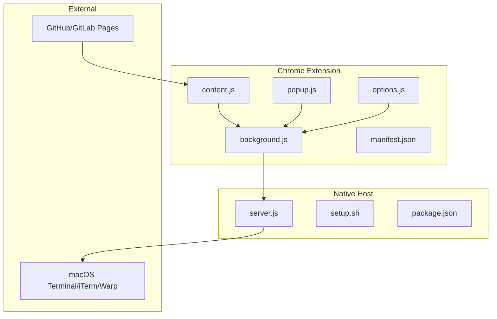
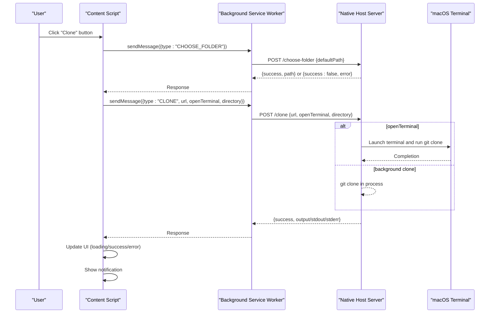
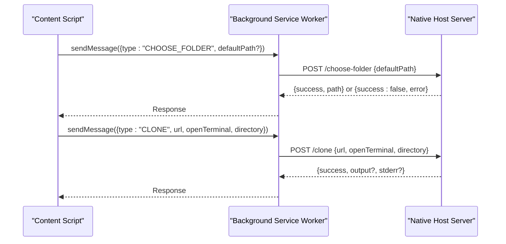
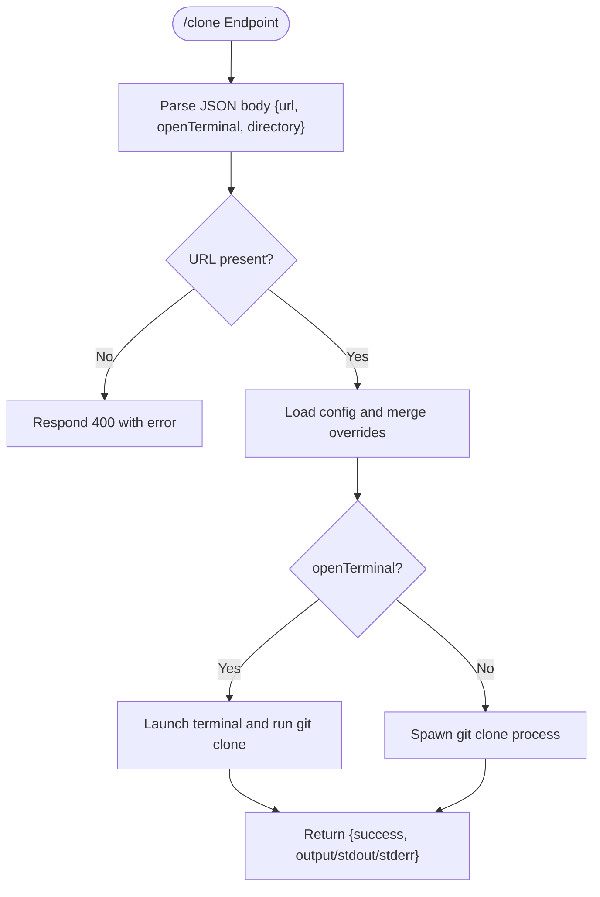
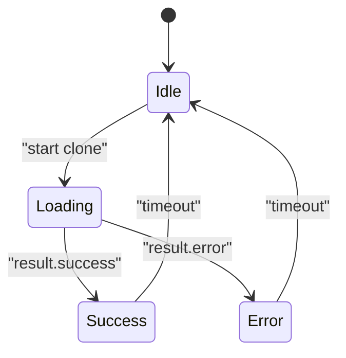
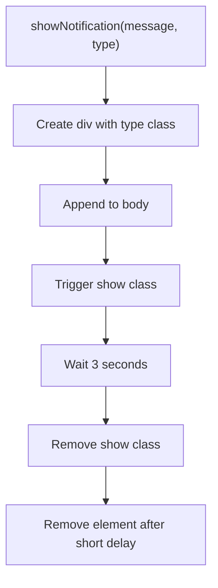
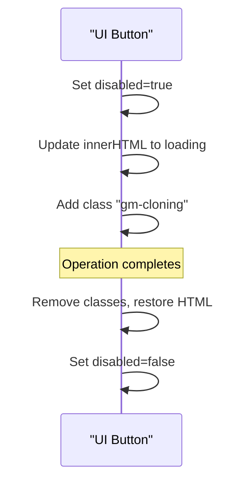
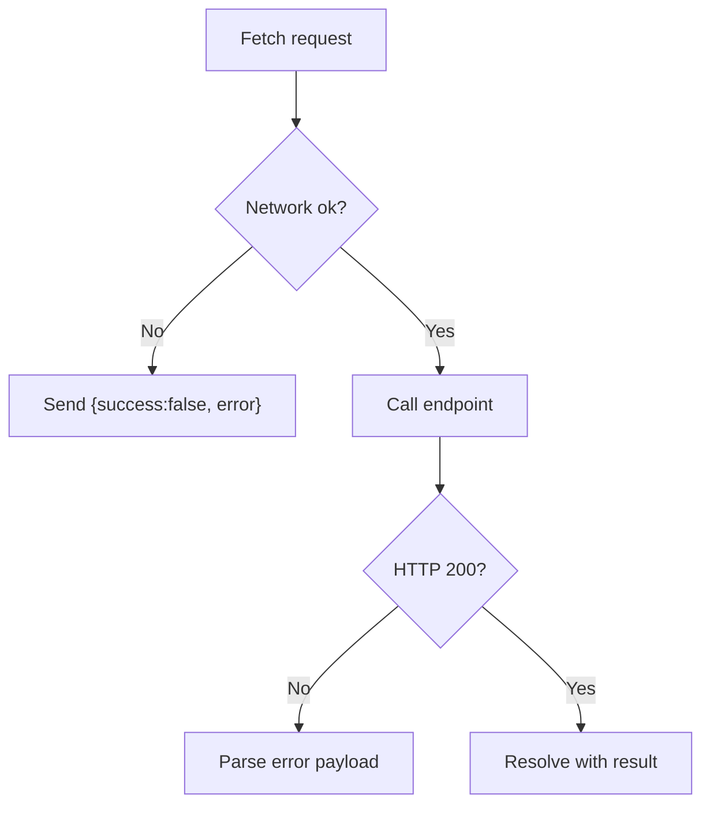
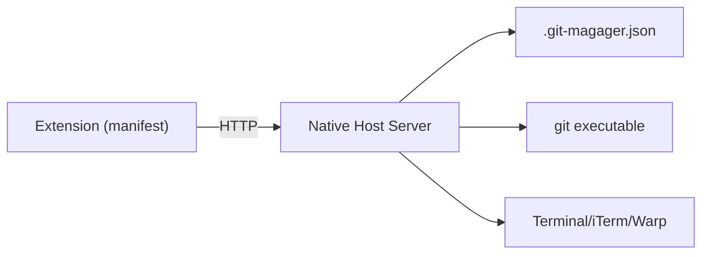
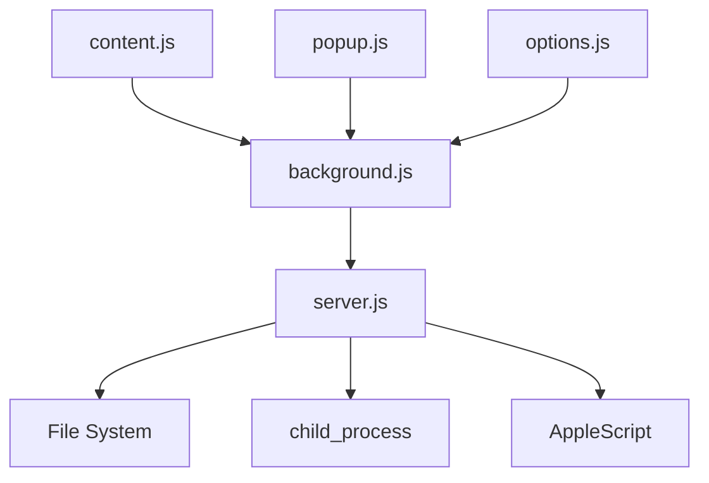

# Git Operation Execution

<cite>
**Referenced Files in This Document**
- [content.js](file://chrome-extension/content.js)
- [background.js](file://chrome-extension/background.js)
- [popup.js](file://chrome-extension/popup.js)
- [popup.html](file://chrome-extension/popup.html)
- [options.js](file://chrome-extension/options.js)
- [options.html](file://chrome-extension/options.html)
- [content.css](file://chrome-extension/content.css)
- [manifest.json](file://chrome-extension/manifest.json)
- [server.js](file://native-host/server.js)
- [setup.sh](file://native-host/setup.sh)
- [package.json](file://native-host/package.json)
- [README.md](file://README.md)
</cite>

## Table of Contents
1. [Introduction](#introduction)
2. [Project Structure](#project-structure)
3. [Core Components](#core-components)
4. [Architecture Overview](#architecture-overview)
5. [Detailed Component Analysis](#detailed-component-analysis)
6. [Dependency Analysis](#dependency-analysis)
7. [Performance Considerations](#performance-considerations)
8. [Troubleshooting Guide](#troubleshooting-guide)
9. [Conclusion](#conclusion)

## Introduction
This document explains the Git operation execution pipeline implemented by the extension. It covers the HTTP communication flow between the content script and the native host server, including POST request formatting and response handling. It documents the clone operation implementation, including URL parameter passing, server-side Git command execution, and progress reporting. It also details the user interface feedback system during cloning operations, including loading states, success indicators, and error display mechanisms. The notification system for user feedback, including success messages, error notifications, and timeout handling, is explained alongside button state management during operations, including disabling mechanisms and automatic restoration. Error handling strategies for network failures, server unavailability, and Git operation errors are documented, along with the integration with the native host server and the local HTTP communication protocol.

## Project Structure
The project consists of:
- A Chrome Extension (manifest v3) with a content script, background service worker, popup UI, and options page.
- A native host server written in Node.js that exposes a local HTTP API for file picking, configuration, and Git clone operations.

**Diagram sources**
- [content.js:1-333](file://chrome-extension/content.js#L1-L333)
- [background.js:1-74](file://chrome-extension/background.js#L1-L74)
- [popup.js:1-168](file://chrome-extension/popup.js#L1-L168)
- [options.js:1-56](file://chrome-extension/options.js#L1-L56)
- [manifest.json:1-50](file://chrome-extension/manifest.json#L1-L50)
- [server.js:1-263](file://native-host/server.js#L1-L263)
- [setup.sh:1-102](file://native-host/setup.sh#L1-L102)
- [package.json:1-12](file://native-host/package.json#L1-L12)

**Section sources**
- [manifest.json:1-50](file://chrome-extension/manifest.json#L1-L50)
- [README.md:1-3](file://README.md#L1-L3)

## Core Components
- Content Script: Detects repository pages, extracts clone URLs, injects UI controls, and coordinates clone actions via messaging.
- Background Service Worker: Acts as the HTTP client to the native host server, forwarding requests and responses to content and popup scripts.
- Native Host Server: Provides endpoints for health checks, configuration, folder selection, and Git clone operations.
- Popup UI: Allows manual cloning with URL input and terminal integration toggle.
- Options UI: Manages configuration persisted locally on disk.

Key responsibilities:
- URL detection and injection of clone buttons on supported platforms.
- Messaging between UI layers and the native host server.
- Local HTTP API for Git operations and configuration persistence.
- User feedback via UI updates and notifications.

**Section sources**
- [content.js:1-333](file://chrome-extension/content.js#L1-L333)
- [background.js:1-74](file://chrome-extension/background.js#L1-L74)
- [server.js:1-263](file://native-host/server.js#L1-L263)
- [popup.js:1-168](file://chrome-extension/popup.js#L1-L168)
- [options.js:1-56](file://chrome-extension/options.js#L1-L56)

## Architecture Overview
The extension uses a layered architecture:
- UI layer (content script, popup, options) interacts with the background service worker.
- The background service worker communicates with the native host server over HTTP on localhost.
- The native host server executes system-level operations (folder selection, Git clone) and returns structured JSON responses.

**Diagram sources**
- [content.js:111-163](file://chrome-extension/content.js#L111-L163)
- [background.js:30-52](file://chrome-extension/background.js#L30-L52)
- [server.js:113-135](file://native-host/server.js#L113-L135)
- [server.js:213-251](file://native-host/server.js#L213-L251)

## Detailed Component Analysis

### HTTP Communication Flow Between Content Script and Native Host Server
- The background service worker acts as the HTTP client to the native host server at http://127.0.0.1:9456.
- Endpoints:
  - GET /health: Returns server status.
  - GET /config: Returns persisted configuration.
  - POST /config: Updates configuration.
  - POST /choose-folder: Opens a native folder picker and returns the selected path.
  - POST /clone: Executes Git clone or opens terminal with the clone command.
- Request formatting:
  - Content-Type: application/json.
  - Body payload varies per endpoint (e.g., { url, openTerminal, directory } for /clone).
- Response handling:
  - All endpoints return JSON.
  - Errors are returned with a success flag set to false and an error field.

**Diagram sources**
- [background.js:30-52](file://chrome-extension/background.js#L30-L52)
- [server.js:189-211](file://native-host/server.js#L189-L211)
- [server.js:213-251](file://native-host/server.js#L213-L251)

**Section sources**
- [background.js:3-21](file://chrome-extension/background.js#L3-L21)
- [background.js:30-73](file://chrome-extension/background.js#L30-L73)
- [server.js:137-256](file://native-host/server.js#L137-L256)

### Clone Operation Implementation
- URL parameter passing:
  - The content script determines HTTPS/SSH URLs from the page and passes the chosen URL to the background worker.
  - The background worker forwards the URL to the native host server.
- Server-side Git command execution:
  - If openTerminal is true, the server launches a terminal application and runs the clone command inside it.
  - Otherwise, the server executes git clone in a subprocess and returns the result.
- Progress reporting:
  - The current implementation does not stream progress; it reports completion or failure via JSON responses.

**Diagram sources**
- [server.js:213-251](file://native-host/server.js#L213-L251)

**Section sources**
- [content.js:111-163](file://chrome-extension/content.js#L111-L163)
- [background.js:42-52](file://chrome-extension/background.js#L42-L52)
- [server.js:45-64](file://native-host/server.js#L45-L64)
- [server.js:66-111](file://native-host/server.js#L66-L111)

### User Interface Feedback During Cloning Operations
- Loading states:
  - Buttons display a spinning indicator while waiting for responses.
  - The content script and popup update button innerHTML and apply CSS classes to reflect state.
- Success indicators:
  - On success, buttons change to a checkmark icon and a success class.
- Error display mechanisms:
  - On failure, buttons change to a cross icon and an error class.
  - Notifications are shown with appropriate types and durations.
- Timeout handling:
  - Buttons revert to original state after a fixed timeout to avoid permanent disabled state.

**Diagram sources**
- [content.js:111-163](file://chrome-extension/content.js#L111-L163)
- [popup.js:94-149](file://chrome-extension/popup.js#L94-L149)
- [content.css:141-175](file://chrome-extension/content.css#L141-L175)

**Section sources**
- [content.js:111-163](file://chrome-extension/content.js#L111-L163)
- [popup.js:94-149](file://chrome-extension/popup.js#L94-L149)
- [content.css:141-175](file://chrome-extension/content.css#L141-L175)

### Notification System for User Feedback
- Notifications are dynamically created and appended to the document body.
- They use CSS transitions to fade in and out.
- Types include info, success, and error, mapped to distinct styles.
- Automatic dismissal after a timeout.

**Diagram sources**
- [content.js:167-181](file://chrome-extension/content.js#L167-L181)
- [content.css:141-175](file://chrome-extension/content.css#L141-L175)

**Section sources**
- [content.js:167-181](file://chrome-extension/content.js#L167-L181)
- [content.css:141-175](file://chrome-extension/content.css#L141-L175)

### Button State Management During Operations
- Disablement:
  - Buttons are disabled during long-running operations to prevent duplicate requests.
- Automatic restoration:
  - After a timeout, buttons are restored to their initial state and re-enabled.
- Visual feedback:
  - CSS classes indicate cloning, success, and error states.

**Diagram sources**
- [content.js:111-163](file://chrome-extension/content.js#L111-L163)
- [popup.js:94-149](file://chrome-extension/popup.js#L94-L149)
- [content.css:58-65](file://chrome-extension/content.css#L58-L65)

**Section sources**
- [content.js:111-163](file://chrome-extension/content.js#L111-L163)
- [popup.js:94-149](file://chrome-extension/popup.js#L94-L149)
- [content.css:58-65](file://chrome-extension/content.css#L58-L65)

### Error Handling Strategies
- Network failures:
  - The background worker wraps fetch calls and returns structured error responses.
- Server unavailability:
  - Health checks are performed; the popup hides clone controls when the server is unreachable.
- Git operation errors:
  - The native host server captures stderr and returns it in the response payload.
- User cancellation:
  - Folder selection returns a cancelled flag when the user cancels the native dialog.

**Diagram sources**
- [background.js:30-52](file://chrome-extension/background.js#L30-L52)
- [server.js:189-211](file://native-host/server.js#L189-L211)
- [server.js:213-251](file://native-host/server.js#L213-L251)

**Section sources**
- [background.js:11-21](file://chrome-extension/background.js#L11-L21)
- [background.js:30-73](file://chrome-extension/background.js#L30-L73)
- [server.js:189-211](file://native-host/server.js#L189-L211)
- [server.js:213-251](file://native-host/server.js#L213-L251)

### Integration with the Native Host Server and Local HTTP Protocol
- The native host server listens on 127.0.0.1:9456 and supports CORS for local development.
- The extension’s manifest grants host permissions for localhost and remote Git hosting sites.
- The server persists configuration to a JSON file in the user’s home directory and supports multiple terminal applications.

**Diagram sources**
- [manifest.json:11-18](file://chrome-extension/manifest.json#L11-L18)
- [server.js:7-37](file://native-host/server.js#L7-L37)
- [server.js:258-262](file://native-host/server.js#L258-L262)

**Section sources**
- [manifest.json:11-18](file://chrome-extension/manifest.json#L11-L18)
- [server.js:7-37](file://native-host/server.js#L7-L37)
- [server.js:258-262](file://native-host/server.js#L258-L262)

## Dependency Analysis
- Content Script depends on:
  - Background worker for HTTP operations.
  - CSS for UI styling and animations.
- Background Worker depends on:
  - Native host server endpoints.
  - Manifest permissions for host access.
- Native Host Server depends on:
  - Node.js child_process for Git commands.
  - macOS AppleScript for terminal automation.
  - File system for configuration persistence.

**Diagram sources**
- [content.js:1-333](file://chrome-extension/content.js#L1-L333)
- [background.js:1-74](file://chrome-extension/background.js#L1-L74)
- [popup.js:1-168](file://chrome-extension/popup.js#L1-L168)
- [options.js:1-56](file://chrome-extension/options.js#L1-L56)
- [server.js:1-263](file://native-host/server.js#L1-L263)

**Section sources**
- [content.js:1-333](file://chrome-extension/content.js#L1-L333)
- [background.js:1-74](file://chrome-extension/background.js#L1-L74)
- [popup.js:1-168](file://chrome-extension/popup.js#L1-L168)
- [options.js:1-56](file://chrome-extension/options.js#L1-L56)
- [server.js:1-263](file://native-host/server.js#L1-L263)

## Performance Considerations
- Minimizing repeated DOM queries and UI updates reduces overhead during clone operations.
- Debouncing DOM mutations prevents redundant UI injections on SPA navigation.
- Using a single HTTP client (background worker) centralizes retries and error handling.
- Avoiding synchronous blocking operations ensures responsive UI.

## Troubleshooting Guide
- Server not running:
  - Verify the native host server is started and listening on 127.0.0.1:9456.
  - Use the built-in health check endpoint to confirm connectivity.
- Permission errors:
  - Ensure the extension has host permissions for localhost and the target Git hosting site.
- Folder selection failures:
  - User cancellation returns a specific cancelled flag; handle gracefully and restore UI state.
- Git errors:
  - Inspect the returned stderr payload for detailed diagnostics.
- Terminal automation:
  - Confirm the selected terminal application is installed and accessible.

**Section sources**
- [background.js:5-21](file://chrome-extension/background.js#L5-L21)
- [server.js:150-155](file://native-host/server.js#L150-L155)
- [server.js:189-211](file://native-host/server.js#L189-L211)
- [server.js:213-251](file://native-host/server.js#L213-L251)
- [manifest.json:11-18](file://chrome-extension/manifest.json#L11-L18)

## Conclusion
The Git operation execution pipeline integrates a Chrome Extension with a native host server to provide seamless Git clone capabilities. The content script detects repository pages and orchestrates clone actions, while the background worker handles HTTP communication to the native host. The native host server executes system-level tasks and returns structured responses, enabling robust user feedback and error handling. The UI provides clear loading, success, and error states, ensuring a smooth user experience.