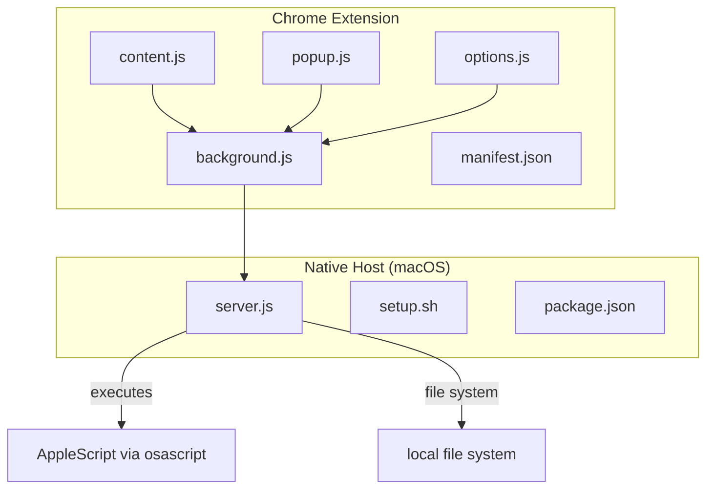
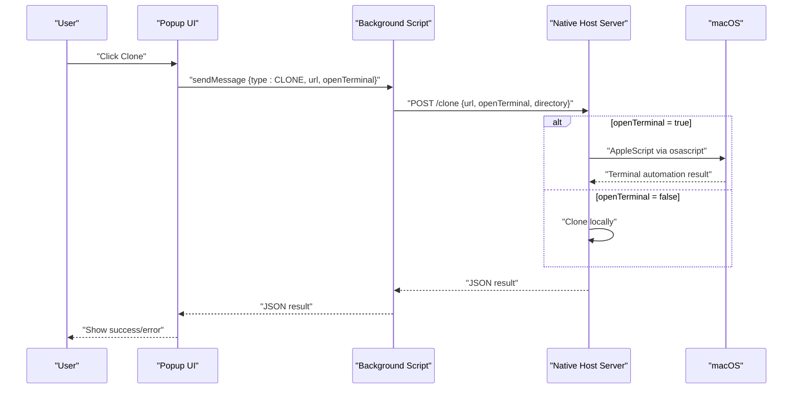
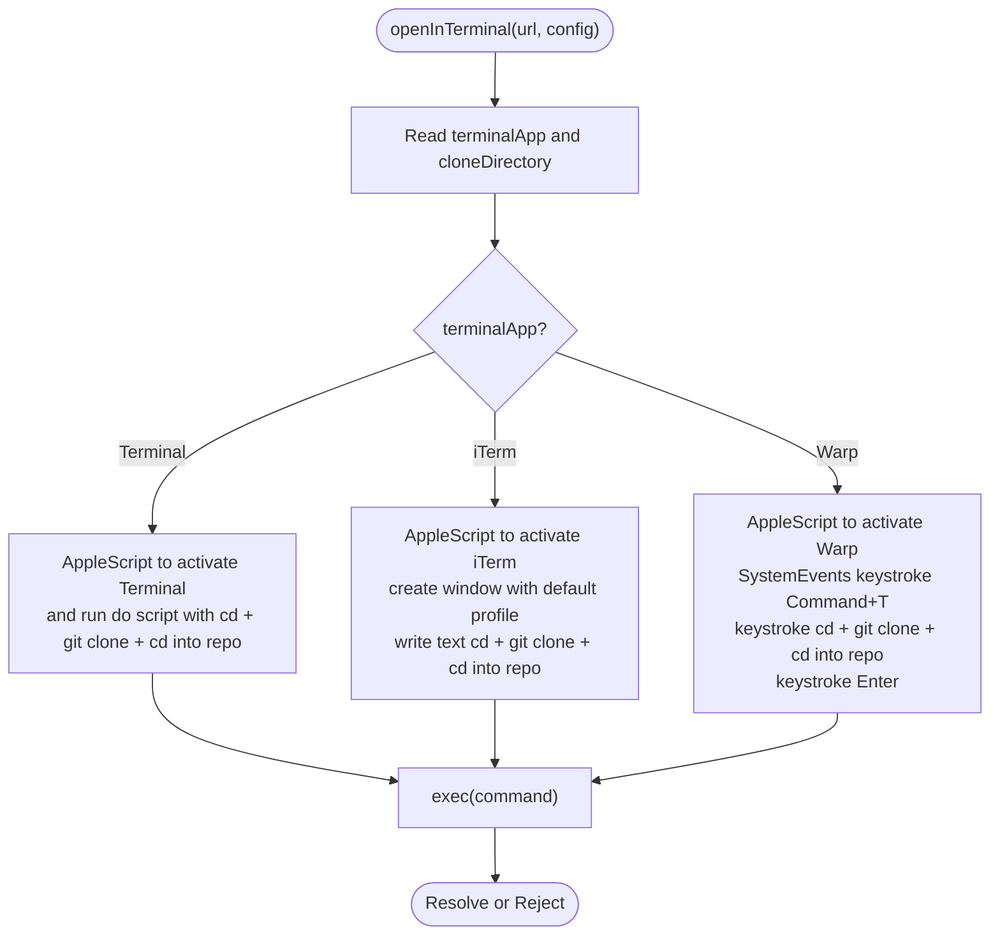
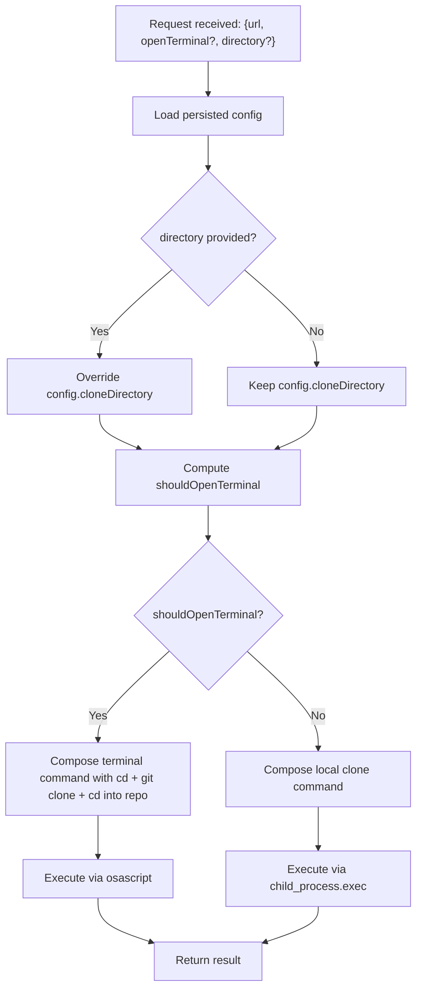
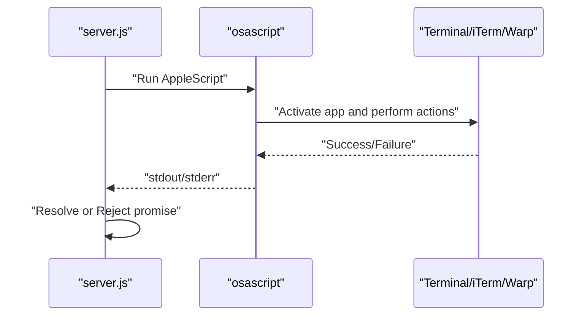
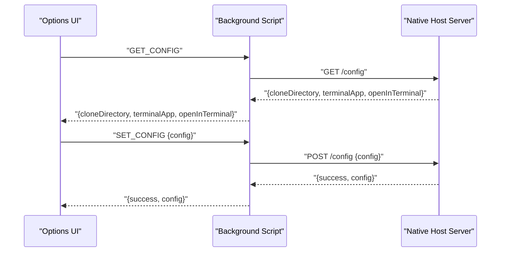
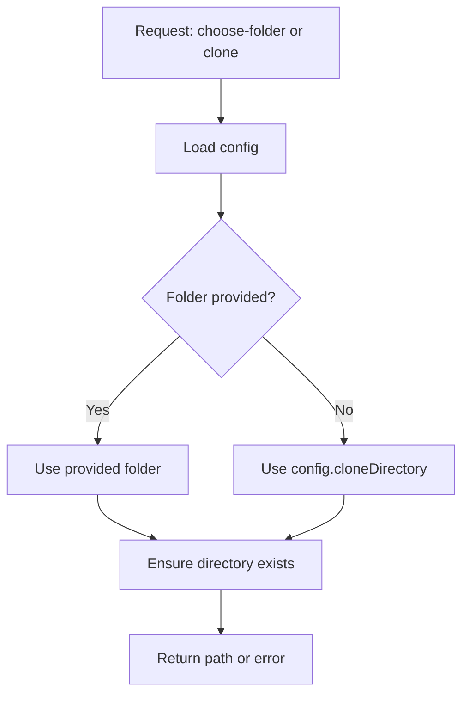
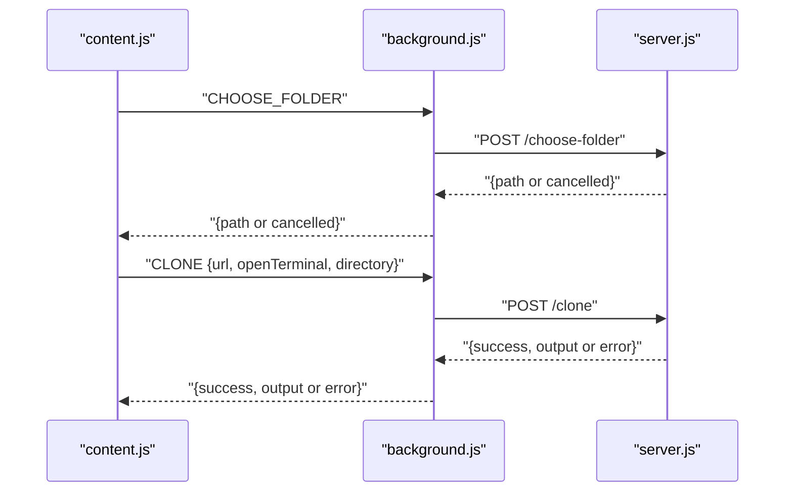
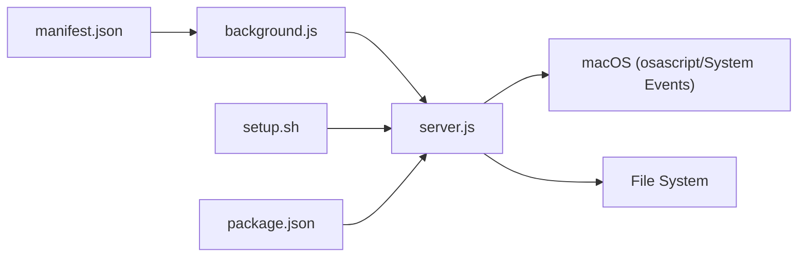

# Terminal Automation

<cite>
**Referenced Files in This Document**
- [README.md](file://README.md)
- [manifest.json](file://chrome-extension/manifest.json)
- [background.js](file://chrome-extension/background.js)
- [content.js](file://chrome-extension/content.js)
- [popup.js](file://chrome-extension/popup.js)
- [options.js](file://chrome-extension/options.js)
- [server.js](file://native-host/server.js)
- [setup.sh](file://native-host/setup.sh)
- [package.json](file://native-host/package.json)
</cite>

## Table of Contents
1. [Introduction](#introduction)
2. [Project Structure](#project-structure)
3. [Core Components](#core-components)
4. [Architecture Overview](#architecture-overview)
5. [Detailed Component Analysis](#detailed-component-analysis)
6. [Dependency Analysis](#dependency-analysis)
7. [Performance Considerations](#performance-considerations)
8. [Troubleshooting Guide](#troubleshooting-guide)
9. [Security Considerations](#security-considerations)
10. [Conclusion](#conclusion)

## Introduction
This document explains the terminal automation feature implemented by the Chrome extension and its local companion server. It covers how the extension detects repository pages, constructs Git clone commands, and triggers terminal automation on macOS via AppleScript. It documents the differences in AppleScript implementations for macOS Terminal, iTerm2, and Warp, along with configuration integration, path resolution, and error handling. It also provides troubleshooting guidance and security considerations for automated terminal operations.

## Project Structure
The project consists of:
- A Chrome Extension (Manifest V3) that runs on GitHub and GitLab pages and communicates with a local server.
- A native host server that performs Git operations and terminal automation on macOS.

**Diagram sources**
- [background.js:1-74](file://chrome-extension/background.js#L1-L74)
- [content.js:1-333](file://chrome-extension/content.js#L1-L333)
- [popup.js:1-168](file://chrome-extension/popup.js#L1-L168)
- [options.js:1-56](file://chrome-extension/options.js#L1-L56)
- [server.js:1-263](file://native-host/server.js#L1-L263)
- [setup.sh:1-102](file://native-host/setup.sh#L1-L102)
- [package.json:1-12](file://native-host/package.json#L1-L12)

**Section sources**
- [README.md:1-3](file://README.md#L1-L3)
- [manifest.json:1-50](file://chrome-extension/manifest.json#L1-L50)

## Core Components
- Chrome Extension:
  - Manifest defines permissions and content scripts.
  - Background script handles messaging with the native host server.
  - Content script injects clone buttons on GitHub/GitLab and orchestrates cloning.
  - Popup and Options scripts manage user preferences and terminal behavior.
- Native Host:
  - Local HTTP server exposing endpoints for health checks, configuration, folder selection, and cloning.
  - Terminal automation via AppleScript using osascript.
  - File system operations for ensuring clone directories and validating paths.

Key responsibilities:
- Command preparation: Constructing Git clone commands and directory navigation.
- AppleScript execution: Compiling and running scripts per terminal application.
- Configuration integration: Persisting and applying user preferences for terminal selection and automatic opening behavior.
- Path resolution and validation: Ensuring directories exist and are accessible.

**Section sources**
- [manifest.json:6-18](file://chrome-extension/manifest.json#L6-L18)
- [background.js:24-73](file://chrome-extension/background.js#L24-L73)
- [content.js:111-163](file://chrome-extension/content.js#L111-L163)
- [popup.js:94-149](file://chrome-extension/popup.js#L94-L149)
- [options.js:22-54](file://chrome-extension/options.js#L22-L54)
- [server.js:45-111](file://native-host/server.js#L45-L111)
- [server.js:137-251](file://native-host/server.js#L137-L251)

## Architecture Overview
The extension communicates with the native host server over HTTP on localhost. The server performs Git operations and terminal automation using AppleScript.

**Diagram sources**
- [popup.js:94-149](file://chrome-extension/popup.js#L94-L149)
- [background.js:42-52](file://chrome-extension/background.js#L42-L52)
- [server.js:213-251](file://native-host/server.js#L213-L251)

## Detailed Component Analysis

### Supported Terminal Applications and AppleScript Differences
The native host supports three terminals on macOS:
- macOS Terminal
- iTerm2
- Warp

Implementation differences:
- macOS Terminal: Uses a single AppleScript to activate the app and run a script in the current session.
- iTerm2: Creates a new window with the default profile, then writes the command to the current session.
- Warp: Activates the app, simulates pressing Command+T to open a new tab, types the command, and presses Enter.

Command composition:
- The server composes a shell command that navigates to the configured clone directory, runs the Git clone operation, and then navigates into the newly created repository directory.

**Diagram sources**
- [server.js:66-111](file://native-host/server.js#L66-L111)

**Section sources**
- [server.js:66-111](file://native-host/server.js#L66-L111)

### Command Preparation Process
- Directory navigation: The composed command includes changing to the configured clone directory.
- Git clone command construction: The URL is embedded into the command string.
- Argument handling: The server merges request-provided directory overrides with persisted configuration and decides whether to open the terminal based on the request or stored preference.

**Diagram sources**
- [server.js:213-251](file://native-host/server.js#L213-L251)
- [server.js:45-64](file://native-host/server.js#L45-L64)

**Section sources**
- [server.js:213-251](file://native-host/server.js#L213-L251)
- [server.js:45-64](file://native-host/server.js#L45-L64)

### AppleScript Execution Mechanism
- Script compilation: AppleScript strings are constructed and executed via osascript.
- Error handling: The exec callback checks for errors and resolves/rejects promises accordingly.
- Process monitoring: The server logs stdout/stderr and returns structured results to the extension.

**Diagram sources**
- [server.js:66-111](file://native-host/server.js#L66-L111)

**Section sources**
- [server.js:66-111](file://native-host/server.js#L66-L111)

### Configuration Integration
- User preferences include:
  - Clone directory
  - Terminal application choice
  - Automatic terminal opening behavior
- The extension loads and saves configuration via the native host server endpoints.
- The server persists configuration to a JSON file in the user’s home directory.

**Diagram sources**
- [options.js:10-21](file://chrome-extension/options.js#L10-L21)
- [options.js:33-44](file://chrome-extension/options.js#L33-L44)
- [background.js:54-72](file://chrome-extension/background.js#L54-L72)
- [server.js:157-187](file://native-host/server.js#L157-L187)

**Section sources**
- [options.js:10-21](file://chrome-extension/options.js#L10-L21)
- [options.js:33-44](file://chrome-extension/options.js#L33-L44)
- [background.js:54-72](file://chrome-extension/background.js#L54-L72)
- [server.js:157-187](file://native-host/server.js#L157-L187)

### Path Resolution and Directory Validation
- The server ensures the clone directory exists, creating it recursively if missing.
- The folder picker endpoint uses a native macOS dialog to select a destination and returns the POSIX path.
- The server validates requests and responds with appropriate HTTP status codes and JSON payloads.

**Diagram sources**
- [server.js:113-135](file://native-host/server.js#L113-L135)
- [server.js:39-43](file://native-host/server.js#L39-L43)
- [server.js:213-251](file://native-host/server.js#L213-L251)

**Section sources**
- [server.js:113-135](file://native-host/server.js#L113-L135)
- [server.js:39-43](file://native-host/server.js#L39-L43)
- [server.js:213-251](file://native-host/server.js#L213-L251)

### Extension Workflow: Content Script and Popup
- Content script injects clone buttons on GitHub/GitLab pages, detects URLs, and sends messages to the background script.
- Popup allows manual cloning with HTTPS/SSH conversion and toggles terminal opening behavior.
- Both paths communicate with the background script, which forwards requests to the native host server.

**Diagram sources**
- [content.js:111-163](file://chrome-extension/content.js#L111-L163)
- [background.js:30-52](file://chrome-extension/background.js#L30-L52)
- [server.js:189-251](file://native-host/server.js#L189-L251)

**Section sources**
- [content.js:111-163](file://chrome-extension/content.js#L111-L163)
- [background.js:30-52](file://chrome-extension/background.js#L30-L52)
- [server.js:189-251](file://native-host/server.js#L189-L251)

## Dependency Analysis
- Permissions and host permissions are declared in the manifest for GitHub and GitLab domains.
- The extension relies on the native host server running on localhost.
- The native host depends on Node.js and macOS system capabilities (osascript, System Events).

**Diagram sources**
- [manifest.json:1-50](file://chrome-extension/manifest.json#L1-L50)
- [background.js:1-74](file://chrome-extension/background.js#L1-L74)
- [server.js:1-263](file://native-host/server.js#L1-L263)
- [setup.sh:1-102](file://native-host/setup.sh#L1-L102)
- [package.json:1-12](file://native-host/package.json#L1-L12)

**Section sources**
- [manifest.json:11-18](file://chrome-extension/manifest.json#L11-L18)
- [setup.sh:15-21](file://native-host/setup.sh#L15-L21)

## Performance Considerations
- Minimize repeated network calls: Batch configuration reads/writes and reuse cached results where appropriate.
- Optimize AppleScript execution: Keep command strings concise and avoid unnecessary delays.
- Reduce UI thrashing: Debounce content script injections and avoid frequent DOM mutations.
- Logging overhead: Limit verbose logging in production builds to reduce I/O.

## Troubleshooting Guide
Common issues and resolutions:
- Server not running:
  - Verify the native host server is installed and started via the provided setup script.
  - Check health endpoint accessibility.
- Permission requirements:
  - Ensure the extension has scripting permissions and the native host is allowed to run.
  - Confirm the system allows automation for Terminal/iTerm/Warp.
- Script execution problems:
  - Validate that osascript is available and functional.
  - Confirm the terminal application is installed and accessible.
- Folder selection failures:
  - Ensure the default path is valid and accessible.
  - Handle user cancellation gracefully.
- Terminal automation not opening:
  - Verify terminalApp setting matches installed application.
  - Confirm the terminal supports AppleScript automation.

**Section sources**
- [background.js:5-21](file://chrome-extension/background.js#L5-L21)
- [server.js:113-135](file://native-host/server.js#L113-L135)
- [server.js:66-111](file://native-host/server.js#L66-L111)

## Security Considerations
- Local-first design: All operations occur on localhost, reducing exposure.
- Minimal permissions: The extension requests only necessary permissions for content scripts and storage.
- User consent: Users initiate cloning actions; the native host executes commands based on explicit user-triggered messages.
- Configuration protection: The configuration file is stored in the user’s home directory with no sensitive credentials.
- Input sanitization: The server validates incoming requests and returns structured errors.

**Section sources**
- [manifest.json:6-10](file://chrome-extension/manifest.json#L6-L10)
- [server.js:213-251](file://native-host/server.js#L213-L251)

## Conclusion
The terminal automation feature integrates a Chrome extension with a native host server to clone repositories and optionally open a terminal with prepared commands. It supports macOS Terminal, iTerm2, and Warp via AppleScript, manages user preferences, and ensures directory readiness. By following the troubleshooting and security guidance, users can reliably automate terminal workflows while maintaining control and safety.