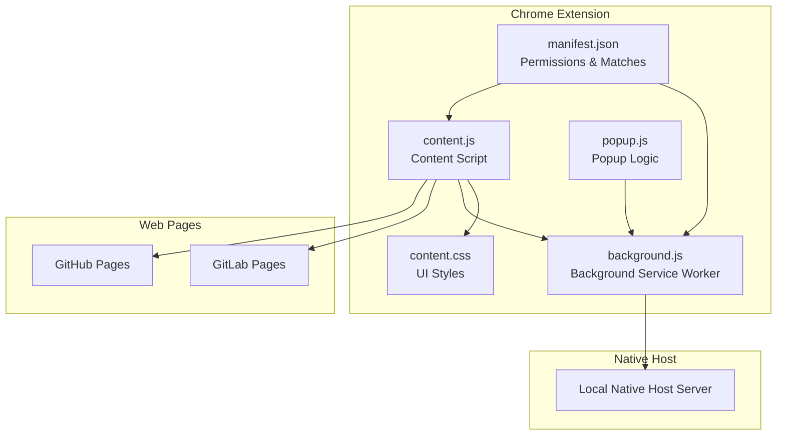
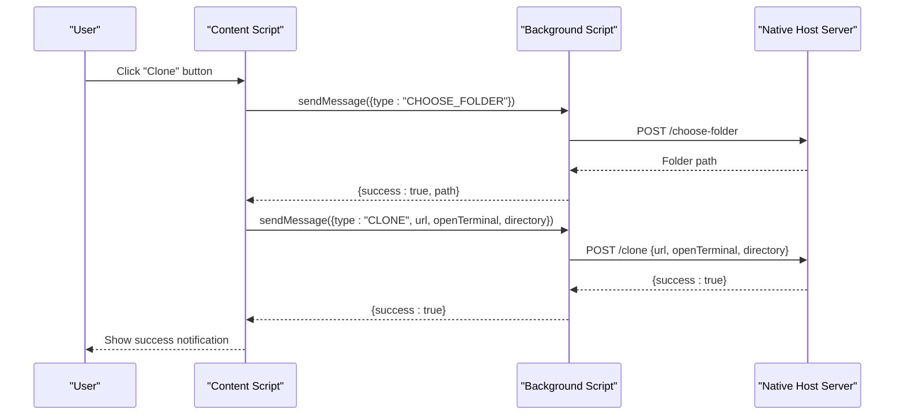
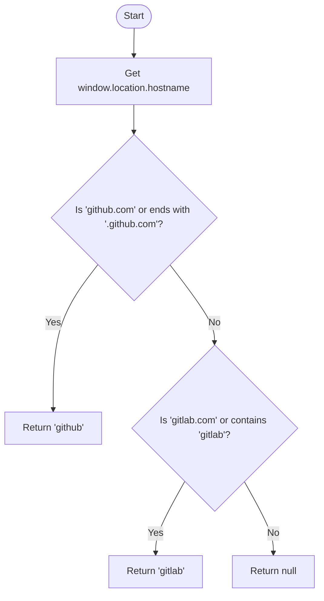
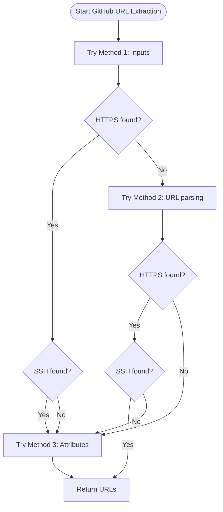
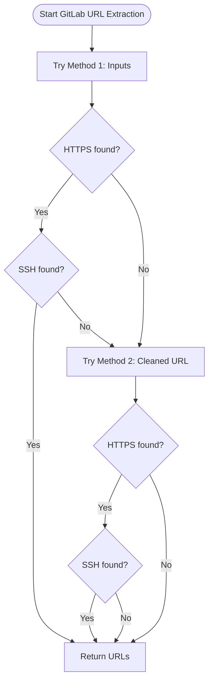
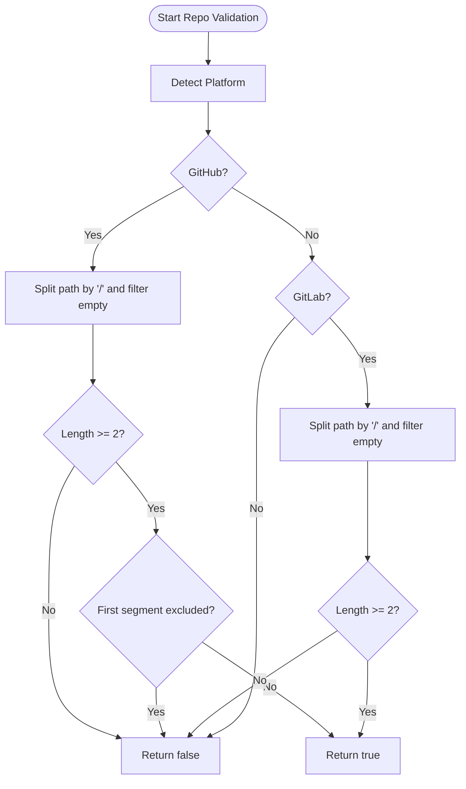
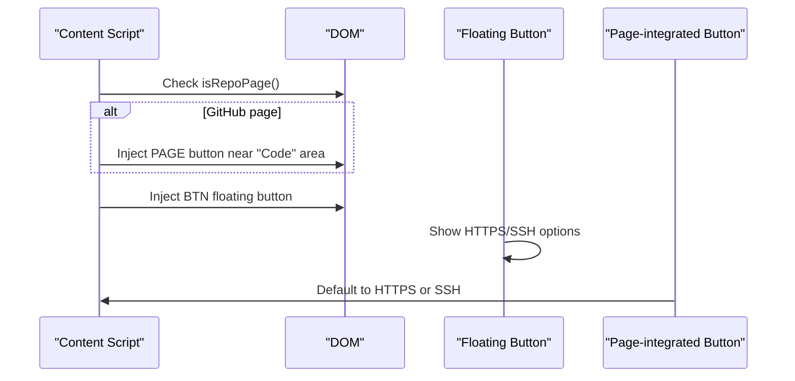
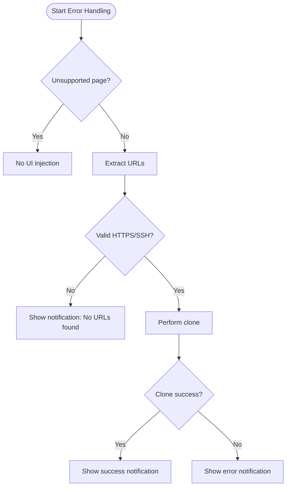
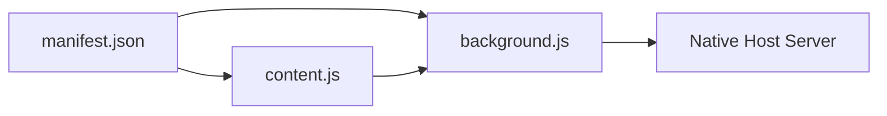

# URL Detection and Parsing

<cite>
**Referenced Files in This Document**
- [content.js](file://chrome-extension/content.js)
- [background.js](file://chrome-extension/background.js)
- [manifest.json](file://chrome-extension/manifest.json)
- [popup.js](file://chrome-extension/popup.js)
- [content.css](file://chrome-extension/content.css)
</cite>

## Table of Contents
1. [Introduction](#introduction)
2. [Project Structure](#project-structure)
3. [Core Components](#core-components)
4. [Architecture Overview](#architecture-overview)
5. [Detailed Component Analysis](#detailed-component-analysis)
6. [Dependency Analysis](#dependency-analysis)
7. [Performance Considerations](#performance-considerations)
8. [Troubleshooting Guide](#troubleshooting-guide)
9. [Conclusion](#conclusion)

## Introduction
This document explains the URL detection and parsing functionality implemented in the Git Magager Chrome extension. It focuses on how the extension detects platforms (GitHub and GitLab), extracts HTTPS and SSH clone URLs from repository pages, and handles edge cases. It also documents the precedence order of detection methods, platform-specific logic, and error handling strategies.

## Project Structure
Git Magager is a Chrome extension with a content script that runs on GitHub and GitLab pages, and a background service worker that communicates with a local native host server. The content script performs URL detection and injection of UI controls. The background script handles messaging with the native host for folder selection and cloning operations.

**Diagram sources**
- [manifest.json:1-50](file://chrome-extension/manifest.json#L1-L50)
- [content.js:1-333](file://chrome-extension/content.js#L1-L333)
- [background.js:1-74](file://chrome-extension/background.js#L1-L74)
- [popup.js:1-168](file://chrome-extension/popup.js#L1-L168)
- [content.css:1-175](file://chrome-extension/content.css#L1-L175)

**Section sources**
- [manifest.json:1-50](file://chrome-extension/manifest.json#L1-L50)

## Core Components
- Platform detection: Determines whether the current page belongs to GitHub or GitLab based on hostname.
- GitHub URL extraction: Uses three methods to extract HTTPS and SSH URLs from GitHub pages.
- GitLab URL extraction: Uses two methods to extract HTTPS and SSH URLs from GitLab pages.
- Repo page validation: Ensures the current page is a repository page before injecting UI.
- UI injection: Adds floating and page-integrated buttons with HTTPS/SSH options.
- Messaging: Communicates with the background service worker to select folders and clone repositories.

Key responsibilities:
- Detect platform and validate repository context.
- Extract URLs using multiple strategies with precedence.
- Provide user feedback via notifications and UI states.
- Delegate cloning to the native host via the background service worker.

**Section sources**
- [content.js:13-18](file://chrome-extension/content.js#L13-L18)
- [content.js:20-57](file://chrome-extension/content.js#L20-L57)
- [content.js:59-84](file://chrome-extension/content.js#L59-L84)
- [content.js:86-107](file://chrome-extension/content.js#L86-L107)
- [content.js:185-258](file://chrome-extension/content.js#L185-L258)
- [content.js:262-292](file://chrome-extension/content.js#L262-L292)
- [background.js:24-73](file://chrome-extension/background.js#L24-L73)

## Architecture Overview
The URL detection pipeline runs inside the content script on supported domains. It identifies the platform, validates the repository context, and attempts to extract HTTPS and SSH URLs using multiple methods. On user action, the content script sends a clone request to the background script, which interacts with the native host server to perform the actual clone operation.

**Diagram sources**
- [content.js:111-163](file://chrome-extension/content.js#L111-L163)
- [background.js:30-52](file://chrome-extension/background.js#L30-L52)

## Detailed Component Analysis

### Platform Detection Logic
- Hostname matching:
  - GitHub: hostname equals "github.com" or ends with ".github.com".
  - GitLab: hostname equals "gitlab.com" or contains "gitlab".
- Returns null for unsupported pages.

**Diagram sources**
- [content.js:13-18](file://chrome-extension/content.js#L13-L18)

**Section sources**
- [content.js:13-18](file://chrome-extension/content.js#L13-L18)

### GitHub URL Extraction Methods
The content script attempts to extract HTTPS and SSH URLs from GitHub pages using three methods, with the following precedence:
1. From page elements:
   - HTTPS: Selects input fields with specific IDs and aria-labels indicating HTTPS.
   - SSH: Selects input fields with specific IDs and aria-labels indicating SSH.
2. From page URL:
   - Parses owner and repository from the pathname and constructs HTTPS and SSH URLs.
3. From attribute-based detection:
   - Scans elements with data-url or data-clipboard-text attributes and filters by protocol.

**Diagram sources**
- [content.js:20-57](file://chrome-extension/content.js#L20-L57)

**Section sources**
- [content.js:20-57](file://chrome-extension/content.js#L20-L57)

### GitLab URL Extraction Methods
The content script attempts to extract HTTPS and SSH URLs from GitLab pages using two methods, with the following precedence:
1. From page elements:
   - HTTPS: Selects inputs with IDs and names indicating HTTP.
   - SSH: Selects inputs with IDs and names indicating SSH.
2. From page URL:
   - Cleans the pathname by removing trailing path segments (e.g., tree, blob, raw, blame, commits, pipelines).
   - Constructs HTTPS and SSH URLs using origin and cleaned path.

**Diagram sources**
- [content.js:59-84](file://chrome-extension/content.js#L59-L84)

**Section sources**
- [content.js:59-84](file://chrome-extension/content.js#L59-L84)

### Repo Page Validation
- GitHub: Requires at least two path segments and excludes certain top-level paths (e.g., features, marketplace, explore, organizations, settings, notifications).
- GitLab: Requires at least two path segments.
- Returns false for unsupported pages.

**Diagram sources**
- [content.js:95-107](file://chrome-extension/content.js#L95-L107)

**Section sources**
- [content.js:95-107](file://chrome-extension/content.js#L95-L107)

### UI Injection and Precedence
- Floating button:
  - Injected only on repository pages.
  - Shows HTTPS and SSH options if available.
  - Defaults to HTTPS when both are present.
- Page-integrated button (GitHub):
  - Injected next to the "Code" button area on GitHub repository pages.
  - Immediately clones using HTTPS if available, otherwise SSH.

**Diagram sources**
- [content.js:185-258](file://chrome-extension/content.js#L185-L258)
- [content.js:262-292](file://chrome-extension/content.js#L262-L292)

**Section sources**
- [content.js:185-258](file://chrome-extension/content.js#L185-L258)
- [content.js:262-292](file://chrome-extension/content.js#L262-L292)

### Error Handling and Edge Cases
- Unsupported pages:
  - Platform detection returns null; URL extraction returns null values; no UI is injected.
- Malformed URLs:
  - URL extraction methods guard against missing inputs and fallback to URL parsing.
- Attribute-based detection:
  - Filters elements by protocol prefixes to avoid unrelated attributes.
- Clone failures:
  - UI transitions to error state and shows a notification.
  - Background messaging errors are handled and surfaced to the UI.

**Diagram sources**
- [content.js:86-93](file://chrome-extension/content.js#L86-L93)
- [content.js:111-163](file://chrome-extension/content.js#L111-L163)

**Section sources**
- [content.js:86-93](file://chrome-extension/content.js#L86-L93)
- [content.js:111-163](file://chrome-extension/content.js#L111-L163)

## Dependency Analysis
- Permissions and matches:
  - The extension requests host permissions for GitHub and GitLab domains and runs content scripts on matching URLs.
- Content script dependencies:
  - Depends on DOM APIs for element selection and mutation observation.
  - Relies on background messaging for folder selection and cloning.
- Background script dependencies:
  - Sends HTTP requests to the native host server for folder selection and cloning.

**Diagram sources**
- [manifest.json:11-42](file://chrome-extension/manifest.json#L11-L42)
- [content.js:1-333](file://chrome-extension/content.js#L1-L333)
- [background.js:1-74](file://chrome-extension/background.js#L1-L74)

**Section sources**
- [manifest.json:11-42](file://chrome-extension/manifest.json#L11-L42)

## Performance Considerations
- DOM queries:
  - Uses targeted selectors to minimize traversal overhead.
  - Debounces re-injection on DOM changes to avoid excessive updates.
- SPA navigation:
  - Observes mutations and periodically checks for URL changes to support single-page navigation.
- Attribute scanning:
  - Limits attribute-based scanning to elements with data-url or data-clipboard-text to reduce overhead.

[No sources needed since this section provides general guidance]

## Troubleshooting Guide
Common issues and resolutions:
- No clone button appears:
  - Ensure the page is a repository page (GitHub requires at least two path segments and excludes certain top-level paths; GitLab requires at least two path segments).
  - Confirm the current page is matched by the extension’s host permissions.
- HTTPS/SSH URLs not detected:
  - Verify that the page elements used by the detection methods are present.
  - Check that the page URL follows expected patterns for repository paths.
- Clone fails:
  - Confirm the native host server is running and reachable.
  - Review notifications for error messages and retry.

**Section sources**
- [content.js:95-107](file://chrome-extension/content.js#L95-L107)
- [background.js:11-21](file://chrome-extension/background.js#L11-L21)

## Conclusion
Git Magager’s URL detection and parsing logic provides robust extraction of HTTPS and SSH clone URLs from GitHub and GitLab repository pages. By combining multiple detection methods with precedence, it adapts to various page layouts and attributes. The platform detection ensures that only supported pages trigger URL extraction and UI injection. Error handling and user feedback improve reliability and usability.