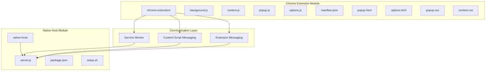
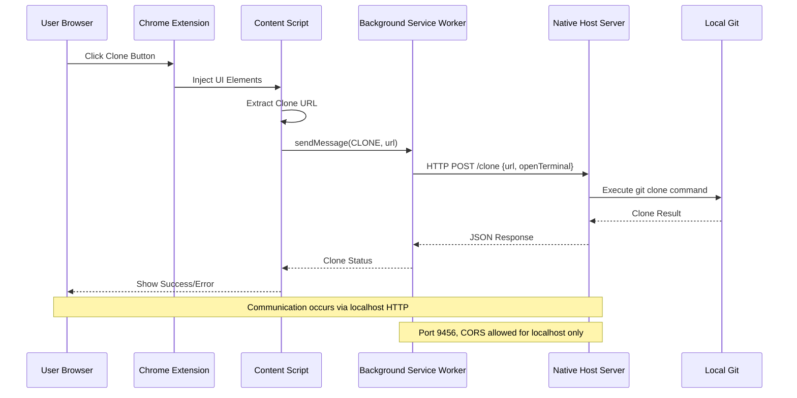

# Development and Contributing

<cite>
**Referenced Files in This Document**
- [README.md](file://README.md)
- [manifest.json](file://chrome-extension/manifest.json)
- [background.js](file://chrome-extension/background.js)
- [content.js](file://chrome-extension/content.js)
- [popup.js](file://chrome-extension/popup.js)
- [options.js](file://chrome-extension/options.js)
- [popup.html](file://chrome-extension/popup.html)
- [options.html](file://chrome-extension/options.html)
- [content.css](file://chrome-extension/content.css)
- [popup.css](file://chrome-extension/popup.css)
- [package.json](file://native-host/package.json)
- [server.js](file://native-host/server.js)
- [setup.sh](file://native-host/setup.sh)
</cite>

## Table of Contents
1. [Introduction](#introduction)
2. [Project Structure](#project-structure)
3. [Core Components](#core-components)
4. [Architecture Overview](#architecture-overview)
5. [Development Environment Setup](#development-environment-setup)
6. [Build and Deployment Processes](#build-and-deployment-processes)
7. [Development Workflow](#development-workflow)
8. [Testing Strategies](#testing-strategies)
9. [Contribution Guidelines](#contribution-guidelines)
10. [Code Style Standards](#code-style-standards)
11. [Pull Request Procedures](#pull-request-procedures)
12. [Development Tools and IDE Configuration](#development-tools-and-ide-configuration)
13. [Debugging Utilities](#debugging-utilities)
14. [Common Development Challenges](#common-development-challenges)
15. [Performance Optimization Techniques](#performance-optimization-techniques)
16. [Security Considerations](#security-considerations)
17. [Troubleshooting Guide](#troubleshooting-guide)
18. [Conclusion](#conclusion)

## Introduction
Git Magager is a Chrome extension designed to simplify Git operations by providing one-click cloning capabilities for GitHub and GitLab repositories. The project follows a modular architecture with clear separation between the Chrome extension frontend and a native host server that handles Git operations locally.

The extension enhances developer productivity by eliminating the need to manually copy repository URLs and execute terminal commands. It automatically detects repository pages, extracts clone URLs, and provides intuitive UI controls for instant cloning with configurable options.

## Project Structure
The project is organized into two primary modules that work together to deliver the complete functionality:

**Diagram sources**
- [manifest.json:1-50](file://chrome-extension/manifest.json#L1-L50)
- [background.js:1-74](file://chrome-extension/background.js#L1-L74)
- [content.js:1-312](file://chrome-extension/content.js#L1-L312)
- [server.js:1-271](file://native-host/server.js#L1-L271)

**Section sources**
- [README.md:1-3](file://README.md#L1-L3)
- [manifest.json:1-50](file://chrome-extension/manifest.json#L1-L50)

## Core Components
The system consists of four primary components that handle different aspects of the Git cloning workflow:

### Chrome Extension Components
- **Background Service Worker**: Manages communication with the native host server and handles extension lifecycle events
- **Content Scripts**: Injects UI elements into repository pages and extracts clone URLs from GitHub/GitLab interfaces
- **Popup Interface**: Provides a user-friendly interface for manual cloning with URL detection and configuration options
- **Options Page**: Allows users to configure default settings and preferences

### Native Host Components
- **HTTP Server**: Provides RESTful endpoints for clone operations, configuration management, and system integration
- **Terminal Integration**: Handles opening repositories in preferred terminal applications
- **File System Operations**: Manages clone directory creation and Git repository initialization

**Section sources**
- [background.js:1-74](file://chrome-extension/background.js#L1-L74)
- [content.js:1-312](file://chrome-extension/content.js#L1-L312)
- [popup.js:1-168](file://chrome-extension/popup.js#L1-L168)
- [options.js:1-56](file://chrome-extension/options.js#L1-L56)
- [server.js:1-271](file://native-host/server.js#L1-L271)

## Architecture Overview
The system implements a client-server architecture with secure communication boundaries:

**Diagram sources**
- [background.js:24-73](file://chrome-extension/background.js#L24-L73)
- [content.js:111-142](file://chrome-extension/content.js#L111-L142)
- [server.js:221-259](file://native-host/server.js#L221-L259)

The architecture ensures security by limiting native host communication to localhost connections and implementing proper CORS headers. The content scripts operate within the browser's security model while the background service worker manages cross-origin requests.

**Section sources**
- [manifest.json:6-18](file://chrome-extension/manifest.json#L6-L18)
- [background.js:3-21](file://chrome-extension/background.js#L3-L21)
- [server.js:145-156](file://native-host/server.js#L145-L156)

## Development Environment Setup
Setting up the development environment requires configuring both the Chrome extension and native host components:

### Prerequisites
- Node.js (required for native host server)
- Chrome browser with developer mode enabled
- Git CLI installed locally
- Terminal application (macOS Terminal/iTerm/Warp)

### Step-by-Step Setup Process
1. **Clone the Repository**: Download the complete codebase from the repository
2. **Install Dependencies**: Navigate to `native-host/` and run `npm install`
3. **Start Native Host**: Execute `npm start` to launch the local server on port 9456
4. **Load Extension**: Open Chrome → chrome://extensions → Enable Developer mode → Load unpacked → Select `chrome-extension/`
5. **Verify Installation**: Check that the extension appears in the toolbar and server connection status shows connected

### Configuration Management
The native host creates a configuration file at `~/.git-magager.json` with default settings:
- Clone directory: `~/Projects`
- Terminal preference: macOS Terminal
- Open in terminal: Enabled by default

**Section sources**
- [setup.sh:15-21](file://native-host/setup.sh#L15-L21)
- [server.js:17-37](file://native-host/server.js#L17-L37)
- [package.json:1-12](file://native-host/package.json#L1-L12)

## Build and Deployment Processes
The project uses a straightforward build process due to its JavaScript-based architecture:

### Development Build
- **Chrome Extension**: No compilation required - files are loaded directly from the filesystem
- **Native Host**: No compilation required - Node.js executes JavaScript files directly
- **Hot Reload**: Changes to extension files are automatically reflected after reloading the extension

### Production Build
- **Extension Packaging**: Use Chrome's extension packaging tools for distribution
- **Native Host Distribution**: Package as a standalone Node.js application
- **Version Management**: Update version numbers in manifest.json and package.json

### Build Verification
- **Extension Validation**: Test all major functionality including URL detection, cloning, and settings
- **Native Host Testing**: Verify HTTP endpoints respond correctly and Git operations succeed
- **Cross-Platform Compatibility**: Test on different operating systems and terminal applications

**Section sources**
- [manifest.json:2-5](file://chrome-extension/manifest.json#L2-L5)
- [package.json:2-4](file://native-host/package.json#L2-L4)

## Development Workflow
The development workflow emphasizes iterative testing and rapid feedback loops:

### Daily Development Cycle
1. **Start Native Host**: Launch the server with `npm start` to ensure backend functionality
2. **Load Extension**: Load the unpacked extension in Chrome for testing
3. **Test URL Detection**: Visit GitHub/GitLab repositories to verify clone button injection
4. **Manual Testing**: Use the popup interface to test cloning with different URL formats
5. **Debug Session**: Monitor console logs for both extension and native host components

### Feature Development Pattern
1. **Identify Requirement**: Determine which component needs modification (extension or native host)
2. **Modify Files**: Update relevant JavaScript/CSS/HTML files
3. **Test Changes**: Reload extension and verify functionality
4. **Debug Issues**: Use browser developer tools and native host logs
5. **Commit Changes**: Document changes with clear commit messages

### Hot Reload Capabilities
- **Extension Hot Reload**: Chrome automatically reloads extension files when changed
- **CSS Updates**: Style changes are applied immediately without restart
- **JavaScript Updates**: Service worker requires manual reload or extension reload
- **Native Host**: Server restart required for server.js changes

**Section sources**
- [content.js:288-311](file://chrome-extension/content.js#L288-L311)
- [background.js:6-9](file://chrome-extension/background.js#L6-L9)

## Testing Strategies
Comprehensive testing ensures reliability across different scenarios and platforms:

### Extension Component Testing
- **Unit Testing**: Test individual functions for URL detection and clone URL extraction
- **Integration Testing**: Verify content script injection and popup functionality
- **UI Testing**: Manual verification of visual elements and user interactions
- **Cross-Platform Testing**: Test on different GitHub/GitLab page layouts and navigation patterns

### Native Server Testing
- **Endpoint Testing**: Verify all HTTP endpoints respond correctly with proper JSON
- **Error Handling**: Test various failure scenarios including invalid URLs and permission errors
- **Terminal Integration**: Validate terminal application launching and command execution
- **File System Testing**: Confirm directory creation and Git repository initialization

### Automated Testing Approach
While the current implementation focuses on manual testing, consider adding:
- **Jest Tests**: For content script URL detection functions
- **Supertest**: For native host endpoint testing
- **Puppeteer**: For end-to-end browser automation

**Section sources**
- [content.js:20-84](file://chrome-extension/content.js#L20-L84)
- [server.js:158-259](file://native-host/server.js#L158-L259)

## Contribution Guidelines
Contributions are welcome and should follow established patterns:

### Code Organization
- **Feature-Based Structure**: Keep related files together in logical groupings
- **Clear Naming Conventions**: Use descriptive names for functions, variables, and files
- **Consistent Formatting**: Maintain uniform indentation and spacing
- **Documentation**: Add comments for complex logic and explain non-obvious decisions

### Pull Request Process
1. **Branch Creation**: Create feature branches from develop branch
2. **Testing**: Ensure all tests pass and functionality works as expected
3. **Documentation**: Update relevant documentation for new features
4. **Review Process**: Submit pull request with clear description of changes
5. **Merge Criteria**: Changes must be reviewed and approved by maintainers

### Issue Reporting
- **Bug Reports**: Include reproduction steps, expected vs actual behavior, and environment details
- **Feature Requests**: Provide clear problem statement and proposed solution
- **Performance Issues**: Include metrics and profiling information when applicable

**Section sources**
- [manifest.json:1-50](file://chrome-extension/manifest.json#L1-L50)

## Code Style Standards
Maintaining consistent code quality is essential for project maintainability:

### JavaScript Coding Standards
- **ES6+ Features**: Use modern JavaScript syntax and features
- **Async/Await**: Prefer async/await over callbacks for asynchronous operations
- **Error Handling**: Implement proper try/catch blocks and error propagation
- **Variable Declaration**: Use const/let appropriately instead of var
- **Function Organization**: Keep functions focused and single-purpose

### CSS Styling Guidelines
- **Component-Based Styles**: Organize styles by component boundaries
- **Custom Properties**: Use CSS custom properties for theme consistency
- **Responsive Design**: Ensure styles work across different screen sizes
- **Animation Timing**: Use consistent timing functions for smooth transitions

### File Organization
- **Logical Grouping**: Place related files in the same directory
- **Naming Consistency**: Use kebab-case for filenames and camelCase for variables
- **Import Organization**: Group imports by type (standard library, external, internal)
- **Export Patterns**: Use named exports for functions and default exports for main components

**Section sources**
- [content.css:1-175](file://chrome-extension/content.css#L1-L175)
- [popup.css:1-264](file://chrome-extension/popup.css#L1-L264)

## Pull Request Procedures
Structured pull request processes ensure code quality and project stability:

### Pre-Submission Checklist
- **Code Review**: Self-review code for readability and efficiency
- **Testing**: Verify all functionality works as expected
- **Documentation**: Update documentation for any API changes
- **Compatibility**: Ensure backward compatibility where possible

### Review Process
1. **Automated Checks**: CI/CD pipeline validates code quality and tests
2. **Peer Review**: Team members review code for correctness and style
3. **Feedback Incorporation**: Address reviewer comments promptly
4. **Approval**: Requires minimum number of approvals before merging

### Merge Requirements
- **Clean History**: Squash commits if necessary for clean history
- **Documentation**: Update changelog and relevant documentation
- **Testing**: Ensure all tests continue to pass after merge
- **Follow-up**: Monitor for any post-merge issues

**Section sources**
- [background.js:11-21](file://chrome-extension/background.js#L11-L21)

## Development Tools and IDE Configuration
Optimizing the development environment improves productivity and code quality:

### Recommended IDE Settings
- **EditorConfig**: Configure consistent indentation and line endings
- **ESLint**: Enable JavaScript linting with project-specific rules
- **Prettier**: Configure automatic code formatting
- **Git Integration**: Set up commit hooks and pre-commit validation

### Browser Development Tools
- **Chrome DevTools**: Essential for extension debugging and inspection
- **Network Monitoring**: Track HTTP requests to native host server
- **Console Logging**: Use structured logging for better debugging
- **Extension Debugging**: Enable background page debugging and service worker inspection

### Native Host Development
- **Node.js Debugging**: Use inspector protocol for server-side debugging
- **Log Management**: Monitor server logs for error tracking
- **Process Management**: Consider using nodemon for automatic restarts during development

**Section sources**
- [background.js:11-21](file://chrome-extension/background.js#L11-L21)
- [server.js:266-271](file://native-host/server.js#L266-L271)

## Debugging Utilities
Effective debugging strategies accelerate issue resolution:

### Extension Debugging
- **Background Page**: Access via chrome://extensions → background page
- **Content Scripts**: Use console in page context for injected script debugging
- **Service Worker**: Monitor network requests and messaging in Application tab
- **Storage Inspection**: Check extension storage and configuration in Storage tab

### Native Host Debugging
- **Server Logs**: Monitor startup and runtime logs in terminal
- **HTTP Debugging**: Use curl commands to test endpoints independently
- **Process Monitoring**: Watch for server process status and resource usage
- **Error Tracking**: Implement structured error reporting for better diagnostics

### Common Debugging Scenarios
- **Connection Issues**: Verify localhost connectivity and port availability
- **Permission Problems**: Check file system permissions and terminal access
- **URL Detection Failures**: Inspect page structure changes on GitHub/GitLab
- **Terminal Integration**: Test terminal application availability and command execution

**Section sources**
- [background.js:11-21](file://chrome-extension/background.js#L11-L21)
- [server.js:145-156](file://native-host/server.js#L145-L156)

## Common Development Challenges
Understanding potential issues helps prevent and resolve problems quickly:

### Platform-Specific Issues
- **GitHub/GitLab Layout Changes**: Content scripts may break with UI updates
- **Browser Compatibility**: Different browsers may handle extensions differently
- **Operating System Differences**: Terminal applications vary across platforms
- **File System Permissions**: Access restrictions on different operating systems

### Performance Considerations
- **DOM Manipulation**: Excessive DOM changes can impact page performance
- **Network Requests**: Minimize unnecessary HTTP requests to native host
- **Memory Management**: Avoid memory leaks in long-running content scripts
- **Event Handling**: Properly manage event listeners to prevent conflicts

### Security Concerns
- **Content Security Policy**: Respect browser security policies for content scripts
- **Data Privacy**: Handle user data securely and minimize data collection
- **Cross-Origin Requests**: Properly configure CORS and origin validation
- **Input Sanitization**: Validate and sanitize all user inputs and URLs

**Section sources**
- [content.js:288-311](file://chrome-extension/content.js#L288-L311)
- [manifest.json:6-18](file://chrome-extension/manifest.json#L6-L18)

## Performance Optimization Techniques
Optimizing for speed and efficiency ensures smooth user experience:

### Extension Performance
- **Debounced DOM Observers**: Use timeouts to prevent excessive re-injection
- **Efficient URL Detection**: Cache detected URLs to avoid repeated extraction
- **Minimal DOM Changes**: Batch DOM operations to reduce layout thrashing
- **Lazy Loading**: Load resources only when needed

### Native Host Optimization
- **Connection Pooling**: Reuse HTTP connections where possible
- **Process Management**: Avoid spawning unnecessary child processes
- **Resource Cleanup**: Properly clean up temporary files and processes
- **Error Caching**: Cache common error responses to reduce processing overhead

### Memory Management
- **Event Listener Cleanup**: Remove listeners when components unmount
- **Weak References**: Use weak references for caches where appropriate
- **Object Pooling**: Reuse objects instead of creating new ones frequently
- **Garbage Collection**: Trigger GC periodically for long-running processes

**Section sources**
- [content.js:288-311](file://chrome-extension/content.js#L288-L311)
- [server.js:45-64](file://native-host/server.js#L45-L64)

## Security Considerations
Security is paramount in extension development:

### Content Security Policy Compliance
- **Inline Script Restrictions**: Avoid inline scripts in content scripts
- **Eval Usage**: Minimize use of eval and dynamic code execution
- **External Resource Loading**: Only load trusted external resources
- **Frame Ancestry**: Verify parent frame permissions for injected content

### Data Protection
- **User Data Encryption**: Encrypt sensitive configuration data
- **Secure Communication**: Use HTTPS for all external communications
- **Input Validation**: Validate all user inputs to prevent injection attacks
- **Privacy by Design**: Minimize data collection and provide user control

### Permission Management
- **Minimal Permissions**: Request only necessary browser permissions
- **Permission Justification**: Clearly document why each permission is needed
- **User Control**: Provide options for users to disable features
- **Audit Trail**: Log permission usage for transparency

### Native Host Security
- **Localhost Binding**: Only accept connections from localhost
- **Input Sanitization**: Validate all inputs before executing system commands
- **Process Isolation**: Run Git operations in isolated processes
- **Error Containment**: Prevent error messages from leaking sensitive information

**Section sources**
- [manifest.json:6-18](file://chrome-extension/manifest.json#L6-L18)
- [server.js:145-156](file://native-host/server.js#L145-L156)

## Troubleshooting Guide
Systematic approaches to resolving common issues:

### Extension Not Loading
- **Check Developer Mode**: Ensure developer mode is enabled in Chrome
- **Verify Manifest**: Validate manifest.json syntax and permissions
- **Reload Extension**: Force reload the extension from chrome://extensions
- **Check Console**: Look for JavaScript errors in background page console

### Native Host Server Issues
- **Port Conflicts**: Verify port 9456 is available and not blocked
- **Node.js Installation**: Confirm Node.js is properly installed and accessible
- **Process Status**: Check if server process is running and listening
- **Log Files**: Review server logs for detailed error information

### Cloning Failures
- **Git Availability**: Ensure Git CLI is installed and accessible
- **Directory Permissions**: Verify write permissions for clone directory
- **Network Connectivity**: Test network access to remote repositories
- **Terminal Access**: Confirm terminal application can be launched

### URL Detection Problems
- **Page Structure Changes**: Update selectors to match current GitHub/GitLab layouts
- **SPA Navigation**: Handle single-page application navigation events
- **Mutation Observer**: Ensure DOM observers are properly configured
- **Platform Detection**: Verify hostname matching logic for different domains

**Section sources**
- [background.js:11-21](file://chrome-extension/background.js#L11-L21)
- [server.js:145-156](file://native-host/server.js#L145-L156)
- [content.js:288-311](file://chrome-extension/content.js#L288-L311)

## Conclusion
Git Magager represents a well-architected solution for simplifying Git operations in web browsers. The modular design with clear separation between extension and native components enables maintainable development and reliable functionality.

Key strengths of the implementation include:
- **Modular Architecture**: Clean separation between UI and backend logic
- **Security Focus**: Local-only communication with proper CORS handling
- **User Experience**: Intuitive interface with visual feedback
- **Platform Support**: Cross-platform compatibility with macOS terminal integration

Future development opportunities include enhanced testing infrastructure, expanded platform support, and additional Git operations beyond cloning. The established patterns and guidelines provide a solid foundation for continued evolution while maintaining code quality and user trust.