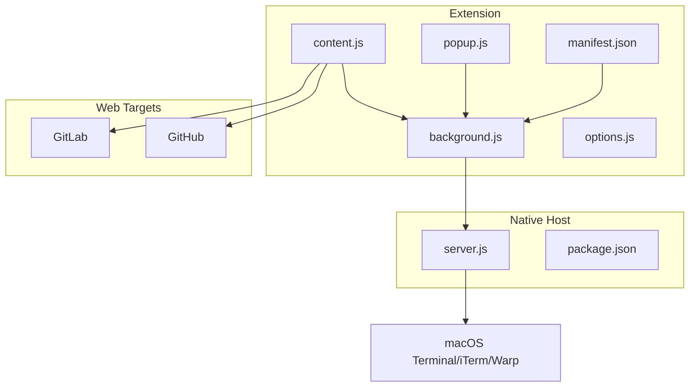
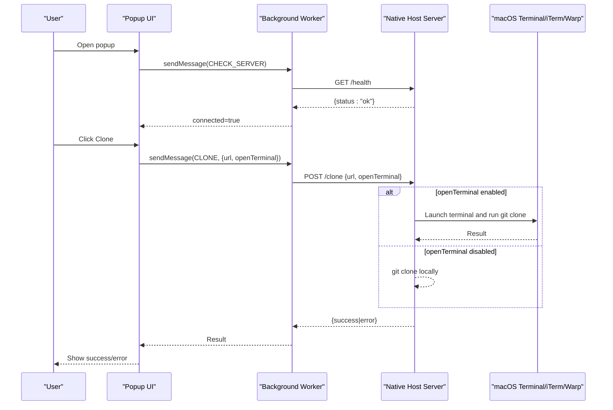
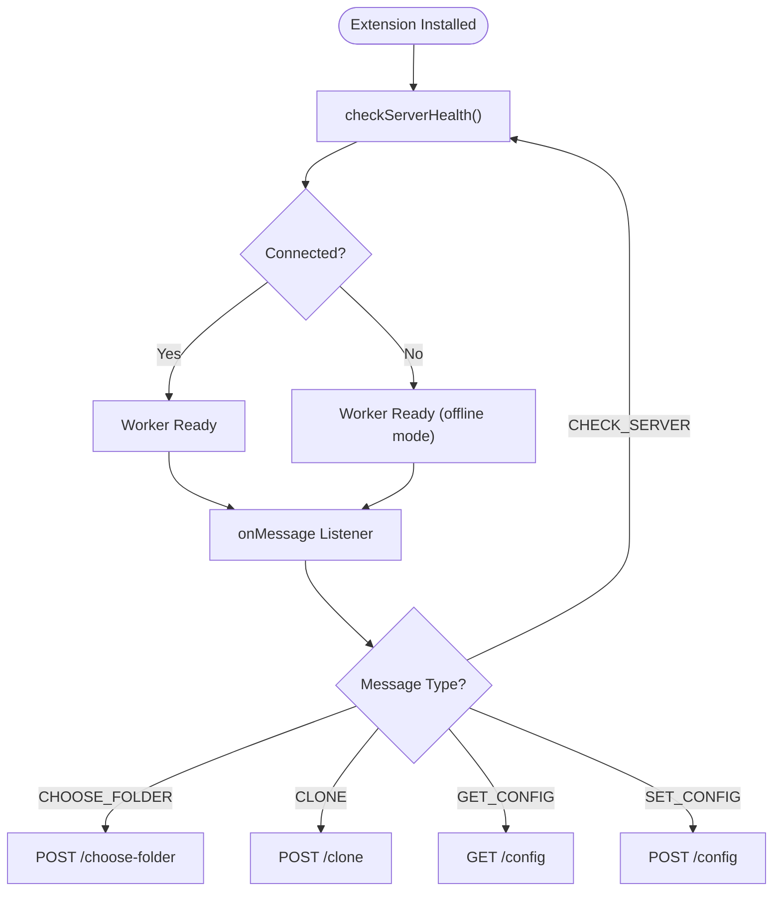
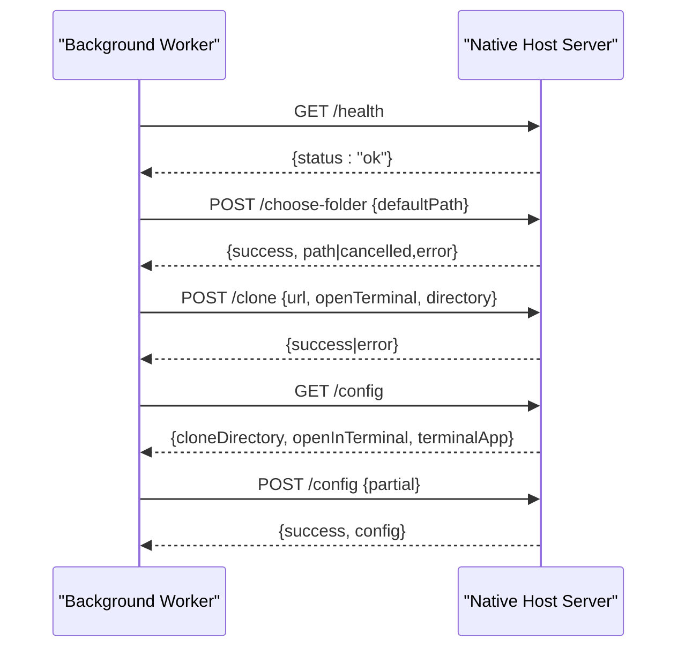
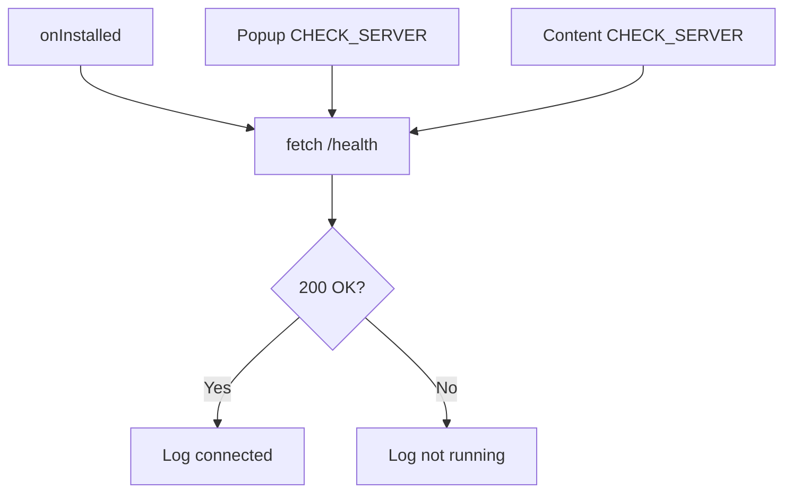
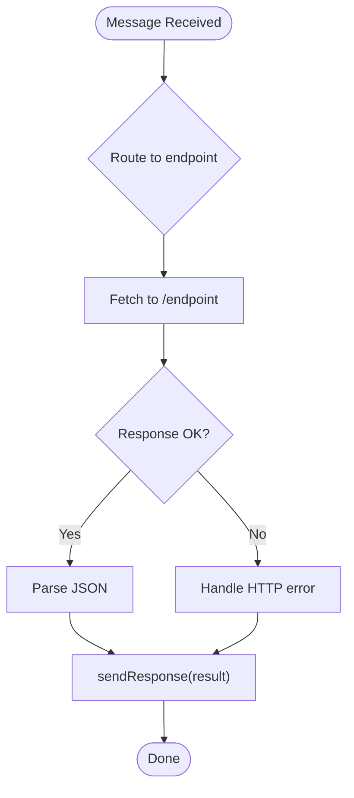
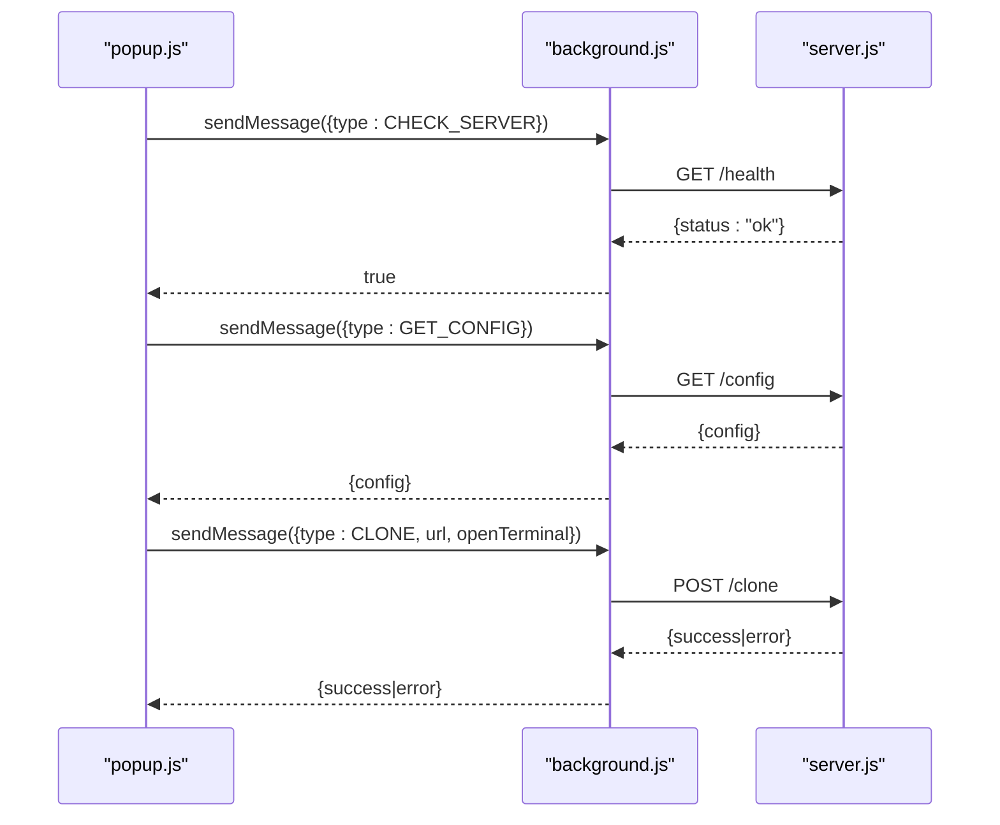
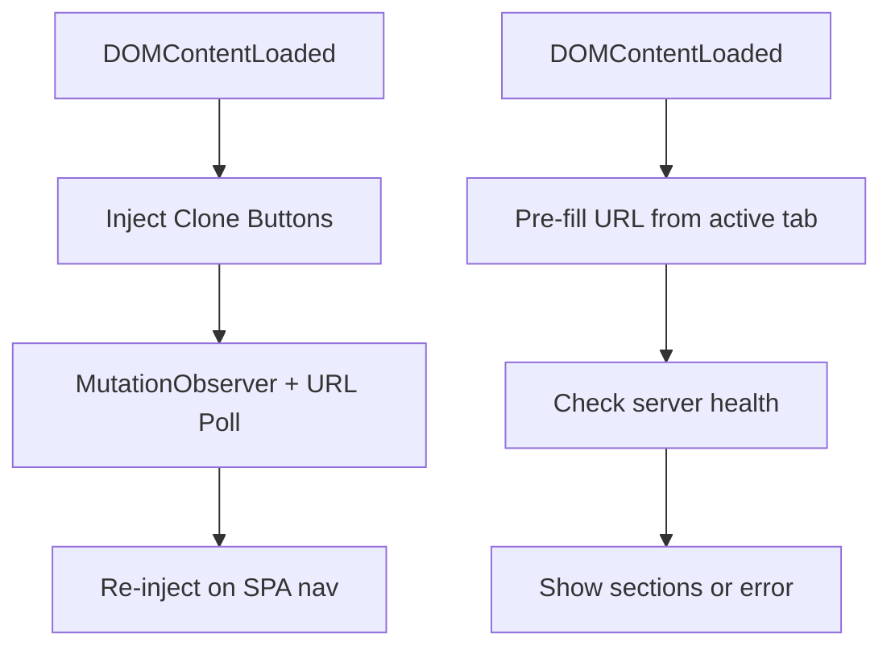
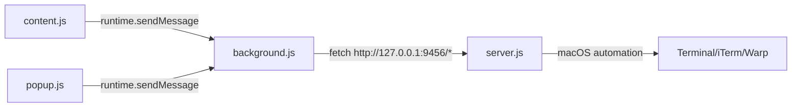
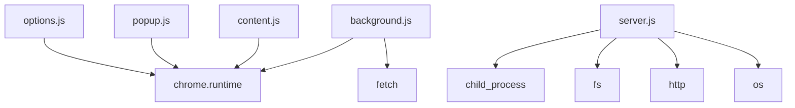

# Background Service Worker

<cite>
**Referenced Files in This Document**
- [background.js](file://chrome-extension/background.js)
- [manifest.json](file://chrome-extension/manifest.json)
- [content.js](file://chrome-extension/content.js)
- [popup.js](file://chrome-extension/popup.js)
- [popup.html](file://chrome-extension/popup.html)
- [options.js](file://chrome-extension/options.js)
- [content.css](file://chrome-extension/content.css)
- [server.js](file://native-host/server.js)
- [package.json](file://native-host/package.json)
</cite>

## Table of Contents
1. [Introduction](#introduction)
2. [Project Structure](#project-structure)
3. [Core Components](#core-components)
4. [Architecture Overview](#architecture-overview)
5. [Detailed Component Analysis](#detailed-component-analysis)
6. [Dependency Analysis](#dependency-analysis)
7. [Performance Considerations](#performance-considerations)
8. [Troubleshooting Guide](#troubleshooting-guide)
9. [Conclusion](#conclusion)
10. [Appendices](#appendices)

## Introduction
This document explains the background service worker architecture of the Git Magager Chrome extension. It covers the service worker lifecycle, initialization sequence, long-running process management, server communication protocols, health checks, error handling, message passing with popup and content scripts, event listener management, cross-origin communication security, update mechanisms, debugging techniques, performance optimization strategies, and Chrome extension security boundaries.

## Project Structure
The extension consists of:
- Manifest v3 background service worker
- Content scripts injected into target websites
- Popup UI and options page
- Native host companion server for local operations

**Diagram sources**
- [background.js:1-74](file://chrome-extension/background.js#L1-L74)
- [content.js:1-333](file://chrome-extension/content.js#L1-L333)
- [popup.js:1-168](file://chrome-extension/popup.js#L1-L168)
- [options.js:1-56](file://chrome-extension/options.js#L1-L56)
- [manifest.json:1-50](file://chrome-extension/manifest.json#L1-L50)
- [server.js:1-263](file://native-host/server.js#L1-L263)
- [package.json:1-12](file://native-host/package.json#L1-L12)

**Section sources**
- [manifest.json:1-50](file://chrome-extension/manifest.json#L1-L50)
- [background.js:1-74](file://chrome-extension/background.js#L1-L74)
- [content.js:1-333](file://chrome-extension/content.js#L1-L333)
- [popup.js:1-168](file://chrome-extension/popup.js#L1-L168)
- [options.js:1-56](file://chrome-extension/options.js#L1-L56)
- [server.js:1-263](file://native-host/server.js#L1-L263)

## Core Components
- Background service worker: central orchestration point for messaging, health checks, and proxying requests to the native host server.
- Content scripts: detect repository pages, extract clone URLs, inject UI, and communicate with the background worker.
- Popup and options scripts: user-facing controls to initiate cloning, configure behavior, and manage settings.
- Native host server: local HTTP server exposing endpoints for health checks, configuration, folder selection, and cloning.

Key responsibilities:
- Message routing between UI and native host
- Server health verification on install and on demand
- Cross-origin safe communication via runtime messaging
- Long-running background lifecycle managed by the browser

**Section sources**
- [background.js:1-74](file://chrome-extension/background.js#L1-L74)
- [content.js:1-333](file://chrome-extension/content.js#L1-L333)
- [popup.js:1-168](file://chrome-extension/popup.js#L1-L168)
- [options.js:1-56](file://chrome-extension/options.js#L1-L56)
- [server.js:1-263](file://native-host/server.js#L1-L263)

## Architecture Overview
The extension uses a hybrid model:
- UI runs in isolated contexts (popup, content scripts).
- Background service worker acts as a long-running coordinator.
- Native host server performs privileged operations (file system, terminal automation).

**Diagram sources**
- [background.js:24-73](file://chrome-extension/background.js#L24-L73)
- [popup.js:37-59](file://chrome-extension/popup.js#L37-L59)
- [popup.js:111-149](file://chrome-extension/popup.js#L111-L149)
- [server.js:150-251](file://native-host/server.js#L150-L251)

## Detailed Component Analysis

### Background Service Worker Lifecycle and Initialization
- Installed event triggers a server health check.
- Listens for runtime messages from popup and content scripts.
- Routes messages to native host endpoints and responds asynchronously.

**Diagram sources**
- [background.js:6-21](file://chrome-extension/background.js#L6-L21)
- [background.js:24-73](file://chrome-extension/background.js#L24-L73)

**Section sources**
- [background.js:6-21](file://chrome-extension/background.js#L6-L21)
- [background.js:24-73](file://chrome-extension/background.js#L24-L73)
- [manifest.json:19-21](file://chrome-extension/manifest.json#L19-L21)

### Server Communication Protocols and Endpoints
- Health check: GET /health
- Configuration: GET /config, POST /config
- Folder selection: POST /choose-folder
- Clone: POST /clone

Security and CORS:
- Native host sets Access-Control-Allow-Origin to accept all origins because it listens on localhost.
- Host_permissions in manifest allow http://127.0.0.1:*/ and http://localhost:*/ for the extension to communicate with the local server.

**Diagram sources**
- [background.js:11-21](file://chrome-extension/background.js#L11-L21)
- [background.js:30-72](file://chrome-extension/background.js#L30-L72)
- [server.js:150-251](file://native-host/server.js#L150-L251)

**Section sources**
- [background.js:3-21](file://chrome-extension/background.js#L3-L21)
- [background.js:30-72](file://chrome-extension/background.js#L30-L72)
- [server.js:137-256](file://native-host/server.js#L137-L256)
- [manifest.json:11-18](file://chrome-extension/manifest.json#L11-L18)

### Health Check Mechanisms
- On install, the background worker pings the native host’s health endpoint.
- Popup and content scripts can request a fresh health check via runtime messaging.

**Diagram sources**
- [background.js:6-21](file://chrome-extension/background.js#L6-L21)
- [background.js:24-28](file://chrome-extension/background.js#L24-L28)

**Section sources**
- [background.js:6-21](file://chrome-extension/background.js#L6-L21)
- [background.js:24-28](file://chrome-extension/background.js#L24-L28)

### Error Handling Strategies
- Network failures during health checks are caught and logged; UI reflects disconnected state.
- Message handlers return structured responses with success/error fields.
- Native host returns explicit HTTP status codes and JSON bodies for client-side handling.

**Diagram sources**
- [background.js:30-72](file://chrome-extension/background.js#L30-L72)
- [server.js:150-251](file://native-host/server.js#L150-L251)

**Section sources**
- [background.js:17-20](file://chrome-extension/background.js#L17-L20)
- [background.js:30-72](file://chrome-extension/background.js#L30-L72)
- [server.js:150-251](file://native-host/server.js#L150-L251)

### Message Passing Patterns with Popup and Content Scripts
- Popup communicates via runtime.sendMessage to trigger actions and retrieve configuration.
- Content script sends messages to select folders and initiate cloning on repository pages.
- Background worker uses synchronous sendResponse for immediate replies; returns true to keep the channel open for asynchronous responses.

**Diagram sources**
- [popup.js:37-59](file://chrome-extension/popup.js#L37-L59)
- [popup.js:111-149](file://chrome-extension/popup.js#L111-L149)
- [background.js:24-73](file://chrome-extension/background.js#L24-L73)
- [server.js:213-251](file://native-host/server.js#L213-L251)

**Section sources**
- [popup.js:37-59](file://chrome-extension/popup.js#L37-L59)
- [popup.js:111-149](file://chrome-extension/popup.js#L111-L149)
- [content.js:121-163](file://chrome-extension/content.js#L121-L163)
- [background.js:24-73](file://chrome-extension/background.js#L24-L73)

### Event Listener Management and UI Integration
- Content script injects UI elements only on repository pages and handles SPA navigation via MutationObserver and periodic URL polling.
- Popup initializes on DOMContentLoaded, queries active tab URL, and pre-fills clone URL for supported hosts.
- Both scripts manage visual feedback and error states.

**Diagram sources**
- [content.js:296-332](file://chrome-extension/content.js#L296-L332)
- [popup.js:3-35](file://chrome-extension/popup.js#L3-L35)
- [popup.js:37-59](file://chrome-extension/popup.js#L37-L59)

**Section sources**
- [content.js:296-332](file://chrome-extension/content.js#L296-L332)
- [popup.js:3-35](file://chrome-extension/popup.js#L3-L35)
- [popup.js:37-59](file://chrome-extension/popup.js#L37-L59)

### Cross-Origin Communication Security
- Manifest permissions define host_permissions for GitHub, GitLab, and localhost/127.0.0.1.
- Runtime messaging is scoped to the extension context; native host only accepts connections from localhost.
- Content scripts run in page context but can only communicate with the extension via runtime APIs.

**Diagram sources**
- [manifest.json:11-18](file://chrome-extension/manifest.json#L11-L18)
- [background.js:3-3](file://chrome-extension/background.js#L3-L3)
- [server.js:137-148](file://native-host/server.js#L137-L148)

**Section sources**
- [manifest.json:6-18](file://chrome-extension/manifest.json#L6-L18)
- [background.js:3-3](file://chrome-extension/background.js#L3-L3)
- [server.js:137-148](file://native-host/server.js#L137-L148)

### Service Worker Update Mechanisms
- Manifest v3 uses a service worker; updates occur when the extension manifest or resources change.
- The background worker remains alive across tabs and browser sessions until idle or updates.

Recommendations:
- Keep background.js minimal and focused on messaging and health checks.
- Use declarative updates via manifest changes; avoid relying on manual reloads.

**Section sources**
- [manifest.json:19-21](file://chrome-extension/manifest.json#L19-L21)
- [background.js:1-74](file://chrome-extension/background.js#L1-L74)

### Debugging Techniques
- Console logging in background.js and server.js for operational visibility.
- Popup displays server status and error messages.
- Content script shows notifications for clone outcomes.

Practical tips:
- Enable Developer Mode in Chrome Extensions and inspect background worker logs.
- Use network panel to observe runtime messaging and native host requests.
- Verify native host is running on http://127.0.0.1:9456.

**Section sources**
- [background.js:11-21](file://chrome-extension/background.js#L11-L21)
- [popup.js:37-59](file://chrome-extension/popup.js#L37-L59)
- [content.js:167-181](file://chrome-extension/content.js#L167-L181)
- [server.js:258-262](file://native-host/server.js#L258-L262)

### Performance Optimization Strategies
- Debounce content script UI re-injection using MutationObserver and a short timer to avoid excessive DOM manipulation.
- Avoid blocking UI by performing heavy operations (folder selection, cloning) in the native host and returning results asynchronously.
- Minimize background worker CPU usage by limiting repeated polling and using targeted message routing.

**Section sources**
- [content.js:311-317](file://chrome-extension/content.js#L311-L317)
- [background.js:24-73](file://chrome-extension/background.js#L24-L73)

## Dependency Analysis
- background.js depends on runtime messaging and fetch to communicate with the native host.
- content.js depends on runtime messaging to coordinate with background.js and inject UI.
- popup.js depends on runtime messaging to control cloning and configuration.
- server.js depends on Node.js child_process, fs, http, and os modules for local operations.

**Diagram sources**
- [background.js:1-74](file://chrome-extension/background.js#L1-L74)
- [content.js:1-333](file://chrome-extension/content.js#L1-L333)
- [popup.js:1-168](file://chrome-extension/popup.js#L1-L168)
- [options.js:1-56](file://chrome-extension/options.js#L1-L56)
- [server.js:1-6](file://native-host/server.js#L1-L6)

**Section sources**
- [background.js:1-74](file://chrome-extension/background.js#L1-L74)
- [content.js:1-333](file://chrome-extension/content.js#L1-L333)
- [popup.js:1-168](file://chrome-extension/popup.js#L1-L168)
- [options.js:1-56](file://chrome-extension/options.js#L1-L56)
- [server.js:1-6](file://native-host/server.js#L1-L6)

## Performance Considerations
- Keep background worker logic lightweight; delegate heavy tasks to the native host.
- Use async/await and structured error handling to prevent unhandled rejections.
- Avoid unnecessary repeated health checks; cache connection state in memory.
- Minimize DOM manipulations in content scripts; reuse injected elements and throttle updates.

[No sources needed since this section provides general guidance]

## Troubleshooting Guide
Common issues and resolutions:
- Server not running: Popup shows “Local server not running” and suggests starting the native host. Ensure the native host is started and listening on http://127.0.0.1:9456.
- Permission errors: Verify host_permissions in manifest and that the native host is reachable from localhost.
- Clone failures: Inspect native host logs for git errors and confirm terminal automation availability (Terminal/iTerm/Warp).
- UI not appearing: Confirm content script is injected on repository pages and that SPA navigation is handled by MutationObserver and URL polling.

**Section sources**
- [popup.html:55-66](file://chrome-extension/popup.html#L55-L66)
- [content.js:296-332](file://chrome-extension/content.js#L296-L332)
- [server.js:258-262](file://native-host/server.js#L258-L262)

## Conclusion
The background service worker orchestrates a secure, efficient pipeline between the extension UI and a local native host server. By leveraging runtime messaging, health checks, and targeted endpoints, the extension provides a seamless cloning experience while respecting Chrome extension security boundaries and sandbox limitations.

[No sources needed since this section summarizes without analyzing specific files]

## Appendices

### Endpoint Reference
- GET /health: Returns server status and version.
- GET /config: Returns current configuration.
- POST /config: Updates configuration; merges partial updates.
- POST /choose-folder: Opens native folder picker; returns selected path or cancellation.
- POST /clone: Clones repository; optionally opens terminal with the operation.

**Section sources**
- [server.js:150-251](file://native-host/server.js#L150-L251)

### Security Boundaries and Sandbox Limitations
- Background worker: Extension context, limited to declared permissions and host_permissions.
- Content scripts: Page context with restricted DOM access; can only communicate via runtime messaging.
- Native host: Local process with elevated privileges; only accessible via localhost.

**Section sources**
- [manifest.json:6-18](file://chrome-extension/manifest.json#L6-L18)
- [background.js:3-3](file://chrome-extension/background.js#L3-L3)
- [server.js:137-148](file://native-host/server.js#L137-L148)