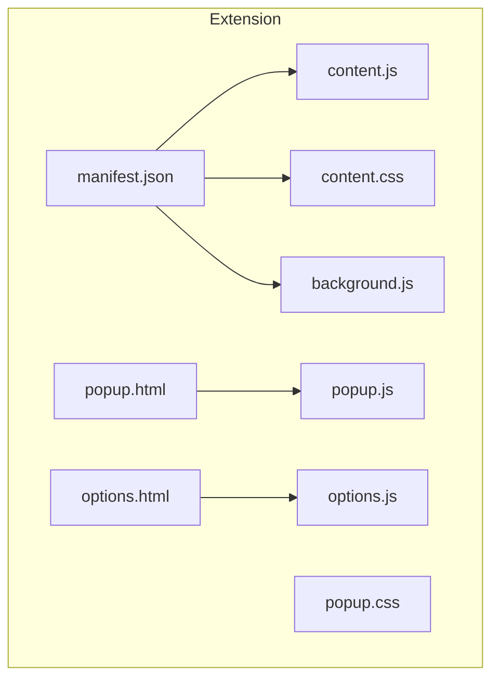
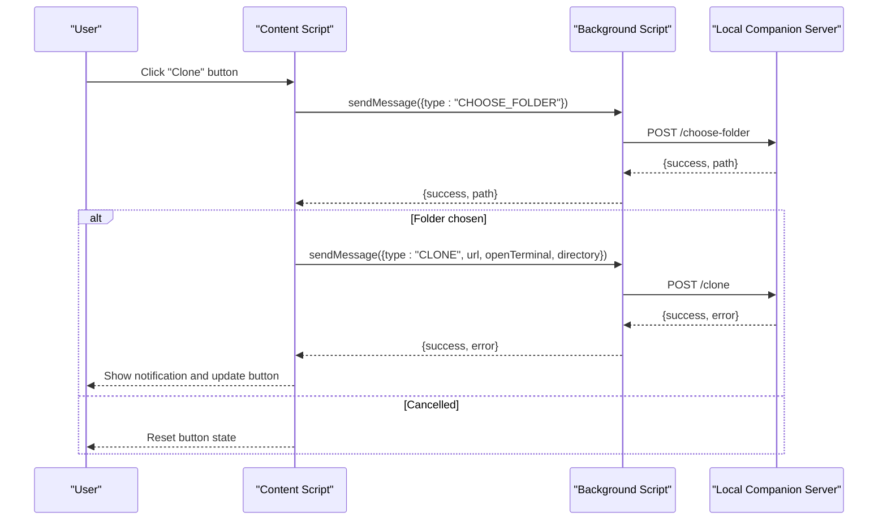
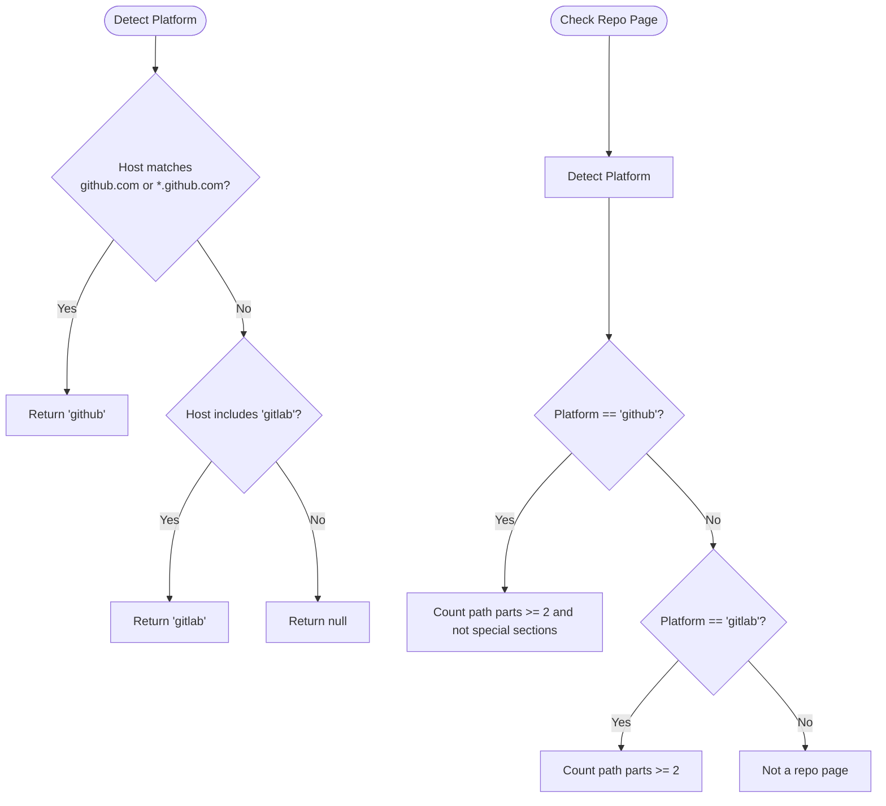
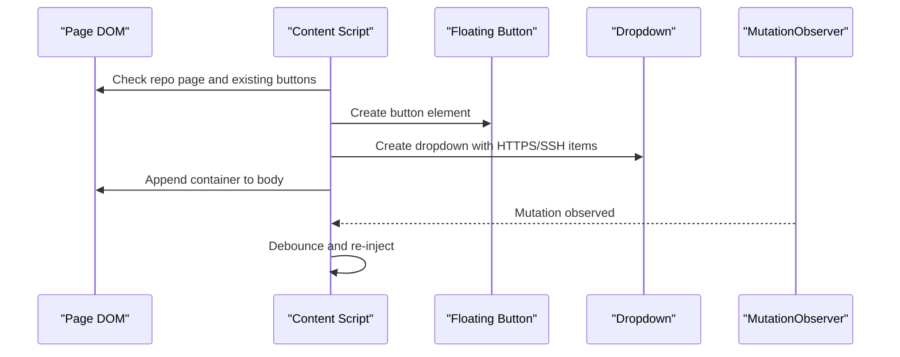
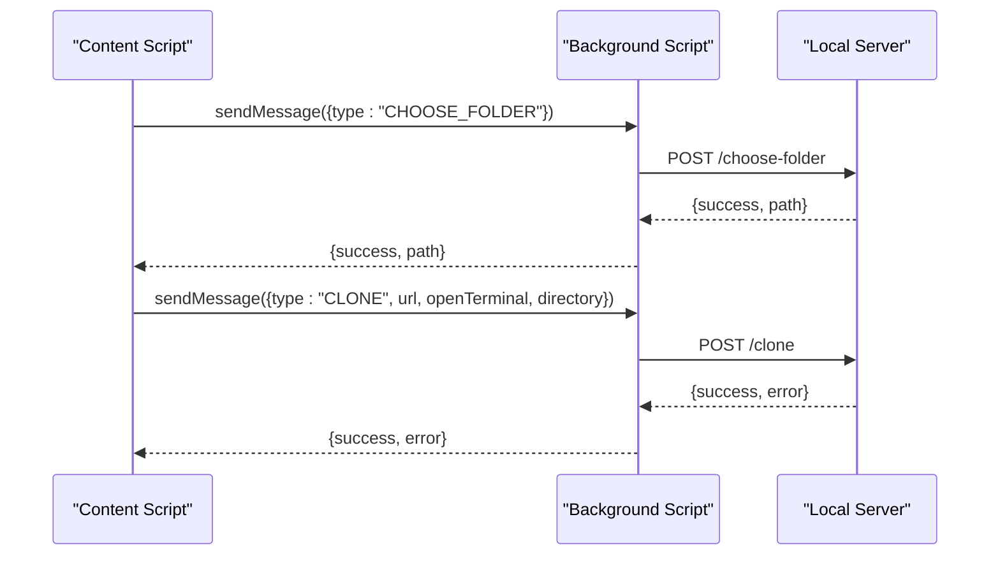
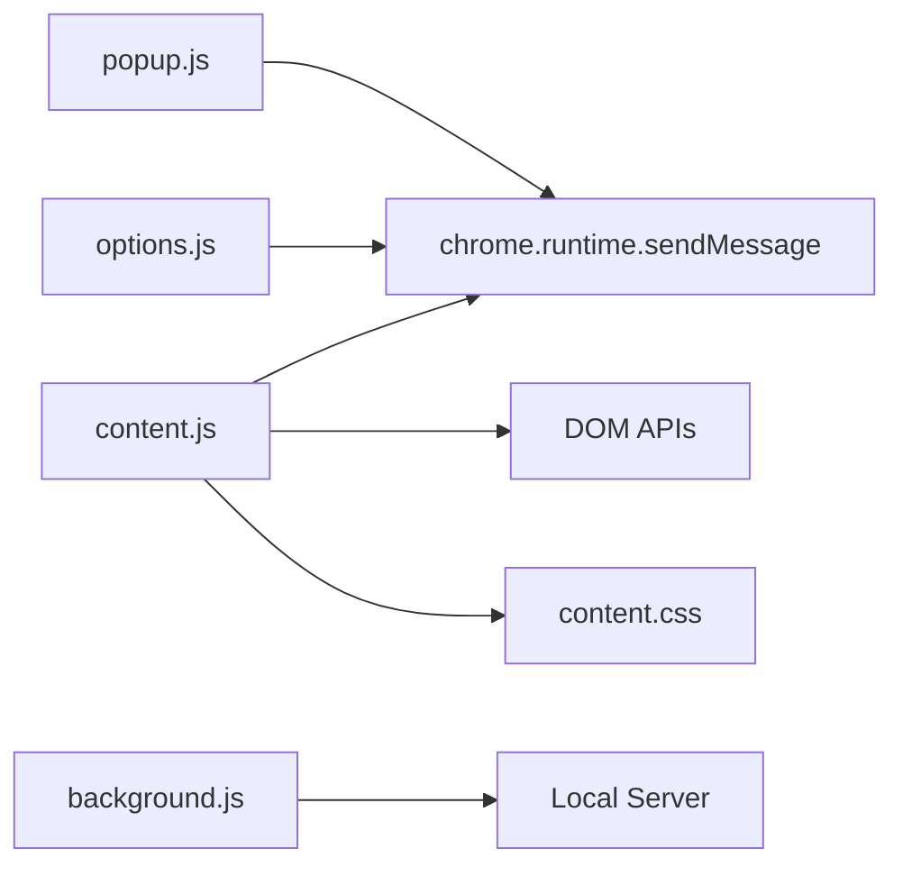

# Content Script Integration

<cite>
**Referenced Files in This Document**
- [content.js](file://chrome-extension/content.js)
- [content.css](file://chrome-extension/content.css)
- [manifest.json](file://chrome-extension/manifest.json)
- [background.js](file://chrome-extension/background.js)
- [popup.js](file://chrome-extension/popup.js)
- [options.js](file://chrome-extension/options.js)
- [popup.html](file://chrome-extension/popup.html)
- [options.html](file://chrome-extension/options.html)
- [popup.css](file://chrome-extension/popup.css)
</cite>

## Table of Contents
1. [Introduction](#introduction)
2. [Project Structure](#project-structure)
3. [Core Components](#core-components)
4. [Architecture Overview](#architecture-overview)
5. [Detailed Component Analysis](#detailed-component-analysis)
6. [Dependency Analysis](#dependency-analysis)
7. [Performance Considerations](#performance-considerations)
8. [Troubleshooting Guide](#troubleshooting-guide)
9. [Conclusion](#conclusion)
10. [Appendices](#appendices)

## Introduction
This document explains the content script architecture and DOM integration for a browser extension that injects a floating clone button on GitHub and GitLab repository pages. It covers URL pattern matching, DOM manipulation techniques, floating clone button injection, content script lifecycle and execution context, communication with background scripts, CSS styling and responsive design, cross-browser compatibility, security restrictions and CSP implications, performance optimization, memory management, and debugging strategies.

## Project Structure
The extension consists of a content script, styles, a background service worker, and UI pages for the popup and options. The manifest defines permissions, host permissions, and content script inclusion.

**Diagram sources**
- [manifest.json:30-42](file://chrome-extension/manifest.json#L30-L42)
- [content.js:1-333](file://chrome-extension/content.js#L1-L333)
- [content.css:1-175](file://chrome-extension/content.css#L1-L175)
- [background.js:1-74](file://chrome-extension/background.js#L1-L74)
- [popup.html:1-77](file://chrome-extension/popup.html#L1-L77)
- [popup.js:1-168](file://chrome-extension/popup.js#L1-L168)
- [popup.css:1-264](file://chrome-extension/popup.css#L1-L264)
- [options.html:1-222](file://chrome-extension/options.html#L1-L222)
- [options.js:1-56](file://chrome-extension/options.js#L1-L56)

**Section sources**
- [manifest.json:1-50](file://chrome-extension/manifest.json#L1-L50)

## Core Components
- Content script: Detects platform, extracts clone URLs, injects floating and page-integrated buttons, handles user interactions, and communicates with the background script.
- Background script: Receives messages from content and popup scripts, interacts with a local companion server, and responds with results.
- Styles: Provide consistent theming, animations, and responsive layout for injected UI.
- Popup and options pages: Provide manual clone controls and configuration management.

Key responsibilities:
- URL pattern matching for GitHub and GitLab.
- DOM discovery and injection of clone UI elements.
- Message passing to background script for folder selection and cloning.
- Notification and feedback UI.
- SPA navigation support via mutation observer and interval checks.

**Section sources**
- [content.js:13-107](file://chrome-extension/content.js#L13-L107)
- [content.js:185-258](file://chrome-extension/content.js#L185-L258)
- [content.js:262-292](file://chrome-extension/content.js#L262-L292)
- [content.js:111-163](file://chrome-extension/content.js#L111-L163)
- [background.js:24-73](file://chrome-extension/background.js#L24-L73)

## Architecture Overview
The extension uses a content script to integrate with target sites, a background service worker for network operations, and UI pages for manual actions and configuration.

**Diagram sources**
- [content.js:121-163](file://chrome-extension/content.js#L121-L163)
- [background.js:30-52](file://chrome-extension/background.js#L30-L52)

## Detailed Component Analysis

### URL Pattern Matching and Platform Detection
- Host detection identifies GitHub and GitLab domains.
- Repo page validation ensures the button is only injected on repository pages.
- Clone URL extraction uses multiple strategies:
  - GitHub: reads inputs and attributes from clone UI, derives URLs from page path, and scans data attributes.
  - GitLab: reads inputs and attributes from clone UI, cleans path segments, and constructs URLs.

**Diagram sources**
- [content.js:13-18](file://chrome-extension/content.js#L13-L18)
- [content.js:95-107](file://chrome-extension/content.js#L95-L107)
- [content.js:20-57](file://chrome-extension/content.js#L20-L57)
- [content.js:59-84](file://chrome-extension/content.js#L59-L84)

**Section sources**
- [content.js:13-18](file://chrome-extension/content.js#L13-L18)
- [content.js:95-107](file://chrome-extension/content.js#L95-L107)
- [content.js:20-57](file://chrome-extension/content.js#L20-L57)
- [content.js:59-84](file://chrome-extension/content.js#L59-L84)

### DOM Manipulation and Floating Clone Button Injection
- Floating button injection:
  - Creates a container with a primary button and a dropdown for HTTPS/SSH selection.
  - Uses MutationObserver to re-inject after DOM changes (SPA navigation).
  - Uses an interval to detect URL changes and re-initialize.
- Page-integrated button injection (GitHub):
  - Injects a compact button into the repository header action area.
- Notification system:
  - Dynamically creates a notification element and animates it in/out.

**Diagram sources**
- [content.js:185-258](file://chrome-extension/content.js#L185-L258)
- [content.js:262-292](file://chrome-extension/content.js#L262-L292)
- [content.js:311-322](file://chrome-extension/content.js#L311-L322)
- [content.js:325-331](file://chrome-extension/content.js#L325-L331)

**Section sources**
- [content.js:185-258](file://chrome-extension/content.js#L185-L258)
- [content.js:262-292](file://chrome-extension/content.js#L262-L292)
- [content.js:311-322](file://chrome-extension/content.js#L311-L322)
- [content.js:325-331](file://chrome-extension/content.js#L325-L331)

### Clone Execution and Communication with Background Script
- The clone flow:
  - Shows a spinner and “Choose folder” text while requesting a folder from the background.
  - Sends a clone request with URL, terminal preference, and directory.
  - Updates button state and shows notifications based on success or failure.
- Background script:
  - Handles CHOOSE_FOLDER and CLONE requests by communicating with a local server.
  - Responds to CHECK_SERVER and GET/SET_CONFIG for popup and options.

**Diagram sources**
- [content.js:121-163](file://chrome-extension/content.js#L121-L163)
- [background.js:30-52](file://chrome-extension/background.js#L30-L52)

**Section sources**
- [content.js:111-163](file://chrome-extension/content.js#L111-L163)
- [background.js:24-73](file://chrome-extension/background.js#L24-L73)

### CSS Styling Approaches and Responsive Design
- Theming:
  - CSS custom properties define primary, hover, success, error, background, text, and border colors.
- Floating button:
  - Fixed positioning with z-index to overlay page content.
  - Hover, active, success, error, and cloning states with transitions and shadows.
- Dropdown:
  - Absolute positioning above the button with fade-in/fade-out and slide-up transitions.
- Notification:
  - Fixed position with slide-down entrance and exit.
- Popup and options:
  - Dark theme with consistent spacing, toggles, and form controls.
- Responsive considerations:
  - Flexible layouts using flexbox and gap.
  - Relative sizing and transitions for smooth UX.

**Section sources**
- [content.css:3-11](file://chrome-extension/content.css#L3-L11)
- [content.css:13-66](file://chrome-extension/content.css#L13-L66)
- [content.css:77-98](file://chrome-extension/content.css#L77-L98)
- [content.css:141-175](file://chrome-extension/content.css#L141-L175)
- [popup.css:1-264](file://chrome-extension/popup.css#L1-L264)
- [options.html:1-222](file://chrome-extension/options.html#L1-L222)

### Content Script Lifecycle and Execution Context
- Lifecycle:
  - Initialization on DOMContentLoaded or immediately if ready.
  - MutationObserver watches for DOM changes to re-inject UI.
  - Interval detects SPA navigation by monitoring URL changes.
- Execution context:
  - Runs in page context with access to DOM and window APIs.
  - Communicates with background via chrome.runtime.sendMessage.

**Section sources**
- [content.js:296-307](file://chrome-extension/content.js#L296-L307)
- [content.js:311-331](file://chrome-extension/content.js#L311-L331)

### Cross-Browser Compatibility
- Manifest v3 with content_scripts and permissions aligned with Chromium-based browsers.
- CSS custom properties and modern selectors used; ensure fallbacks if targeting older engines.
- MutationObserver and IntersectionObserver are widely supported in modern browsers.

**Section sources**
- [manifest.json:2-10](file://chrome-extension/manifest.json#L2-L10)
- [manifest.json:30-42](file://chrome-extension/manifest.json#L30-L42)

### Security Restrictions and CSP Implications
- Permissions:
  - storage, activeTab, scripting declared in manifest.
  - host_permissions for GitHub and GitLab domains.
- CSP:
  - Content script runs in page context; inline event handlers and dynamic HTML are used. Prefer delegated event listeners and avoid inline styles where possible.
  - Ensure CSP allows necessary script execution and messaging.

**Section sources**
- [manifest.json:6-18](file://chrome-extension/manifest.json#L6-L18)
- [content.js:242-250](file://chrome-extension/content.js#L242-L250)

### Best Practices for Content Script Development
- Avoid duplicate injections using a global flag.
- Use MutationObserver and URL polling for SPA navigation robustness.
- Prefer delegated event listeners and controlled DOM updates.
- Keep styles scoped and modular; use CSS custom properties for theming.
- Minimize synchronous DOM operations; batch updates when possible.

**Section sources**
- [content.js:8](file://chrome-extension/content.js#L8)
- [content.js:311-331](file://chrome-extension/content.js#L311-L331)

## Dependency Analysis
The content script depends on:
- DOM APIs for detection and injection.
- chrome.runtime for messaging to the background script.
- CSS for styling and animations.

**Diagram sources**
- [content.js:121-163](file://chrome-extension/content.js#L121-L163)
- [background.js:30-52](file://chrome-extension/background.js#L30-L52)
- [popup.js:37-59](file://chrome-extension/popup.js#L37-L59)
- [options.js:10-54](file://chrome-extension/options.js#L10-L54)

**Section sources**
- [content.js:121-163](file://chrome-extension/content.js#L121-L163)
- [background.js:24-73](file://chrome-extension/background.js#L24-L73)
- [popup.js:37-59](file://chrome-extension/popup.js#L37-L59)
- [options.js:10-54](file://chrome-extension/options.js#L10-L54)

## Performance Considerations
- Debounce re-injection to avoid excessive DOM manipulation during rapid SPA navigations.
- Use MutationObserver efficiently with subtree and childList watching.
- Avoid heavy synchronous operations; defer non-critical tasks.
- Minimize repaints by batching DOM writes and using transforms for animations.
- Keep CSS animations lightweight; prefer GPU-accelerated properties.

[No sources needed since this section provides general guidance]

## Troubleshooting Guide
Common issues and remedies:
- Button not appearing:
  - Verify isRepoPage conditions and platform detection.
  - Confirm content script is loaded for the matched URLs.
- Clone fails:
  - Check server connectivity via CHECK_SERVER.
  - Inspect background script logs for network errors.
- UI not updating:
  - Ensure event delegation and correct class toggling.
  - Verify CSS custom properties are applied.

**Section sources**
- [content.js:95-107](file://chrome-extension/content.js#L95-L107)
- [content.js:167-181](file://chrome-extension/content.js#L167-L181)
- [background.js:24-73](file://chrome-extension/background.js#L24-L73)

## Conclusion
The extension integrates seamlessly with GitHub and GitLab by detecting repository pages, extracting clone URLs, injecting a floating and page-integrated button, and delegating clone operations to a background script that communicates with a local server. The architecture balances robust DOM integration, responsive styling, and efficient reactivity to SPA navigation, while adhering to security and performance best practices.

## Appendices

### Manifest and Permissions Summary
- Manifest v3 with content_scripts, permissions, and host_permissions for GitHub and GitLab.
- Background service worker configured.

**Section sources**
- [manifest.json:1-50](file://chrome-extension/manifest.json#L1-L50)

### Popup and Options Integration
- Popup pre-fills clone URLs from the active tab and toggles between HTTPS and SSH.
- Options page manages configuration persisted via background script.

**Section sources**
- [popup.js:13-35](file://chrome-extension/popup.js#L13-L35)
- [popup.js:61-91](file://chrome-extension/popup.js#L61-L91)
- [popup.js:94-149](file://chrome-extension/popup.js#L94-L149)
- [options.js:10-54](file://chrome-extension/options.js#L10-L54)