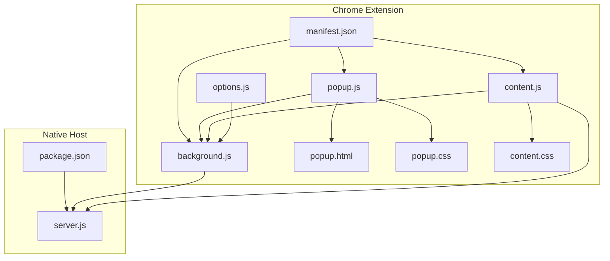
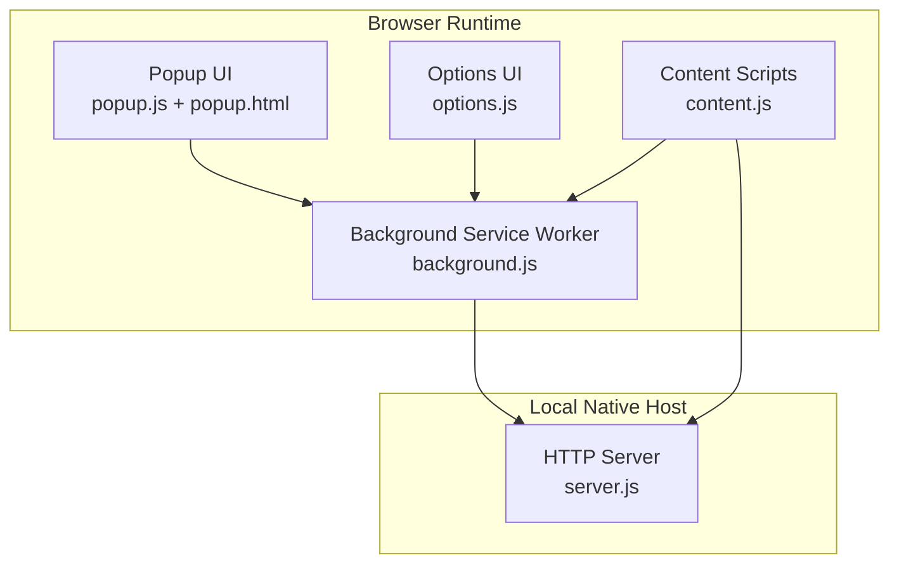
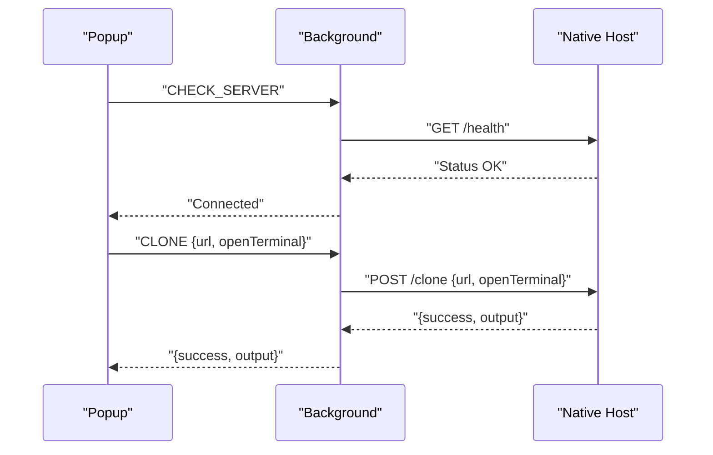
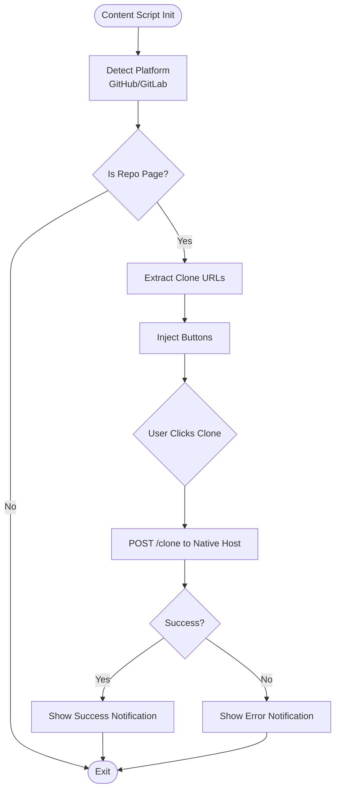
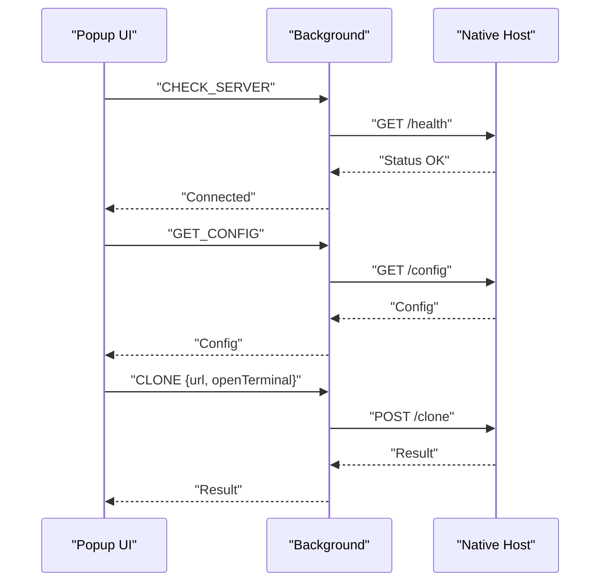
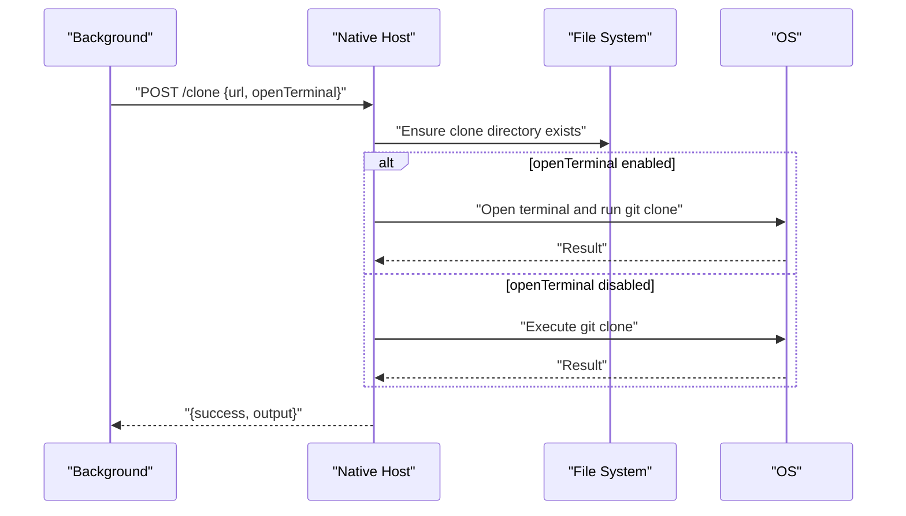
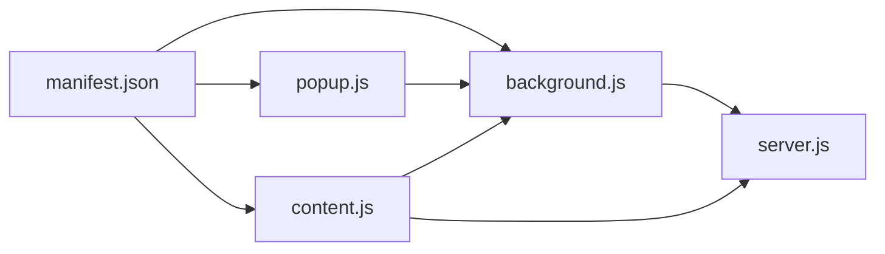

# Extension Architecture

<cite>
**Referenced Files in This Document**
- [manifest.json](file://chrome-extension/manifest.json)
- [background.js](file://chrome-extension/background.js)
- [content.js](file://chrome-extension/content.js)
- [popup.js](file://chrome-extension/popup.js)
- [popup.html](file://chrome-extension/popup.html)
- [options.js](file://chrome-extension/options.js)
- [content.css](file://chrome-extension/content.css)
- [popup.css](file://chrome-extension/popup.css)
- [server.js](file://native-host/server.js)
- [package.json](file://native-host/package.json)
</cite>

## Table of Contents
1. [Introduction](#introduction)
2. [Project Structure](#project-structure)
3. [Core Components](#core-components)
4. [Architecture Overview](#architecture-overview)
5. [Detailed Component Analysis](#detailed-component-analysis)
6. [Dependency Analysis](#dependency-analysis)
7. [Performance Considerations](#performance-considerations)
8. [Security Model and Best Practices](#security-model-and-best-practices)
9. [Troubleshooting Guide](#troubleshooting-guide)
10. [Conclusion](#conclusion)

## Introduction
This document describes the architecture of the Git Magager Chrome extension. It covers the high-level design, including the background service worker, content script injection patterns, and message-passing system. It documents the Manifest V3 configuration, permissions, and security model. It explains component interactions among the background script, content scripts, popup interface, and the native host server. It also details service worker lifecycle management, server communication protocols, cross-origin resource sharing considerations, and provides data flow diagrams and security best practices.

## Project Structure
The project consists of two primary parts:
- Chrome extension (Manifest V3) under chrome-extension/
- Native host server under native-host/



**Diagram sources**
- [manifest.json:1-50](file://chrome-extension/manifest.json#L1-L50)
- [background.js:1-62](file://chrome-extension/background.js#L1-L62)
- [content.js:1-320](file://chrome-extension/content.js#L1-L320)
- [popup.js:1-168](file://chrome-extension/popup.js#L1-L168)
- [options.js:1-56](file://chrome-extension/options.js#L1-L56)
- [popup.html:1-77](file://chrome-extension/popup.html#L1-L77)
- [popup.css:1-264](file://chrome-extension/popup.css#L1-L264)
- [content.css:1-175](file://chrome-extension/content.css#L1-L175)
- [server.js:1-210](file://native-host/server.js#L1-L210)
- [package.json:1-12](file://native-host/package.json#L1-L12)

**Section sources**
- [manifest.json:1-50](file://chrome-extension/manifest.json#L1-L50)
- [background.js:1-62](file://chrome-extension/background.js#L1-L62)
- [content.js:1-320](file://chrome-extension/content.js#L1-L320)
- [popup.js:1-168](file://chrome-extension/popup.js#L1-L168)
- [options.js:1-56](file://chrome-extension/options.js#L1-L56)
- [popup.html:1-77](file://chrome-extension/popup.html#L1-L77)
- [popup.css:1-264](file://chrome-extension/popup.css#L1-L264)
- [content.css:1-175](file://chrome-extension/content.css#L1-L175)
- [server.js:1-210](file://native-host/server.js#L1-L210)
- [package.json:1-12](file://native-host/package.json#L1-L12)

## Core Components
- Background service worker: Handles extension lifecycle, server health checks, and routes clone/config requests to the native host server.
- Content script: Injects UI elements into GitHub/GitLab pages, detects clone URLs, and triggers cloning via the native host server.
- Popup interface: Provides a user-friendly UI to initiate cloning, configure preferences, and manage settings.
- Options page: Allows users to set clone directory, terminal app preference, and whether to open in terminal.
- Native host server: Runs locally on the user’s machine, performs git clone operations, and optionally opens a terminal window.

Key runtime behaviors:
- Manifest V3 defines the service worker, action popup, content scripts, and permissions.
- Message passing uses chrome.runtime.sendMessage and chrome.runtime.onMessage.
- Cross-origin communication is handled via a local HTTP server with CORS headers.

**Section sources**
- [manifest.json:1-50](file://chrome-extension/manifest.json#L1-L50)
- [background.js:1-62](file://chrome-extension/background.js#L1-L62)
- [content.js:1-320](file://chrome-extension/content.js#L1-L320)
- [popup.js:1-168](file://chrome-extension/popup.js#L1-L168)
- [options.js:1-56](file://chrome-extension/options.js#L1-L56)
- [server.js:1-210](file://native-host/server.js#L1-L210)

## Architecture Overview
The extension follows a client-server model:
- The background service worker runs continuously and manages extension-wide state and messaging.
- Content scripts run in page contexts to inject UI and extract repository URLs.
- The popup and options pages communicate with the background via message passing.
- All network operations are proxied through a local native host server, which executes git commands and interacts with the OS.



**Diagram sources**
- [background.js:1-62](file://chrome-extension/background.js#L1-L62)
- [content.js:1-320](file://chrome-extension/content.js#L1-L320)
- [popup.js:1-168](file://chrome-extension/popup.js#L1-L168)
- [options.js:1-56](file://chrome-extension/options.js#L1-L56)
- [server.js:1-210](file://native-host/server.js#L1-L210)

## Detailed Component Analysis

### Background Service Worker
Responsibilities:
- Initializes on extension installation and checks native host server health.
- Listens for messages from popup and content scripts.
- Routes clone and configuration requests to the native host server.
- Returns responses to callers via sendResponse.

Lifecycle:
- Uses chrome.runtime.onInstalled to trigger initial health check.
- Uses chrome.runtime.onMessage to handle asynchronous message dispatch.

Message types handled:
- CHECK_SERVER: Probes server health endpoint.
- CLONE: Sends clone request with URL and optional terminal flag.
- GET_CONFIG: Retrieves persisted configuration.
- SET_CONFIG: Updates configuration and persists to disk.



**Diagram sources**
- [background.js:24-61](file://chrome-extension/background.js#L24-L61)
- [server.js:125-130](file://native-host/server.js#L125-L130)
- [server.js:164-198](file://native-host/server.js#L164-L198)

**Section sources**
- [background.js:1-62](file://chrome-extension/background.js#L1-L62)

### Content Script
Responsibilities:
- Detects GitHub/GitLab repository pages and extracts HTTPS/SSH clone URLs.
- Injects floating and page-integrated buttons to trigger cloning.
- Communicates with the native host server to perform clone operations.
- Provides in-page notifications for success/failure.

Injection strategy:
- Runs at document_idle for specified hosts.
- Prevents double-injection via a global flag.
- Observes DOM mutations and SPA navigation to re-inject UI.



**Diagram sources**
- [content.js:15-109](file://chrome-extension/content.js#L15-L109)
- [content.js:172-245](file://chrome-extension/content.js#L172-L245)
- [content.js:113-150](file://chrome-extension/content.js#L113-L150)
- [server.js:164-198](file://native-host/server.js#L164-L198)

**Section sources**
- [content.js:1-320](file://chrome-extension/content.js#L1-L320)

### Popup Interface
Responsibilities:
- Pre-fills clone URL based on current tab.
- Checks server connectivity and displays appropriate UI sections.
- Converts between HTTPS and SSH URLs.
- Sends clone requests to the background with optional terminal flag.
- Loads and updates configuration via background.



**Diagram sources**
- [popup.js:37-59](file://chrome-extension/popup.js#L37-L59)
- [popup.js:112-137](file://chrome-extension/popup.js#L112-L137)
- [background.js:42-48](file://chrome-extension/background.js#L42-L48)
- [background.js:30-40](file://chrome-extension/background.js#L30-L40)
- [server.js:132-138](file://native-host/server.js#L132-L138)
- [server.js:164-198](file://native-host/server.js#L164-L198)

**Section sources**
- [popup.js:1-168](file://chrome-extension/popup.js#L1-L168)
- [popup.html:1-77](file://chrome-extension/popup.html#L1-L77)

### Options Page
Responsibilities:
- Loads current configuration from background.
- Allows updating clone directory, terminal app, and open-in-terminal preference.
- Persists configuration via background.

```mermaid
sequenceDiagram
participant Opt as "Options"
participant BG as "Background"
participant Server as "Native Host"
Opt->>BG : "GET_CONFIG"
BG->>Server : "GET /config"
Server-->>BG : "Config"
BG-->>Opt : "Config"
Opt->>BG : "SET_CONFIG {config}"
BG->>Server : "POST /config"
Server-->>BG : "{success, config}"
BG-->>Opt : "{success, config}"
```

**Diagram sources**
- [options.js:10-21](file://chrome-extension/options.js#L10-L21)
- [options.js:22-54](file://chrome-extension/options.js#L22-L54)
- [background.js:50-60](file://chrome-extension/background.js#L50-L60)
- [server.js:140-162](file://native-host/server.js#L140-L162)

**Section sources**
- [options.js:1-56](file://chrome-extension/options.js#L1-L56)

### Native Host Server
Responsibilities:
- Serves health, config, and clone endpoints.
- Executes git clone operations in a configured directory.
- Optionally opens a terminal window and runs the clone command inside it.
- Manages configuration persistence in a user-specific JSON file.

Endpoints:
- GET /health: Returns server status.
- GET /config: Returns current configuration.
- POST /config: Updates configuration.
- POST /clone: Performs clone or opens terminal with clone command.

CORS:
- Responds with Access-Control-Allow-Origin for chrome-extension scheme.



**Diagram sources**
- [server.js:164-198](file://native-host/server.js#L164-L198)
- [server.js:45-64](file://native-host/server.js#L45-L64)
- [server.js:66-111](file://native-host/server.js#L66-L111)

**Section sources**
- [server.js:1-210](file://native-host/server.js#L1-L210)
- [package.json:1-12](file://native-host/package.json#L1-L12)

## Dependency Analysis
- Manifest V3 declares:
  - Permissions: storage, activeTab, scripting
  - Host permissions: GitHub, GitLab domains, and localhost/127.0.0.1
  - Service worker entry point
  - Action popup and content scripts
  - Icons and options page
- Background depends on:
  - Local HTTP server availability
  - Message handlers for popup and content scripts
- Content script depends on:
  - Page context for URL detection and DOM injection
  - Local HTTP server for clone operations
- Popup and options depend on:
  - Background for message routing and configuration



**Diagram sources**
- [manifest.json:1-50](file://chrome-extension/manifest.json#L1-L50)
- [background.js:1-62](file://chrome-extension/background.js#L1-L62)
- [content.js:1-320](file://chrome-extension/content.js#L1-L320)
- [server.js:1-210](file://native-host/server.js#L1-L210)

**Section sources**
- [manifest.json:1-50](file://chrome-extension/manifest.json#L1-L50)
- [background.js:1-62](file://chrome-extension/background.js#L1-L62)
- [content.js:1-320](file://chrome-extension/content.js#L1-L320)
- [server.js:1-210](file://native-host/server.js#L1-L210)

## Performance Considerations
- Content script DOM observation uses debounced mutation observers and periodic navigation checks to minimize redundant injections.
- Background message handlers return immediately after initiating fetch requests, allowing asynchronous responses.
- Popup and options pages cache configuration locally and avoid unnecessary network calls.
- Native host server executes git operations synchronously; long-running clones can block the server thread. Consider offloading to worker threads or process managers for scalability.

[No sources needed since this section provides general guidance]

## Security Model and Best Practices
- Manifest V3 permissions:
  - storage: for extension settings
  - activeTab: to read current tab URL for pre-filling
  - scripting: to enable content script injection
- Host permissions:
  - Allowlist specific GitHub and GitLab domains plus localhost/127.0.0.1
- Cross-origin resource sharing:
  - Native host sets Access-Control-Allow-Origin for chrome-extension scheme and allows GET/POST/OPTIONS with Content-Type header
- Sandboxing:
  - Content scripts run in page context with limited permissions; avoid exposing sensitive APIs
  - Background runs in extension context with elevated permissions; keep logic minimal and secure
- Recommendations:
  - Validate and sanitize all inputs before sending to native host
  - Limit exposed endpoints and avoid serving arbitrary content
  - Use HTTPS for any external communications (not applicable here since server is local)
  - Implement rate limiting on clone operations to prevent abuse
  - Store configuration securely and avoid logging sensitive paths

**Section sources**
- [manifest.json:6-18](file://chrome-extension/manifest.json#L6-L18)
- [server.js:113-123](file://native-host/server.js#L113-L123)

## Troubleshooting Guide
Common issues and resolutions:
- Server not running:
  - Popup shows “Server not running” and instructs to start the native host server
  - Verify local server is listening on 127.0.0.1:9456
- Clone failures:
  - Check native host logs for git errors
  - Ensure clone directory exists and is writable
  - Confirm terminal app preferences if opening in terminal
- Content script not injecting:
  - Verify content script matches target hosts
  - Check for double-injection prevention and SPA navigation
- CORS errors:
  - Confirm Access-Control-Allow-Origin header is present
  - Ensure requests originate from chrome-extension context

**Section sources**
- [popup.js:51-59](file://chrome-extension/popup.js#L51-L59)
- [server.js:113-123](file://native-host/server.js#L113-L123)
- [content.js:9-11](file://chrome-extension/content.js#L9-L11)
- [content.js:296-318](file://chrome-extension/content.js#L296-L318)

## Conclusion
Git Magager employs a clean separation of concerns: the background service worker coordinates messaging, the content script integrates with target sites, and the native host server handles system-level operations. The design leverages Manifest V3 capabilities while maintaining a secure, local-first architecture. Following the outlined best practices ensures robustness, performance, and safety across browser environments.