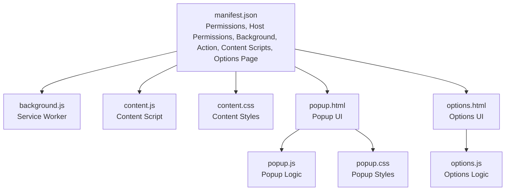
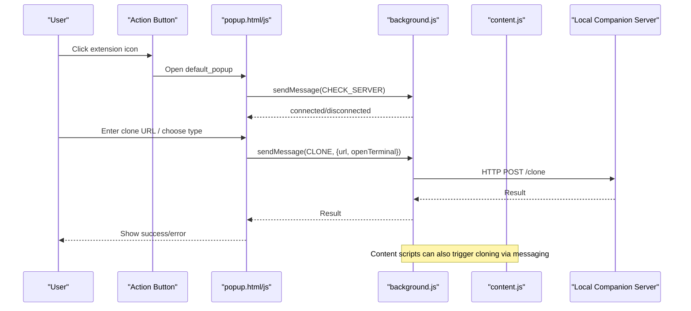
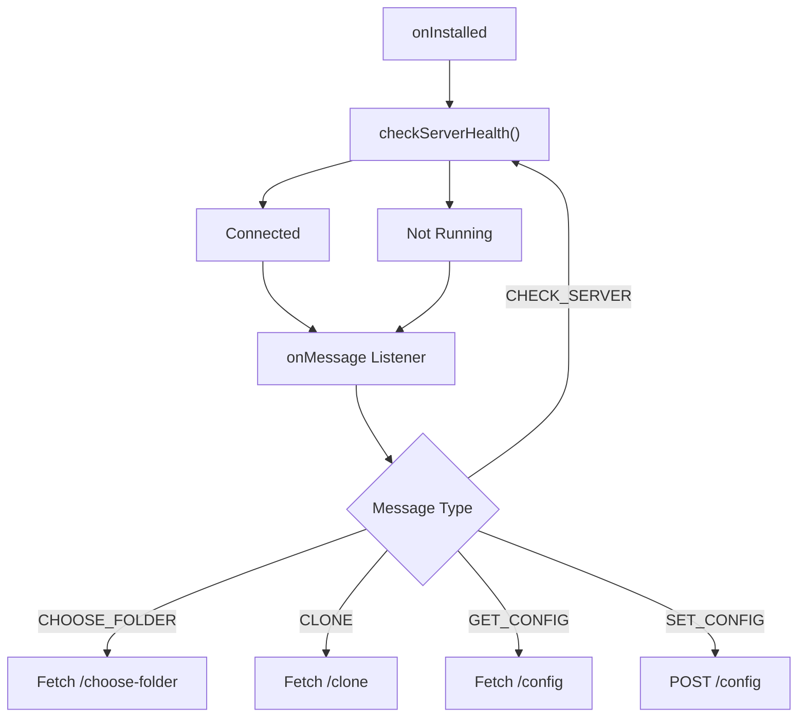
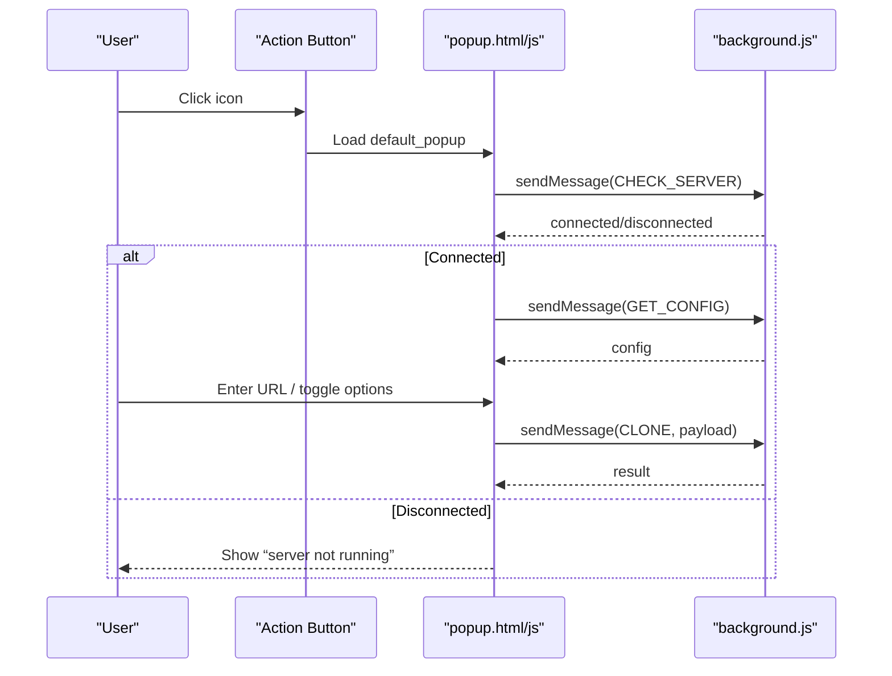
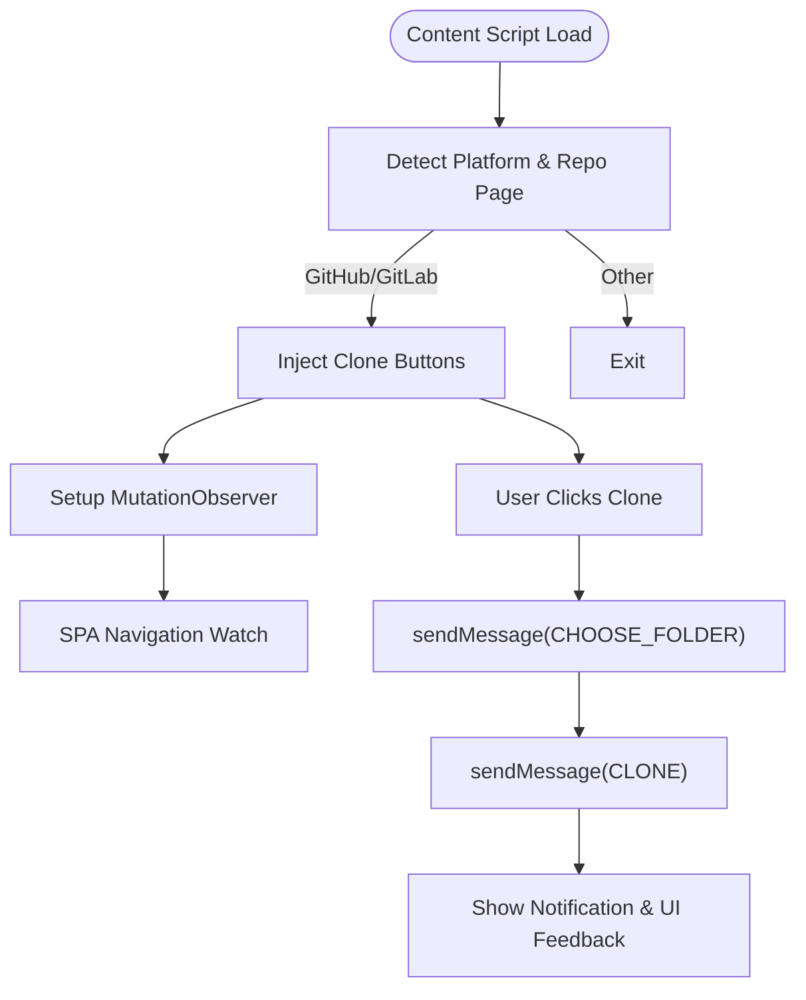
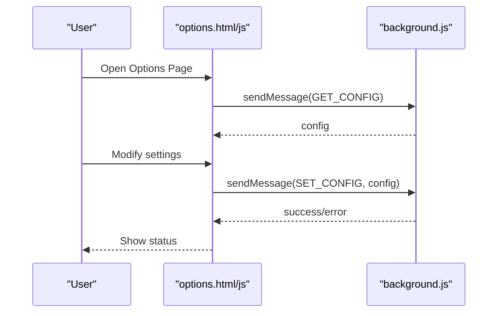
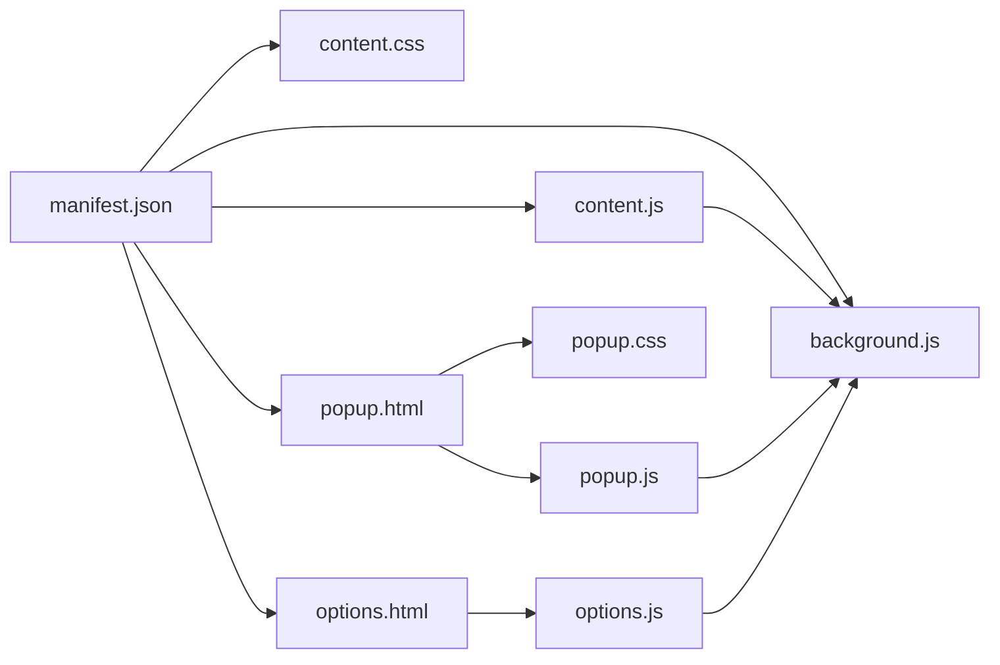

# Manifest Configuration

<cite>
**Referenced Files in This Document**
- [manifest.json](file://chrome-extension/manifest.json)
- [background.js](file://chrome-extension/background.js)
- [content.js](file://chrome-extension/content.js)
- [content.css](file://chrome-extension/content.css)
- [popup.html](file://chrome-extension/popup.html)
- [popup.js](file://chrome-extension/popup.js)
- [popup.css](file://chrome-extension/popup.css)
- [options.html](file://chrome-extension/options.html)
- [options.js](file://chrome-extension/options.js)
</cite>

## Table of Contents
1. [Introduction](#introduction)
2. [Project Structure](#project-structure)
3. [Core Components](#core-components)
4. [Architecture Overview](#architecture-overview)
5. [Detailed Component Analysis](#detailed-component-analysis)
6. [Dependency Analysis](#dependency-analysis)
7. [Performance Considerations](#performance-considerations)
8. [Troubleshooting Guide](#troubleshooting-guide)
9. [Conclusion](#conclusion)

## Introduction
This document provides comprehensive documentation for the Git Magager Chrome extension’s manifest v3 configuration. It explains the permissions model, host permissions for GitHub and GitLab domains, service worker registration, action button configuration, content script injection, and options page setup. It also covers run_at timing, content security policy (CSP) implications, cross-origin resource sharing (CORS) considerations, and best practices for manifest security, permission minimization, and Chrome Web Store submission requirements.

## Project Structure
The extension is organized around a manifest v3 configuration that declares permissions, host permissions, background service worker, action button, content scripts, and static resources. The structure supports:
- A background service worker for messaging and local server communication
- Content scripts injected into GitHub and GitLab pages
- A popup UI for manual cloning and server status
- An options page for configuration persistence

**Diagram sources**
- [manifest.json:1-50](file://chrome-extension/manifest.json#L1-L50)
- [background.js:1-74](file://chrome-extension/background.js#L1-L74)
- [content.js:1-333](file://chrome-extension/content.js#L1-L333)
- [content.css:1-175](file://chrome-extension/content.css#L1-L175)
- [popup.html:1-77](file://chrome-extension/popup.html#L1-L77)
- [popup.js:1-168](file://chrome-extension/popup.js#L1-L168)
- [popup.css:1-264](file://chrome-extension/popup.css#L1-L264)
- [options.html:1-222](file://chrome-extension/options.html#L1-L222)
- [options.js:1-56](file://chrome-extension/options.js#L1-L56)

**Section sources**
- [manifest.json:1-50](file://chrome-extension/manifest.json#L1-L50)

## Core Components
- Manifest v3 declaration: Defines permissions, host permissions, background service worker, action button, content scripts, options page, and icon assets.
- Background service worker: Handles extension lifecycle, server health checks, and inter-component messaging.
- Content script: Detects repository pages, extracts clone URLs, injects UI controls, and coordinates cloning via the background script.
- Popup UI: Provides quick clone actions, server status, and configuration toggles.
- Options UI: Manages persistent settings and displays server connection hints.
- Static assets: Icons, CSS, and HTML resources referenced by the manifest.

**Section sources**
- [manifest.json:1-50](file://chrome-extension/manifest.json#L1-L50)
- [background.js:1-74](file://chrome-extension/background.js#L1-L74)
- [content.js:1-333](file://chrome-extension/content.js#L1-L333)
- [popup.html:1-77](file://chrome-extension/popup.html#L1-L77)
- [popup.js:1-168](file://chrome-extension/popup.js#L1-L168)
- [options.html:1-222](file://chrome-extension/options.html#L1-L222)
- [options.js:1-56](file://chrome-extension/options.js#L1-L56)

## Architecture Overview
The extension follows a classic MV3 architecture:
- The manifest registers a service worker as the background script.
- Content scripts run on target domains to enhance UI and extract data.
- The action button opens a popup for user interaction.
- Messaging bridges the popup, content scripts, and background script to coordinate cloning operations.

**Diagram sources**
- [manifest.json:19-29](file://chrome-extension/manifest.json#L19-L29)
- [popup.js:37-59](file://chrome-extension/popup.js#L37-L59)
- [popup.js:94-149](file://chrome-extension/popup.js#L94-L149)
- [background.js:24-73](file://chrome-extension/background.js#L24-L73)

## Detailed Component Analysis

### Manifest v3 Structure and Permissions
- Manifest version: 3
- Name, version, description: Human-readable metadata
- Permissions:
  - storage: Enables persistent settings and configuration
  - activeTab: Allows access to the currently active tab for URL detection and UI enhancement
  - scripting: Required for programmatic content script injection and DOM manipulation
- Host permissions:
  - GitHub: https://github.com/*
  - GitLab: https://gitlab.com/* and subdomains
  - Local development: http://localhost:* and http://127.0.0.1:*
- Background:
  - Service worker registered at background.js
- Action:
  - default_popup: popup.html
  - default_icon: 16x16, 48x48, 128x128 PNG icons
- Content scripts:
  - Matches GitHub and GitLab domains
  - Injects content.js and content.css
  - run_at: document_idle
- Options page:
  - options.html as the options page
- Icons:
  - Declares 16x16, 48x48, 128x128 PNG icons

Security model:
- Permissions are minimal and scoped to required capabilities.
- Host permissions are restricted to target domains and localhost for development.
- CSP is enforced by Chrome; inline scripts/styles must be allowed via manifest or CSP policies.

**Section sources**
- [manifest.json:1-50](file://chrome-extension/manifest.json#L1-L50)

### Service Worker Registration and Lifecycle
- Registers as a service worker via background.service_worker.
- Listens for extension installation to perform initial server health checks.
- Exposes message handlers for:
  - CHECK_SERVER: Verifies local companion server availability
  - CHOOSE_FOLDER: Requests a folder path from the native host
  - CLONE: Initiates cloning via the native host
  - GET_CONFIG and SET_CONFIG: Reads/writes persistent configuration

**Diagram sources**
- [background.js:6-21](file://chrome-extension/background.js#L6-L21)
- [background.js:24-73](file://chrome-extension/background.js#L24-L73)

**Section sources**
- [background.js:1-74](file://chrome-extension/background.js#L1-L74)

### Action Button Configuration (Popup and Icons)
- default_popup: popup.html
- default_icon: 16x16, 48x48, 128x128 PNG icons
- The popup UI:
  - Displays server status and shows either clone controls or a “server not running” notice
  - Pre-fills clone URL based on the active tab’s URL for GitHub/GitLab
  - Supports HTTPS/SSH conversion and terminal toggling
  - Opens options page via a link inside the popup

**Diagram sources**
- [manifest.json:22-29](file://chrome-extension/manifest.json#L22-L29)
- [popup.html:1-77](file://chrome-extension/popup.html#L1-L77)
- [popup.js:37-59](file://chrome-extension/popup.js#L37-L59)
- [popup.js:94-149](file://chrome-extension/popup.js#L94-L149)
- [background.js:24-73](file://chrome-extension/background.js#L24-L73)

**Section sources**
- [manifest.json:22-29](file://chrome-extension/manifest.json#L22-L29)
- [popup.html:1-77](file://chrome-extension/popup.html#L1-L77)
- [popup.js:1-168](file://chrome-extension/popup.js#L1-L168)

### Content Script Injection Settings
- Matches: GitHub and GitLab domains (including subdomains)
- JS: content.js
- CSS: content.css
- run_at: document_idle
- Behavior:
  - Detects platform and repository pages
  - Extracts HTTPS/SSH clone URLs
  - Injects floating and page-integrated buttons
  - Uses mutation observers and SPA navigation detection to re-inject UI
  - Communicates with the background script for folder selection and cloning

**Diagram sources**
- [manifest.json:30-42](file://chrome-extension/manifest.json#L30-L42)
- [content.js:13-107](file://chrome-extension/content.js#L13-L107)
- [content.js:185-258](file://chrome-extension/content.js#L185-L258)
- [content.js:262-292](file://chrome-extension/content.js#L262-L292)
- [content.js:296-332](file://chrome-extension/content.js#L296-L332)

**Section sources**
- [manifest.json:30-42](file://chrome-extension/manifest.json#L30-L42)
- [content.js:1-333](file://chrome-extension/content.js#L1-L333)
- [content.css:1-175](file://chrome-extension/content.css#L1-L175)

### Options Page Setup
- options.html defines the settings UI with:
  - Default clone directory
  - Terminal application selection
  - Toggle for opening terminal after clone
  - Server info section
- options.js:
  - Loads current configuration via messaging
  - Saves configuration via messaging
  - Displays success/error feedback

**Diagram sources**
- [manifest.json:43](file://chrome-extension/manifest.json#L43)
- [options.html:1-222](file://chrome-extension/options.html#L1-L222)
- [options.js:3-54](file://chrome-extension/options.js#L3-L54)
- [background.js:54-72](file://chrome-extension/background.js#L54-L72)

**Section sources**
- [manifest.json:43](file://chrome-extension/manifest.json#L43)
- [options.html:1-222](file://chrome-extension/options.html#L1-L222)
- [options.js:1-56](file://chrome-extension/options.js#L1-L56)

### CSP Implications and Cross-Origin Resource Sharing
- Content Security Policy:
  - Inline scripts/styles are allowed via manifest-declared permissions and CSP policies.
  - The extension uses external stylesheets and inline styles within popup and options pages.
- Cross-origin resource sharing:
  - Host permissions are declared for GitHub and GitLab domains.
  - Local development host permissions include localhost and 127.0.0.1.
  - The background script communicates with a local companion server over HTTP; ensure the server responds with appropriate CORS headers if accessed from popup or content contexts.

Best practices:
- Prefer external stylesheets and scripts referenced by manifest.
- Avoid inline event handlers; attach listeners programmatically.
- Use secure origins for production; localhost is acceptable for development.

**Section sources**
- [manifest.json:11-18](file://chrome-extension/manifest.json#L11-L18)
- [background.js:30-72](file://chrome-extension/background.js#L30-L72)

## Dependency Analysis
- Manifest to components:
  - manifest.json -> background.js (service worker)
  - manifest.json -> content.js and content.css (content scripts)
  - manifest.json -> popup.html and popup.css (action popup)
  - manifest.json -> options.html (options page)
- Runtime dependencies:
  - background.js depends on messaging APIs and local server endpoints
  - content.js depends on DOM APIs and messaging to background
  - popup.js and options.js depend on messaging to background

**Diagram sources**
- [manifest.json:1-50](file://chrome-extension/manifest.json#L1-L50)
- [background.js:1-74](file://chrome-extension/background.js#L1-L74)
- [content.js:1-333](file://chrome-extension/content.js#L1-L333)
- [popup.html:1-77](file://chrome-extension/popup.html#L1-L77)
- [popup.js:1-168](file://chrome-extension/popup.js#L1-L168)
- [options.html:1-222](file://chrome-extension/options.html#L1-L222)
- [options.js:1-56](file://chrome-extension/options.js#L1-L56)

**Section sources**
- [manifest.json:1-50](file://chrome-extension/manifest.json#L1-L50)

## Performance Considerations
- run_at timing: Using document_idle reduces early DOM contention and ensures content scripts run after the page is mostly ready.
- MutationObserver and SPA navigation: Content script re-injection is debounced to minimize repeated work during navigation.
- Messaging batching: Group related operations (e.g., folder selection and clone) to reduce round-trips.
- Icon sizes: Provide appropriately sized icons to avoid scaling overhead.

[No sources needed since this section provides general guidance]

## Troubleshooting Guide
- Server not running:
  - The popup shows a “server not running” section and instructs to start the companion server.
  - The background script performs a health check on install and on demand.
- Clone failures:
  - The popup and content script display error notifications and revert UI state.
  - Verify the local server is reachable and responding to /clone, /choose-folder, and /config endpoints.
- Permission errors:
  - Ensure storage, activeTab, and scripting permissions are granted.
  - Confirm host permissions include the target domains and localhost for development.
- CSP violations:
  - Avoid inline scripts/styles; use external resources referenced by the manifest.
  - Validate CSP policies for any additional content or frames.

**Section sources**
- [popup.html:55-66](file://chrome-extension/popup.html#L55-L66)
- [popup.js:54-59](file://chrome-extension/popup.js#L54-L59)
- [background.js:11-21](file://chrome-extension/background.js#L11-L21)
- [content.js:150-156](file://chrome-extension/content.js#L150-L156)

## Conclusion
Git Magager’s manifest v3 configuration is designed for minimal permissions and focused functionality. It enables secure, targeted enhancements on GitHub and GitLab while delegating cloning operations to a local companion server. The architecture balances user convenience with security through careful permission scoping, CSP-compliant asset loading, and robust messaging between components.