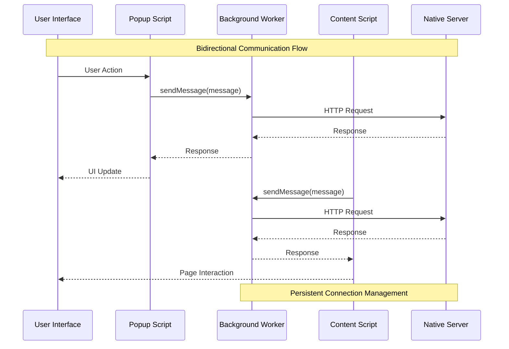
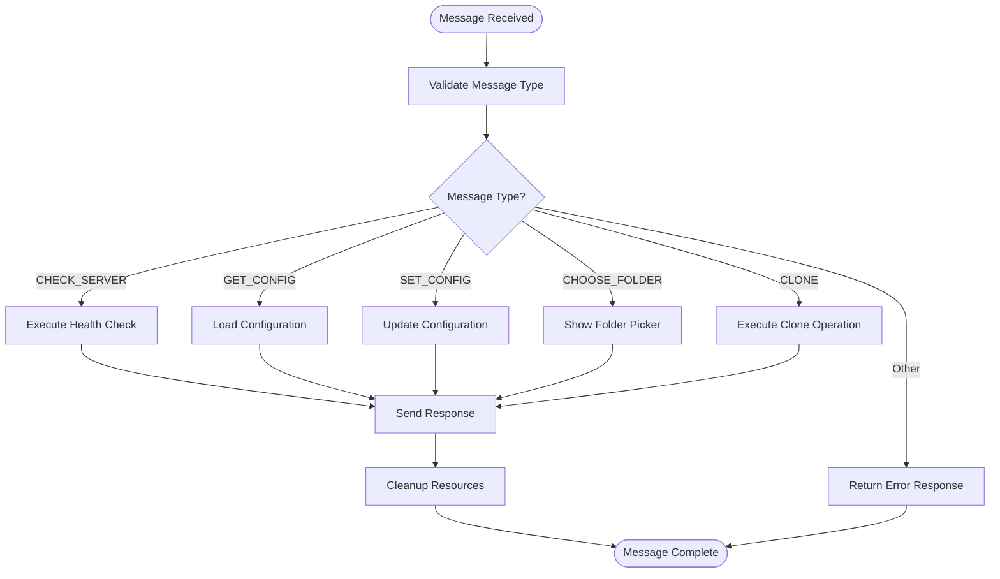
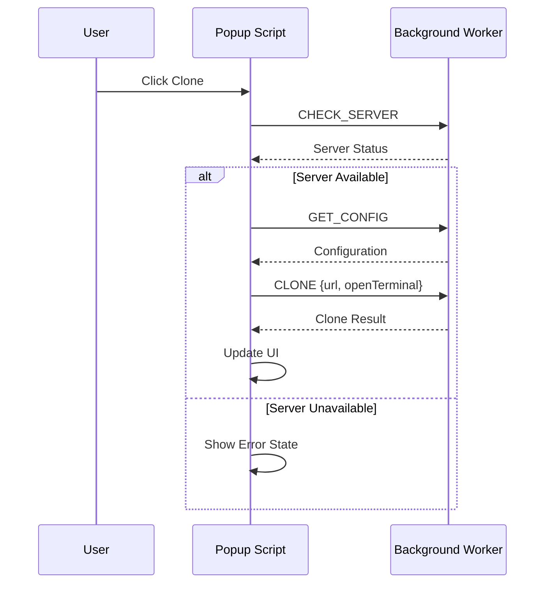
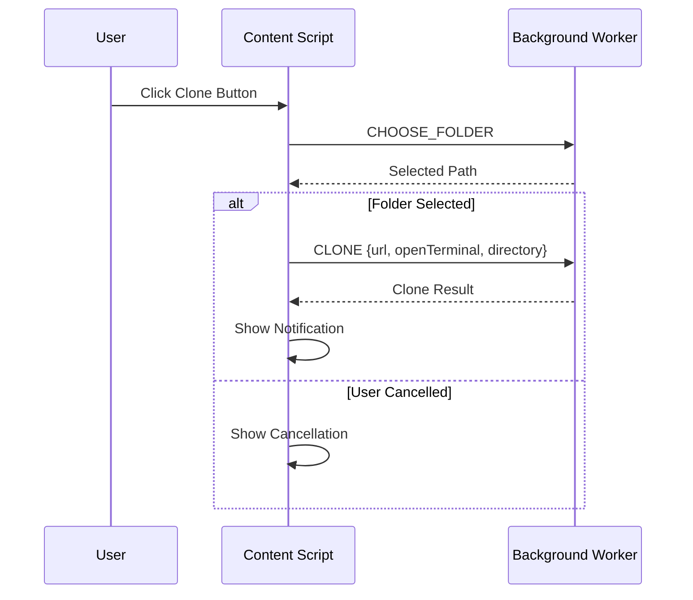
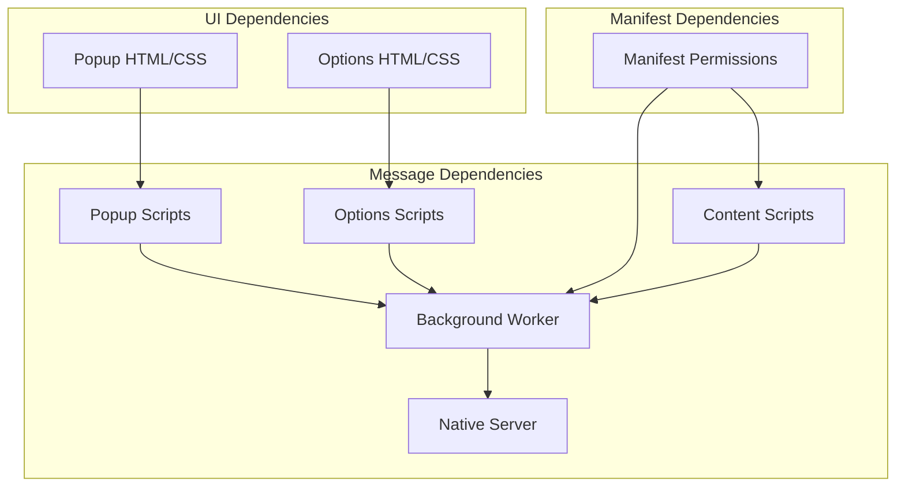

# Message Passing System

<cite>
**Referenced Files in This Document**
- [background.js](file://chrome-extension/background.js)
- [content.js](file://chrome-extension/content.js)
- [popup.js](file://chrome-extension/popup.js)
- [options.js](file://chrome-extension/options.js)
- [manifest.json](file://chrome-extension/manifest.json)
- [popup.html](file://chrome-extension/popup.html)
- [options.html](file://chrome-extension/options.html)
- [server.js](file://native-host/server.js)
</cite>

## Table of Contents
1. [Introduction](#introduction)
2. [Project Structure](#project-structure)
3. [Core Components](#core-components)
4. [Architecture Overview](#architecture-overview)
5. [Detailed Component Analysis](#detailed-component-analysis)
6. [Dependency Analysis](#dependency-analysis)
7. [Performance Considerations](#performance-considerations)
8. [Security Considerations](#security-considerations)
9. [Debugging Guide](#debugging-guide)
10. [Best Practices](#best-practices)
11. [Conclusion](#conclusion)

## Introduction

This document provides comprehensive documentation for the Chrome extension message passing architecture used in the Git Magager extension. The system enables bidirectional communication between background scripts, popup interfaces, and content scripts, facilitating seamless git repository cloning workflows across GitHub and GitLab platforms.

The message passing system operates through Chrome's messaging APIs, with a native host server providing backend functionality for repository cloning and system integration. This architecture supports asynchronous message processing, robust error handling, and secure cross-origin communication patterns.

## Project Structure

The Git Magager extension follows a modular architecture with distinct components handling different aspects of the cloning workflow:

```mermaid
graph TB
subgraph "Chrome Extension"
BG[Background Service Worker]
POP[Popup Interface]
CS[Content Scripts]
OPT[Options Page]
end
subgraph "Native Host"
NS[Native Server]
end
subgraph "External Services"
GH[GitHub]
GL[GitLab]
GIT[Git Commands]
end
POP < --> BG
CS < --> BG
OPT < --> BG
BG --> NS
NS --> GIT
CS --> GH
CS --> GL
```

**Diagram sources**
- [background.js:1-74](file://chrome-extension/background.js#L1-L74)
- [content.js:1-333](file://chrome-extension/content.js#L1-L333)
- [popup.js:1-168](file://chrome-extension/popup.js#L1-L168)
- [options.js:1-56](file://chrome-extension/options.js#L1-L56)

**Section sources**
- [manifest.json:1-50](file://chrome-extension/manifest.json#L1-L50)

## Core Components

The message passing system consists of four primary components that communicate through structured message protocols:

### Background Service Worker
The central coordinator that handles all external communications and message routing. It maintains persistent connections and manages the native host server integration.

### Popup Interface
Provides user interaction for manual cloning operations, displaying server status and handling user input for repository URLs and preferences.

### Content Scripts
Inject interactive elements into target web pages (GitHub/GitLab) and handle automatic cloning triggers from page context.

### Options Page
Manages configuration settings and provides access to extension preferences.

**Section sources**
- [background.js:23-73](file://chrome-extension/background.js#L23-L73)
- [popup.js:37-59](file://chrome-extension/popup.js#L37-L59)
- [content.js:111-163](file://chrome-extension/content.js#L111-L163)

## Architecture Overview

The message passing architecture implements a unidirectional service worker model with bidirectional communication channels:



**Diagram sources**
- [background.js:24-72](file://chrome-extension/background.js#L24-L72)
- [popup.js:39](file://chrome-extension/popup.js#L39)
- [content.js:122](file://chrome-extension/content.js#L122)

The architecture supports three primary communication patterns:
- Popup-to-background messaging for user-initiated operations
- Content script-to-background messaging for page-integrated actions
- Background-to-native server communication for system-level operations

## Detailed Component Analysis

### Message Types and Payload Structures

The system defines several standardized message types with specific payload requirements:

#### Server Health Messages
- **Type**: `CHECK_SERVER`
- **Direction**: Popup → Background
- **Payload**: None required
- **Response**: Boolean indicating server connectivity

#### Configuration Management Messages
- **Type**: `GET_CONFIG`
- **Direction**: Popup/Options → Background
- **Payload**: None required
- **Response**: Configuration object with clone directory, terminal preferences, and open-in-terminal setting

- **Type**: `SET_CONFIG`
- **Direction**: Options → Background
- **Payload**: Configuration object containing updated settings
- **Response**: Success/failure indicator with error details if applicable

#### Repository Operations Messages
- **Type**: `CHOOSE_FOLDER`
- **Direction**: Content Script → Background
- **Payload**: Optional default path specification
- **Response**: Selected folder path or cancellation indication

- **Type**: `CLONE`
- **Direction**: Popup/Content Script → Background
- **Payload**: Repository URL, terminal preference, and optional directory override
- **Response**: Operation result with success status and completion details

**Section sources**
- [background.js:24-72](file://chrome-extension/background.js#L24-L72)
- [popup.js:47](file://chrome-extension/popup.js#L47)
- [content.js:122](file://chrome-extension/content.js#L122)

### Asynchronous Message Processing

The message system implements robust asynchronous processing with proper promise handling and error propagation:



**Diagram sources**
- [background.js:24-72](file://chrome-extension/background.js#L24-L72)

### Response Handling Mechanisms

Each message type implements specific response handling patterns:

#### Success Responses
- Consistent success object structure: `{ success: true, ...data }`
- Data payload varies by operation type
- UI updates occur immediately upon successful response

#### Error Responses
- Standardized error structure: `{ success: false, error: "message" }`
- Cancellation scenarios return `{ cancelled: true }`
- Network errors propagate through the message chain

#### Timeout Management
The system relies on Chrome's built-in message timeout handling, with typical timeouts of 30 seconds for long-running operations like repository cloning.

**Section sources**
- [background.js:38](file://chrome-extension/background.js#L38)
- [background.js:50](file://chrome-extension/background.js#L50)
- [content.js:124](file://chrome-extension/content.js#L124)

### Component-Specific Message Flows

#### Popup Interface Message Flow
The popup interface coordinates multiple sequential operations during user-initiated cloning:



**Diagram sources**
- [popup.js:39](file://chrome-extension/popup.js#L39)
- [popup.js:112](file://chrome-extension/popup.js#L112)

#### Content Script Integration Flow
Content scripts provide automatic cloning capabilities integrated into target web pages:



**Diagram sources**
- [content.js:122](file://chrome-extension/content.js#L122)
- [content.js:140](file://chrome-extension/content.js#L140)

**Section sources**
- [popup.js:94-149](file://chrome-extension/popup.js#L94-L149)
- [content.js:111-163](file://chrome-extension/content.js#L111-L163)

## Dependency Analysis

The message passing system exhibits clear dependency relationships between components:



**Diagram sources**
- [manifest.json:6-18](file://chrome-extension/manifest.json#L6-L18)
- [background.js:1-74](file://chrome-extension/background.js#L1-L74)

Key dependency characteristics:
- **Cohesion**: Each component maintains focused responsibilities
- **Coupling**: Minimal direct coupling between UI and background logic
- **Persistence**: Background worker maintains state across UI interactions
- **Asynchronous**: All communication occurs asynchronously to prevent blocking

**Section sources**
- [manifest.json:19-42](file://chrome-extension/manifest.json#L19-L42)

## Performance Considerations

### Message Processing Optimization

The system implements several performance optimization strategies:

#### Debouncing and Throttling
- Content script DOM mutation observers use 500ms debounce intervals
- Navigation event detection employs 1-second polling intervals
- Input validation prevents unnecessary message processing

#### Resource Management
- Window-scoped variables prevent duplicate script injection
- Mutation observers are properly cleaned up on component removal
- Event listeners are removed when components are destroyed

#### Memory Efficiency
- Message handlers return `true` for asynchronous responses to keep message ports alive
- Temporary DOM elements are removed after animations complete
- Configuration objects are cached to minimize storage operations

### Network Performance

#### Connection Management
- Single persistent connection to native server reduces overhead
- Batch related operations where possible
- Efficient JSON serialization minimizes payload sizes

#### Timeout Strategies
- Appropriate timeout values balance responsiveness with reliability
- Graceful degradation when network requests fail
- Progressive UI updates provide immediate feedback

## Security Considerations

### Message Validation and Sanitization

The system implements multiple layers of security validation:

#### Origin Verification
- All message handlers validate incoming messages through structured patterns
- Background worker acts as a central gatekeeper for external operations
- Content scripts operate within restricted contexts with validated permissions

#### Data Validation
- All external HTTP requests validate input parameters
- Configuration updates merge safely with existing settings
- Error responses sanitize potentially sensitive information

#### Permission Management
- Manifest defines minimal required permissions
- Host permissions are scoped to target domains only
- Storage access is limited to extension-managed data

### Cross-Origin Security

#### Native Host Communication
- Localhost-only server restricts external access
- CORS headers are configured for internal communication only
- Input escaping prevents command injection attacks

#### Content Script Security
- Strict Content Security Policy compliance
- DOM manipulation through validated selectors only
- Event listener cleanup prevents memory leaks

**Section sources**
- [manifest.json:6-18](file://chrome-extension/manifest.json#L6-L18)
- [server.js:137-155](file://native-host/server.js#L137-L155)

## Debugging Guide

### Common Message Flow Issues

#### Message Not Received
- Verify message type constants match between sender and receiver
- Check that message handlers return `true` for asynchronous responses
- Ensure proper error handling in promise chains

#### Response Format Errors
- Confirm all responses follow the standardized success/error patterns
- Validate payload structures match expected schemas
- Check for missing required fields in response objects

#### Timeout Problems
- Monitor long-running operations for proper completion handling
- Implement appropriate progress indicators for extended operations
- Consider breaking large operations into smaller, cancellable steps

### Debugging Tools and Techniques

#### Browser Developer Tools
- Use Chrome DevTools to inspect message traffic in background page
- Monitor network requests to native server for timing issues
- Check console logs for error messages and stack traces

#### Extension-Specific Debugging
- Enable developer mode and load unpacked extension for testing
- Use extension page inspection to debug popup and content script issues
- Monitor storage operations for configuration-related problems

#### Logging Strategy
- Implement structured logging for all message operations
- Capture timestamps for performance analysis
- Log error conditions with sufficient context for debugging

**Section sources**
- [background.js:11](file://chrome-extension/background.js#L11)
- [content.js:150](file://chrome-extension/content.js#L150)

## Best Practices

### Message Design Patterns

#### Consistent Message Structure
- Always include a `type` field identifying the operation
- Use standardized payload and response formats
- Implement comprehensive error handling with descriptive messages

#### Asynchronous Pattern Compliance
- Return `true` from message handlers for asynchronous responses
- Use proper promise chaining for complex operations
- Implement timeout handling for long-running tasks

#### Error Propagation
- Maintain consistent error response formats across all operations
- Provide meaningful error messages while avoiding sensitive information
- Implement retry logic for transient failures

### Performance Optimization

#### Message Batching
- Combine related operations where possible to reduce message overhead
- Implement caching strategies for frequently accessed data
- Minimize DOM manipulations through efficient update patterns

#### Resource Management
- Clean up event listeners and observers appropriately
- Implement proper resource disposal in component lifecycle
- Monitor memory usage and optimize data structures

### Security Implementation

#### Input Validation
- Validate all external inputs rigorously
- Sanitize data before processing or storage
- Implement rate limiting for sensitive operations

#### Access Control
- Limit permissions to minimum required scope
- Implement proper authentication for external services
- Regular security audits of message handling logic

## Conclusion

The Git Magager extension demonstrates a sophisticated message passing architecture that effectively coordinates multiple extension components while maintaining security and performance standards. The system successfully implements bidirectional communication patterns between background scripts, popup interfaces, and content scripts, enabling seamless user experiences across GitHub and GitLab platforms.

Key architectural strengths include:
- Clear separation of concerns with well-defined message boundaries
- Robust asynchronous processing with proper error handling
- Comprehensive security measures including input validation and permission management
- Efficient resource utilization through careful memory and network management

The implementation serves as a practical example of modern Chrome extension architecture, providing a foundation for similar collaborative development tools. The documented patterns and best practices can be adapted for other extension development scenarios requiring complex inter-component communication.

Future enhancements could include message encryption for sensitive operations, enhanced monitoring and analytics, and expanded support for additional version control platforms.