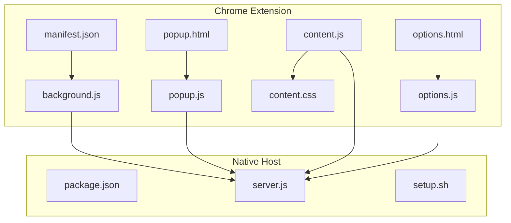
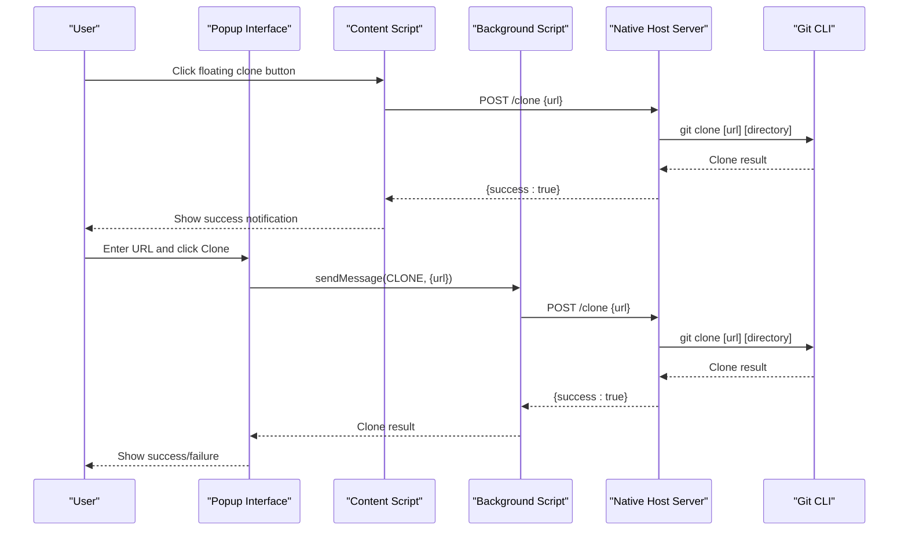

# Getting Started

<cite>
**Referenced Files in This Document**
- [README.md](file://README.md)
- [manifest.json](file://chrome-extension/manifest.json)
- [background.js](file://chrome-extension/background.js)
- [popup.html](file://chrome-extension/popup.html)
- [popup.js](file://chrome-extension/popup.js)
- [content.js](file://chrome-extension/content.js)
- [content.css](file://chrome-extension/content.css)
- [options.html](file://chrome-extension/options.html)
- [options.js](file://chrome-extension/options.js)
- [package.json](file://native-host/package.json)
- [server.js](file://native-host/server.js)
- [setup.sh](file://native-host/setup.sh)
</cite>

## Table of Contents
1. [Introduction](#introduction)
2. [Project Structure](#project-structure)
3. [System Requirements](#system-requirements)
4. [Installation](#installation)
5. [Initial Configuration](#initial-configuration)
6. [Basic Usage](#basic-usage)
7. [Architecture Overview](#architecture-overview)
8. [Troubleshooting Guide](#troubleshooting-guide)
9. [Conclusion](#conclusion)

## Introduction
Git Magager is a Chrome extension that enables one-click cloning of repositories from GitHub and GitLab directly from your browser. It consists of two main components:
- A Chrome extension that injects clone buttons into repository pages and provides a popup interface
- A native host server that performs the actual Git operations locally

The extension works by communicating with a local companion server that executes Git commands and manages repository cloning.

**Section sources**
- [README.md:1-3](file://README.md#L1-L3)

## Project Structure
The project is organized into two primary components:



**Diagram sources**
- [manifest.json:1-50](file://chrome-extension/manifest.json#L1-L50)
- [background.js:1-62](file://chrome-extension/background.js#L1-L62)
- [server.js:1-210](file://native-host/server.js#L1-L210)

**Section sources**
- [manifest.json:1-50](file://chrome-extension/manifest.json#L1-L50)
- [package.json:1-12](file://native-host/package.json#L1-L12)

## System Requirements
Git Magager requires the following system components:

### Browser Compatibility
- Google Chrome (recommended)
- Chromium-based browsers
- Manifest V3 compatible browsers

### Local Environment
- **Node.js**: Required for the native host server
- **Git CLI**: Must be installed and available in PATH
- **macOS**: Native host includes launchd service support
- **Windows/Linux**: Native host can run manually (requires Node.js)

### Network Requirements
- Local loopback interface (127.0.0.1)
- Port 9456 availability for the native host server

**Section sources**
- [manifest.json:11-18](file://chrome-extension/manifest.json#L11-L18)
- [server.js:7](file://native-host/server.js#L7)
- [setup.sh:15-21](file://native-host/setup.sh#L15-L21)

## Installation

### Step 1: Install Node.js and Git
1. Download and install Node.js from [nodejs.org](https://nodejs.org/)
2. Verify installation:
   ```bash
   node --version
   npm --version
   ```
3. Install Git CLI from [git-scm.com](https://git-scm.com/)
4. Verify Git installation:
   ```bash
   git --version
   ```

### Step 2: Launch the Native Host Server
Navigate to the native-host directory and start the server:

```bash
cd native-host
npm start
```

The server will listen on `http://127.0.0.1:9456` and automatically create a default configuration file at `~/.git-magager.json`.

### Step 3: Install the Chrome Extension
1. Open Chrome and navigate to `chrome://extensions`
2. Enable "Developer mode" (top right corner)
3. Click "Load unpacked"
4. Select the `chrome-extension` folder
5. Pin the extension icon for easy access

### Step 4: Configure Auto-Start (macOS)
Run the setup script to configure launchd service:

```bash
cd native-host
./setup.sh
```

This creates a launchd service that automatically starts the server when your Mac boots.

**Section sources**
- [setup.sh:15-21](file://native-host/setup.sh#L15-L21)
- [setup.sh:41-82](file://native-host/setup.sh#L41-L82)
- [setup.sh:96-102](file://native-host/setup.sh#L96-L102)

## Initial Configuration

### Default Configuration
The first time you run the native host, it creates a default configuration file at `~/.git-magager.json`:

```json
{
  "cloneDirectory": "~/Projects",
  "openInTerminal": true,
  "terminalApp": "Terminal"
}
```

### Accessing Settings
1. Click the Git Magager icon in Chrome
2. Click "Settings" in the popup
3. Or go to `chrome://extensions` and click "Options" for Git Magager

### Configuration Options
- **Clone Directory**: Default location for cloned repositories
- **Open in Terminal**: Automatically open terminal after cloning
- **Terminal Application**: Choose between macOS Terminal, iTerm2, or Warp

**Section sources**
- [server.js:10-27](file://native-host/server.js#L10-L27)
- [options.html:176-204](file://chrome-extension/options.html#L176-L204)
- [options.js:22-31](file://chrome-extension/options.js#L22-L31)

## Basic Usage

### Method 1: Using Floating Clone Buttons
1. Navigate to a GitHub or GitLab repository page
2. Look for the floating clone button (purple button with "Clone" text) in the bottom-right corner
3. Click the button to reveal HTTPS/SSH options
4. Select your preferred protocol and click "Clone"

### Method 2: Using the Popup Interface
1. Click the Git Magager icon in Chrome
2. Enter the repository URL or use the pre-filled URL from the current page
3. Choose HTTPS or SSH protocol
4. Toggle "Open in Terminal" if desired
5. Click "Clone Now"

### Method 3: Using GitHub Page Button
On GitHub repository pages, you'll see an "Instant Clone" button integrated into the page UI. Click this button to clone the current repository.

**Section sources**
- [content.js:172-245](file://chrome-extension/content.js#L172-L245)
- [content.js:249-279](file://chrome-extension/content.js#L249-L279)
- [popup.html:24-53](file://chrome-extension/popup.html#L24-L53)
- [popup.js:94-149](file://chrome-extension/popup.js#L94-L149)

## Architecture Overview



**Diagram sources**
- [content.js:113-150](file://chrome-extension/content.js#L113-L150)
- [popup.js:112-117](file://chrome-extension/popup.js#L112-L117)
- [background.js:30-40](file://chrome-extension/background.js#L30-L40)
- [server.js:164-198](file://native-host/server.js#L164-L198)

The system architecture follows a client-server model:
- **Chrome Extension**: Provides user interface and browser integration
- **Native Host Server**: Executes Git operations with elevated permissions
- **Git CLI**: Performs actual repository cloning

**Section sources**
- [background.js:11-21](file://chrome-extension/background.js#L11-L21)
- [server.js:113-203](file://native-host/server.js#L113-L203)

## Troubleshooting Guide

### Common Issues and Solutions

#### Issue: Server Not Running
**Symptoms**: Popup shows "Local server not running" message
**Solution**:
1. Start the native host server: `cd native-host && npm start`
2. Verify server is running: `curl http://127.0.0.1:9456/health`
3. Check logs: `tail -f ~/.git-magager.log`

#### Issue: Permission Denied
**Symptoms**: Clone fails with permission errors
**Solution**:
1. Ensure Git CLI is installed and accessible: `git --version`
2. Check clone directory permissions: `ls -la ~/Projects`
3. Update clone directory in settings if needed

#### Issue: Extension Not Loading
**Symptoms**: Extension icon missing or shows loading state
**Solution**:
1. Enable Developer mode in Chrome extensions
2. Reload the extension
3. Check for error messages in `chrome://extensions`

#### Issue: Floating Button Not Appearing
**Symptoms**: No clone button on repository pages
**Solution**:
1. Verify you're on a supported GitHub/GitLab page
2. Check that the extension has permission to access the site
3. Refresh the page to trigger content script injection

#### Issue: Terminal Not Opening
**Symptoms**: "Open in Terminal" option doesn't work
**Solution**:
1. Verify terminal application is installed (Terminal/iTerm2/Warp)
2. Check terminal permissions in System Preferences
3. Test terminal accessibility: `osascript -e 'tell application "Terminal" to do script "echo test"'`

**Section sources**
- [popup.html:55-66](file://chrome-extension/popup.html#L55-L66)
- [setup.sh:84-91](file://native-host/setup.sh#L84-L91)
- [server.js:164-198](file://native-host/server.js#L164-L198)

## Conclusion
Git Magager provides a seamless way to clone repositories directly from your browser without leaving the development workflow. The combination of a user-friendly Chrome extension interface and a reliable native host server makes repository management efficient and accessible.

Key benefits:
- One-click cloning from GitHub and GitLab
- Automatic URL detection and protocol switching
- Flexible configuration options
- Terminal integration for advanced workflows
- Cross-platform compatibility with native host support

For best results, ensure all system requirements are met, the native host server is running, and the extension has necessary permissions. The built-in troubleshooting steps should resolve most common issues encountered during setup.