# Configuration Management

<cite>
**Referenced Files in This Document**
- [server.js](file://native-host/server.js)
- [background.js](file://chrome-extension/background.js)
- [options.js](file://chrome-extension/options.js)
- [options.html](file://chrome-extension/options.html)
- [popup.js](file://chrome-extension/popup.js)
- [content.js](file://chrome-extension/content.js)
</cite>

## Table of Contents
1. [Introduction](#introduction)
2. [Project Structure](#project-structure)
3. [Core Components](#core-components)
4. [Architecture Overview](#architecture-overview)
5. [Detailed Component Analysis](#detailed-component-analysis)
6. [Configuration Schema](#configuration-schema)
7. [File Persistence Mechanisms](#file-persistence-mechanisms)
8. [Load and Save Operations](#load-and-save-operations)
9. [Validation and Migration Strategies](#validation-and-migration-strategies)
10. [Troubleshooting Guide](#troubleshooting-guide)
11. [Conclusion](#conclusion)

## Introduction

The Git Magager configuration management system provides persistent storage for user preferences and settings across browser sessions. The system consists of a native host server that manages configuration files stored in the user's home directory, and a Chrome extension frontend that provides configuration interfaces and communicates with the native server.

The configuration system follows a client-server architecture where the Chrome extension acts as the client and the native host server manages the actual file persistence. Configuration data is stored in JSON format in the user's home directory under the filename `.git-magager.json`.

## Project Structure

The configuration management system spans two main components:

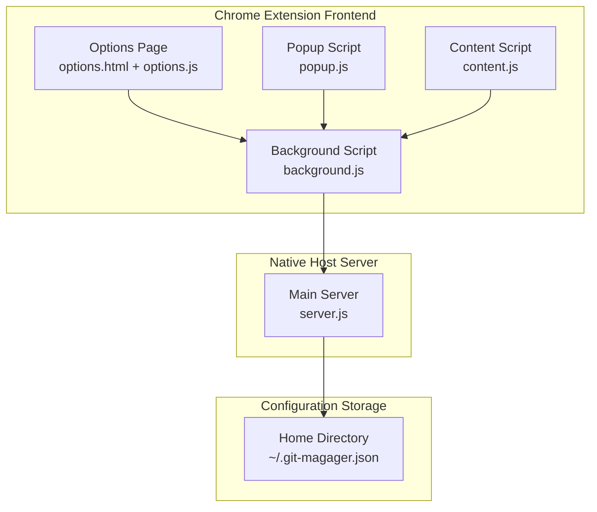

**Diagram sources**
- [server.js:1-263](file://native-host/server.js#L1-L263)
- [background.js:1-74](file://chrome-extension/background.js#L1-L74)
- [options.js:1-56](file://chrome-extension/options.js#L1-L56)

**Section sources**
- [server.js:1-263](file://native-host/server.js#L1-L263)
- [background.js:1-74](file://chrome-extension/background.js#L1-L74)
- [options.js:1-56](file://chrome-extension/options.js#L1-L56)

## Core Components

The configuration management system comprises several key components that work together to provide seamless configuration persistence:

### Native Host Server
The native host server (`server.js`) serves as the central configuration manager, handling file I/O operations, configuration validation, and providing HTTP endpoints for the Chrome extension to interact with.

### Chrome Extension Frontend
The Chrome extension provides multiple interfaces for configuration management:
- **Background Script**: Handles communication with the native server and exposes configuration APIs
- **Options Page**: Provides a user interface for configuring clone directory, terminal preferences, and open-in-terminal settings
- **Popup Script**: Displays current configuration state and allows quick access to settings
- **Content Script**: Integrates with web pages to provide clone functionality while respecting user configuration

### Configuration Storage
Configuration data is persisted in JSON format in the user's home directory, ensuring cross-session persistence and easy backup/restore capabilities.

**Section sources**
- [server.js:17-37](file://native-host/server.js#L17-L37)
- [background.js:24-73](file://chrome-extension/background.js#L24-L73)
- [options.html:176-204](file://chrome-extension/options.html#L176-L204)

## Architecture Overview

The configuration management architecture follows a client-server pattern with clear separation of concerns:

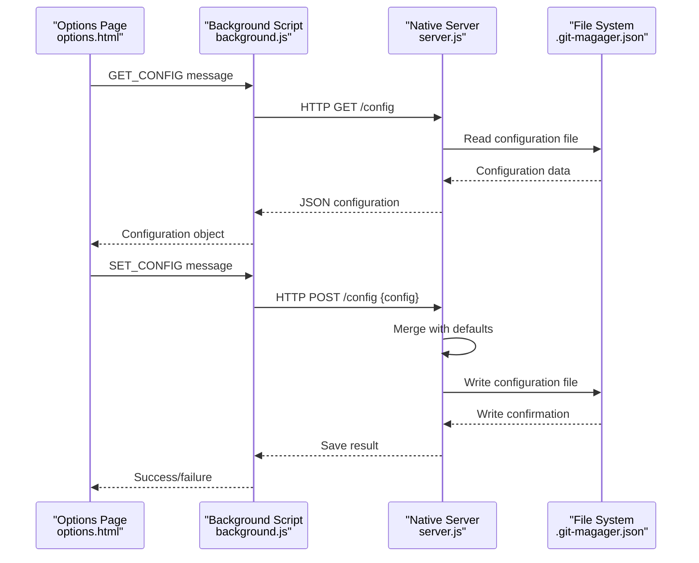

**Diagram sources**
- [background.js:54-72](file://chrome-extension/background.js#L54-L72)
- [server.js:157-187](file://native-host/server.js#L157-L187)

**Section sources**
- [background.js:24-73](file://chrome-extension/background.js#L24-L73)
- [server.js:137-256](file://native-host/server.js#L137-L256)

## Detailed Component Analysis

### Native Host Server Configuration Management

The native host server implements robust configuration management with comprehensive error handling and validation:

#### Configuration Loading Strategy
The server employs a merge-based loading strategy that combines default values with user preferences:

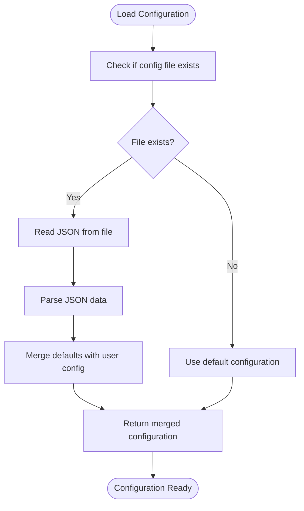

**Diagram sources**
- [server.js:17-27](file://native-host/server.js#L17-L27)

#### Configuration Saving Strategy
The server implements atomic write operations with comprehensive error handling:

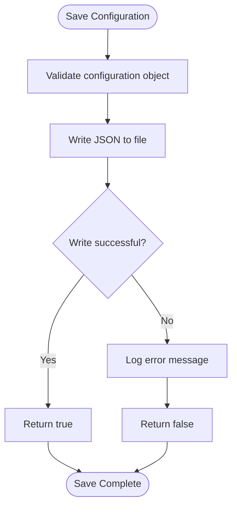

**Diagram sources**
- [server.js:29-37](file://native-host/server.js#L29-L37)

**Section sources**
- [server.js:17-37](file://native-host/server.js#L17-L37)

### Chrome Extension Configuration Interfaces

The Chrome extension provides multiple interfaces for configuration management, each serving different user interaction patterns:

#### Options Page Configuration Interface
The options page provides a comprehensive configuration interface with form validation and real-time feedback:

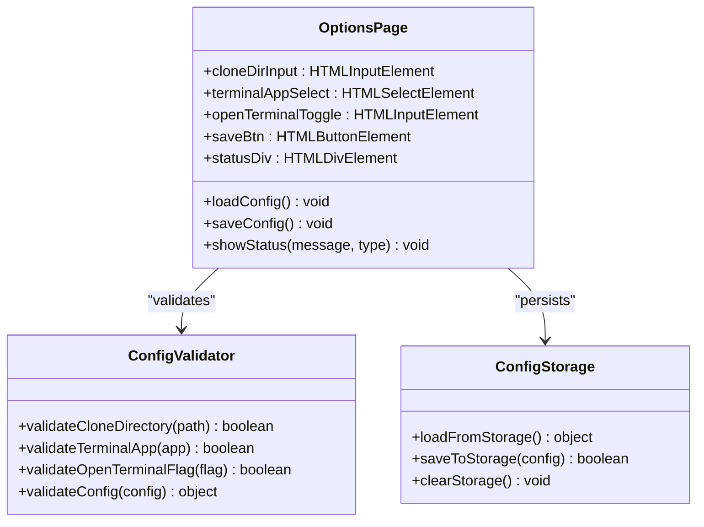

**Diagram sources**
- [options.js:1-56](file://chrome-extension/options.js#L1-L56)
- [options.html:176-204](file://chrome-extension/options.html#L176-L204)

**Section sources**
- [options.js:1-56](file://chrome-extension/options.js#L1-L56)
- [options.html:176-204](file://chrome-extension/options.html#L176-L204)

#### Background Script Communication Layer
The background script serves as the primary communication hub between the extension and the native server:

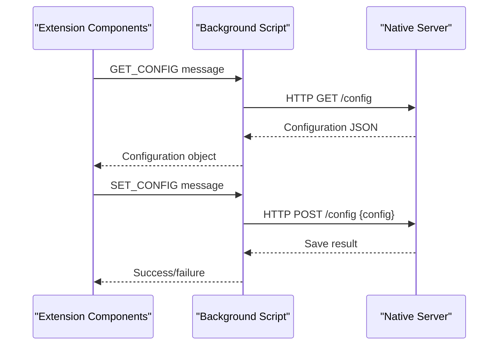

**Diagram sources**
- [background.js:54-72](file://chrome-extension/background.js#L54-L72)

**Section sources**
- [background.js:24-73](file://chrome-extension/background.js#L24-L73)

## Configuration Schema

The configuration system defines a structured schema for storing user preferences. The schema consists of three primary properties that control cloning behavior and terminal integration:

### Configuration Properties

| Property | Type | Default Value | Description |
|----------|------|---------------|-------------|
| `cloneDirectory` | String | `~/Projects` | Default directory where repositories are cloned |
| `openInTerminal` | Boolean | `true` | Whether to open terminal after cloning |
| `terminalApp` | String | `'Terminal'` | Terminal application to use for cloning |

### Configuration Validation Rules

The system implements comprehensive validation rules to ensure configuration integrity:

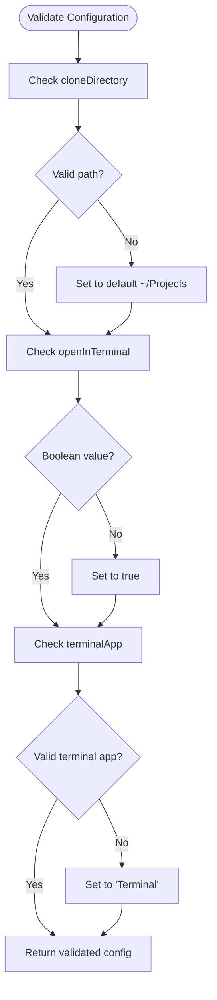

**Diagram sources**
- [server.js:17-27](file://native-host/server.js#L17-L27)

**Section sources**
- [server.js:10-15](file://native-host/server.js#L10-L15)
- [options.js:27-31](file://chrome-extension/options.js#L27-L31)

## File Persistence Mechanisms

The configuration persistence system operates through a JSON file stored in the user's home directory, providing reliable cross-session storage with automatic fallback mechanisms.

### File Location and Naming
Configuration files are stored in the user's home directory with the filename `.git-magager.json`. This location ensures:
- Cross-platform compatibility (works on macOS, Linux, Windows)
- User-level isolation (separate configurations per user)
- Easy backup and restore capabilities

### JSON Serialization Strategy
The system uses robust JSON serialization with comprehensive error handling:

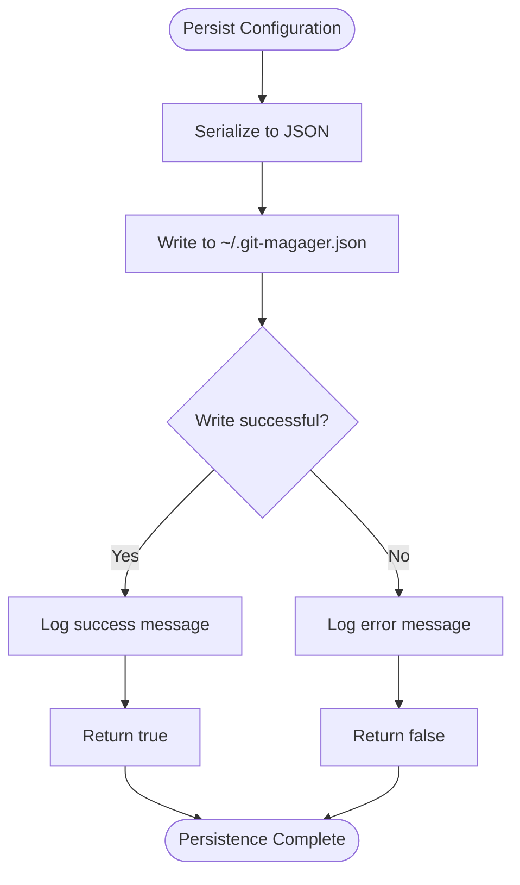

**Diagram sources**
- [server.js:29-37](file://native-host/server.js#L29-L37)

### Atomic Write Operations
The system implements atomic write operations to prevent corruption:
- Configuration data is written to a temporary buffer first
- JSON serialization occurs with proper indentation for readability
- File replacement occurs only after successful serialization
- Error handling ensures graceful degradation

**Section sources**
- [server.js:8](file://native-host/server.js#L8)
- [server.js:29-37](file://native-host/server.js#L29-L37)

## Load and Save Operations

The configuration loading and saving operations implement sophisticated merge strategies and error handling to ensure data integrity and user experience continuity.

### Load Configuration Process

The load operation follows a multi-stage process:

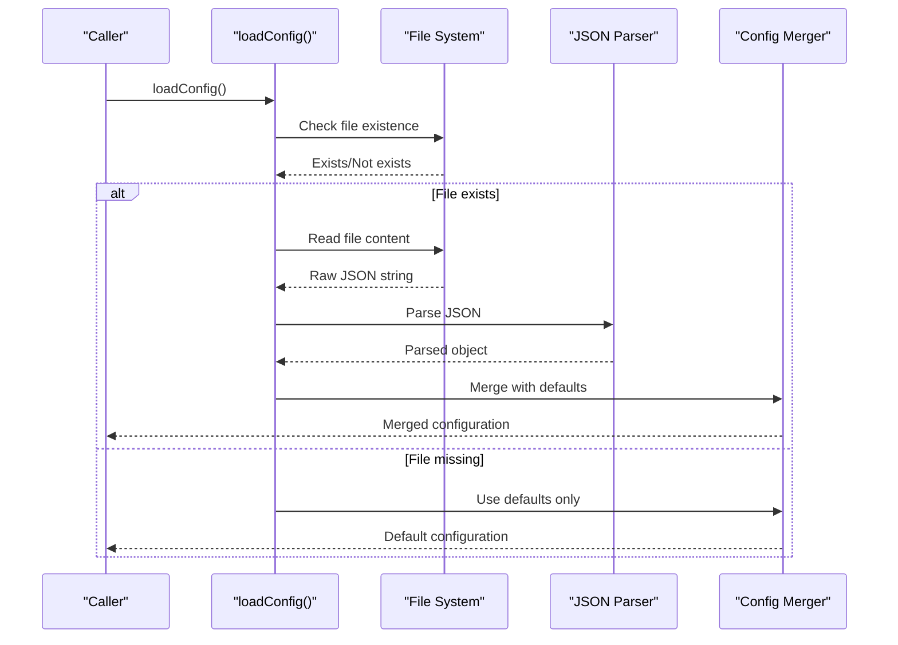

**Diagram sources**
- [server.js:17-27](file://native-host/server.js#L17-L27)

### Save Configuration Process

The save operation implements comprehensive validation and error handling:

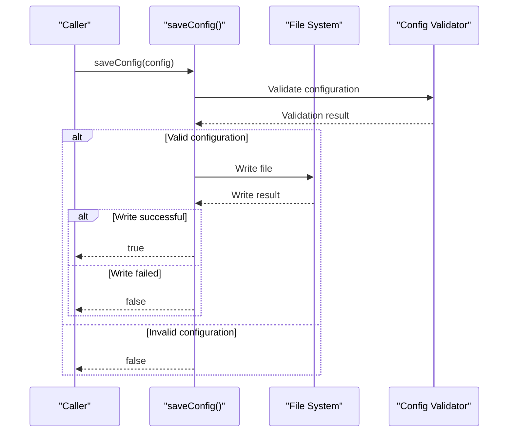

**Diagram sources**
- [server.js:29-37](file://native-host/server.js#L29-L37)

### Error Handling Strategies

Both load and save operations implement comprehensive error handling:

#### Load Error Handling
- File read failures are caught and logged
- JSON parsing errors trigger fallback to default configuration
- Partial configuration corruption is handled gracefully
- System continues with safe default values

#### Save Error Handling
- File write failures are caught and logged
- Partial writes are prevented through atomic operations
- Error messages provide actionable feedback
- Operation failures are propagated to calling components

**Section sources**
- [server.js:17-37](file://native-host/server.js#L17-L37)

## Validation and Migration Strategies

The configuration system implements robust validation and migration strategies to handle evolving requirements and maintain backward compatibility.

### Configuration Validation Rules

The system enforces strict validation rules for each configuration property:

#### Clone Directory Validation
- Must be a valid filesystem path
- Must be writable by the current user
- Defaults to `~/Projects` if invalid or missing
- Path normalization ensures consistent behavior

#### Terminal Application Validation
- Only accepts predefined terminal applications
- Currently supports: `'Terminal'`, `'iTerm'`, `'Warp'`
- Falls back to default `'Terminal'` for invalid values
- Case-insensitive validation with normalization

#### Open Terminal Flag Validation
- Must be a boolean value
- Defaults to `true` if missing or invalid
- Controls whether cloning operations open terminal windows

### Migration Strategies

The system handles configuration migrations through intelligent merging:

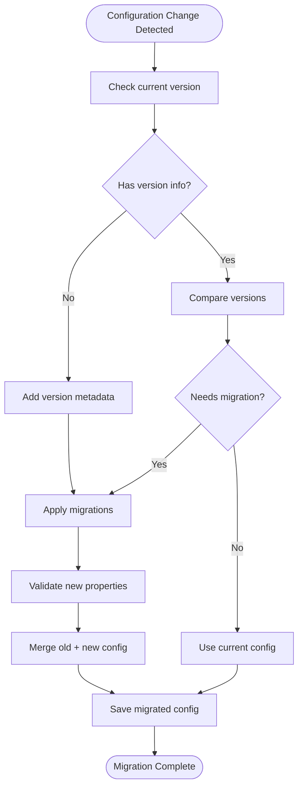

**Diagram sources**
- [server.js:17-27](file://native-host/server.js#L17-L27)

### Backward Compatibility Measures

The system maintains backward compatibility through:
- Default value fallbacks for missing properties
- Graceful degradation for unsupported values
- Non-destructive configuration updates
- Version-aware migration logic

**Section sources**
- [server.js:10-15](file://native-host/server.js#L10-L15)
- [server.js:17-27](file://native-host/server.js#L17-L27)

## Troubleshooting Guide

Common configuration issues and their resolution strategies:

### Configuration File Issues

**Problem**: Configuration file cannot be read
**Symptoms**: Settings reset to defaults, configuration appears corrupted
**Resolution**:
1. Verify file permissions in home directory
2. Check for file corruption or incomplete writes
3. Restart the native host server
4. Manually delete corrupted configuration file

**Problem**: Configuration changes not persisting
**Symptoms**: Settings revert after browser restart
**Resolution**:
1. Verify native host server is running
2. Check file write permissions
3. Ensure sufficient disk space
4. Review error logs for write failures

### Network Communication Issues

**Problem**: Extension cannot communicate with native server
**Symptoms**: "Server not running" status, configuration operations fail
**Resolution**:
1. Verify native host server is running on port 9456
2. Check firewall settings for localhost connections
3. Restart Chrome extension
4. Reinstall native host components

### Terminal Integration Issues

**Problem**: Terminal applications not opening correctly
**Symptoms**: Cloning completes but terminal does not open
**Resolution**:
1. Verify terminal application installation
2. Check terminal application accessibility permissions
3. Test terminal application manually
4. Select alternative terminal application

**Section sources**
- [server.js:137-256](file://native-host/server.js#L137-L256)
- [background.js:11-21](file://chrome-extension/background.js#L11-L21)

## Conclusion

The Git Magager configuration management system provides a robust, user-friendly solution for persistent configuration storage across browser sessions. Through its client-server architecture, comprehensive validation, and intelligent error handling, the system ensures reliable configuration persistence while maintaining ease of use and extensibility.

Key strengths of the system include:
- **Reliable Persistence**: JSON-based storage with atomic write operations
- **Intelligent Merging**: Default value fallback and property validation
- **Cross-Platform Compatibility**: Home directory storage with universal access
- **Comprehensive Error Handling**: Graceful degradation and user feedback
- **Extensible Design**: Modular architecture supporting future enhancements

The system successfully balances simplicity for end users with robustness for developers, providing a foundation for continued feature development while maintaining stability and reliability.