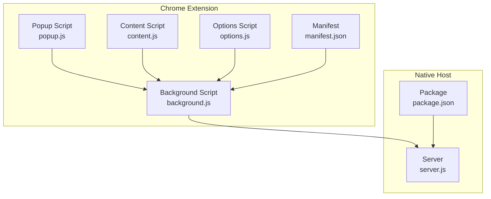
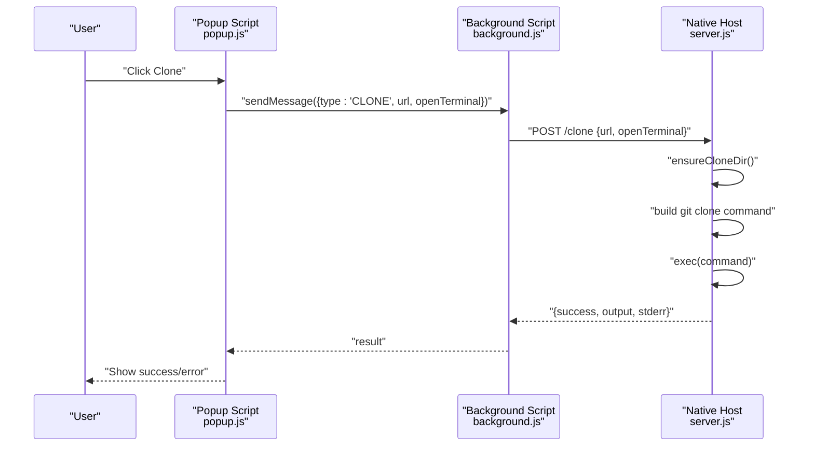
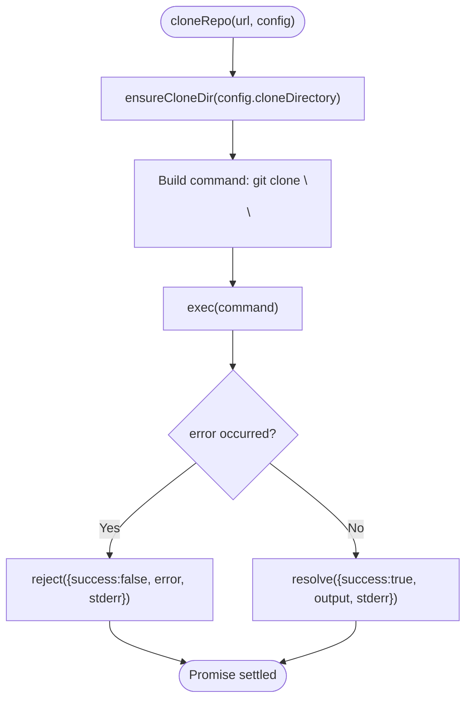
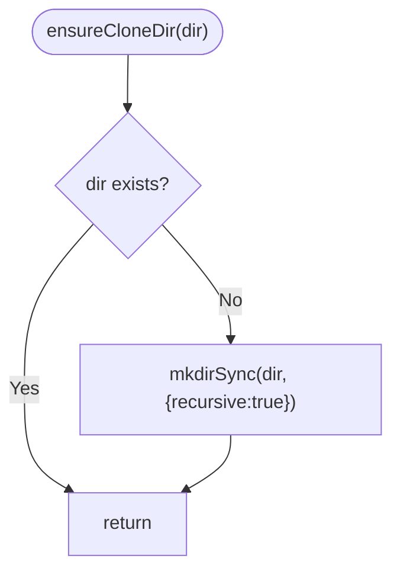
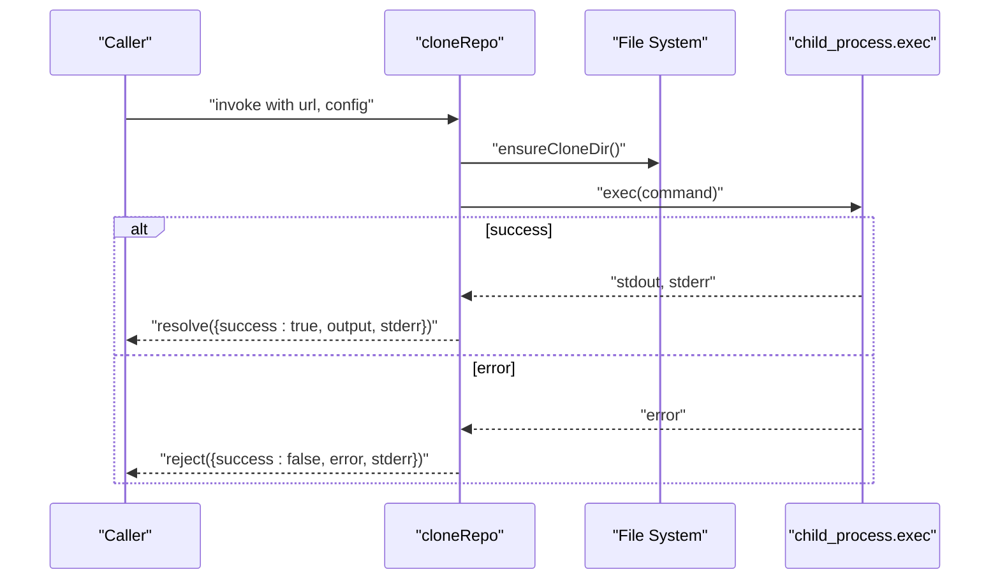
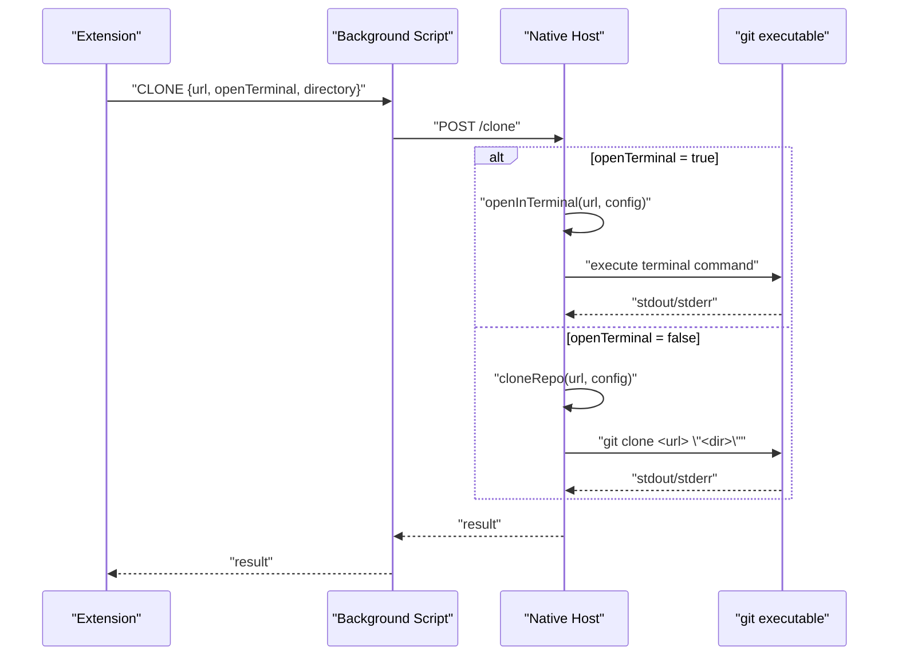
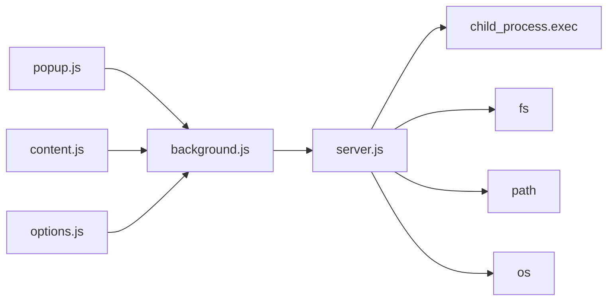

# Git Operation Handlers

<cite>
**Referenced Files in This Document**
- [server.js](file://native-host/server.js)
- [background.js](file://chrome-extension/background.js)
- [content.js](file://chrome-extension/content.js)
- [popup.js](file://chrome-extension/popup.js)
- [options.js](file://chrome-extension/options.js)
- [manifest.json](file://chrome-extension/manifest.json)
- [package.json](file://native-host/package.json)
</cite>

## Table of Contents
1. [Introduction](#introduction)
2. [Project Structure](#project-structure)
3. [Core Components](#core-components)
4. [Architecture Overview](#architecture-overview)
5. [Detailed Component Analysis](#detailed-component-analysis)
6. [Dependency Analysis](#dependency-analysis)
7. [Performance Considerations](#performance-considerations)
8. [Troubleshooting Guide](#troubleshooting-guide)
9. [Conclusion](#conclusion)

## Introduction
This document provides comprehensive documentation for the Git operation handlers within the Git Magager project. It focuses on the clone repository functionality, including command construction, process execution via child_process.exec, output capture, directory management, and promise-based asynchronous handling. It also covers supported Git protocols, URL handling, repository cloning workflows, and common error scenarios with resolution strategies.

## Project Structure
The project consists of two primary components:
- Native Host (Node.js server): Provides local HTTP endpoints for configuration, folder selection, and Git cloning operations.
- Chrome Extension: A Manifest V3 extension that communicates with the native host to perform Git operations and present UI interactions.

**Diagram sources**
- [server.js:137-263](file://native-host/server.js#L137-L263)
- [background.js:1-74](file://chrome-extension/background.js#L1-L74)
- [content.js:1-333](file://chrome-extension/content.js#L1-L333)
- [popup.js:1-168](file://chrome-extension/popup.js#L1-L168)
- [options.js:1-56](file://chrome-extension/options.js#L1-L56)
- [manifest.json:1-50](file://chrome-extension/manifest.json#L1-L50)
- [package.json:1-12](file://native-host/package.json#L1-L12)

**Section sources**
- [server.js:137-263](file://native-host/server.js#L137-L263)
- [background.js:1-74](file://chrome-extension/background.js#L1-L74)
- [content.js:1-333](file://chrome-extension/content.js#L1-L333)
- [popup.js:1-168](file://chrome-extension/popup.js#L1-L168)
- [options.js:1-56](file://chrome-extension/options.js#L1-L56)
- [manifest.json:1-50](file://chrome-extension/manifest.json#L1-L50)
- [package.json:1-12](file://native-host/package.json#L1-L12)

## Core Components
This section documents the core Git operation handler responsible for cloning repositories, including:
- Command construction for git clone
- Process execution using child_process.exec
- Output capture and response formatting
- Directory management and recursive creation
- Promise-based async handling and error propagation

Key implementation details:
- Command construction: The clone command is built using a template that includes the repository URL and target directory.
- Process execution: child_process.exec runs the constructed command and captures stdout/stderr.
- Output capture: Responses are formatted consistently with success and error fields.
- Directory management: ensureCloneDir checks for directory existence and creates it recursively if missing.
- Async handling: All operations return promises and handle both success and failure cases.

**Section sources**
- [server.js:45-64](file://native-host/server.js#L45-L64)
- [server.js:39-43](file://native-host/server.js#L39-L43)
- [server.js:213-251](file://native-host/server.js#L213-L251)

## Architecture Overview
The system architecture follows a client-server model:
- The Chrome Extension communicates with the Native Host via HTTP requests.
- The Native Host exposes endpoints for health checks, configuration, folder selection, and cloning.
- The clone endpoint executes git clone and returns structured responses.

**Diagram sources**
- [popup.js:94-149](file://chrome-extension/popup.js#L94-L149)
- [background.js:42-52](file://chrome-extension/background.js#L42-L52)
- [server.js:213-251](file://native-host/server.js#L213-L251)
- [server.js:45-64](file://native-host/server.js#L45-L64)

## Detailed Component Analysis

### cloneRepo Handler
The cloneRepo function encapsulates the core Git cloning logic:
- Validates configuration and ensures the clone directory exists.
- Constructs the git clone command with the provided URL and target directory.
- Executes the command using child_process.exec and captures stdout and stderr.
- Resolves with a structured success response or rejects with a structured error response.

Implementation highlights:
- Directory management: ensureCloneDir verifies the directory exists and creates it recursively if needed.
- Command construction: The command string is assembled with the URL and clone directory.
- Process execution: exec runs the command and handles completion callbacks.
- Response formatting: Both success and error responses include structured fields for downstream consumption.

**Diagram sources**
- [server.js:39-43](file://native-host/server.js#L39-L43)
- [server.js:52](file://native-host/server.js#L52)
- [server.js:54-62](file://native-host/server.js#L54-L62)

**Section sources**
- [server.js:45-64](file://native-host/server.js#L45-L64)
- [server.js:39-43](file://native-host/server.js#L39-L43)

### Directory Management
The ensureCloneDir function guarantees that the clone directory exists:
- Checks for directory existence using fs.existsSync.
- Creates the directory recursively using fs.mkdirSync with recursive option.
- Ensures subsequent clone operations have a valid destination.

**Diagram sources**
- [server.js:39-43](file://native-host/server.js#L39-L43)

**Section sources**
- [server.js:39-43](file://native-host/server.js#L39-L43)

### Promise-Based Async Handling
All Git operation handlers return promises and handle:
- Success: resolves with a structured object containing success, output, and stderr.
- Failure: rejects with a structured object containing success, error, and stderr.
- Error propagation: The server endpoint catches thrown errors and returns standardized error responses.

**Diagram sources**
- [server.js:45-64](file://native-host/server.js#L45-L64)
- [server.js:54-62](file://native-host/server.js#L54-L62)

**Section sources**
- [server.js:45-64](file://native-host/server.js#L45-L64)
- [server.js:213-251](file://native-host/server.js#L213-L251)

### Supported Git Protocols and URL Handling
The extension detects and supports:
- HTTPS URLs for GitHub and GitLab repositories.
- SSH URLs for GitHub and GitLab repositories.

Detection and conversion logic:
- Content script extracts HTTPS and SSH URLs from repository pages.
- Popup script converts between HTTPS and SSH formats based on user selection.

Examples of supported URL formats:
- HTTPS: https://github.com/<owner>/<repo>.git
- SSH: git@github.com:<owner>/<repo>.git

**Section sources**
- [content.js:20-84](file://chrome-extension/content.js#L20-L84)
- [popup.js:61-91](file://chrome-extension/popup.js#L61-L91)

### Repository Cloning Workflows
Two primary workflows are supported:
- Direct cloning via the native host: The extension sends a clone request with the URL and optional directory override.
- Terminal-based cloning: The native host opens a terminal and executes the clone command interactively.

Workflow details:
- Request construction: The extension builds a JSON payload with url, openTerminal, and directory.
- Endpoint routing: The native host routes to either cloneRepo or openInTerminal based on the openTerminal flag.
- Response handling: The extension displays success or error notifications based on the response.

**Diagram sources**
- [background.js:42-52](file://chrome-extension/background.js#L42-L52)
- [server.js:213-251](file://native-host/server.js#L213-L251)
- [server.js:66-111](file://native-host/server.js#L66-L111)
- [server.js:45-64](file://native-host/server.js#L45-L64)

**Section sources**
- [background.js:42-52](file://chrome-extension/background.js#L42-L52)
- [server.js:213-251](file://native-host/server.js#L213-L251)
- [server.js:66-111](file://native-host/server.js#L66-L111)
- [server.js:45-64](file://native-host/server.js#L45-L64)

## Dependency Analysis
The system exhibits clear separation of concerns:
- Extension scripts depend on the background script for network communication.
- The background script depends on the native host for Git operations.
- The native host depends on Node.js built-ins (child_process, fs, path, os) and exposes HTTP endpoints.

**Diagram sources**
- [background.js:1-74](file://chrome-extension/background.js#L1-L74)
- [server.js:1-6](file://native-host/server.js#L1-L6)

**Section sources**
- [background.js:1-74](file://chrome-extension/background.js#L1-L74)
- [server.js:1-6](file://native-host/server.js#L1-L6)

## Performance Considerations
- Process execution overhead: Each clone operation spawns a new git process. For frequent cloning, consider batching or caching to reduce overhead.
- Directory checks: ensureCloneDir performs a filesystem check before each clone. While lightweight, repeated checks can accumulate in high-frequency scenarios.
- Network latency: The extension communicates with the native host over localhost. Ensure the host remains responsive to avoid UI delays.
- Memory usage: Long-running clones can consume memory. Monitor process lifecycle and avoid unnecessary logging in production.

## Troubleshooting Guide
Common Git errors and resolution strategies:
- Authentication failures:
  - Symptom: Errors indicating permission denied or credential issues.
  - Resolution: Configure SSH keys or HTTPS credentials. Verify repository access permissions.
- Network connectivity:
  - Symptom: Timeouts or connection refused during clone.
  - Resolution: Ensure the native host is running and reachable on localhost. Check firewall settings.
- Invalid repository URL:
  - Symptom: Errors indicating malformed URL or unsupported protocol.
  - Resolution: Confirm the URL format matches supported protocols (HTTPS/SSH). Validate repository availability.
- Directory permissions:
  - Symptom: Errors indicating inability to write to the target directory.
  - Resolution: Verify write permissions for the configured clone directory. Adjust directory ownership or permissions.
- Git executable not found:
  - Symptom: Errors indicating git command not found.
  - Resolution: Ensure Git is installed and available in the system PATH. Reinstall Git if necessary.
- Terminal app issues:
  - Symptom: Errors opening the terminal or executing commands.
  - Resolution: Verify terminal app selection in configuration. Test terminal accessibility and permissions.

**Section sources**
- [server.js:54-62](file://native-host/server.js#L54-L62)
- [server.js:103-109](file://native-host/server.js#L103-L109)

## Conclusion
The Git operation handlers provide a robust foundation for cloning repositories through a Chrome extension and a native host server. The implementation emphasizes clear command construction, reliable process execution, and structured response handling. By understanding the supported protocols, URL handling, and error scenarios, users can effectively utilize the system for streamlined Git workflows while troubleshooting common issues with targeted resolutions.