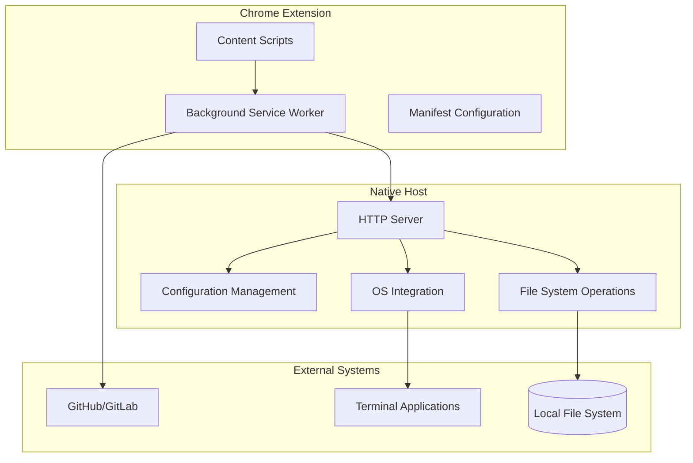
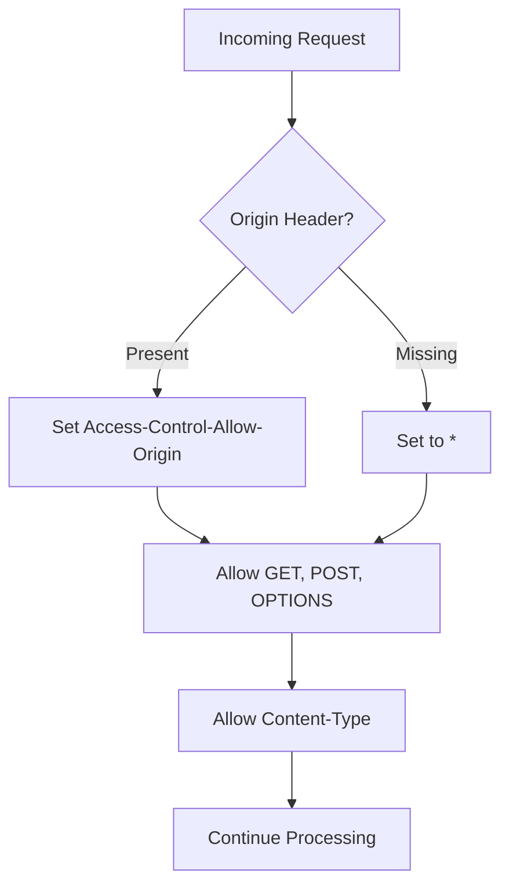
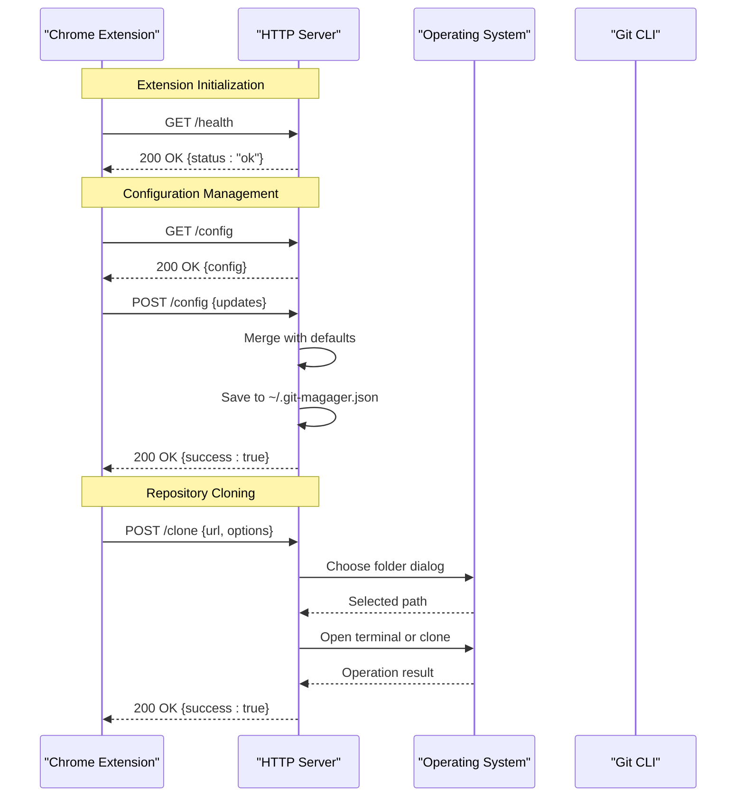
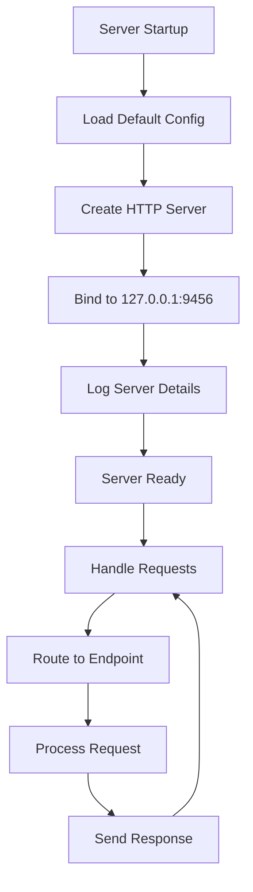
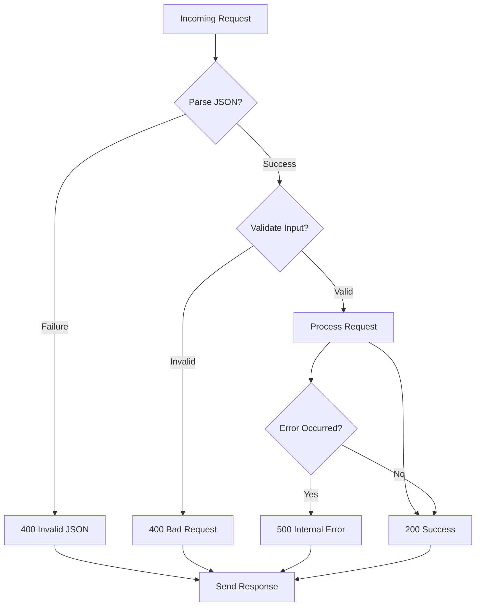
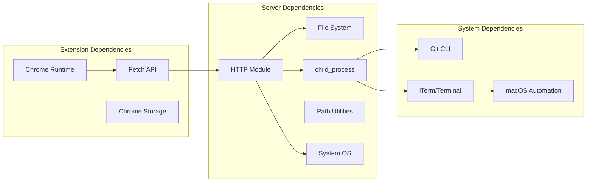

# HTTP Server Implementation

<cite>
**Referenced Files in This Document**
- [server.js](file://native-host/server.js)
- [background.js](file://chrome-extension/background.js)
- [content.js](file://chrome-extension/content.js)
- [manifest.json](file://chrome-extension/manifest.json)
- [setup.sh](file://native-host/setup.sh)
- [package.json](file://native-host/package.json)
</cite>

## Table of Contents
1. [Introduction](#introduction)
2. [Project Structure](#project-structure)
3. [Core Components](#core-components)
4. [Architecture Overview](#architecture-overview)
5. [Detailed Component Analysis](#detailed-component-analysis)
6. [Dependency Analysis](#dependency-analysis)
7. [Performance Considerations](#performance-considerations)
8. [Troubleshooting Guide](#troubleshooting-guide)
9. [Conclusion](#conclusion)

## Introduction
This document provides comprehensive technical documentation for the HTTP server implementation that powers the Git Magager Chrome extension. The server runs locally on port 9456 and provides REST-like endpoints for configuration management, repository cloning, and system integration. It serves as a bridge between the browser extension and the local operating system, enabling seamless Git operations without requiring users to open terminals manually.

The implementation demonstrates modern Node.js HTTP server patterns with robust error handling, CORS configuration, and JSON-based request/response protocols. The server integrates with macOS-specific features including native folder selection dialogs and terminal automation.

## Project Structure
The project follows a modular architecture with distinct components:



**Diagram sources**
- [server.js:137-262](file://native-host/server.js#L137-L262)
- [background.js:1-74](file://chrome-extension/background.js#L1-L74)

**Section sources**
- [server.js:1-263](file://native-host/server.js#L1-L263)
- [background.js:1-74](file://chrome-extension/background.js#L1-L74)
- [manifest.json:1-50](file://chrome-extension/manifest.json#L1-L50)

## Core Components

### HTTP Server Foundation
The server is built using Node.js's native HTTP module with a single-threaded event-driven architecture. It listens on localhost interface (127.0.0.1) at port 9456, ensuring secure local-only communication.

Key server characteristics:
- **Port Configuration**: Fixed port 9456 on localhost interface
- **Protocol**: HTTP/1.1 with JSON payload support
- **Concurrency**: Single-threaded with asynchronous request handling
- **Security**: Local-only binding prevents external access

### CORS Policy Implementation
The server implements a permissive CORS policy designed for local development scenarios:



**Diagram sources**
- [server.js:137-148](file://native-host/server.js#L137-L148)

**Section sources**
- [server.js:7-8](file://native-host/server.js#L7-L8)
- [server.js:137-148](file://native-host/server.js#L137-L148)

## Architecture Overview



**Diagram sources**
- [server.js:150-251](file://native-host/server.js#L150-L251)
- [background.js:11-21](file://chrome-extension/background.js#L11-L21)

## Detailed Component Analysis

### Server Initialization and Lifecycle

The server initialization process follows a standard Node.js pattern with comprehensive logging and configuration loading:



**Diagram sources**
- [server.js:258-262](file://native-host/server.js#L258-L262)

**Section sources**
- [server.js:258-262](file://native-host/server.js#L258-L262)

### Endpoint Routing Logic

The server implements a comprehensive routing system with explicit method and URL matching:

#### Health Check Endpoint
- **Method**: GET
- **Path**: `/health`
- **Response**: JSON with status and version information
- **Status Codes**: 200 OK

#### Configuration Management Endpoints
- **GET /config**: Retrieves current configuration
- **POST /config**: Updates configuration with merge semantics

#### Repository Operations Endpoints
- **GET /health**: Health check endpoint
- **POST /choose-folder**: Native macOS folder selection
- **POST /clone**: Repository cloning with terminal integration

**Section sources**
- [server.js:150-251](file://native-host/server.js#L150-L251)

### Request/Response Handling Patterns

#### GET Method Processing
GET requests follow a consistent pattern:
1. Parse URL and method
2. Validate endpoint
3. Execute business logic
4. Send JSON response with appropriate status code

#### POST Method Processing
POST requests implement streaming data collection:
1. Initialize empty body accumulator
2. Collect data chunks via 'data' event
3. Process 'end' event to parse JSON
4. Execute business logic with error handling
5. Send structured JSON response

**Section sources**
- [server.js:158-187](file://native-host/server.js#L158-L187)
- [server.js:214-251](file://native-host/server.js#L214-L251)

### Error Handling Strategies

The server implements comprehensive error handling across multiple layers:



**Diagram sources**
- [server.js:170-184](file://native-host/server.js#L170-L184)
- [server.js:242-248](file://native-host/server.js#L242-L248)

**Section sources**
- [server.js:170-184](file://native-host/server.js#L170-L184)
- [server.js:242-248](file://native-host/server.js#L242-L248)

### JSON Serialization and Data Flow

The server maintains consistent JSON serialization patterns:
- **Request Bodies**: Streamed JSON parsing with error handling
- **Response Bodies**: Structured JSON with success/error indicators
- **Configuration**: Merged defaults with user preferences
- **Status Codes**: Standard HTTP codes with JSON payloads

**Section sources**
- [server.js:167-186](file://native-host/server.js#L167-L186)
- [server.js:215-250](file://native-host/server.js#L215-L250)

## Dependency Analysis



**Diagram sources**
- [server.js:1-6](file://native-host/server.js#L1-L6)
- [background.js:1-3](file://chrome-extension/background.js#L1-L3)

**Section sources**
- [server.js:1-6](file://native-host/server.js#L1-L6)
- [background.js:1-3](file://chrome-extension/background.js#L1-L3)

## Performance Considerations

### Concurrency Model
The server operates on a single-threaded event loop model, which provides excellent performance for I/O-bound operations typical of file system and subprocess operations. This design choice optimizes resource usage for the local-only nature of the application.

### Memory Management
- **Streaming Requests**: Large JSON bodies are processed incrementally
- **Configuration Caching**: Configuration loaded on demand with minimal caching
- **Process Spawning**: Git operations spawn separate processes to avoid blocking

### Network Efficiency
- **Local Binding**: Only accepts connections from localhost
- **Minimal Headers**: Uses essential CORS headers only
- **JSON Optimization**: Compact JSON responses without unnecessary metadata

## Troubleshooting Guide

### Server Startup Issues

**Common Symptoms**:
- Port already in use (EADDRINUSE)
- Permission denied errors
- Node.js not installed

**Resolution Steps**:
1. Verify port availability: `lsof -i :9456`
2. Check Node.js installation: `node --version`
3. Review system logs: `tail -f ~/.git-magager-error.log`

### CORS Configuration Problems

**Symptoms**:
- Cross-origin request blocked
- Preflight OPTIONS requests failing

**Debugging Approach**:
1. Verify CORS headers in response
2. Check browser developer tools network tab
3. Confirm extension manifest host permissions

### Extension Communication Issues

**Health Check Failure**:
```javascript
// Debug sequence in extension
await fetch('http://127.0.0.1:9456/health')
  .then(response => response.json())
  .then(data => console.log('Server status:', data))
  .catch(error => console.error('Connection failed:', error));
```

**Configuration Issues**:
1. Check configuration file existence: `~/.git-magager.json`
2. Verify file permissions
3. Review server logs for parsing errors

**Section sources**
- [setup.sh:84-91](file://native-host/setup.sh#L84-L91)
- [background.js:11-21](file://chrome-extension/background.js#L11-L21)

## Conclusion

The Git Magager HTTP server implementation demonstrates a well-architected solution for bridging browser extensions with local system capabilities. The design emphasizes simplicity, security, and reliability through:

- **Local-Only Architecture**: Ensures security by limiting access to localhost
- **Robust Error Handling**: Comprehensive error detection and reporting
- **Streamlined API**: Clean JSON-based interface with consistent patterns
- **Cross-Platform Integration**: Seamless macOS system integration
- **Developer-Friendly Design**: Clear logging and debugging capabilities

The implementation successfully balances functionality with security, providing a reliable foundation for the Chrome extension while maintaining the flexibility to extend functionality as needed. The modular design allows for easy maintenance and potential future enhancements without compromising the existing stable interface.