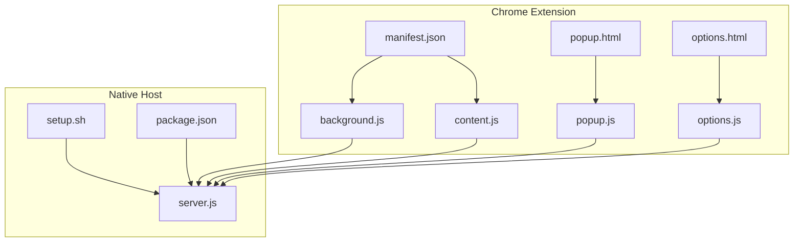
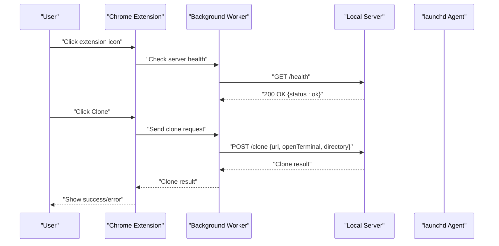
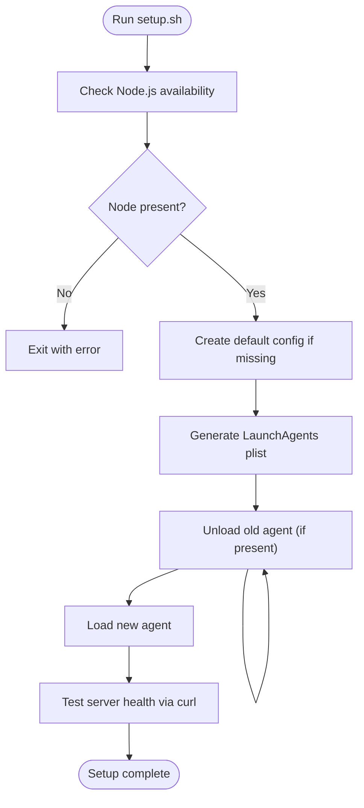
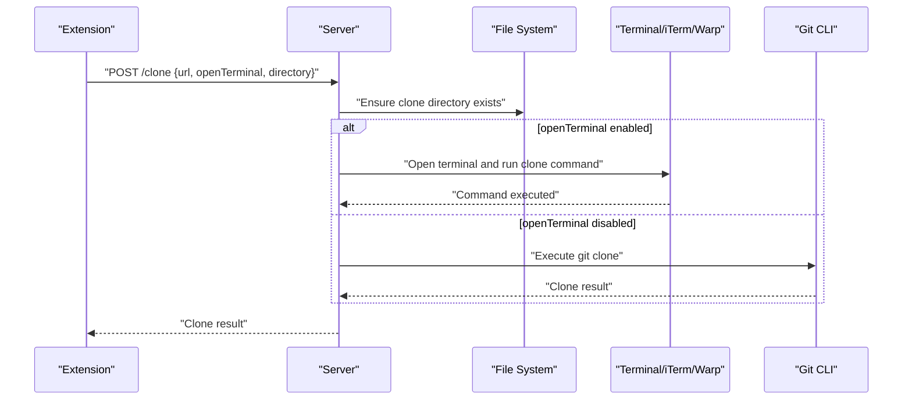
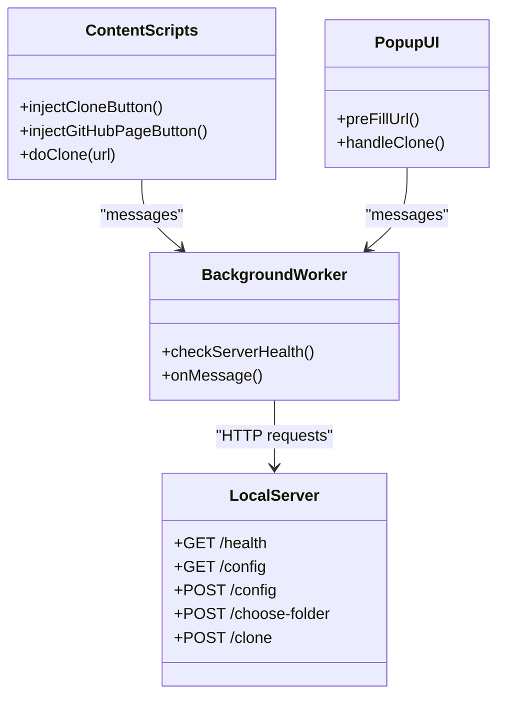
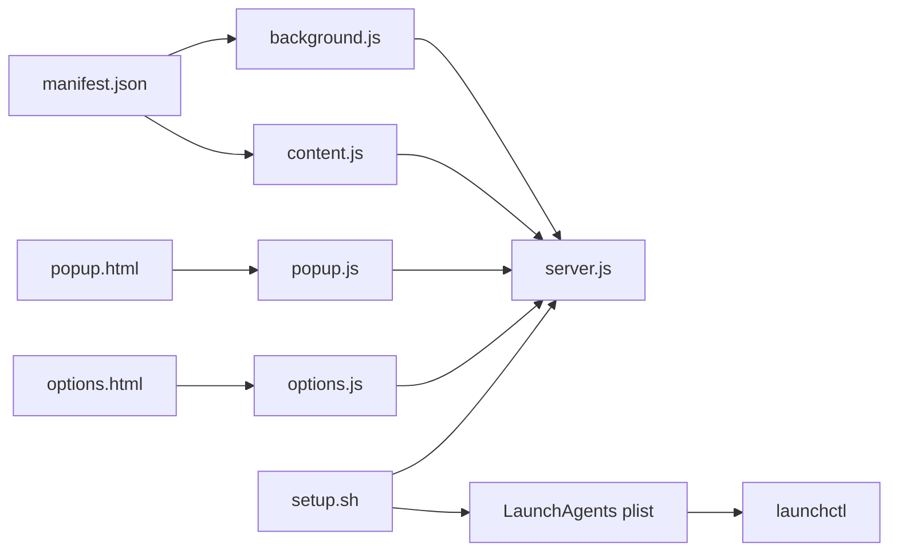

# Launchd Service Integration

<cite>
**Referenced Files in This Document**
- [setup.sh](file://native-host/setup.sh)
- [package.json](file://native-host/package.json)
- [server.js](file://native-host/server.js)
- [manifest.json](file://chrome-extension/manifest.json)
- [background.js](file://chrome-extension/background.js)
- [content.js](file://chrome-extension/content.js)
- [popup.js](file://chrome-extension/popup.js)
- [options.js](file://chrome-extension/options.js)
- [popup.html](file://chrome-extension/popup.html)
- [options.html](file://chrome-extension/options.html)
</cite>

## Table of Contents
1. [Introduction](#introduction)
2. [Project Structure](#project-structure)
3. [Core Components](#core-components)
4. [Architecture Overview](#architecture-overview)
5. [Detailed Component Analysis](#detailed-component-analysis)
6. [Dependency Analysis](#dependency-analysis)
7. [Performance Considerations](#performance-considerations)
8. [Troubleshooting Guide](#troubleshooting-guide)
9. [Conclusion](#conclusion)
10. [Appendices](#appendices)

## Introduction
This document explains the launchd service integration and auto-start functionality for the Git Magager project. It covers the setup script that registers a launchd agent, generates the plist configuration, and integrates with the macOS system. It also documents the Node.js companion server, the Chrome extension’s communication model, and provides practical guidance for installation, monitoring, and troubleshooting.

## Project Structure
The project consists of:
- A native host (Node.js server) under native-host with a setup script and package configuration.
- A Chrome extension under chrome-extension that communicates with the local server.

**Diagram sources**
- [setup.sh:1-102](file://native-host/setup.sh#L1-L102)
- [package.json:1-12](file://native-host/package.json#L1-L12)
- [server.js:1-263](file://native-host/server.js#L1-L263)
- [manifest.json:1-50](file://chrome-extension/manifest.json#L1-L50)
- [background.js:1-74](file://chrome-extension/background.js#L1-L74)
- [content.js:1-333](file://chrome-extension/content.js#L1-L333)
- [popup.js:1-168](file://chrome-extension/popup.js#L1-L168)
- [options.js:1-56](file://chrome-extension/options.js#L1-L56)
- [popup.html:1-77](file://chrome-extension/popup.html#L1-L77)
- [options.html:1-222](file://chrome-extension/options.html#L1-L222)

**Section sources**
- [setup.sh:1-102](file://native-host/setup.sh#L1-L102)
- [package.json:1-12](file://native-host/package.json#L1-L12)
- [server.js:1-263](file://native-host/server.js#L1-L263)
- [manifest.json:1-50](file://chrome-extension/manifest.json#L1-L50)

## Core Components
- Launchd Agent Registration: The setup script creates a LaunchAgents plist and loads it via launchctl.
- Companion Server: A Node.js HTTP server listens on localhost and exposes endpoints for health checks, configuration, folder selection, and cloning.
- Chrome Extension: A Manifest V3 extension that communicates with the local server to enable one-click cloning.

Key responsibilities:
- setup.sh: Validates Node.js, creates default configuration, generates and loads the launchd plist, and tests connectivity.
- server.js: Implements HTTP endpoints, manages configuration, and orchestrates cloning and terminal automation.
- Chrome extension: Background worker, content scripts, and UI components that talk to the server.

**Section sources**
- [setup.sh:15-91](file://native-host/setup.sh#L15-L91)
- [server.js:137-262](file://native-host/server.js#L137-L262)
- [background.js:11-73](file://chrome-extension/background.js#L11-L73)
- [manifest.json:1-50](file://chrome-extension/manifest.json#L1-L50)

## Architecture Overview
The system integrates a local companion server with a browser extension. The extension communicates with the server over HTTP on localhost. The setup script installs a launchd agent so the server starts automatically at login.

**Diagram sources**
- [background.js:11-73](file://chrome-extension/background.js#L11-L73)
- [server.js:150-251](file://native-host/server.js#L150-L251)

## Detailed Component Analysis

### Launchd Agent Setup and Plist Generation
The setup script performs:
- Node.js detection and version reporting.
- Default configuration creation if missing.
- Plist generation under the user’s LaunchAgents directory with:
  - Label identifying the service.
  - ProgramArguments pointing to the Node executable and server script.
  - RunAtLoad and KeepAlive set to true.
  - StandardOutPath and StandardErrorPath configured for logging.
- Unload and reload the agent via launchctl to apply changes.
- Post-installation instructions and a quick health check using curl.

**Diagram sources**
- [setup.sh:15-91](file://native-host/setup.sh#L15-L91)

**Section sources**
- [setup.sh:15-91](file://native-host/setup.sh#L15-L91)

### Launchd Daemon Configuration Details
- Label: com.git-magager.host
- ProgramArguments: [Node executable, server script path]
- RunAtLoad: true
- KeepAlive: true
- StandardOutPath: user home log file
- StandardErrorPath: user home error log file
- Location: ~/Library/LaunchAgents/com.git-magager.host.plist

These settings ensure the server starts automatically and remains running.

**Section sources**
- [setup.sh:48-70](file://native-host/setup.sh#L48-L70)

### Service Lifecycle Management
- Start/Stop: launchctl load and unload the agent plist.
- Logs: Tail the configured log files for stdout and stderr.
- Health Check: The extension pings /health and the setup script validates via curl.

Operational commands:
- Start: launchctl load ~/Library/LaunchAgents/com.git-magager.host.plist
- Stop: launchctl unload ~/Library/LaunchAgents/com.git-magager.host.plist
- Logs: tail -f ~/.git-magager.log and tail -f ~/.git-magager-error.log
- Health: curl http://127.0.0.1:9456/health

**Section sources**
- [setup.sh:77-91](file://native-host/setup.sh#L77-L91)
- [background.js:11-21](file://chrome-extension/background.js#L11-L21)

### Companion Server Implementation
The server exposes:
- GET /health: Returns a simple status payload.
- GET /config: Returns current configuration.
- POST /config: Updates configuration.
- POST /choose-folder: Opens a native macOS folder picker and returns the selected path.
- POST /clone: Clones a repository into the selected directory and optionally opens a terminal.

It also:
- Loads and saves configuration from ~/.git-magager.json.
- Ensures the clone directory exists.
- Integrates with macOS terminal applications via AppleScript.

**Diagram sources**
- [server.js:213-251](file://native-host/server.js#L213-L251)

**Section sources**
- [server.js:137-262](file://native-host/server.js#L137-L262)

### Package.json Configuration for Node.js Packaging and Scripts
- Name, version, and description define the package metadata.
- Main points to the server entry file.
- Scripts:
  - start: node server.js
  - install-service: intended for future use (placeholder)
- Dependencies: empty in this repository snapshot.

This configuration enables straightforward local development and service installation.

**Section sources**
- [package.json:1-12](file://native-host/package.json#L1-L12)

### Chrome Extension Integration
The extension:
- Manifest V3 defines permissions, host permissions, background service worker, action popup, content scripts, and options page.
- Background worker checks server health and forwards requests to the server.
- Content scripts inject clone buttons on GitHub and GitLab pages and coordinate cloning.
- Popup and options pages manage user preferences and provide a UI for cloning.

Communication model:
- Background worker sends fetch requests to the local server endpoints.
- Content scripts communicate with the background worker to trigger cloning.
- Options page updates server-side configuration.

**Diagram sources**
- [background.js:11-73](file://chrome-extension/background.js#L11-L73)
- [content.js:185-332](file://chrome-extension/content.js#L185-L332)
- [popup.js:3-168](file://chrome-extension/popup.js#L3-L168)
- [server.js:137-262](file://native-host/server.js#L137-L262)

**Section sources**
- [manifest.json:1-50](file://chrome-extension/manifest.json#L1-L50)
- [background.js:11-73](file://chrome-extension/background.js#L11-L73)
- [content.js:185-332](file://chrome-extension/content.js#L185-L332)
- [popup.js:3-168](file://chrome-extension/popup.js#L3-L168)
- [options.js:1-56](file://chrome-extension/options.js#L1-L56)

## Dependency Analysis
- Extension depends on the local server running on localhost:9456.
- The setup script depends on Node.js and launchctl.
- The server depends on the filesystem for configuration and on terminal automation for interactive cloning.

**Diagram sources**
- [manifest.json:1-50](file://chrome-extension/manifest.json#L1-L50)
- [background.js:11-73](file://chrome-extension/background.js#L11-L73)
- [content.js:185-332](file://chrome-extension/content.js#L185-L332)
- [popup.html:1-77](file://chrome-extension/popup.html#L1-77)
- [options.html:1-222](file://chrome-extension/options.html#L1-L222)
- [popup.js:3-168](file://chrome-extension/popup.js#L3-L168)
- [options.js:1-56](file://chrome-extension/options.js#L1-L56)
- [setup.sh:48-70](file://native-host/setup.sh#L48-L70)

**Section sources**
- [setup.sh:48-70](file://native-host/setup.sh#L48-L70)
- [manifest.json:1-50](file://chrome-extension/manifest.json#L1-L50)

## Performance Considerations
- The server runs locally on localhost and uses synchronous filesystem operations for configuration. These are lightweight for typical usage.
- Terminal automation relies on AppleScript and external terminal applications; delays may occur depending on the terminal app.
- KeepAlive ensures continuous availability; consider resource usage if the server is frequently idle.

## Troubleshooting Guide
Common issues and resolutions:
- Node.js not installed:
  - Cause: Missing Node.js runtime.
  - Resolution: Install Node.js and rerun the setup script.
- Server not reachable:
  - Cause: Service not loaded or port blocked.
  - Resolution: Verify launchd agent is loaded, check logs, and confirm the server is listening on 127.0.0.1:9456.
- Extension shows “Server not running”:
  - Cause: Local server not started or not responding.
  - Resolution: Start the server manually, check logs, and ensure the extension can reach the server.
- Cloning fails:
  - Cause: Git not installed or permission issues.
  - Resolution: Ensure Git is installed and the target directory is writable.
- Terminal automation issues:
  - Cause: Terminal app not installed or AppleScript permissions.
  - Resolution: Confirm the selected terminal app is installed and grant accessibility permissions if needed.

Verification steps:
- Confirm service status: launchctl print user/$(id -u)/com.git-magager.host
- View logs: tail -f ~/.git-magager.log and tail -f ~/.git-magager-error.log
- Health check: curl http://127.0.0.1:9456/health
- Restart service: launchctl unload ~/Library/LaunchAgents/com.git-magager.host.plist && launchctl load ~/Library/LaunchAgents/com.git-magager.host.plist

**Section sources**
- [setup.sh:15-91](file://native-host/setup.sh#L15-L91)
- [server.js:137-262](file://native-host/server.js#L137-L262)

## Conclusion
The Git Magager project integrates a launchd-managed Node.js server with a Chrome extension to provide seamless one-click cloning. The setup script automates service registration and initial configuration, while the extension handles user interaction and delegates operations to the local server. Following the installation and troubleshooting guidance ensures reliable operation across macOS environments.

## Appendices

### Installation Procedures
- Prerequisites: Node.js must be installed.
- Steps:
  - Run the setup script to create default configuration, generate the plist, and load the agent.
  - Start the extension in developer mode and load the unpacked extension from the chrome-extension directory.
  - Use the extension to clone repositories; the server will handle cloning and optional terminal automation.

**Section sources**
- [setup.sh:15-101](file://native-host/setup.sh#L15-L101)
- [manifest.json:1-50](file://chrome-extension/manifest.json#L1-L50)

### Service Status Monitoring
- Use launchctl to inspect the agent and logs.
- Monitor the server health endpoint to confirm readiness.
- Observe the extension UI for connection status and error feedback.

**Section sources**
- [setup.sh:77-91](file://native-host/setup.sh#L77-L91)
- [background.js:11-21](file://chrome-extension/background.js#L11-L21)