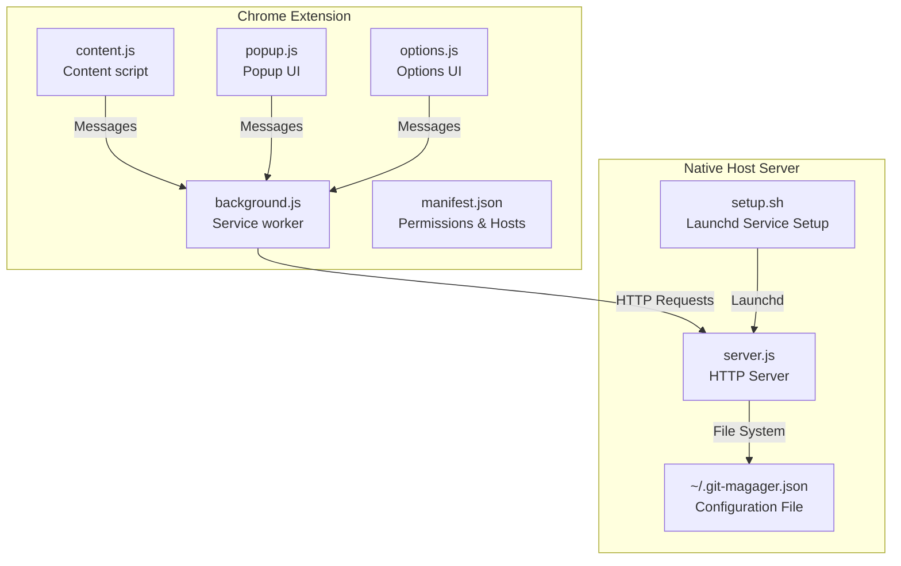
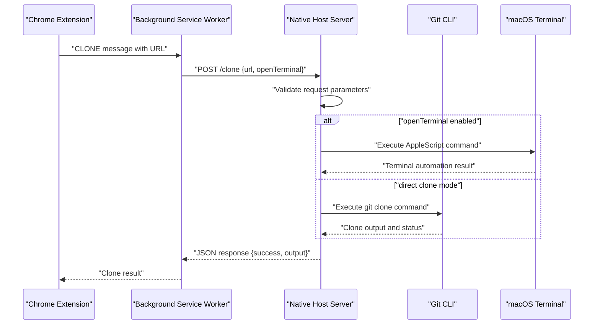
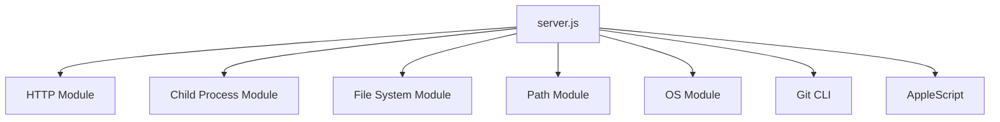

# Native Host Server

<cite>
**Referenced Files in This Document**
- [README.md](file://README.md)
- [package.json](file://native-host/package.json)
- [server.js](file://native-host/server.js)
- [setup.sh](file://native-host/setup.sh)
- [manifest.json](file://chrome-extension/manifest.json)
- [background.js](file://chrome-extension/background.js)
- [content.js](file://chrome-extension/content.js)
- [popup.js](file://chrome-extension/popup.js)
- [options.js](file://chrome-extension/options.js)
</cite>

## Table of Contents
1. [Introduction](#introduction)
2. [Project Structure](#project-structure)
3. [Core Components](#core-components)
4. [Architecture Overview](#architecture-overview)
5. [Detailed Component Analysis](#detailed-component-analysis)
6. [Dependency Analysis](#dependency-analysis)
7. [Performance Considerations](#performance-considerations)
8. [Security Considerations](#security-considerations)
9. [Troubleshooting Guide](#troubleshooting-guide)
10. [Platform Compatibility](#platform-compatibility)
11. [Conclusion](#conclusion)

## Introduction
This document provides comprehensive documentation for the native host server component that powers the Git Magager Chrome extension. The native host is a local HTTP server that exposes endpoints for health checks, configuration management, and Git repository cloning. It integrates with the Chrome extension via a secure loopback interface and supports macOS-specific terminal automation for seamless cloning workflows.

The server runs locally on the user's machine and communicates exclusively with the Chrome extension through localhost, ensuring secure and isolated operation. It manages configuration persistence, validates requests, executes Git commands, and handles platform-specific terminal integrations.

## Project Structure
The project consists of two primary components:
- Native host server: A Node.js HTTP server located in the native-host directory
- Chrome extension: A Manifest V3 extension that communicates with the native host server



**Diagram sources**
- [server.js](file://native-host/server.js)
- [setup.sh](file://native-host/setup.sh)
- [manifest.json](file://chrome-extension/manifest.json)
- [background.js](file://chrome-extension/background.js)

**Section sources**
- [README.md](file://README.md)
- [package.json](file://native-host/package.json)

## Core Components
The native host server comprises several core components that handle HTTP communication, configuration management, Git operations, and system integration.

### HTTP Server Implementation
The server uses Node.js built-in HTTP module to create a lightweight local server listening on localhost. It implements four primary endpoints with specific request/response patterns and error handling strategies.

### Configuration Management System
The server maintains a JSON configuration file in the user's home directory with default values and supports runtime updates. It handles file persistence, validation, and merging of user preferences.

### Git Operation Handlers
The server provides two primary Git operation modes: direct cloning via Git CLI and terminal-based cloning with automated shell scripting for macOS applications.

### Launchd Service Integration
The setup script configures the server to start automatically using macOS launchd, ensuring reliable background operation without manual intervention.

**Section sources**
- [server.js](file://native-host/server.js)
- [setup.sh](file://native-host/setup.sh)

## Architecture Overview
The system follows a client-server architecture where the Chrome extension acts as the client and the native host server operates as the backend service.



**Diagram sources**
- [background.js](file://chrome-extension/background.js)
- [server.js](file://native-host/server.js)

**Section sources**
- [background.js](file://chrome-extension/background.js)
- [server.js](file://native-host/server.js)

## Detailed Component Analysis

### HTTP Server Endpoints

#### Health Check Endpoint (/health)
The health endpoint provides a simple status check for the server's operational state.

**Endpoint Definition:**
- Method: GET
- Path: /health
- Response: JSON object containing status and version information
- Status Codes: 200 OK

**Response Schema:**
```json
{
  "status": "ok",
  "version": "1.0.0"
}
```

**Implementation Details:**
- Returns immediate success response without external dependencies
- Used by the extension to verify server availability
- Supports CORS for Chrome extension origin

#### Configuration Management Endpoints

##### Get Configuration (/config - GET)
Retrieves the current server configuration from persistent storage.

**Endpoint Definition:**
- Method: GET
- Path: /config
- Response: JSON object containing current configuration
- Status Codes: 200 OK

**Response Schema:**
```json
{
  "cloneDirectory": "/Users/username/Projects",
  "openInTerminal": true,
  "terminalApp": "Terminal"
}
```

##### Update Configuration (/config - POST)
Updates the server configuration with user-specified values.

**Endpoint Definition:**
- Method: POST
- Path: /config
- Request Body: JSON object with partial configuration updates
- Response: JSON object indicating success or error
- Status Codes: 200 OK, 400 Bad Request, 500 Internal Server Error

**Request Schema:**
```json
{
  "cloneDirectory": "/path/to/directory",
  "openInTerminal": true,
  "terminalApp": "Terminal|iTerm|Warp"
}
```

**Response Schema:**
```json
{
  "success": true,
  "config": {
    "cloneDirectory": "/path/to/directory",
    "openInTerminal": true,
    "terminalApp": "Terminal"
  }
}
```

#### Clone Operation Endpoint (/clone - POST)
Performs Git repository cloning with support for terminal automation.

**Endpoint Definition:**
- Method: POST
- Path: /clone
- Request Body: JSON object containing repository URL and optional terminal preference
- Response: JSON object with operation result
- Status Codes: 200 OK, 400 Bad Request, 500 Internal Server Error

**Request Schema:**
```json
{
  "url": "https://github.com/user/repo.git",
  "openTerminal": true
}
```

**Response Schema:**
```json
{
  "success": true,
  "output": "Cloning into 'repo'...",
  "stderr": ""
}
```

**Section sources**
- [server.js](file://native-host/server.js)

### Configuration Management System

#### Default Configuration Values
The server initializes with sensible defaults for optimal user experience:

| Parameter | Type | Default Value | Description |
|-----------|------|---------------|-------------|
| cloneDirectory | String | `~/Projects` | Base directory for cloned repositories |
| openInTerminal | Boolean | `true` | Whether to open terminal for cloning |
| terminalApp | String | `"Terminal"` | Preferred terminal application |

#### Configuration Persistence
Configuration is stored as a JSON file in the user's home directory with automatic backup of default values.

**File Location:** `~/.git-magager.json`

**Section sources**
- [server.js](file://native-host/server.js)

### Git Operation Handlers

#### Direct Cloning Mode
When terminal automation is disabled, the server executes Git commands directly using the system's Git installation.

**Process Flow:**
1. Validate repository URL format
2. Ensure clone directory exists (create if missing)
3. Execute `git clone` command with sanitized parameters
4. Capture stdout/stderr output
5. Return structured response with operation status

#### Terminal Automation Mode (macOS)
When enabled, the server automates terminal-based cloning using AppleScript to integrate with popular macOS terminals.

**Supported Terminals:**
- **Terminal.app** (Default): Uses AppleScript to create new terminal sessions
- **iTerm**: Creates new iTerm windows with configured profiles
- **Warp**: Activates Warp and simulates keyboard input for terminal commands

**Security Considerations:**
- Terminal automation requires user permission for accessibility features
- Commands are constructed with proper escaping to prevent shell injection
- Output is captured and returned to the extension without exposing sensitive paths

**Section sources**
- [server.js](file://native-host/server.js)

### Launchd Service Integration

#### Service Registration
The setup script configures the server to start automatically using macOS launchd:

**Service Properties:**
- Label: `com.git-magager.host`
- Program: Node.js executable path
- Arguments: Path to server.js
- RunAtLoad: Enabled
- KeepAlive: Enabled
- Log Paths: Separate stdout and stderr log files

**Installation Process:**
1. Verify Node.js installation
2. Create default configuration file
3. Generate launchd plist configuration
4. Load service with launchctl
5. Test server connectivity

**Log Management:**
- Standard output: `~/.git-magager.log`
- Standard error: `~/.git-magager-error.log`

**Section sources**
- [setup.sh](file://native-host/setup.sh)

## Dependency Analysis



**Diagram sources**
- [server.js](file://native-host/server.js)

**Section sources**
- [server.js](file://native-host/server.js)

## Performance Considerations
The native host server is designed for lightweight operation with minimal resource consumption:

### Resource Usage
- **Memory**: Minimal footprint due to synchronous HTTP handling
- **CPU**: Low overhead during idle periods
- **Disk**: Configuration file I/O occurs only on initialization and updates

### Concurrency Model
- Single-threaded event loop using Node.js HTTP server
- Synchronous file operations for configuration management
- Asynchronous Git operations using child process execution

### Scalability Limitations
- Not designed for concurrent high-volume operations
- Suitable for typical developer usage patterns
- May benefit from connection pooling if extended to handle multiple simultaneous clones

## Security Considerations

### Local Communication Protocol
The server communicates exclusively over localhost using HTTP protocol with strict origin validation:

**Security Measures:**
- CORS headers restricted to Chrome extension origins
- Loopback interface binding prevents external access
- Request validation prevents malformed payload processing
- Command execution uses sanitized parameters

### Platform-Specific Security
**macOS Terminal Automation:**
- Requires accessibility permissions for AppleScript execution
- Terminal commands are constructed with proper escaping
- No sensitive credential exposure in logs or responses

**Cross-Platform Risks:**
- Current implementation is macOS-specific
- Linux/Windows would require separate terminal automation approaches
- Git CLI availability is essential for operation

### Input Validation and Sanitization
- JSON parsing with comprehensive error handling
- URL validation for repository addresses
- Parameter sanitization for shell command construction

**Section sources**
- [server.js](file://native-host/server.js)

## Troubleshooting Guide

### Server Startup Issues
**Common Symptoms:**
- Extension shows "Server not running" status
- Setup script fails with Node.js not found error

**Diagnostic Steps:**
1. Verify Node.js installation: `node --version`
2. Check server port availability: `lsof -i :9456`
3. Review launchd service status: `launchctl print user/\$UID/com.git-magager.host`
4. Examine log files: `tail -f ~/.git-magager.log`

**Resolution Procedures:**
- Install Node.js if missing (minimum supported version)
- Unload/load service: `launchctl unload ~/Library/LaunchAgents/com.git-magager.host.plist && launchctl load ~/Library/LaunchAgents/com.git-magager.host.plist`
- Restart browser extension and reload page

### Configuration Problems
**Symptoms:**
- Settings not persisting between sessions
- Default configuration not applied

**Troubleshooting Steps:**
1. Verify configuration file existence: `ls -la ~/.git-magager.json`
2. Check file permissions: `ls -l ~/.git-magager.json`
3. Validate JSON syntax: `cat ~/.git-magager.json | jq .`
4. Reset to defaults: Remove configuration file and restart service

### Git Operation Failures
**Common Issues:**
- Git command execution errors
- Permission denied for clone directory
- Network connectivity problems

**Diagnostic Commands:**
```bash
# Test Git availability
which git

# Test clone command manually
git clone https://github.com/user/repo.git ~/test

# Check directory permissions
ls -la ~/Projects
```

**Section sources**
- [setup.sh](file://native-host/setup.sh)
- [server.js](file://native-host/server.js)

## Platform Compatibility

### Current Platform Support
**Primary Platform:** macOS (Intel and Apple Silicon)
- Full support for Terminal.app, iTerm, and Warp terminals
- Native AppleScript automation capabilities
- Launchd service integration

**Limited Support:** Linux
- HTTP server functionality remains identical
- Git CLI integration preserved
- Terminal automation requires adaptation for xterm, gnome-terminal, etc.

**Unsupported:** Windows
- AppleScript-based terminal automation not applicable
- PowerShell/Command Prompt alternatives would require significant implementation
- Launchd service replacement needed

### Cross-Platform Adaptation Strategy
For extending to other platforms, consider:

1. **Terminal Automation Abstraction:**
   - Platform-specific command execution
   - Unified interface for terminal operations
   - Fallback to direct Git execution

2. **Service Management:**
   - Windows: Task Scheduler or Windows Services
   - Linux: systemd units or cron jobs
   - macOS: Existing launchd implementation

3. **File System Differences:**
   - Home directory detection across platforms
   - Configuration file location standardization
   - Path separator handling

## Conclusion
The native host server provides a robust foundation for Git operations integration with the Chrome extension. Its architecture balances simplicity with functionality, offering reliable repository cloning through both direct Git execution and automated terminal workflows.

Key strengths include:
- Secure localhost-only communication
- Comprehensive error handling and logging
- Automatic startup via launchd service
- Extensible configuration system
- Platform-specific terminal integration

Areas for potential improvement include:
- Enhanced cross-platform support
- Connection pooling for concurrent operations
- Advanced Git operation monitoring
- Plugin architecture for additional repository providers

The current implementation successfully demonstrates how a lightweight native component can enhance browser-based development workflows while maintaining security and reliability standards.