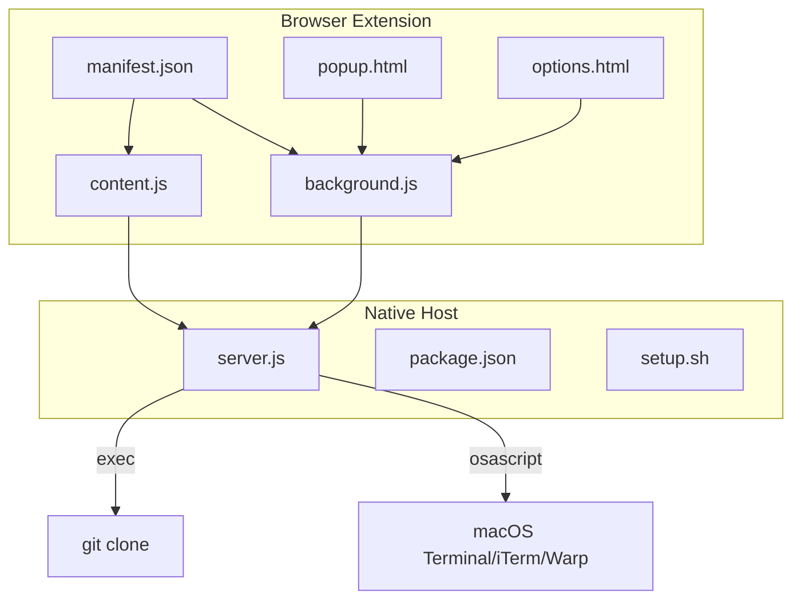
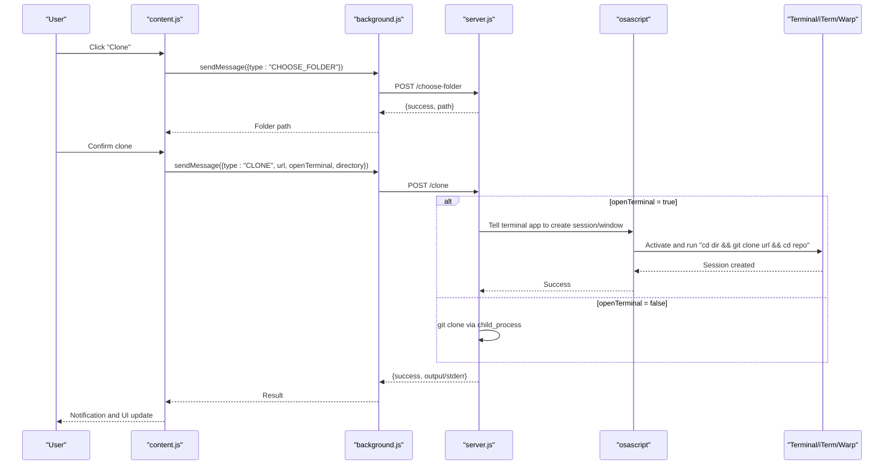
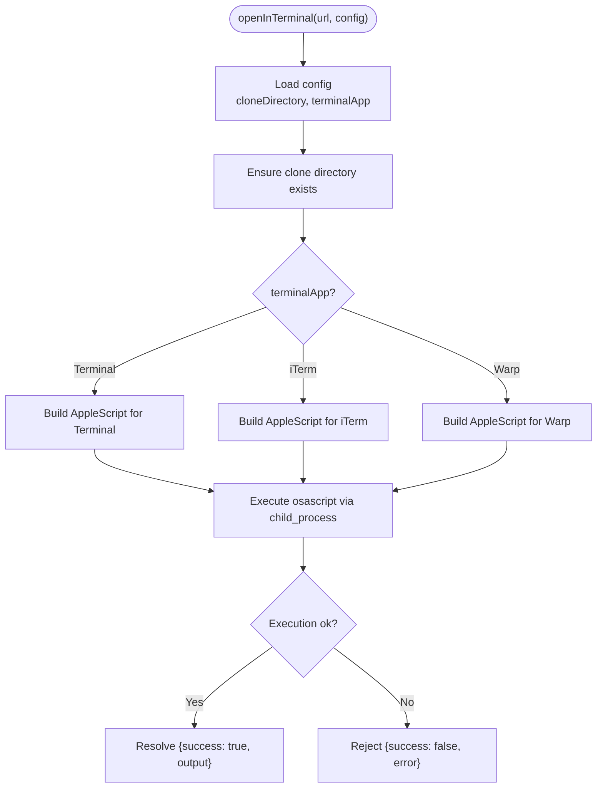
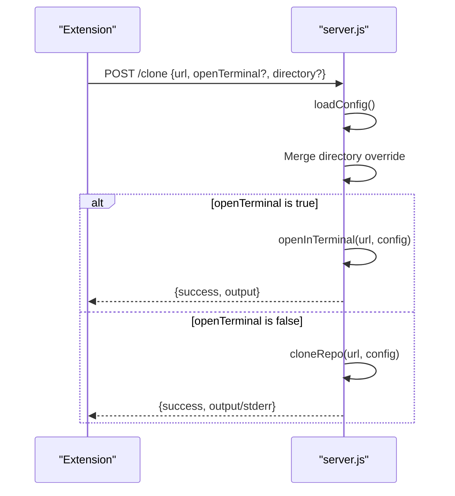
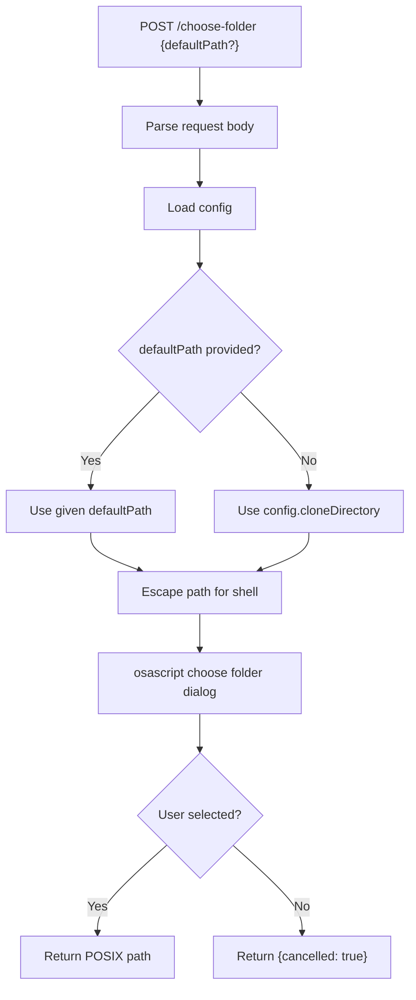
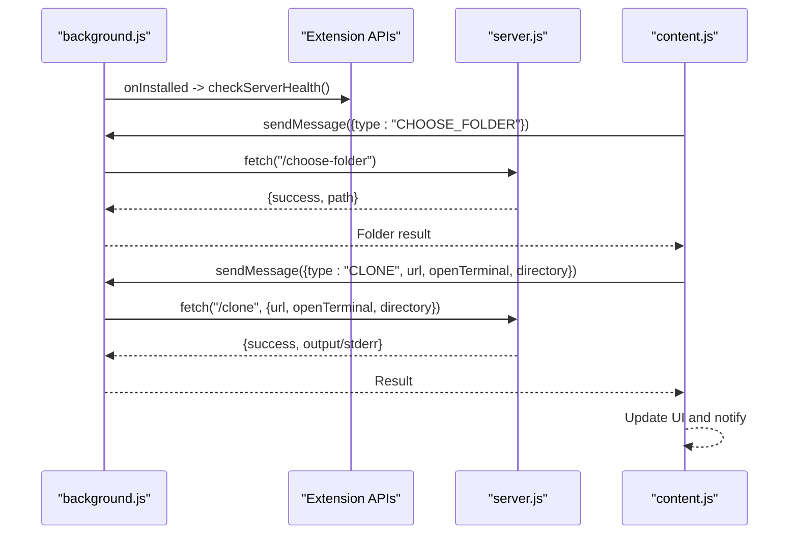
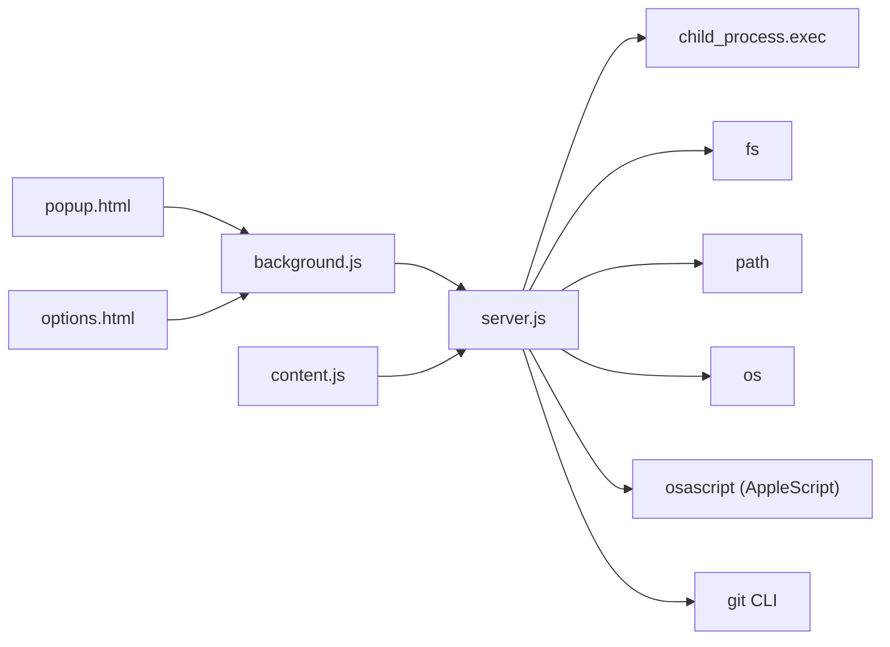

# Terminal Automation

<cite>
**Referenced Files in This Document**
- [README.md](file://README.md)
- [chrome-extension/manifest.json](file://chrome-extension/manifest.json)
- [chrome-extension/background.js](file://chrome-extension/background.js)
- [chrome-extension/content.js](file://chrome-extension/content.js)
- [chrome-extension/popup.html](file://chrome-extension/popup.html)
- [chrome-extension/options.html](file://chrome-extension/options.html)
- [native-host/server.js](file://native-host/server.js)
- [native-host/package.json](file://native-host/package.json)
- [native-host/setup.sh](file://native-host/setup.sh)
</cite>

## Table of Contents
1. [Introduction](#introduction)
2. [Project Structure](#project-structure)
3. [Core Components](#core-components)
4. [Architecture Overview](#architecture-overview)
5. [Detailed Component Analysis](#detailed-component-analysis)
6. [Dependency Analysis](#dependency-analysis)
7. [Performance Considerations](#performance-considerations)
8. [Troubleshooting Guide](#troubleshooting-guide)
9. [Conclusion](#conclusion)

## Introduction
This document explains the terminal automation system for macOS applications integrated with a Chrome extension. It focuses on how the extension triggers cloning of Git repositories and optionally opens a terminal application to display or execute the operation. The automation leverages a local companion server that runs on macOS, communicates with AppleScript to control Terminal, iTerm, and Warp, and manages process execution via Node’s child process module.

The goal is to help both developers and users understand:
- How the Chrome extension coordinates cloning and terminal automation
- How the native server constructs and executes terminal commands
- How promises and async flows propagate errors
- Platform-specific considerations for macOS automation
- Practical workflows and troubleshooting tips

## Project Structure
The project consists of:
- A Chrome extension (manifest v3) that injects UI into GitHub/GitLab pages and sends requests to a local server
- A native host server written in Node.js that exposes HTTP endpoints for health checks, configuration, folder selection, and cloning
- A setup script to install and auto-start the server via launchd

**Diagram sources**
- [chrome-extension/manifest.json:1-50](file://chrome-extension/manifest.json#L1-L50)
- [chrome-extension/background.js:1-74](file://chrome-extension/background.js#L1-L74)
- [chrome-extension/content.js:1-333](file://chrome-extension/content.js#L1-L333)
- [chrome-extension/popup.html:1-77](file://chrome-extension/popup.html#L1-L77)
- [chrome-extension/options.html:1-222](file://chrome-extension/options.html#L1-L222)
- [native-host/server.js:1-263](file://native-host/server.js#L1-L263)
- [native-host/package.json:1-12](file://native-host/package.json#L1-L12)
- [native-host/setup.sh:1-102](file://native-host/setup.sh#L1-L102)

**Section sources**
- [README.md:1-3](file://README.md#L1-L3)
- [chrome-extension/manifest.json:1-50](file://chrome-extension/manifest.json#L1-L50)
- [native-host/package.json:1-12](file://native-host/package.json#L1-L12)

## Core Components
- Chrome Extension (manifest v3): Defines permissions, host permissions, content scripts, and action popup/options pages.
- Background Service Worker: Handles messaging with content scripts and popup, forwards requests to the local server, and checks server health.
- Content Script: Detects repository pages, extracts clone URLs, injects UI, and triggers cloning with optional terminal automation.
- Native Host Server: Exposes HTTP endpoints, loads/saves configuration, chooses folders, clones repositories, and opens terminals via AppleScript.
- Setup Script: Installs the server as a launchd agent, creates default configuration, and tests server availability.

Key responsibilities:
- Terminal automation is performed by the native host server using AppleScript to target Terminal, iTerm, or Warp.
- Cloning is executed either directly via the server or inside a terminal session depending on user preferences.
- Async flows use promises and propagate errors to the extension UI.

**Section sources**
- [chrome-extension/manifest.json:1-50](file://chrome-extension/manifest.json#L1-L50)
- [chrome-extension/background.js:11-74](file://chrome-extension/background.js#L11-L74)
- [chrome-extension/content.js:111-163](file://chrome-extension/content.js#L111-L163)
- [native-host/server.js:17-37](file://native-host/server.js#L17-L37)
- [native-host/server.js:45-64](file://native-host/server.js#L45-L64)
- [native-host/server.js:66-111](file://native-host/server.js#L66-L111)
- [native-host/server.js:113-135](file://native-host/server.js#L113-L135)
- [native-host/setup.sh:23-39](file://native-host/setup.sh#L23-L39)

## Architecture Overview
The extension communicates with the native host server over HTTP on localhost. The server performs file system operations, executes shell commands, and controls macOS applications via AppleScript.

**Diagram sources**
- [chrome-extension/content.js:111-163](file://chrome-extension/content.js#L111-L163)
- [chrome-extension/background.js:24-73](file://chrome-extension/background.js#L24-L73)
- [native-host/server.js:113-135](file://native-host/server.js#L113-L135)
- [native-host/server.js:213-251](file://native-host/server.js#L213-L251)
- [native-host/server.js:66-111](file://native-host/server.js#L66-L111)

## Detailed Component Analysis

### Terminal Automation Function: openInTerminal
The native host server implements a terminal automation function that:
- Reads configuration (clone directory, terminal app choice)
- Ensures the clone directory exists
- Builds an AppleScript command tailored to the selected terminal application
- Executes the AppleScript via a shell command
- Resolves or rejects based on execution outcome

Command construction and execution:
- Terminal: Creates a new script in the active Terminal application and runs a shell command that navigates to the clone directory, clones the repository, and enters the newly created directory.
- iTerm: Activates iTerm, creates a new window with the default profile, and writes a command to the current session that performs the same actions.
- Warp: Activates Warp, simulates pressing Command+T to open a new tab, types the command, and presses Enter.

Promise-based async handling:
- The function returns a Promise wrapping the child process execution.
- On success, resolves with a success flag and captured output.
- On failure, rejects with an error message.

Platform-specific considerations:
- Requires macOS with the specified terminal application installed.
- Uses AppleScript to control applications; ensure accessibility permissions are granted if needed.
- The command string is constructed carefully to escape paths and repository names.

**Diagram sources**
- [native-host/server.js:66-111](file://native-host/server.js#L66-L111)

**Section sources**
- [native-host/server.js:66-111](file://native-host/server.js#L66-L111)

### Clone Endpoint and Terminal Decision
The clone endpoint accepts a request with the repository URL, optional directory override, and a flag to open in terminal. It:
- Loads configuration
- Overrides clone directory if provided
- Decides whether to open in terminal or run in background
- Calls either the terminal automation function or the direct clone function
- Returns structured results to the caller

**Diagram sources**
- [native-host/server.js:213-251](file://native-host/server.js#L213-L251)
- [native-host/server.js:45-64](file://native-host/server.js#L45-L64)
- [native-host/server.js:66-111](file://native-host/server.js#L66-L111)

**Section sources**
- [native-host/server.js:213-251](file://native-host/server.js#L213-L251)

### Folder Selection Workflow
The folder selection endpoint:
- Accepts a default path (or uses the configured clone directory)
- Escapes the path for safe shell usage
- Invokes an AppleScript dialog to present a native folder picker
- Returns the chosen path or indicates cancellation

**Diagram sources**
- [native-host/server.js:113-135](file://native-host/server.js#L113-L135)

**Section sources**
- [native-host/server.js:113-135](file://native-host/server.js#L113-L135)

### Extension Messaging and UI Integration
The extension:
- Background worker listens for messages and forwards them to the server
- Content script injects UI on supported pages, detects clone URLs, and triggers cloning
- Popup and options pages manage configuration and server status

**Diagram sources**
- [chrome-extension/background.js:24-73](file://chrome-extension/background.js#L24-L73)
- [chrome-extension/content.js:111-163](file://chrome-extension/content.js#L111-L163)
- [native-host/server.js:113-135](file://native-host/server.js#L113-L135)
- [native-host/server.js:213-251](file://native-host/server.js#L213-L251)

**Section sources**
- [chrome-extension/background.js:11-21](file://chrome-extension/background.js#L11-L21)
- [chrome-extension/background.js:24-73](file://chrome-extension/background.js#L24-L73)
- [chrome-extension/content.js:111-163](file://chrome-extension/content.js#L111-L163)

## Dependency Analysis
- The extension depends on:
  - Manifest permissions for storage, activeTab, scripting, and host permissions for GitHub/GitLab
  - Background and content scripts for messaging and UI injection
- The native host server depends on:
  - Node core modules: http, child_process, fs, path, os
  - AppleScript for terminal automation
  - Git CLI availability for cloning

**Diagram sources**
- [chrome-extension/background.js:1-74](file://chrome-extension/background.js#L1-L74)
- [chrome-extension/content.js:1-333](file://chrome-extension/content.js#L1-L333)
- [native-host/server.js:1-6](file://native-host/server.js#L1-L6)

**Section sources**
- [chrome-extension/manifest.json:6-18](file://chrome-extension/manifest.json#L6-L18)
- [native-host/server.js:1-6](file://native-host/server.js#L1-L6)

## Performance Considerations
- The server uses synchronous filesystem checks and asynchronous child process execution. Ensure the clone directory exists before cloning to avoid repeated checks.
- AppleScript automation adds latency due to application activation and session creation. Consider batching operations if used frequently.
- The extension avoids heavy computations in content scripts; most work is delegated to the native server.
- Network overhead is minimal since the server runs locally.

## Troubleshooting Guide
Common issues and resolutions:
- Local server not running
  - Symptom: Extension shows “Local server not running” in the popup.
  - Resolution: Start the server manually or use the provided setup script to install and enable the launchd service.
  - References:
    - [chrome-extension/popup.html:55-66](file://chrome-extension/popup.html#L55-L66)
    - [native-host/setup.sh:41-81](file://native-host/setup.sh#L41-L81)

- Terminal automation fails
  - Symptom: Terminal does not open or command is not executed.
  - Checks:
    - Verify the selected terminal application is installed and reachable.
    - Confirm AppleScript can control the application (accessibility permissions).
    - Validate that the clone directory path is correct and accessible.
  - References:
    - [native-host/server.js:66-111](file://native-host/server.js#L66-L111)

- Folder picker returns cancellation
  - Symptom: User cancels folder selection.
  - Behavior: The server returns a cancellation result; the extension handles it gracefully.
  - References:
    - [native-host/server.js:113-135](file://native-host/server.js#L113-L135)

- Clone fails with error
  - Symptom: Clone endpoint returns an error payload.
  - Actions:
    - Inspect server logs for detailed error messages.
    - Verify Git is installed and accessible in PATH.
    - Ensure network connectivity for remote repositories.
  - References:
    - [native-host/server.js:45-64](file://native-host/server.js#L45-L64)
    - [native-host/server.js:213-251](file://native-host/server.js#L213-L251)

- Accessibility permissions
  - Symptom: AppleScript cannot control the terminal application.
  - Resolution: Grant accessibility permission to the browser or terminal application.
  - References:
    - [native-host/server.js:66-111](file://native-host/server.js#L66-L111)

**Section sources**
- [chrome-extension/popup.html:55-66](file://chrome-extension/popup.html#L55-L66)
- [native-host/server.js:45-64](file://native-host/server.js#L45-L64)
- [native-host/server.js:66-111](file://native-host/server.js#L66-L111)
- [native-host/server.js:113-135](file://native-host/server.js#L113-L135)
- [native-host/server.js:213-251](file://native-host/server.js#L213-L251)
- [native-host/setup.sh:41-81](file://native-host/setup.sh#L41-L81)

## Conclusion
The terminal automation system integrates a Chrome extension with a native macOS server to provide seamless Git cloning with optional terminal automation. The server encapsulates platform-specific AppleScript logic, manages configuration, and orchestrates process execution. The extension provides a user-friendly interface and robust async communication. By understanding the flow and potential pitfalls, users and developers can effectively troubleshoot and extend the system.