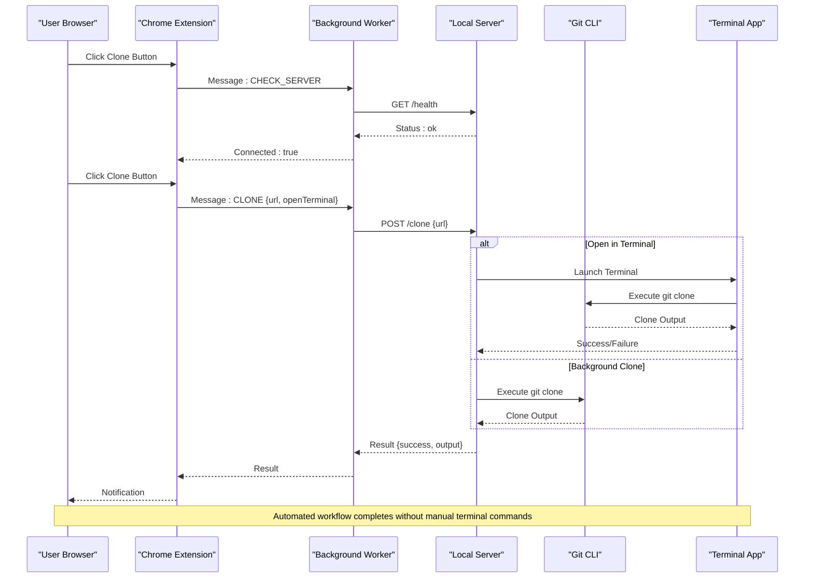
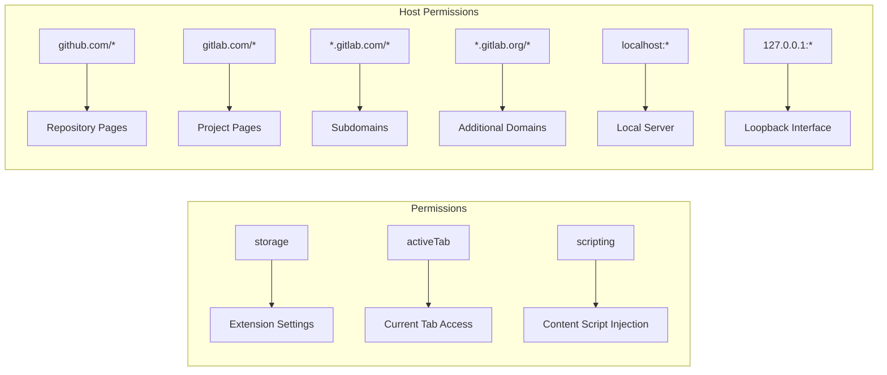
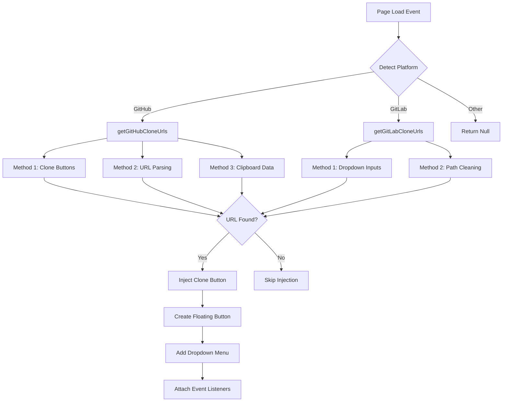
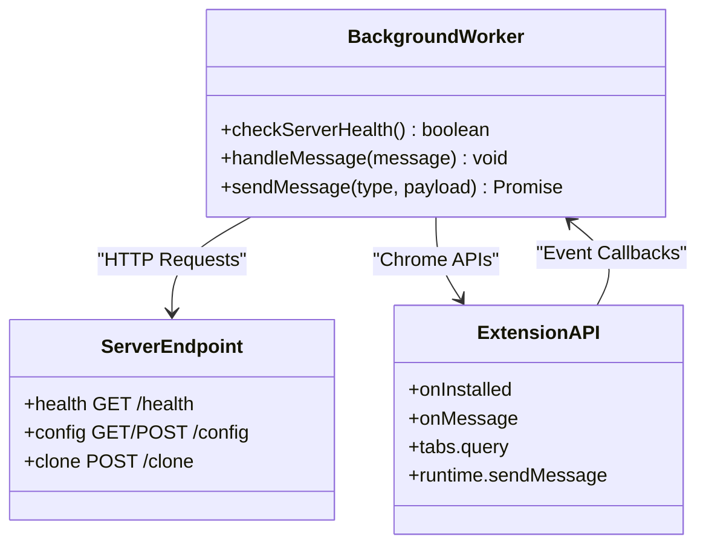
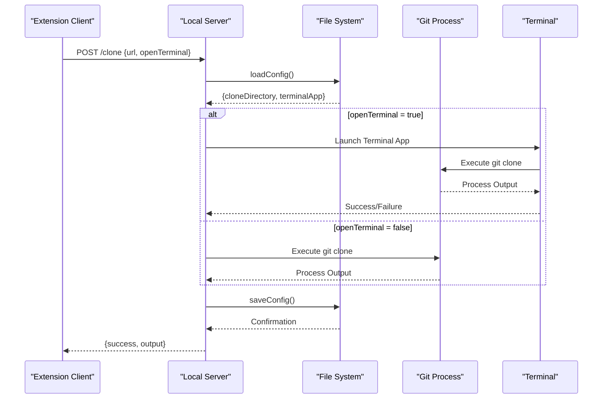
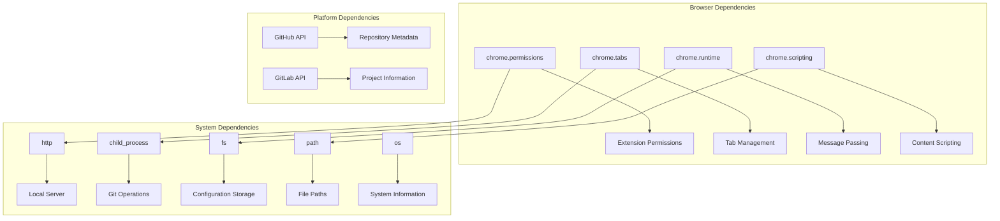

# Project Overview

<cite>
**Referenced Files in This Document**
- [README.md](file://README.md)
- [manifest.json](file://chrome-extension/manifest.json)
- [background.js](file://chrome-extension/background.js)
- [content.js](file://chrome-extension/content.js)
- [content.css](file://chrome-extension/content.css)
- [popup.html](file://chrome-extension/popup.html)
- [popup.js](file://chrome-extension/popup.js)
- [options.html](file://chrome-extension/options.html)
- [options.js](file://chrome-extension/options.js)
- [server.js](file://native-host/server.js)
- [package.json](file://native-host/package.json)
- [setup.sh](file://native-host/setup.sh)
</cite>

## Table of Contents
1. [Introduction](#introduction)
2. [Project Structure](#project-structure)
3. [Core Components](#core-components)
4. [Architecture Overview](#architecture-overview)
5. [Detailed Component Analysis](#detailed-component-analysis)
6. [Dependency Analysis](#dependency-analysis)
7. [Performance Considerations](#performance-considerations)
8. [Troubleshooting Guide](#troubleshooting-guide)
9. [Conclusion](#conclusion)

## Introduction
Git Magager is a Chrome extension designed to simplify Git repository cloning from popular hosting platforms without requiring terminal commands. It provides a seamless, one-click cloning experience for repositories hosted on GitHub and GitLab, with automatic URL detection and floating clone buttons integrated directly into the platform UI.

The project combines two complementary technologies: a Chrome extension that handles user interface and browser integration, and a native host server that executes Git operations locally. This hybrid architecture ensures secure permissions management while enabling powerful automation capabilities.

## Project Structure
The project follows a clear separation of concerns with distinct components for browser integration and local system operations:

```mermaid
graph TB
subgraph "Chrome Extension"
A[manifest.json]
B[background.js]
C[content.js]
D[popup.html/js]
E[options.html/js]
F[content.css]
end
subgraph "Native Host"
G[server.js]
H[package.json]
I[setup.sh]
end
subgraph "External Dependencies"
J[GitHub]
K[GitLab]
L[Local Terminal]
end
A --> B
A --> C
B <- --> G
C --> G
D --> B
E --> B
G --> L
C --> J
C --> K
```

**Diagram sources**
- [manifest.json:1-50](file://chrome-extension/manifest.json#L1-L50)
- [background.js:1-62](file://chrome-extension/background.js#L1-L62)
- [content.js:1-320](file://chrome-extension/content.js#L1-L320)
- [server.js:1-210](file://native-host/server.js#L1-L210)

**Section sources**
- [manifest.json:1-50](file://chrome-extension/manifest.json#L1-L50)
- [README.md:1-3](file://README.md#L1-L3)

## Core Components
Git Magager consists of four primary components working together to deliver a seamless cloning experience:

### Chrome Extension Components
- **Manifest Configuration**: Defines permissions, host permissions, and extension metadata
- **Background Service Worker**: Handles cross-origin communication and server health checks
- **Content Scripts**: Automatic URL detection and UI injection for GitHub and GitLab
- **Popup Interface**: Manual cloning interface with configuration options
- **Options Page**: Advanced settings management for clone behavior

### Native Host Components
- **Local HTTP Server**: Provides secure localhost communication for Git operations
- **Configuration Management**: Persistent settings stored in user home directory
- **Terminal Automation**: Integrates with macOS Terminal applications for automated workflows

**Section sources**
- [manifest.json:1-50](file://chrome-extension/manifest.json#L1-L50)
- [background.js:1-62](file://chrome-extension/background.js#L1-L62)
- [content.js:1-320](file://chrome-extension/content.js#L1-L320)
- [server.js:1-210](file://native-host/server.js#L1-L210)

## Architecture Overview
The system employs a hybrid architecture that balances security with functionality through a clear separation between browser-based UI and local system operations:



**Diagram sources**
- [background.js:24-61](file://chrome-extension/background.js#L24-L61)
- [content.js:113-150](file://chrome-extension/content.js#L113-L150)
- [server.js:164-198](file://native-host/server.js#L164-L198)

The architecture provides several key benefits:
- **Security Isolation**: Local server runs on localhost (127.0.0.1) preventing external access
- **Permission Management**: Chrome extension handles browser permissions while local server manages system operations
- **Cross-Platform Compatibility**: Works with multiple terminal applications and Git hosting platforms
- **Automatic Integration**: Seamless UI integration with GitHub and GitLab interfaces

## Detailed Component Analysis

### Chrome Extension Manifest and Permissions
The extension manifest defines comprehensive permissions for seamless operation across multiple domains and contexts:



**Diagram sources**
- [manifest.json:6-18](file://chrome-extension/manifest.json#L6-L18)

The manifest grants essential permissions for:
- **Storage Access**: Persistent configuration and user preferences
- **Active Tab Interaction**: Access to current browsing context for URL detection
- **Script Injection**: Dynamic content modification for UI integration
- **Multi-Domain Support**: Comprehensive coverage of GitHub and GitLab ecosystems

**Section sources**
- [manifest.json:1-50](file://chrome-extension/manifest.json#L1-L50)

### Content Script URL Detection and UI Integration
The content script implements sophisticated URL detection algorithms tailored to each platform:



**Diagram sources**
- [content.js:15-95](file://chrome-extension/content.js#L15-L95)
- [content.js:172-245](file://chrome-extension/content.js#L172-L245)

The URL detection system employs three complementary approaches:
1. **Direct Element Detection**: Extracts URLs from existing clone interface elements
2. **Pattern Recognition**: Parses repository URLs from page structure
3. **Attribute Extraction**: Reads URLs from clipboard data attributes

**Section sources**
- [content.js:1-320](file://chrome-extension/content.js#L1-L320)

### Background Service Worker Communication
The background worker serves as the central coordinator for extension functionality:



**Diagram sources**
- [background.js:1-62](file://chrome-extension/background.js#L1-L62)

The worker manages four primary message types:
- **CHECK_SERVER**: Verifies local server availability
- **CLONE**: Initiates repository cloning process
- **GET_CONFIG**: Retrieves user preferences
- **SET_CONFIG**: Updates configuration settings

**Section sources**
- [background.js:1-62](file://chrome-extension/background.js#L1-L62)

### Native Host Server Operations
The local server provides secure, persistent Git operations:



**Diagram sources**
- [server.js:164-198](file://native-host/server.js#L164-L198)

The server implements robust error handling and logging:
- **Configuration Persistence**: JSON file storage in user home directory
- **Process Management**: Child process execution with proper error propagation
- **Terminal Integration**: AppleScript automation for macOS terminal applications
- **Cross-Platform Considerations**: Extensible architecture for future platform support

**Section sources**
- [server.js:1-210](file://native-host/server.js#L1-L210)

### User Interface Components
The extension provides multiple interface modes for different user workflows:

#### Popup Interface
The popup offers manual cloning with advanced configuration options:
- **Auto-detected URLs**: Pre-filled repository URLs from current tab
- **Protocol Switching**: Seamless HTTPS/SSH conversion
- **Terminal Control**: Toggle for automated terminal opening
- **Visual Feedback**: Animated buttons with success/error states

#### Content Script Integration
Floating clone buttons integrate directly into platform UI:
- **GitHub Integration**: Enhanced "Code" button area integration
- **GitLab Integration**: Project page button placement
- **Dropdown Selection**: HTTPS/SSH protocol choice
- **Real-time Updates**: MutationObserver for SPA navigation support

**Section sources**
- [popup.html:1-77](file://chrome-extension/popup.html#L1-L77)
- [popup.js:1-168](file://chrome-extension/popup.js#L1-L168)
- [content.css:1-175](file://chrome-extension/content.css#L1-L175)

## Dependency Analysis
The project maintains minimal external dependencies while leveraging essential browser and system APIs:



**Diagram sources**
- [manifest.json:6-18](file://chrome-extension/manifest.json#L6-L18)
- [background.js:1-62](file://chrome-extension/background.js#L1-L62)
- [server.js:1-6](file://native-host/server.js#L1-L6)

The dependency structure ensures:
- **Minimal Browser Impact**: Uses only essential Chrome extension APIs
- **Secure Local Operations**: All Git operations occur on localhost
- **Platform Agnostic Design**: Extensible architecture for additional Git hosting platforms
- **Robust Error Handling**: Comprehensive error propagation and user feedback

**Section sources**
- [manifest.json:1-50](file://chrome-extension/manifest.json#L1-L50)
- [background.js:1-62](file://chrome-extension/background.js#L1-L62)
- [server.js:1-210](file://native-host/server.js#L1-L210)

## Performance Considerations
The hybrid architecture balances functionality with performance through strategic design decisions:

### Memory Management
- **Content Script Prevention**: Double-injection protection prevents memory leaks
- **DOM Cleanup**: Automatic removal of injected elements on navigation
- **Observer Optimization**: Debounced mutation observers prevent excessive processing

### Network Efficiency
- **Local Communication**: All extension-server communication occurs over localhost
- **Connection Reuse**: Persistent server connection reduces overhead
- **Batch Operations**: Coalesced DOM mutations minimize layout thrashing

### User Experience Optimization
- **Progress Indicators**: Animated buttons provide immediate feedback
- **Graceful Degradation**: UI remains functional even with server unavailability
- **Intelligent Caching**: URL detection results cached during navigation

## Troubleshooting Guide

### Common Issues and Solutions

#### Server Not Running
**Symptoms**: Clone button disabled, server status shows disconnected
**Solution**: Start the native host server using the setup script
- Verify Node.js installation: `node --version`
- Run setup script: `./native-host/setup.sh`
- Check server status: `curl http://127.0.0.1:9456/health`

#### Permission Denied Errors
**Symptoms**: Git operations fail with permission errors
**Solution**: Verify extension permissions and terminal access
- Check Chrome extension permissions in settings
- Verify terminal application accessibility
- Review system security settings for automation access

#### URL Detection Failures
**Symptoms**: Clone buttons not appearing on supported platforms
**Solution**: Verify platform-specific URL detection
- Check if repository URL matches supported patterns
- Verify network connectivity to hosting platforms
- Review browser console for JavaScript errors

#### Configuration Issues
**Symptoms**: Incorrect clone directory or terminal application
**Solution**: Reset and reconfigure extension settings
- Access options page through extension menu
- Verify clone directory exists and is writable
- Test terminal application selection

**Section sources**
- [setup.sh:1-102](file://native-host/setup.sh#L1-L102)
- [server.js:17-37](file://native-host/server.js#L17-L37)
- [content.js:283-319](file://chrome-extension/content.js#L283-L319)

## Conclusion
Git Magager represents a sophisticated solution for modern Git workflow automation, successfully bridging the gap between browser-based development environments and local system operations. The hybrid architecture delivers exceptional user experience while maintaining security and extensibility.

Key achievements include:
- **Seamless Integration**: Native UI integration with GitHub and GitLab platforms
- **Automated Workflows**: Complete elimination of manual terminal commands
- **Flexible Configuration**: Extensive customization options for different development workflows
- **Robust Architecture**: Secure, maintainable design supporting future platform expansion

The project serves both beginners seeking simplified Git operations and experienced developers requiring efficient repository management tools. Its thoughtful design ensures accessibility without sacrificing power or flexibility.

Future enhancement opportunities include expanded platform support, additional Git hosting integrations, and advanced workflow automation features. The modular architecture provides a solid foundation for continued evolution while maintaining the core value proposition of effortless repository cloning.