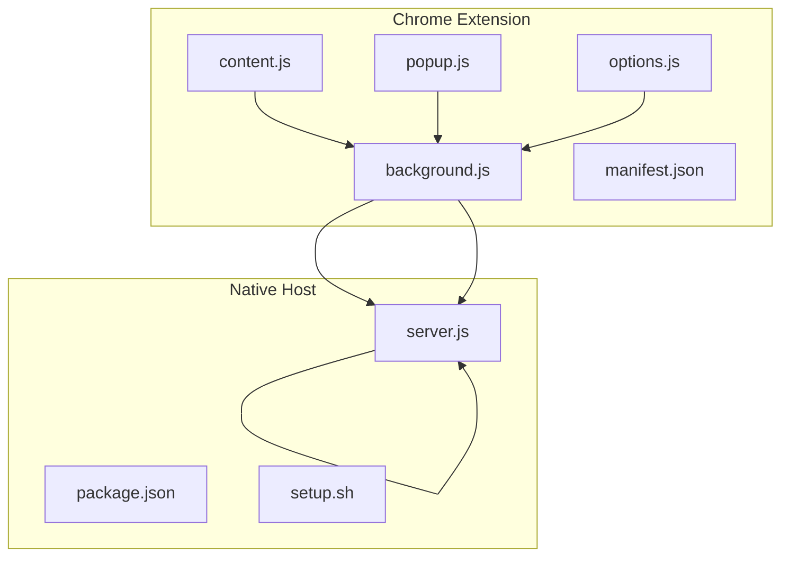
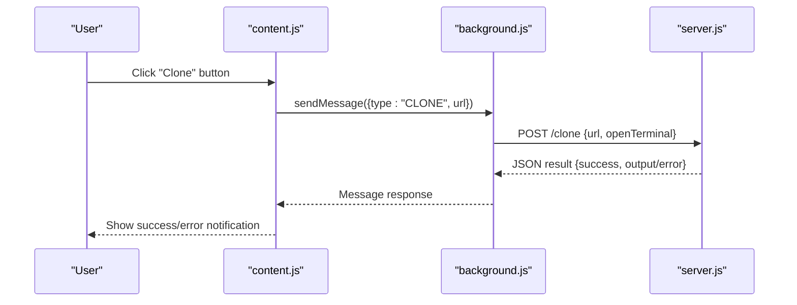

# Troubleshooting Guide

<cite>
**Referenced Files in This Document**
- [README.md](file://README.md)
- [manifest.json](file://chrome-extension/manifest.json)
- [background.js](file://chrome-extension/background.js)
- [content.js](file://chrome-extension/content.js)
- [popup.js](file://chrome-extension/popup.js)
- [popup.html](file://chrome-extension/popup.html)
- [options.js](file://chrome-extension/options.js)
- [options.html](file://chrome-extension/options.html)
- [package.json](file://native-host/package.json)
- [server.js](file://native-host/server.js)
- [setup.sh](file://native-host/setup.sh)
</cite>

## Table of Contents
1. [Introduction](#introduction)
2. [Project Structure](#project-structure)
3. [Core Components](#core-components)
4. [Architecture Overview](#architecture-overview)
5. [Installation Troubleshooting](#installation-troubleshooting)
6. [Runtime Troubleshooting](#runtime-troubleshooting)
7. [Diagnostic Procedures](#diagnostic-procedures)
8. [Platform-Specific Issues](#platform-specific-issues)
9. [Debugging Techniques](#debugging-techniques)
10. [Performance Considerations](#performance-considerations)
11. [Troubleshooting Guide](#troubleshooting-guide)
12. [Conclusion](#conclusion)

## Introduction
This guide provides comprehensive troubleshooting procedures for Git Magager, covering installation issues, runtime failures, diagnostics, and platform-specific problems. It focuses on Chrome extension permission challenges, native host registration, launchd service startup, cloning failures, URL detection problems, terminal automation issues, and performance concerns.

## Project Structure
Git Magager consists of:
- A Chrome Extension (Manifest V3) with background service worker, content scripts, popup, and options page
- A native host companion server (Node.js) exposing HTTP endpoints for cloning and configuration
- A macOS launchd setup script to auto-start the server

**Diagram sources**
- [background.js:1-74](file://chrome-extension/background.js#L1-L74)
- [content.js:1-312](file://chrome-extension/content.js#L1-L312)
- [popup.js:1-168](file://chrome-extension/popup.js#L1-L168)
- [options.js:1-56](file://chrome-extension/options.js#L1-L56)
- [manifest.json:1-50](file://chrome-extension/manifest.json#L1-L50)
- [server.js:1-271](file://native-host/server.js#L1-L271)
- [package.json:1-12](file://native-host/package.json#L1-L12)
- [setup.sh:1-102](file://native-host/setup.sh#L1-L102)

**Section sources**
- [README.md:1-3](file://README.md#L1-L3)
- [manifest.json:1-50](file://chrome-extension/manifest.json#L1-L50)
- [background.js:1-74](file://chrome-extension/background.js#L1-L74)
- [server.js:1-271](file://native-host/server.js#L1-L271)

## Core Components
- Chrome Extension background service worker: Handles messaging with the native host, health checks, and exposes endpoints for cloning and configuration updates.
- Content script: Detects repository URLs on GitHub and GitLab pages and injects clone UI elements.
- Popup and Options pages: Provide UI for manual cloning, toggling terminal behavior, and configuring defaults.
- Native host server: Runs locally on port 9456, manages configuration, performs git clones, and opens terminals on macOS.

Key implementation references:
- Background messaging and health checks: [background.js:11-21](file://chrome-extension/background.js#L11-L21)
- Clone and config endpoints: [background.js:42-73](file://chrome-extension/background.js#L42-L73)
- URL detection and button injection: [content.js:86-237](file://chrome-extension/content.js#L86-L237)
- Popup clone flow: [popup.js:94-149](file://chrome-extension/popup.js#L94-L149)
- Native host server endpoints: [server.js:145-264](file://native-host/server.js#L145-L264)

**Section sources**
- [background.js:11-73](file://chrome-extension/background.js#L11-L73)
- [content.js:86-237](file://chrome-extension/content.js#L86-L237)
- [popup.js:94-149](file://chrome-extension/popup.js#L94-L149)
- [server.js:145-264](file://native-host/server.js#L145-L264)

## Architecture Overview
The extension communicates with the native host via HTTP requests to localhost. The content script detects URLs and triggers cloning through the background script, which forwards requests to the native host.

**Diagram sources**
- [content.js:111-142](file://chrome-extension/content.js#L111-L142)
- [background.js:42-52](file://chrome-extension/background.js#L42-L52)
- [server.js:221-259](file://native-host/server.js#L221-L259)

## Installation Troubleshooting
Common installation issues and resolutions:

- Chrome extension not loading
  - Verify Developer Mode is enabled and the extension is loaded from the unpacked directory.
  - Check the extension page for errors and reload if needed.
  - References: [popup.html:68-71](file://chrome-extension/popup.html#L68-L71)

- Native host not reachable
  - Ensure the native host server is running on port 9456.
  - Use the built-in health check endpoint to confirm connectivity.
  - References: [background.js:11-21](file://chrome-extension/background.js#L11-L21), [server.js:266-270](file://native-host/server.js#L266-L270)

- Launchd service startup errors (macOS)
  - Confirm Node.js is installed and accessible.
  - Review logs for launchd service setup and server startup.
  - References: [setup.sh:15-21](file://native-host/setup.sh#L15-L21), [setup.sh:41-91](file://native-host/setup.sh#L41-L91)

- Permissions and host permissions
  - Confirm host permissions for GitHub and GitLab domains are declared.
  - References: [manifest.json:11-18](file://chrome-extension/manifest.json#L11-L18)

**Section sources**
- [popup.html:68-71](file://chrome-extension/popup.html#L68-L71)
- [background.js:11-21](file://chrome-extension/background.js#L11-L21)
- [server.js:266-270](file://native-host/server.js#L266-L270)
- [setup.sh:15-21](file://native-host/setup.sh#L15-L21)
- [setup.sh:41-91](file://native-host/setup.sh#L41-L91)
- [manifest.json:11-18](file://chrome-extension/manifest.json#L11-L18)

## Runtime Troubleshooting
Symptoms and fixes for runtime issues:

- Cloning failures
  - Validate the repository URL and network connectivity.
  - Check the native host logs for detailed error messages.
  - References: [server.js:221-259](file://native-host/server.js#L221-L259), [content.js:118-135](file://chrome-extension/content.js#L118-L135)

- URL detection problems
  - Ensure the page is a recognized repository page (GitHub/GitLab).
  - Confirm the content script injected clone buttons and dropdowns.
  - References: [content.js:86-107](file://chrome-extension/content.js#L86-L107), [content.js:164-237](file://chrome-extension/content.js#L164-L237)

- Terminal automation issues (macOS)
  - Verify the selected terminal app is installed and accessible.
  - Confirm AppleScript permissions and accessibility settings.
  - References: [server.js:66-111](file://native-host/server.js#L66-L111), [options.html:186-191](file://chrome-extension/options.html#L186-L191)

- Configuration validation errors
  - Use the options page to update and save configuration.
  - Validate JSON format and required fields.
  - References: [options.js:23-54](file://chrome-extension/options.js#L23-L54), [server.js:165-195](file://native-host/server.js#L165-L195)

**Section sources**
- [server.js:221-259](file://native-host/server.js#L221-L259)
- [content.js:86-135](file://chrome-extension/content.js#L86-L135)
- [server.js:66-111](file://native-host/server.js#L66-L111)
- [options.js:23-54](file://chrome-extension/options.js#L23-L54)
- [server.js:165-195](file://native-host/server.js#L165-L195)

## Diagnostic Procedures
Procedures to diagnose and resolve issues:

- Check server connectivity
  - Use the built-in health endpoint to verify the native host is running.
  - References: [background.js:11-21](file://chrome-extension/background.js#L11-L21), [server.js:158-163](file://native-host/server.js#L158-L163)

- Validate configuration
  - Retrieve and review current configuration via the extension.
  - References: [background.js:54-60](file://chrome-extension/background.js#L54-L60), [server.js:165-171](file://native-host/server.js#L165-L171)

- Verify Git CLI availability
  - Ensure Git is installed and accessible in the system PATH.
  - References: [server.js:52](file://native-host/server.js#L52)

- Inspect logs
  - On macOS, review launchd logs and server logs.
  - References: [setup.sh:80-81](file://native-host/setup.sh#L80-L81)

**Section sources**
- [background.js:11-21](file://chrome-extension/background.js#L11-L21)
- [server.js:158-171](file://native-host/server.js#L158-L171)
- [server.js:52](file://native-host/server.js#L52)
- [setup.sh:80-81](file://native-host/setup.sh#L80-L81)

## Platform-Specific Issues
Platform-specific considerations and remedies:

- macOS
  - Launchd service setup and logs are managed by the setup script.
  - Terminal automation relies on AppleScript and selected terminal app.
  - References: [setup.sh:41-91](file://native-host/setup.sh#L41-L91), [server.js:66-111](file://native-host/server.js#L66-L111), [options.html:186-191](file://chrome-extension/options.html#L186-L191)

- Windows/Linux
  - The native host currently targets macOS-specific terminal automation.
  - For Windows/Linux, configure the native host to use appropriate terminal commands and ensure Git is installed.
  - References: [server.js:66-111](file://native-host/server.js#L66-L111), [server.js:52](file://native-host/server.js#L52)

**Section sources**
- [setup.sh:41-91](file://native-host/setup.sh#L41-L91)
- [server.js:66-111](file://native-host/server.js#L66-L111)
- [options.html:186-191](file://chrome-extension/options.html#L186-L191)
- [server.js:52](file://native-host/server.js#L52)

## Debugging Techniques
Techniques to debug and interpret errors:

- Browser developer tools
  - Inspect the background script console for health check and messaging logs.
  - References: [background.js:11-21](file://chrome-extension/background.js#L11-L21)

- Extension debugging panel
  - Use the extension’s popup and options pages to trigger actions and observe feedback.
  - References: [popup.js:37-59](file://chrome-extension/popup.js#L37-L59), [options.js:10-20](file://chrome-extension/options.js#L10-L20)

- Native host logging
  - Review launchd logs and server logs for detailed error messages.
  - References: [setup.sh:80-81](file://native-host/setup.sh#L80-L81), [server.js:54-62](file://native-host/server.js#L54-L62)

- Error message interpretation
  - Look for explicit error messages in clone responses and logs.
  - References: [content.js:129-135](file://chrome-extension/content.js#L129-L135), [server.js:250-256](file://native-host/server.js#L250-L256)

**Section sources**
- [background.js:11-21](file://chrome-extension/background.js#L11-L21)
- [popup.js:37-59](file://chrome-extension/popup.js#L37-L59)
- [options.js:10-20](file://chrome-extension/options.js#L10-L20)
- [setup.sh:80-81](file://native-host/setup.sh#L80-L81)
- [server.js:54-62](file://native-host/server.js#L54-L62)
- [content.js:129-135](file://chrome-extension/content.js#L129-L135)
- [server.js:250-256](file://native-host/server.js#L250-L256)

## Performance Considerations
Guidance to optimize performance and reduce resource consumption:

- Minimize repeated DOM mutations
  - The content script debounces re-injection to handle SPA navigation efficiently.
  - References: [content.js:288-311](file://chrome-extension/content.js#L288-L311)

- Reduce unnecessary network calls
  - Use the health check endpoint sparingly and cache results when appropriate.
  - References: [background.js:11-21](file://chrome-extension/background.js#L11-L21)

- Optimize terminal automation
  - Limit terminal automation to user-initiated actions to avoid blocking UI.
  - References: [server.js:66-111](file://native-host/server.js#L66-L111)

- Monitor system resources
  - Keep an eye on CPU and memory usage during cloning operations.
  - References: [server.js:54-62](file://native-host/server.js#L54-L62)

**Section sources**
- [content.js:288-311](file://chrome-extension/content.js#L288-L311)
- [background.js:11-21](file://chrome-extension/background.js#L11-L21)
- [server.js:66-111](file://native-host/server.js#L66-L111)
- [server.js:54-62](file://native-host/server.js#L54-L62)

## Troubleshooting Guide
Step-by-step troubleshooting checklist:

- Installation checklist
  - Confirm Node.js is installed and accessible.
  - References: [setup.sh:15-21](file://native-host/setup.sh#L15-L21)

  - Install and start the native host service.
  - References: [setup.sh:41-91](file://native-host/setup.sh#L41-L91)

  - Load the Chrome extension in Developer Mode.
  - References: [popup.html:68-71](file://chrome-extension/popup.html#L68-L71)

- Connectivity verification
  - Check the health endpoint response.
  - References: [background.js:11-21](file://chrome-extension/background.js#L11-L21), [server.js:158-163](file://native-host/server.js#L158-L163)

- Configuration validation
  - Retrieve and review current configuration.
  - References: [background.js:54-60](file://chrome-extension/background.js#L54-L60), [server.js:165-171](file://native-host/server.js#L165-L171)

- Cloning flow diagnosis
  - Trigger a clone from the popup and inspect the response.
  - References: [popup.js:94-149](file://chrome-extension/popup.js#L94-L149), [server.js:221-259](file://native-host/server.js#L221-L259)

- URL detection troubleshooting
  - Verify the content script injected buttons and dropdowns.
  - References: [content.js:164-237](file://chrome-extension/content.js#L164-L237)

- Terminal automation checks (macOS)
  - Confirm terminal app selection and AppleScript permissions.
  - References: [options.html:186-191](file://chrome-extension/options.html#L186-L191), [server.js:66-111](file://native-host/server.js#L66-L111)

- Log inspection
  - Tail the native host logs for detailed error messages.
  - References: [setup.sh:80-81](file://native-host/setup.sh#L80-L81)

- Escalation procedures
  - Collect logs and reproduce steps for support.
  - References: [setup.sh:80-81](file://native-host/setup.sh#L80-L81)

**Section sources**
- [setup.sh:15-21](file://native-host/setup.sh#L15-L21)
- [setup.sh:41-91](file://native-host/setup.sh#L41-L91)
- [popup.html:68-71](file://chrome-extension/popup.html#L68-L71)
- [background.js:11-21](file://chrome-extension/background.js#L11-L21)
- [server.js:158-163](file://native-host/server.js#L158-L163)
- [background.js:54-60](file://chrome-extension/background.js#L54-L60)
- [server.js:165-171](file://native-host/server.js#L165-L171)
- [popup.js:94-149](file://chrome-extension/popup.js#L94-L149)
- [server.js:221-259](file://native-host/server.js#L221-L259)
- [content.js:164-237](file://chrome-extension/content.js#L164-L237)
- [options.html:186-191](file://chrome-extension/options.html#L186-L191)
- [server.js:66-111](file://native-host/server.js#L66-L111)
- [setup.sh:80-81](file://native-host/setup.sh#L80-L81)

## Conclusion
This guide consolidates installation, runtime, and diagnostic procedures for Git Magager. By following the outlined steps—validating permissions, confirming server connectivity, inspecting logs, and leveraging platform-specific tools—you can effectively troubleshoot and resolve common issues across macOS, Windows, and Linux environments.