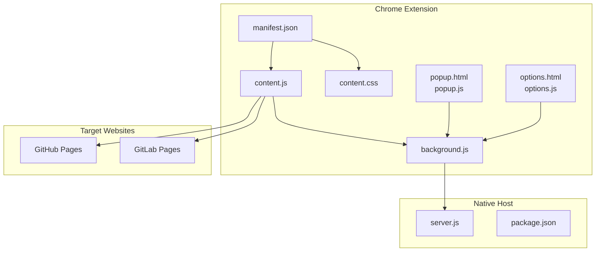
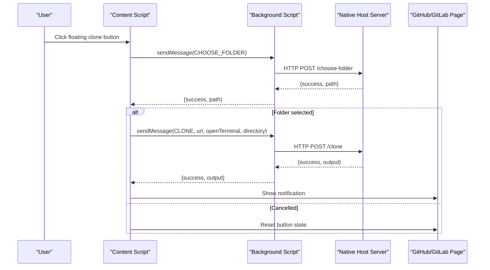
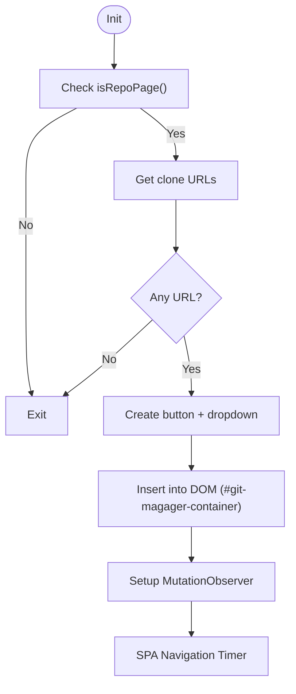
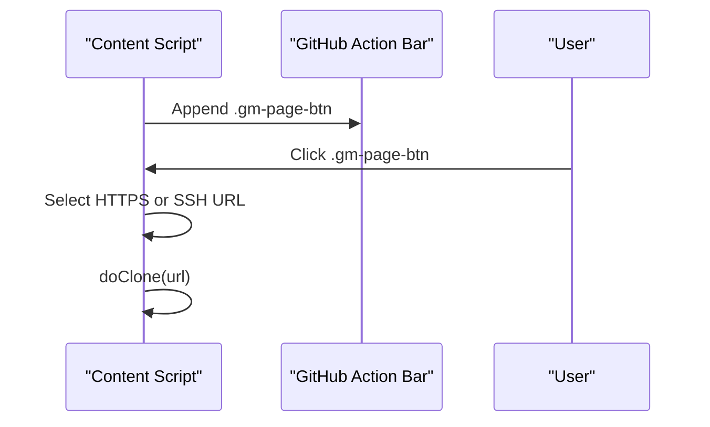
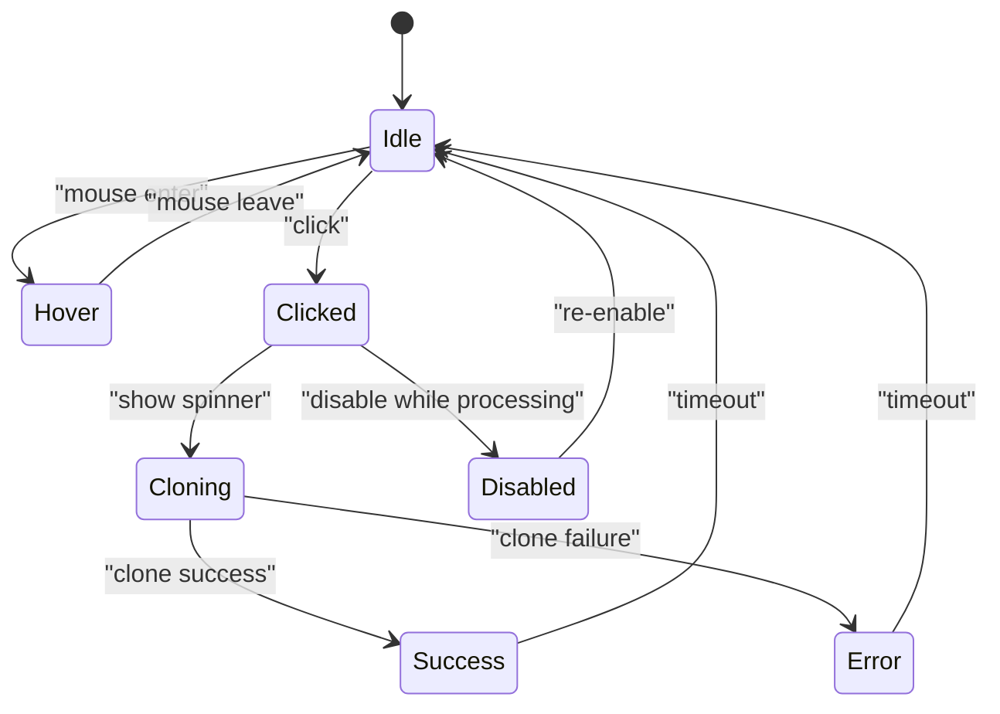
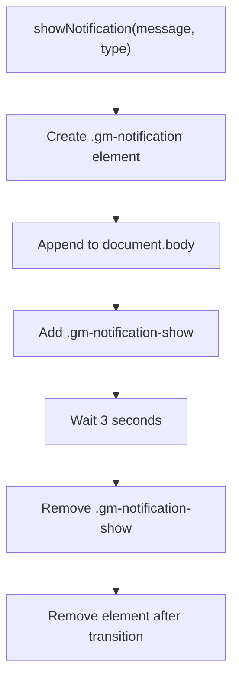
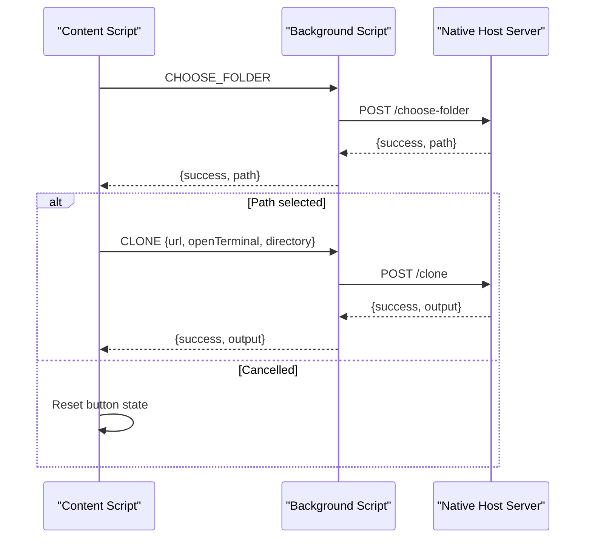
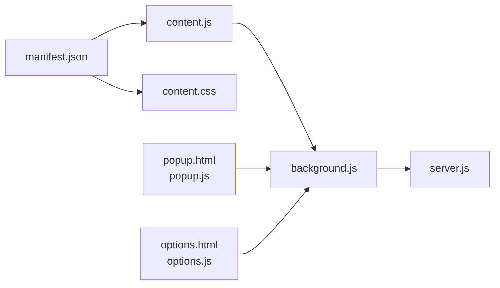

# Floating Clone Buttons

<cite>
**Referenced Files in This Document**
- [content.js](file://chrome-extension/content.js)
- [content.css](file://chrome-extension/content.css)
- [manifest.json](file://chrome-extension/manifest.json)
- [background.js](file://chrome-extension/background.js)
- [server.js](file://native-host/server.js)
- [package.json](file://native-host/package.json)
- [popup.html](file://chrome-extension/popup.html)
- [popup.js](file://chrome-extension/popup.js)
- [options.html](file://chrome-extension/options.html)
- [options.js](file://chrome-extension/options.js)
</cite>

## Table of Contents
1. [Introduction](#introduction)
2. [Project Structure](#project-structure)
3. [Core Components](#core-components)
4. [Architecture Overview](#architecture-overview)
5. [Detailed Component Analysis](#detailed-component-analysis)
6. [Dependency Analysis](#dependency-analysis)
7. [Performance Considerations](#performance-considerations)
8. [Troubleshooting Guide](#troubleshooting-guide)
9. [Conclusion](#conclusion)

## Introduction
This document explains the floating clone buttons injected into GitHub and GitLab repository pages. It covers the button positioning strategy, visual styling with custom CSS, integration with the target website's design system, the injection mechanism, DOM manipulation techniques, dynamic positioning based on page layout, button states (hover effects, click handlers, loading indicators), responsive design considerations, and customization options for button appearance.

## Project Structure
The project consists of a Chrome extension and a native host server. The extension injects floating clone buttons into supported pages and communicates with the native host to perform cloning operations.

**Diagram sources**
- [manifest.json:30-42](file://chrome-extension/manifest.json#L30-L42)
- [content.js:185-258](file://chrome-extension/content.js#L185-L258)
- [background.js:24-73](file://chrome-extension/background.js#L24-L73)
- [server.js:137-256](file://native-host/server.js#L137-L256)

**Section sources**
- [manifest.json:1-50](file://chrome-extension/manifest.json#L1-L50)

## Core Components
- Floating clone button: A fixed-position button injected into the page with a dropdown for HTTPS/SSH selection.
- Page-integrated button (GitHub): An inline button placed alongside the repository's "Code" action bar.
- Notification system: A transient notification overlay for feedback.
- Background service worker: Routes messages between content script and native host.
- Native host server: Provides folder selection, cloning, and configuration management.

Key responsibilities:
- Detect platform and extract clone URLs from page elements.
- Inject buttons and manage their lifecycle.
- Handle user interactions and state transitions.
- Communicate with the native host for cloning and configuration.

**Section sources**
- [content.js:13-107](file://chrome-extension/content.js#L13-L107)
- [content.js:185-258](file://chrome-extension/content.js#L185-L258)
- [content.js:262-292](file://chrome-extension/content.js#L262-L292)
- [content.js:167-181](file://chrome-extension/content.js#L167-L181)
- [background.js:24-73](file://chrome-extension/background.js#L24-L73)
- [server.js:137-256](file://native-host/server.js#L137-L256)

## Architecture Overview
The extension uses a content script to inject UI elements and a background service worker to communicate with a native host server. The native host performs file system operations and terminal automation.

**Diagram sources**
- [content.js:111-163](file://chrome-extension/content.js#L111-L163)
- [background.js:30-52](file://chrome-extension/background.js#L30-L52)
- [server.js:190-211](file://native-host/server.js#L190-L211)
- [server.js:213-251](file://native-host/server.js#L213-L251)

## Detailed Component Analysis

### Floating Clone Button Injection
The floating clone button is injected into the page as a fixed-position element near the bottom-right corner. It includes a dropdown menu for HTTPS/SSH selection.

**Diagram sources**
- [content.js:185-258](file://chrome-extension/content.js#L185-L258)
- [content.js:296-332](file://chrome-extension/content.js#L296-L332)

Key behaviors:
- Prevents double injection using a global flag.
- Detects repository pages and extracts HTTPS/SSH URLs from multiple sources.
- Creates a container div and appends the button and dropdown.
- Toggles dropdown visibility on click and closes it when clicking outside.
- Re-injects on DOM changes and SPA navigation.

**Section sources**
- [content.js:8-9](file://chrome-extension/content.js#L8-L9)
- [content.js:95-107](file://chrome-extension/content.js#L95-L107)
- [content.js:204-250](file://chrome-extension/content.js#L204-L250)
- [content.js:311-332](file://chrome-extension/content.js#L311-L332)

### Page-Integrated Button (GitHub)
On GitHub repository pages, the extension injects an inline "Instant Clone" button next to the "Code" action bar.

**Diagram sources**
- [content.js:262-292](file://chrome-extension/content.js#L262-L292)

**Section sources**
- [content.js:262-292](file://chrome-extension/content.js#L262-L292)

### Button States and Interactions
The button supports hover, active, disabled, cloning, success, and error states. Loading indicators use a spinning SVG animation.

**Diagram sources**
- [content.css:38-65](file://chrome-extension/content.css#L38-L65)
- [content.css:58-61](file://chrome-extension/content.css#L58-L61)
- [content.css:68-75](file://chrome-extension/content.css#L68-L75)
- [content.js:111-163](file://chrome-extension/content.js#L111-L163)

**Section sources**
- [content.css:21-65](file://chrome-extension/content.css#L21-L65)
- [content.css:68-75](file://chrome-extension/content.css#L68-L75)
- [content.js:111-163](file://chrome-extension/content.js#L111-L163)

### Notification System
Notifications appear as a floating overlay near the top-right corner, with distinct styles for success, error, and info.

**Diagram sources**
- [content.js:167-181](file://chrome-extension/content.js#L167-L181)
- [content.css:142-170](file://chrome-extension/content.css#L142-L170)

**Section sources**
- [content.js:167-181](file://chrome-extension/content.js#L167-L181)
- [content.css:142-170](file://chrome-extension/content.css#L142-L170)

### Visual Styling and Design System Integration
The button styling uses CSS custom properties for theme colors and integrates with GitHub/GitLab design systems by:
- Using similar typography and spacing patterns.
- Matching button radius and shadow styles.
- Providing hover and focus affordances consistent with modern UI frameworks.
- Supporting dark mode via CSS variables.

Styling highlights:
- Fixed positioning with high z-index ensures visibility above page content.
- Dropdown appears above the button with smooth fade-in/out transitions.
- Color tokens for primary, success, error, background, text, and border.
- Responsive-friendly padding and gap values.

**Section sources**
- [content.css:13-19](file://chrome-extension/content.css#L13-L19)
- [content.css:21-65](file://chrome-extension/content.css#L21-L65)
- [content.css:77-98](file://chrome-extension/content.css#L77-L98)
- [content.css:120-139](file://chrome-extension/content.css#L120-L139)
- [content.css:142-170](file://chrome-extension/content.css#L142-L170)

### Clone Operation Flow
The content script coordinates with the background script and native host to perform cloning.

**Diagram sources**
- [content.js:111-163](file://chrome-extension/content.js#L111-L163)
- [background.js:30-52](file://chrome-extension/background.js#L30-L52)
- [server.js:190-211](file://native-host/server.js#L190-L211)
- [server.js:213-251](file://native-host/server.js#L213-L251)

**Section sources**
- [content.js:111-163](file://chrome-extension/content.js#L111-L163)
- [background.js:30-52](file://chrome-extension/background.js#L30-L52)
- [server.js:213-251](file://native-host/server.js#L213-L251)

### Responsive Design Considerations
- Fixed positioning: The floating button uses fixed positioning so it remains visible regardless of page scroll.
- Container placement: Positioned near the bottom-right corner with margins suitable for typical desktop layouts.
- Dropdown alignment: The dropdown is positioned above the button and aligned to the right edge for readability.
- Typography scaling: Font sizes and gaps scale appropriately for different screen densities.
- Minimal overlap: The button avoids overlapping with commonly used interactive elements by placing it in the page margins.

**Section sources**
- [content.css:13-19](file://chrome-extension/content.css#L13-L19)
- [content.css:79-98](file://chrome-extension/content.css#L79-L98)

### Customization Options
The extension exposes several customization points:
- Theme colors via CSS custom properties for primary, hover, success, error, background, text, and border.
- Button sizes and radii adjustable through CSS variables and class overrides.
- Terminal behavior controlled by configuration (open in terminal vs background).
- Default clone directory configurable in the options page.

Implementation notes:
- CSS variables define the color scheme and can be overridden externally.
- The page-integrated button mirrors the floating button’s design system integration.
- Configuration is persisted on the native host and synchronized via the background script.

**Section sources**
- [content.css:3-11](file://chrome-extension/content.css#L3-L11)
- [content.css:120-139](file://chrome-extension/content.css#L120-L139)
- [background.js:54-72](file://chrome-extension/background.js#L54-L72)
- [server.js:17-37](file://native-host/server.js#L17-L37)

## Dependency Analysis
The extension depends on:
- Manifest declaring content scripts and permissions.
- Content script for DOM manipulation and state management.
- Background script for cross-process messaging.
- Native host for file system operations and terminal automation.

**Diagram sources**
- [manifest.json:30-42](file://chrome-extension/manifest.json#L30-L42)
- [background.js:24-73](file://chrome-extension/background.js#L24-L73)
- [server.js:137-256](file://native-host/server.js#L137-L256)

**Section sources**
- [manifest.json:6-18](file://chrome-extension/manifest.json#L6-L18)
- [background.js:24-73](file://chrome-extension/background.js#L24-L73)
- [server.js:137-256](file://native-host/server.js#L137-L256)

## Performance Considerations
- Debounced re-injection: Uses a MutationObserver with a short debounce timer to avoid repeated injections on SPA navigation.
- Minimal DOM updates: Only creates and appends the container once per page load.
- CSS animations: Uses GPU-friendly transforms for hover and dropdown transitions.
- Network efficiency: Background script batches requests to the native host and handles errors gracefully.

## Troubleshooting Guide
Common issues and resolutions:
- Native host not running: The extension checks server health and displays a helpful message in the popup when the server is unreachable.
- Folder selection cancelled: The button resets to its original state and shows a notification indicating cancellation.
- Clone failures: The button switches to an error state with a message and logs the error to the console.
- Double injection prevention: A global flag prevents multiple instances of the button from being created.

**Section sources**
- [popup.js:37-59](file://chrome-extension/popup.js#L37-L59)
- [content.js:121-133](file://chrome-extension/content.js#L121-L133)
- [content.js:150-156](file://chrome-extension/content.js#L150-L156)
- [content.js:8-9](file://chrome-extension/content.js#L8-L9)

## Conclusion
The floating clone buttons provide a seamless, integrated experience for cloning repositories directly from GitHub and GitLab. The implementation balances robust DOM manipulation, responsive design, and clear user feedback. The architecture cleanly separates concerns between the content script, background service worker, and native host, enabling reliable cloning operations with customizable behavior.