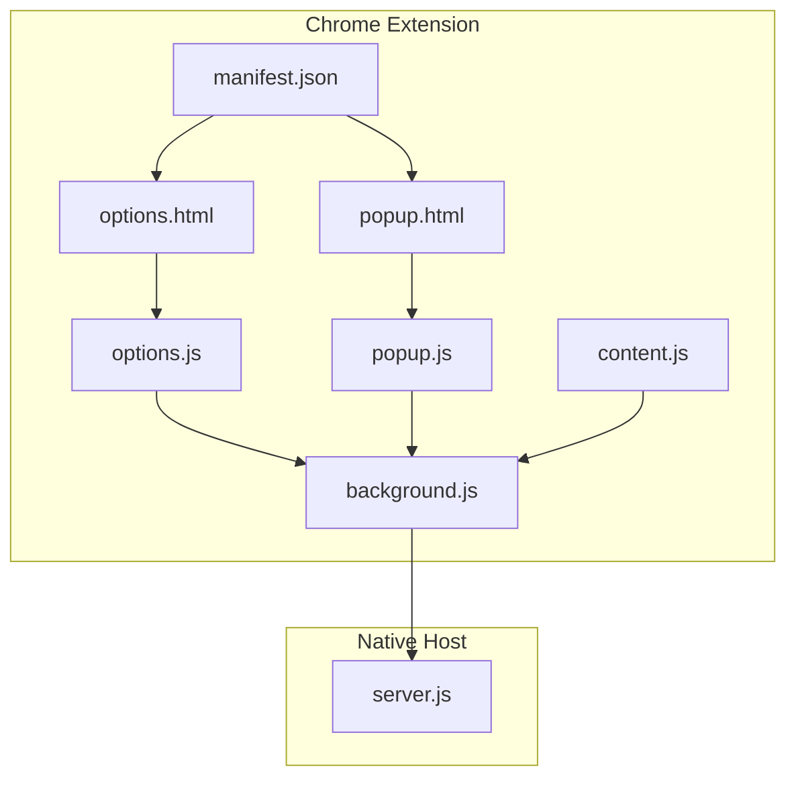
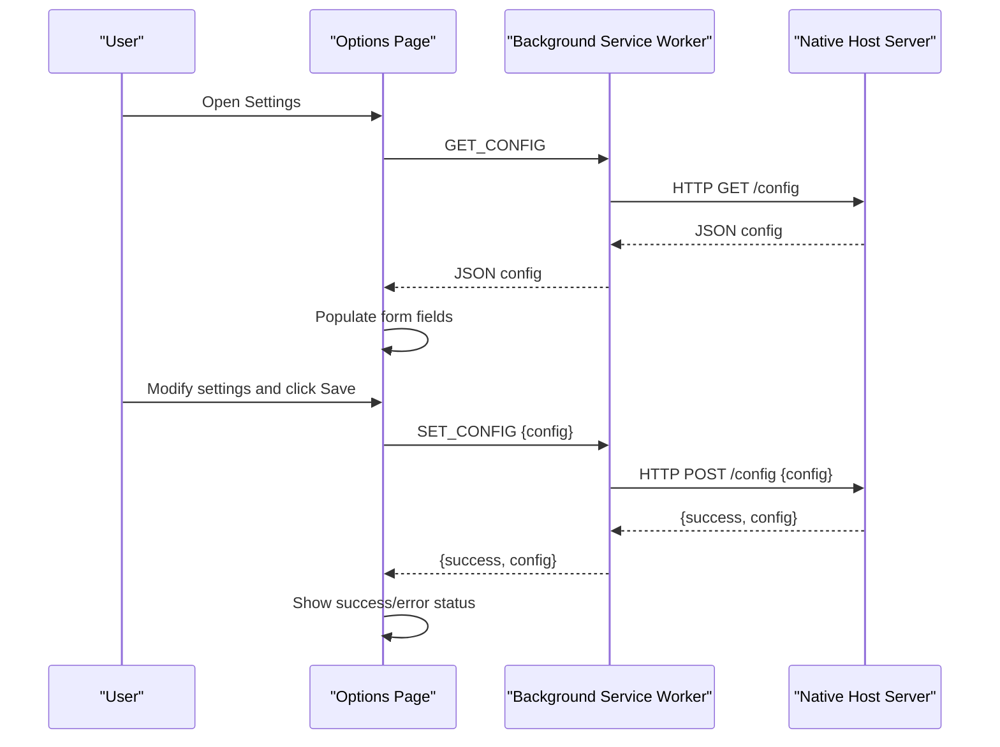
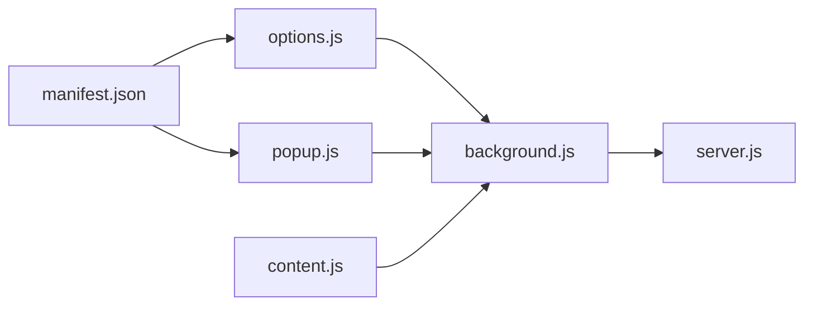

# Options and Settings Page

<cite>
**Referenced Files in This Document**
- [options.html](file://chrome-extension/options.html)
- [options.js](file://chrome-extension/options.js)
- [background.js](file://chrome-extension/background.js)
- [server.js](file://native-host/server.js)
- [manifest.json](file://chrome-extension/manifest.json)
- [popup.html](file://chrome-extension/popup.html)
- [popup.js](file://chrome-extension/popup.js)
- [content.js](file://chrome-extension/content.js)
</cite>

## Table of Contents
1. [Introduction](#introduction)
2. [Project Structure](#project-structure)
3. [Core Components](#core-components)
4. [Architecture Overview](#architecture-overview)
5. [Detailed Component Analysis](#detailed-component-analysis)
6. [Dependency Analysis](#dependency-analysis)
7. [Performance Considerations](#performance-considerations)
8. [Troubleshooting Guide](#troubleshooting-guide)
9. [Conclusion](#conclusion)

## Introduction
This document describes the Git Magager options and settings management interface. It covers the settings page layout, form controls for configuring the default clone directory path, terminal application selection, and preferences persistence. It also explains configuration validation, default value handling, settings synchronization with the native host server, user interface elements (file picker dialogs, dropdown menus, and form submission), and accessibility and keyboard navigation support.

## Project Structure
The settings page is part of a Chrome extension with a native host server. The options page is rendered in a dedicated HTML file and uses a small JavaScript script to manage loading and saving settings. The background service worker routes messages to the native host server, which persists settings to disk and exposes endpoints for configuration.

**Diagram sources**
- [options.html:1-222](file://chrome-extension/options.html#L1-L222)
- [options.js:1-56](file://chrome-extension/options.js#L1-L56)
- [background.js:1-74](file://chrome-extension/background.js#L1-L74)
- [server.js:1-263](file://native-host/server.js#L1-L263)
- [manifest.json:1-50](file://chrome-extension/manifest.json#L1-L50)
- [popup.html:1-77](file://chrome-extension/popup.html#L1-L77)
- [popup.js:1-168](file://chrome-extension/popup.js#L1-L168)
- [content.js:1-333](file://chrome-extension/content.js#L1-L333)

**Section sources**
- [options.html:1-222](file://chrome-extension/options.html#L1-L222)
- [options.js:1-56](file://chrome-extension/options.js#L1-L56)
- [background.js:1-74](file://chrome-extension/background.js#L1-L74)
- [server.js:1-263](file://native-host/server.js#L1-L263)
- [manifest.json:1-50](file://chrome-extension/manifest.json#L1-L50)
- [popup.html:1-77](file://chrome-extension/popup.html#L1-L77)
- [popup.js:1-168](file://chrome-extension/popup.js#L1-L168)
- [content.js:1-333](file://chrome-extension/content.js#L1-L333)

## Core Components
- Options page layout and form controls:
  - Default clone directory input field
  - Terminal application dropdown (macOS Terminal, iTerm2, Warp)
  - Toggle for opening in terminal after clone
  - Save button and status feedback
- Settings persistence:
  - Native host server stores configuration in a JSON file under the user’s home directory
  - Default values are applied when no persisted configuration exists
- Settings synchronization:
  - Background service worker forwards GET_CONFIG and SET_CONFIG requests to the native host server
  - The options page loads current settings and saves updates via runtime messaging

**Section sources**
- [options.html:176-216](file://chrome-extension/options.html#L176-L216)
- [options.js:10-54](file://chrome-extension/options.js#L10-L54)
- [background.js:54-72](file://chrome-extension/background.js#L54-L72)
- [server.js:10-37](file://native-host/server.js#L10-L37)

## Architecture Overview
The settings page communicates with the background service worker, which proxies requests to the native host server. The server reads and writes configuration to a JSON file and validates incoming configuration updates.

**Diagram sources**
- [options.js:10-54](file://chrome-extension/options.js#L10-L54)
- [background.js:54-72](file://chrome-extension/background.js#L54-L72)
- [server.js:157-187](file://native-host/server.js#L157-L187)

## Detailed Component Analysis

### Options Page Layout and Controls
- Clone Settings card:
  - Default Clone Directory input field
  - Terminal Application dropdown with options for macOS Terminal, iTerm2, and Warp
  - Toggle row for “Open in Terminal after clone”
- Server Info card:
  - Displays the companion server address
- Save button and status area:
  - Provides success and error feedback after saving

Accessibility and keyboard navigation:
- The page uses standard HTML form elements with labels associated to inputs.
- Focus styles are defined for inputs and buttons.
- No explicit ARIA attributes or keyboard shortcuts are present in the current implementation.

**Section sources**
- [options.html:176-216](file://chrome-extension/options.html#L176-L216)
- [options.js:3-21](file://chrome-extension/options.js#L3-L21)

### Settings Loading and Default Values
- On load, the options page requests the current configuration from the background service worker.
- If a configuration is returned, the form fields are populated:
  - Clone directory value
  - Terminal application value (defaults to macOS Terminal if missing)
  - Open in terminal toggle defaults to enabled if not explicitly set to false
- If no configuration is returned, defaults are used.

Validation and error handling:
- The options page does not perform client-side validation of the clone directory path.
- If the background service worker fails to return a configuration, the page falls back to defaults.

**Section sources**
- [options.js:10-21](file://chrome-extension/options.js#L10-L21)
- [server.js:10-27](file://native-host/server.js#L10-L27)

### Settings Saving and Persistence
- The options page collects form values and sends a SET_CONFIG message to the background service worker.
- The background service worker forwards the request to the native host server’s /config endpoint with a POST method.
- The server merges the incoming configuration with the existing configuration and writes it to disk.
- The server responds with either success or an error message.

Persistence location:
- Configuration is stored in a JSON file located under the user’s home directory.

**Section sources**
- [options.js:22-54](file://chrome-extension/options.js#L22-L54)
- [background.js:62-72](file://chrome-extension/background.js#L62-L72)
- [server.js:165-187](file://native-host/server.js#L165-L187)
- [server.js:29-37](file://native-host/server.js#L29-L37)

### Terminal Application Selection and Behavior
- The terminal application selection affects how cloning commands are executed:
  - macOS Terminal: Uses AppleScript to create a new terminal session and run the clone command
  - iTerm2: Uses AppleScript to create a new window and write the clone command to the current session
  - Warp: Uses AppleScript to activate Warp, then simulates keystrokes to open a new tab, change directory, run the clone command, and enter
- The default terminal application is macOS Terminal.

**Section sources**
- [options.html:184-192](file://chrome-extension/options.html#L184-L192)
- [server.js:66-111](file://native-host/server.js#L66-L111)

### File Picker Dialog Integration
- The content script triggers a folder picker dialog through the background service worker.
- The background service worker forwards a CHOOSE_FOLDER request to the native host server.
- The server executes an AppleScript to present the native macOS folder picker and returns the selected path.

Note: The options page itself does not expose a file picker dialog; the folder picker is invoked during cloning operations.

**Section sources**
- [content.js:116-140](file://chrome-extension/content.js#L116-L140)
- [background.js:30-40](file://chrome-extension/background.js#L30-L40)
- [server.js:113-135](file://native-host/server.js#L113-L135)

### Form Submission Handling
- Clicking the Save button disables the button, shows a status area, and sends the configuration to the background service worker.
- On success, the status area displays a success message; on failure, it displays an error message.
- After a timeout, the status area is cleared.

**Section sources**
- [options.html:215-216](file://chrome-extension/options.html#L215-L216)
- [options.js:22-54](file://chrome-extension/options.js#L22-L54)

### Settings Synchronization with Native Host Server
- GET_CONFIG: The background service worker queries the native host server for the current configuration.
- SET_CONFIG: The background service worker posts updated configuration to the native host server.
- Health checks: The background service worker periodically checks the native host server health.

**Section sources**
- [background.js:54-72](file://chrome-extension/background.js#L54-L72)
- [background.js:11-21](file://chrome-extension/background.js#L11-L21)

### Accessibility and Keyboard Navigation
- The options page uses standard HTML elements with labels and focus styles.
- There are no explicit ARIA roles, aria-live regions, or keyboard shortcuts implemented in the current code.
- Users can navigate the form using Tab and Enter keys, and the focus indicator is styled for visibility.

**Section sources**
- [options.html:66-80](file://chrome-extension/options.html#L66-L80)
- [options.html:126-140](file://chrome-extension/options.html#L126-L140)

## Dependency Analysis
The options page depends on the background service worker to communicate with the native host server. The background service worker depends on the native host server for configuration persistence and cloning operations.

**Diagram sources**
- [options.js:1-56](file://chrome-extension/options.js#L1-L56)
- [background.js:1-74](file://chrome-extension/background.js#L1-L74)
- [server.js:1-263](file://native-host/server.js#L1-L263)
- [popup.js:1-168](file://chrome-extension/popup.js#L1-L168)
- [content.js:1-333](file://chrome-extension/content.js#L1-L333)
- [manifest.json:1-50](file://chrome-extension/manifest.json#L1-L50)

**Section sources**
- [options.js:1-56](file://chrome-extension/options.js#L1-L56)
- [background.js:1-74](file://chrome-extension/background.js#L1-L74)
- [server.js:1-263](file://native-host/server.js#L1-L263)
- [popup.js:1-168](file://chrome-extension/popup.js#L1-L168)
- [content.js:1-333](file://chrome-extension/content.js#L1-L333)
- [manifest.json:1-50](file://chrome-extension/manifest.json#L1-L50)

## Performance Considerations
- The options page performs minimal DOM manipulation and relies on asynchronous messaging to the background service worker and native host server.
- Configuration loading and saving are lightweight operations that involve JSON parsing and HTTP requests.
- The native host server writes configuration to disk synchronously; this is acceptable given the low frequency of settings changes.

## Troubleshooting Guide
Common issues and resolutions:
- Settings not saving:
  - Verify the native host server is running and reachable at the configured address.
  - Check the status area on the options page for error messages after attempting to save.
- Terminal application not opening:
  - Ensure the selected terminal application is installed and accessible.
  - Confirm that the terminal application is allowed to receive AppleScript commands.
- Clone directory path errors:
  - The options page does not validate the path; ensure the path exists or is writable.
  - If the path does not exist, the native host server creates it automatically during cloning.

**Section sources**
- [options.js:33-54](file://chrome-extension/options.js#L33-L54)
- [server.js:165-187](file://native-host/server.js#L165-L187)
- [server.js:39-43](file://native-host/server.js#L39-L43)

## Conclusion
The Git Magager options and settings page provides a straightforward interface for configuring the default clone directory, terminal application, and whether to open the terminal after cloning. Settings are persisted locally via a native host server and synchronized through the extension’s background service worker. While the current implementation focuses on usability and simplicity, adding explicit validation, ARIA attributes, and keyboard shortcuts would improve robustness and accessibility.