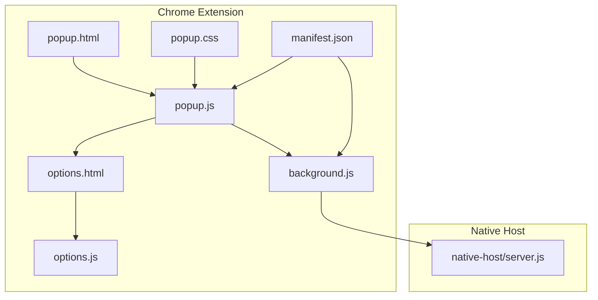
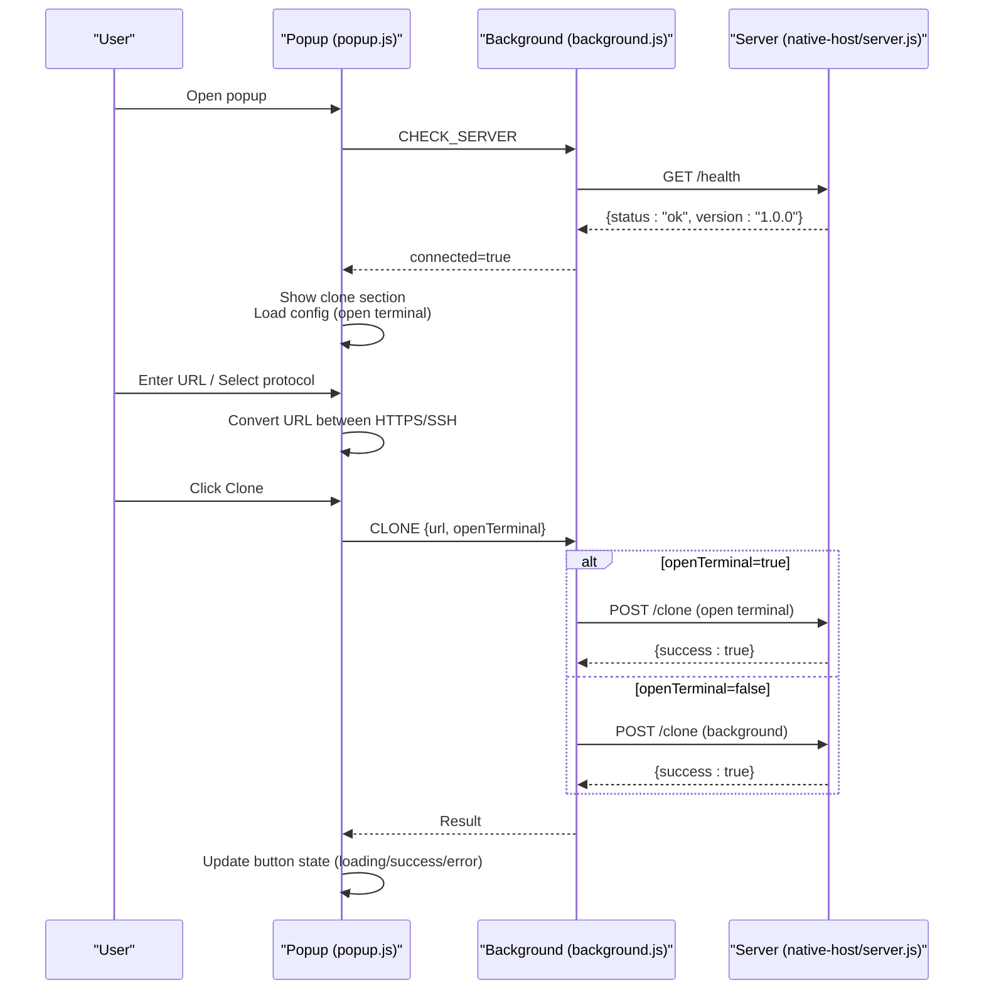
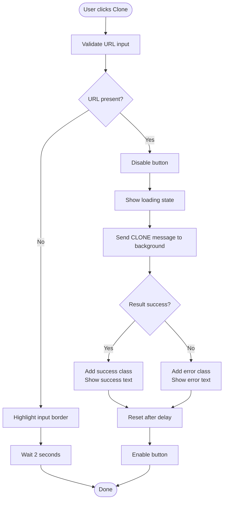
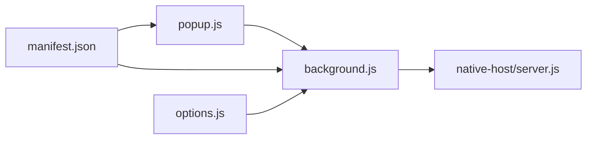

# Popup Interface

<cite>
**Referenced Files in This Document**
- [popup.html](file://chrome-extension/popup.html)
- [popup.css](file://chrome-extension/popup.css)
- [popup.js](file://chrome-extension/popup.js)
- [background.js](file://chrome-extension/background.js)
- [manifest.json](file://chrome-extension/manifest.json)
- [options.html](file://chrome-extension/options.html)
- [options.js](file://chrome-extension/options.js)
- [server.js](file://native-host/server.js)
</cite>

## Table of Contents
1. [Introduction](#introduction)
2. [Project Structure](#project-structure)
3. [Core Components](#core-components)
4. [Architecture Overview](#architecture-overview)
5. [Detailed Component Analysis](#detailed-component-analysis)
6. [Dependency Analysis](#dependency-analysis)
7. [Performance Considerations](#performance-considerations)
8. [Troubleshooting Guide](#troubleshooting-guide)
9. [Conclusion](#conclusion)

## Introduction
This document describes the Git Magager popup interface component. It covers the popup window layout, server status indicator, main clone interface, input validation, protocol toggling, terminal option, and error handling. It also documents the navigation to the settings page and version display, along with CSS styling and responsive design considerations.

## Project Structure
The popup interface resides in the Chrome extension’s chrome-extension directory. The key files are:
- popup.html: Defines the DOM structure for the popup window.
- popup.css: Provides dark theme styling and responsive layout.
- popup.js: Implements client-side logic for server checks, input handling, protocol conversion, cloning, and UI updates.
- background.js: Handles messaging with the native host server and exposes endpoints for the popup.
- manifest.json: Declares permissions, host permissions, and action configuration.
- options.html and options.js: Settings page for configuring clone behavior and server info.
- native-host/server.js: Local companion server that performs git operations and responds to requests.

**Diagram sources**
- [popup.html](file://chrome-extension/popup.html)
- [popup.css](file://chrome-extension/popup.css)
- [popup.js](file://chrome-extension/popup.js)
- [background.js](file://chrome-extension/background.js)
- [manifest.json](file://chrome-extension/manifest.json)
- [options.html](file://chrome-extension/options.html)
- [options.js](file://chrome-extension/options.js)
- [server.js](file://native-host/server.js)

**Section sources**
- [popup.html](file://chrome-extension/popup.html)
- [popup.css](file://chrome-extension/popup.css)
- [popup.js](file://chrome-extension/popup.js)
- [background.js](file://chrome-extension/background.js)
- [manifest.json](file://chrome-extension/manifest.json)
- [options.html](file://chrome-extension/options.html)
- [options.js](file://chrome-extension/options.js)
- [server.js](file://native-host/server.js)

## Core Components
- Header with logo and title: Displays the brand identity and title.
- Server status indicator: Shows connection status with color-coded dot and text, plus loading states.
- Main clone interface: Contains URL input, protocol radio buttons (HTTPS/SSH), terminal toggle, and clone button.
- Error section: Appears when the local server is unreachable, with clear instructions.
- Footer with settings link and version: Links to settings and displays version.

Key behaviors:
- Pre-fills the clone URL from the active tab when applicable.
- Checks server connectivity and switches UI sections accordingly.
- Converts URLs between HTTPS and SSH protocols.
- Handles clone button states with loading, success, and error visuals.
- Navigates to the settings page from the footer.

**Section sources**
- [popup.html](file://chrome-extension/popup.html)
- [popup.css](file://chrome-extension/popup.css)
- [popup.js](file://chrome-extension/popup.js)
- [background.js](file://chrome-extension/background.js)

## Architecture Overview
The popup communicates with the background service worker, which proxies requests to the native host server. The server executes git operations locally and returns results.

**Diagram sources**
- [popup.js](file://chrome-extension/popup.js)
- [background.js](file://chrome-extension/background.js)
- [server.js](file://native-host/server.js)

## Detailed Component Analysis

### Header and Logo
- Structure: Flex container with SVG logo and title text.
- Styling: Dark theme with purple branding for the title.
- Responsiveness: Fixed width popup container ensures consistent layout.

**Section sources**
- [popup.html](file://chrome-extension/popup.html)
- [popup.css](file://chrome-extension/popup.css)

### Server Status Indicator
- Elements: Status dot (color-coded), status text, and a hidden “Checking server…” state.
- States:
  - Connected: Green dot with glow and “Server connected” text.
  - Disconnected: Red dot with glow and “Server not running” text.
- Behavior:
  - On load, sends a CHECK_SERVER message to the background.
  - Updates UI sections based on connection result.

**Section sources**
- [popup.html](file://chrome-extension/popup.html)
- [popup.css](file://chrome-extension/popup.css)
- [popup.js](file://chrome-extension/popup.js)
- [background.js](file://chrome-extension/background.js)

### Main Clone Interface
- URL Input Field:
  - Placeholder text suggests a typical GitHub repository URL.
  - Validation highlights the border in red when empty and resets after a timeout.
- Protocol Radio Buttons:
  - HTTPS selected by default; switching toggles between HTTPS and SSH URL formats for known hosts (GitHub, GitLab).
- Terminal Toggle Switch:
  - Controls whether cloning runs in the terminal or in the background.
  - Loaded from stored configuration on successful server check.
- Clone Button:
  - Disabled during cloning.
  - Loading state shows a spinning icon and “Cloning...” text.
  - Success state shows a checkmark and “Cloned!” text.
  - Error state shows an X icon and “Failed: <message>”.

**Diagram sources**
- [popup.js](file://chrome-extension/popup.js)

**Section sources**
- [popup.html](file://chrome-extension/popup.html)
- [popup.css](file://chrome-extension/popup.css)
- [popup.js](file://chrome-extension/popup.js)

### Error Handling for Disconnected Servers
- When the server is unreachable:
  - Status dot turns red.
  - “Server not running” text replaces “Checking server…”.
  - Clone section is hidden; error section is shown with:
    - Icon and heading indicating the issue.
    - Instruction to start the companion server.
    - Command to run in terminal.

**Section sources**
- [popup.html](file://chrome-extension/popup.html)
- [popup.css](file://chrome-extension/popup.css)
- [popup.js](file://chrome-extension/popup.js)
- [background.js](file://chrome-extension/background.js)

### Navigation to Settings Page and Version Display
- Settings Link:
  - Click handler opens the options page via the runtime API.
- Version Display:
  - Footer shows the extension version from manifest metadata.

**Section sources**
- [popup.html](file://chrome-extension/popup.html)
- [popup.js](file://chrome-extension/popup.js)
- [manifest.json](file://chrome-extension/manifest.json)

### CSS Styling Details and Responsive Design
- Color Scheme:
  - Dark theme with purple accents for branding.
  - Status dots use green/red with subtle glow for visual feedback.
- Typography:
  - System fonts with monospace for input fields.
- Layout:
  - Fixed width popup container (360px) for consistent rendering.
  - Flexbox for header alignment and button layout.
- Interactions:
  - Hover and active states for the clone button.
  - Smooth transitions for toggles and focus states.
- Animations:
  - Spinner animation for loading state.

Responsive considerations:
- The popup width is fixed; content adapts via flexbox and padding.
- Media queries are not used; the design targets a compact popup form factor.

**Section sources**
- [popup.css](file://chrome-extension/popup.css)

## Dependency Analysis
- Popup depends on:
  - Manifest for permissions and action configuration.
  - Background service worker for server communication.
  - Native host server for git operations.
- Background depends on:
  - Local server endpoints for health, config, folder selection, and cloning.
- Options page depends on:
  - Background to persist configuration to the native host.

**Diagram sources**
- [popup.js](file://chrome-extension/popup.js)
- [background.js](file://chrome-extension/background.js)
- [server.js](file://native-host/server.js)
- [manifest.json](file://chrome-extension/manifest.json)
- [options.js](file://chrome-extension/options.js)

**Section sources**
- [popup.js](file://chrome-extension/popup.js)
- [background.js](file://chrome-extension/background.js)
- [server.js](file://native-host/server.js)
- [manifest.json](file://chrome-extension/manifest.json)
- [options.js](file://chrome-extension/options.js)

## Performance Considerations
- Network latency: Server health checks and clone operations are asynchronous; UI remains responsive.
- Minimal DOM updates: Status and button states are toggled via class additions/removals.
- Local execution: Git operations run on the user’s machine via the native host server, avoiding heavy client-side processing.

## Troubleshooting Guide
Common issues and resolutions:
- Server not running:
  - Symptom: Red status dot and “Server not running” text; error section visible.
  - Action: Start the native host server using the provided command in the error section.
- Empty URL:
  - Symptom: Input border turns red briefly.
  - Action: Enter a valid repository URL.
- Clone failure:
  - Symptom: Error state on the button with a message.
  - Action: Verify URL correctness, network access, and repository visibility.
- Settings not applying:
  - Symptom: Changes not reflected in cloning behavior.
  - Action: Confirm settings were saved successfully and the native host server is reachable.

**Section sources**
- [popup.html](file://chrome-extension/popup.html)
- [popup.js](file://chrome-extension/popup.js)
- [background.js](file://chrome-extension/background.js)
- [server.js](file://native-host/server.js)

## Conclusion
The Git Magager popup interface provides a streamlined, visually consistent way to clone repositories. It integrates server connectivity checks, protocol conversion, and terminal options while offering clear feedback and error guidance. The design emphasizes usability with a dark theme, responsive layout, and intuitive controls.