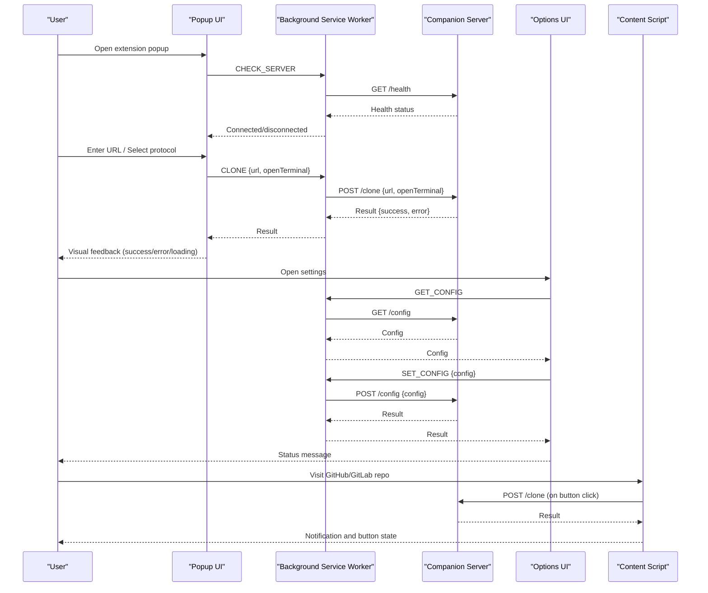
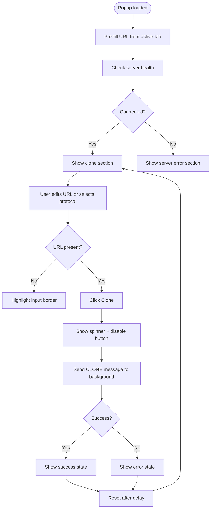
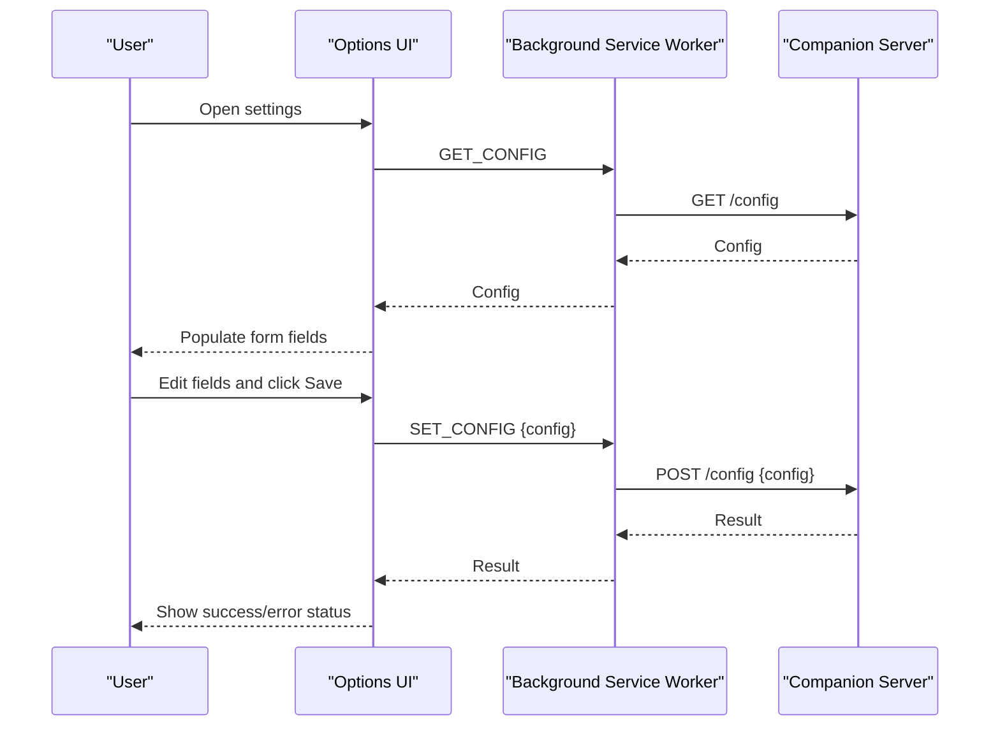
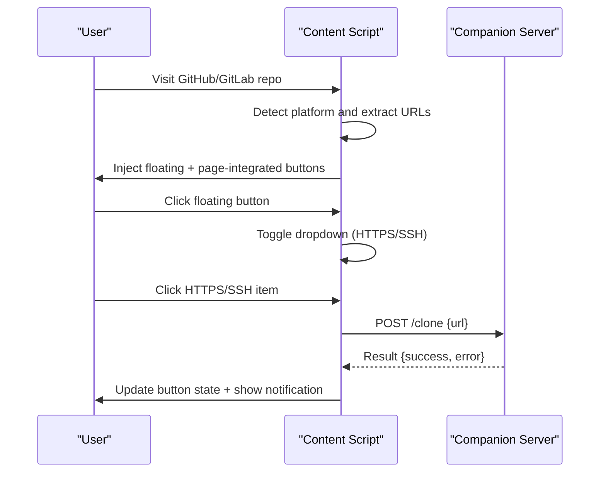
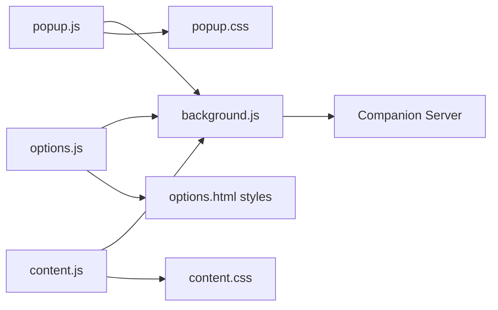

# User Interface Guide

<cite>
**Referenced Files in This Document**
- [popup.html](file://chrome-extension/popup.html)
- [popup.js](file://chrome-extension/popup.js)
- [popup.css](file://chrome-extension/popup.css)
- [options.html](file://chrome-extension/options.html)
- [options.js](file://chrome-extension/options.js)
- [content.js](file://chrome-extension/content.js)
- [content.css](file://chrome-extension/content.css)
- [manifest.json](file://chrome-extension/manifest.json)
- [background.js](file://chrome-extension/background.js)
</cite>

## Table of Contents
1. [Introduction](#introduction)
2. [Project Structure](#project-structure)
3. [Core Components](#core-components)
4. [Architecture Overview](#architecture-overview)
5. [Detailed Component Analysis](#detailed-component-analysis)
6. [Dependency Analysis](#dependency-analysis)
7. [Performance Considerations](#performance-considerations)
8. [Accessibility and Keyboard Navigation](#accessibility-and-keyboard-navigation)
9. [Troubleshooting Guide](#troubleshooting-guide)
10. [Conclusion](#conclusion)

## Introduction
This guide documents the user interface components of the Git Magager Chrome extension. It covers:
- The popup interface for direct cloning operations, including URL input validation, protocol selection (HTTPS/SSH), and clone button functionality
- The options page interface for configuration management, including clone directory settings, terminal application selection, and preference persistence
- The floating clone buttons injected into GitHub and GitLab repository pages, including positioning, styling, and interaction patterns
- Visual UI states, error messages, loading indicators, and user feedback mechanisms
- Accessibility considerations and keyboard navigation support

## Project Structure
The extension’s UI is organized into distinct HTML/CSS/JS modules:
- Popup UI: a compact panel accessed via the extension icon
- Options UI: a settings page for configuration
- Content UI: floating buttons injected into target websites (GitHub/GitLab)

```mermaid
graph TB
subgraph "Extension UI Modules"
Popup["Popup UI<br/>popup.html + popup.js + popup.css"]
Options["Options UI<br/>options.html + options.js"]
Content["Content UI<br/>content.js + content.css"]
end
subgraph "Manifest"
Manifest["manifest.json"]
end
subgraph "Background"
Background["background.js"]
end
Manifest --> Popup
Manifest --> Options
Manifest --> Content
Popup --> Background
Options --> Background
Content --> Background
```

**Diagram sources**
- [manifest.json:1-50](file://chrome-extension/manifest.json#L1-L50)
- [popup.html:1-77](file://chrome-extension/popup.html#L1-L77)
- [options.html:1-222](file://chrome-extension/options.html#L1-L222)
- [content.js:1-320](file://chrome-extension/content.js#L1-L320)
- [background.js:1-62](file://chrome-extension/background.js#L1-L62)

**Section sources**
- [manifest.json:1-50](file://chrome-extension/manifest.json#L1-L50)

## Core Components
- Popup panel: Provides immediate cloning controls, server status, and quick access to settings
- Options page: Centralized configuration for clone directory, terminal app, and behavior preferences
- Floating buttons: One-click clone actions injected into GitHub and GitLab repository pages

Key responsibilities:
- Popup: Pre-fills repository URLs from active tab, validates input, toggles protocol, and triggers clone with feedback
- Options: Loads/saves persistent preferences and displays status messages
- Content: Detects repository pages, extracts clone URLs, injects floating and page-integrated buttons, and shows notifications

**Section sources**
- [popup.html:1-77](file://chrome-extension/popup.html#L1-L77)
- [popup.js:1-168](file://chrome-extension/popup.js#L1-L168)
- [options.html:1-222](file://chrome-extension/options.html#L1-L222)
- [options.js:1-56](file://chrome-extension/options.js#L1-L56)
- [content.js:1-320](file://chrome-extension/content.js#L1-L320)
- [content.css:1-175](file://chrome-extension/content.css#L1-L175)

## Architecture Overview
The UI components communicate through the background service worker, which interacts with the companion server for cloning and configuration.



**Diagram sources**
- [popup.js:37-59](file://chrome-extension/popup.js#L37-L59)
- [popup.js:94-149](file://chrome-extension/popup.js#L94-L149)
- [background.js:24-61](file://chrome-extension/background.js#L24-L61)
- [options.js:10-54](file://chrome-extension/options.js#L10-L54)
- [content.js:113-150](file://chrome-extension/content.js#L113-L150)

## Detailed Component Analysis

### Popup Interface
The popup provides a compact, dark-themed interface for cloning repositories directly from the extension icon.

- Layout and sections
  - Header with logo and title
  - Server status bar with dot indicator and text
  - Clone section with:
    - Label and input field for clone URL
    - Protocol selection radios (HTTPS/SSH)
    - Toggle for opening in terminal
    - Clone button with icon and text
  - Error section for “server not running”
  - Footer with settings link and version

- Behavior highlights
  - Pre-fills URL from the active tab if it matches GitHub or GitLab repository patterns
  - Validates empty URL input with visual border highlight
  - Converts between HTTPS and SSH protocols dynamically
  - Shows loading spinner during clone operation
  - Displays success/error states with colored buttons and icons
  - Disables button during operation and restores after timeout

- Visual states and feedback
  - Server status dot: green for connected, red for disconnected
  - Clone button: primary purple, hover/active effects; success (green), error (red), disabled states
  - Error box: red background with icon and instructions to start the companion server

- Accessibility and keyboard navigation
  - Focusable elements: input, radio buttons, checkbox, clone button, settings link
  - Keyboard focus order follows visual layout
  - Radio buttons and checkbox use accessible labels
  - Sufficient color contrast for status indicators and feedback



**Diagram sources**
- [popup.js:13-35](file://chrome-extension/popup.js#L13-L35)
- [popup.js:37-59](file://chrome-extension/popup.js#L37-L59)
- [popup.js:94-149](file://chrome-extension/popup.js#L94-L149)

**Section sources**
- [popup.html:1-77](file://chrome-extension/popup.html#L1-L77)
- [popup.js:1-168](file://chrome-extension/popup.js#L1-L168)
- [popup.css:1-264](file://chrome-extension/popup.css#L1-L264)

### Options Page Interface
The options page centralizes configuration for clone behavior and preferences.

- Layout and sections
  - Card for Clone Settings:
    - Default clone directory input
    - Terminal application selector (macOS Terminal, iTerm2, Warp)
    - Toggle for opening in terminal after clone
  - Card for Server Info:
    - Companion server endpoint display
  - Save button with status feedback

- Behavior highlights
  - Loads current configuration from the companion server on startup
  - Saves configuration via a message to the background service worker
  - Shows success or error status messages with appropriate styling

- Visual states and feedback
  - Status box: success (green) or error (red) with border and background
  - Disabled save button while saving
  - Hint text under each setting for clarity



**Diagram sources**
- [options.js:10-54](file://chrome-extension/options.js#L10-L54)
- [background.js:42-60](file://chrome-extension/background.js#L42-L60)

**Section sources**
- [options.html:1-222](file://chrome-extension/options.html#L1-L222)
- [options.js:1-56](file://chrome-extension/options.js#L1-L56)

### Floating Clone Buttons (GitHub/GitLab)
The content script injects two types of clone buttons into repository pages:
- Floating button (fixed position, bottom-right)
- Page-integrated button (next to the repository’s “Code” action area on GitHub)

- Positioning and styling
  - Floating button: fixed bottom-right corner with z-index to stay above page content
  - Page-integrated button: inserted into GitHub’s action bar for seamless UX
  - Shared styles: purple primary color, hover/active effects, shadow, and transitions
  - Dropdown menu appears above the floating button with smooth fade/translate

- Interaction patterns
  - On click, the floating button toggles a dropdown with HTTPS and/or SSH options
  - Each option triggers a clone operation against the companion server
  - The page-integrated button chooses HTTPS if available, otherwise SSH
  - During clone, the button shows a spinner and changes color to indicate success or failure
  - A notification appears in the top-right corner with contextual message and color

- URL detection and conversion
  - Detects platform (GitHub/GitLab) and extracts HTTPS/SSH URLs from page elements or URL patterns
  - Supports multiple detection methods to handle site updates and SPA navigation
  - Handles GitLab path normalization and namespace formatting



**Diagram sources**
- [content.js:172-245](file://chrome-extension/content.js#L172-L245)
- [content.js:249-279](file://chrome-extension/content.js#L249-L279)
- [content.js:113-150](file://chrome-extension/content.js#L113-L150)

**Section sources**
- [content.js:1-320](file://chrome-extension/content.js#L1-L320)
- [content.css:1-175](file://chrome-extension/content.css#L1-L175)

## Dependency Analysis
UI components depend on the background service worker and the companion server for runtime operations.



**Diagram sources**
- [popup.js:37-59](file://chrome-extension/popup.js#L37-L59)
- [options.js:10-54](file://chrome-extension/options.js#L10-L54)
- [content.js:113-150](file://chrome-extension/content.js#L113-L150)
- [background.js:24-61](file://chrome-extension/background.js#L24-L61)

**Section sources**
- [manifest.json:1-50](file://chrome-extension/manifest.json#L1-L50)
- [background.js:1-62](file://chrome-extension/background.js#L1-L62)

## Performance Considerations
- Debounced re-injection: The content script uses a mutation observer and periodic navigation checks to re-inject buttons after DOM changes or SPA navigation, preventing redundant work
- Minimal DOM manipulation: Buttons and dropdowns are created once and reused; animations are lightweight
- Efficient state updates: Button states and notifications are toggled via class additions/removals
- Network efficiency: Messages to the background are sent only on user interaction or initialization

[No sources needed since this section provides general guidance]

## Accessibility and Keyboard Navigation
- Focus management
  - Input fields, radio buttons, checkboxes, and buttons receive keyboard focus in logical order
  - Focus styles are visible for interactive elements
- Semantic labeling
  - Labels are associated with inputs and radio groups for screen readers
  - Checkbox toggle uses accessible slider semantics
- Color contrast
  - Status indicators and feedback colors meet contrast guidelines for readability
- ARIA attributes
  - Tooltips and titles provide contextual information for buttons
  - Dropdown toggling is handled via click events; ensure screen reader announcements if needed
- Keyboard shortcuts
  - Users can operate the popup and options page using Tab, Enter, Space, and arrow keys
  - No custom keyboard shortcuts are implemented; rely on browser defaults

[No sources needed since this section provides general guidance]

## Troubleshooting Guide
Common issues and resolutions:
- Server not running
  - Symptom: Popup shows “Server not running” and hides clone section
  - Action: Start the companion server locally and reload the extension
  - Reference: [popup.js:37-59](file://chrome-extension/popup.js#L37-L59), [background.js:11-21](file://chrome-extension/background.js#L11-L21)
- Invalid or empty URL
  - Symptom: Input border turns red; clone button does nothing
  - Action: Enter a valid HTTPS/SSH URL; protocol toggle converts automatically
  - Reference: [popup.js:94-100](file://chrome-extension/popup.js#L94-L100), [popup.js:62-91](file://chrome-extension/popup.js#L62-L91)
- Clone fails
  - Symptom: Button turns red with error text; notification appears
  - Action: Verify server connectivity and repository URL; check server logs
  - Reference: [popup.js:129-137](file://chrome-extension/popup.js#L129-L137), [content.js:137-143](file://chrome-extension/content.js#L137-L143)
- Settings not saving
  - Symptom: Save button disabled; status shows error
  - Action: Confirm server is reachable; retry saving
  - Reference: [options.js:23-54](file://chrome-extension/options.js#L23-L54), [background.js:50-60](file://chrome-extension/background.js#L50-L60)

**Section sources**
- [popup.js:37-59](file://chrome-extension/popup.js#L37-L59)
- [popup.js:94-149](file://chrome-extension/popup.js#L94-L149)
- [options.js:23-54](file://chrome-extension/options.js#L23-L54)
- [content.js:113-150](file://chrome-extension/content.js#L113-L150)

## Conclusion
Git Magager’s UI is designed for simplicity and speed:
- The popup offers immediate cloning with intelligent URL prefilling and protocol switching
- The options page centralizes configuration with clear feedback
- The content script integrates seamlessly into GitHub and GitLab with unobtrusive floating and page-integrated buttons
- Robust visual states, loading indicators, and notifications provide clear user feedback
- Accessibility and keyboard navigation are supported through standard HTML semantics and focus management

[No sources needed since this section summarizes without analyzing specific files]